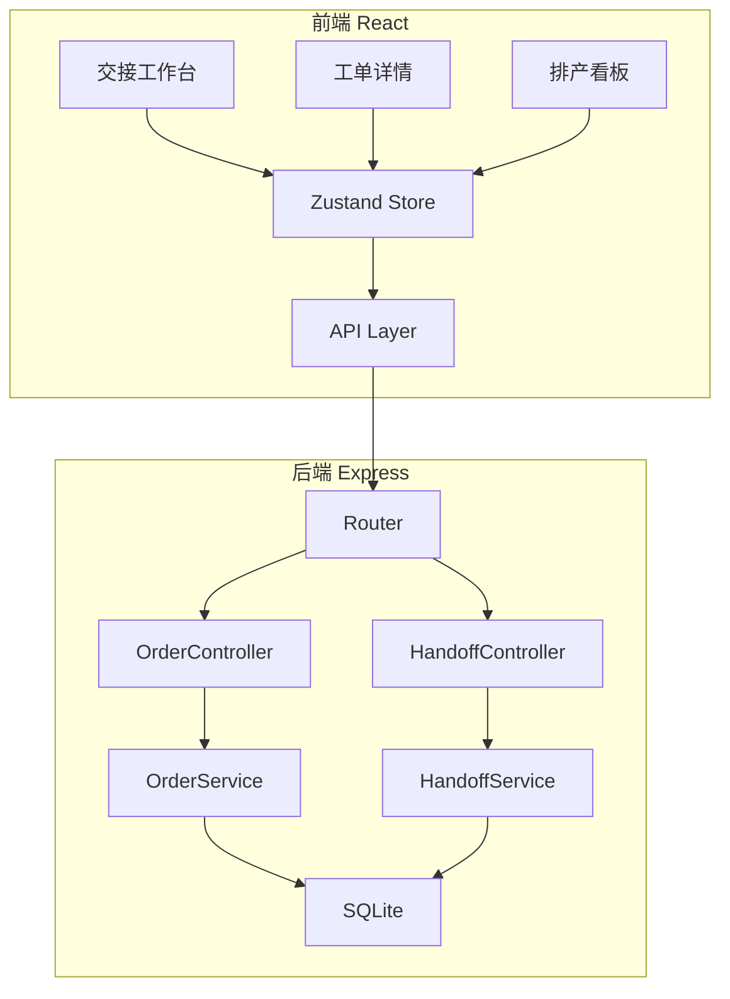
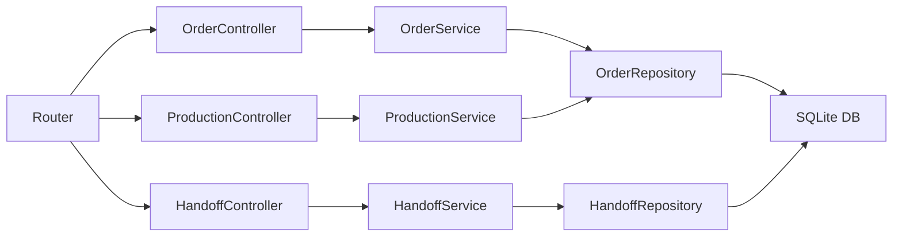
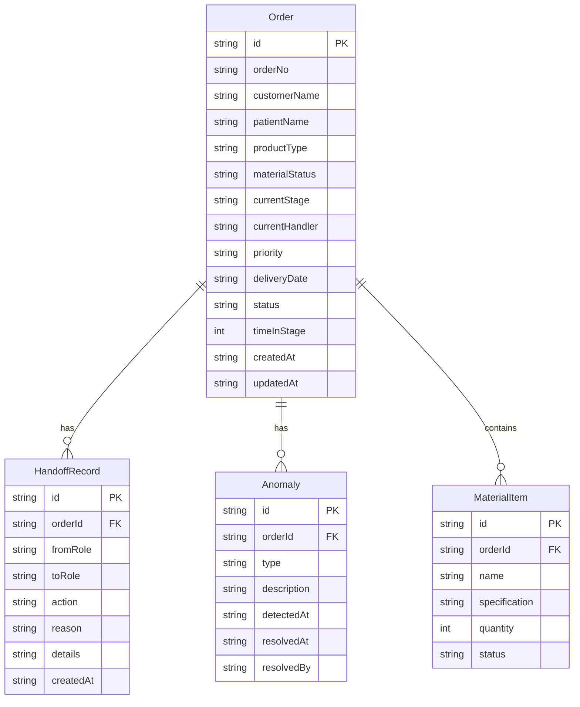

## 1. 架构设计



## 2. 技术说明

- **前端**：React 18 + TypeScript + Tailwind CSS 3 + Zustand + Vite
- **初始化工具**：vite-init（react-express-ts 模板）
- **后端**：Express 4 + TypeScript（ESM）
- **数据库**：SQLite（通过 better-sqlite3），开发阶段内置 mock 数据
- **拖拽**：@dnd-kit/core + @dnd-kit/sortable（排产看板拖拽拆单）
- **图标**：lucide-react

## 3. 路由定义

| 路由 | 用途 |
|------|------|
| / | 交接工作台主页，默认客服视角 |
| /order/:id | 工单详情页，展示完整接力时间线 |

排产看板不是独立路由，而是工作台内的嵌入视图，通过状态控制显示/隐藏。

## 4. API 定义

### 4.1 工单相关

```typescript
interface Order {
  id: string
  orderNo: string
  customerName: string
  patientName: string
  productType: "全瓷冠" | "贴面" | "活动义齿" | "种植修复" | "嵌体"
  materialList: MaterialItem[]
  materialStatus: "complete" | "incomplete"
  missingMaterials: string[]
  currentStage: "reception" | "design" | "qc" | "production"
  currentHandler: "receptionist" | "designer" | "inspector"
  priority: "normal" | "urgent"
  deliveryDate: string
  createdAt: string
  updatedAt: string
  status: "pending" | "in_progress" | "blocked" | "completed"
  anomalies: Anomaly[]
  timeInStage: number
}

interface MaterialItem {
  name: string
  specification: string
  quantity: number
  status: "available" | "missing" | "ordered"
}

interface Anomaly {
  type: "missing_material" | "timeout" | "qc_failed"
  description: string
  detectedAt: string
  resolvedAt: string | null
  resolvedBy: string | null
}
```

### 4.2 交接记录

```typescript
interface HandoffRecord {
  id: string
  orderId: string
  fromRole: "receptionist" | "designer" | "inspector"
  toRole: "designer" | "inspector" | "production"
  action: "submit" | "reject" | "release_material" | "schedule"
  reason: string
  details: HandoffDetails
  createdAt: string
}

interface HandoffDetails {
  reception?: {
    scanFileType: string
    modelType: "digital" | "physical"
    scanFileCount: number
    notes: string
  }
  design?: {
    softwareVersion: string
    modifications: string[]
    colorChangeReason: string | null
    specialProcess: string | null
  }
  qc?: {
    checkItems: QCCheckItem[]
    result: "pass" | "fail"
    failReason: string | null
    reworkTarget: string | null
  }
  production?: {
    productionLine: string
    estimatedCompletion: string
    splitFrom: string | null
  }
}

interface QCCheckItem {
  name: string
  standard: string
  actual: string
  passed: boolean
}
```

### 4.3 API 端点

| 方法 | 路径 | 用途 |
|------|------|------|
| GET | /api/orders | 获取工单列表，支持筛选参数 |
| GET | /api/orders/:id | 获取工单详情含完整交接记录 |
| POST | /api/orders | 创建新工单 |
| PATCH | /api/orders/:id | 更新工单信息 |
| POST | /api/orders/:id/handoff | 提交交接记录（推进/打回/放行） |
| GET | /api/orders/:id/handoffs | 获取工单的交接时间线 |
| PATCH | /api/production/schedule | 更新排产信息（拆单/调整日期） |
| GET | /api/production/board | 获取排产看板数据 |

### 4.4 筛选参数

```typescript
interface OrderFilter {
  status?: Order["status"]
  stage?: Order["currentStage"]
  anomalyType?: Anomaly["type"]
  customerName?: string
  dateFrom?: string
  dateTo?: string
  handlerRole?: Order["currentHandler"]
}
```

## 5. 服务端架构图



## 6. 数据模型

### 6.1 数据模型定义



### 6.2 数据定义语言

```sql
CREATE TABLE orders (
  id TEXT PRIMARY KEY,
  order_no TEXT NOT NULL UNIQUE,
  customer_name TEXT NOT NULL,
  patient_name TEXT NOT NULL,
  product_type TEXT NOT NULL CHECK(product_type IN ('全瓷冠', '贴面', '活动义齿', '种植修复', '嵌体')),
  material_status TEXT NOT NULL DEFAULT 'complete' CHECK(material_status IN ('complete', 'incomplete')),
  current_stage TEXT NOT NULL CHECK(current_stage IN ('reception', 'design', 'qc', 'production')),
  current_handler TEXT NOT NULL CHECK(current_handler IN ('receptionist', 'designer', 'inspector')),
  priority TEXT NOT NULL DEFAULT 'normal' CHECK(priority IN ('normal', 'urgent')),
  delivery_date TEXT NOT NULL,
  status TEXT NOT NULL DEFAULT 'pending' CHECK(status IN ('pending', 'in_progress', 'blocked', 'completed')),
  time_in_stage INTEGER NOT NULL DEFAULT 0,
  created_at TEXT NOT NULL DEFAULT (datetime('now')),
  updated_at TEXT NOT NULL DEFAULT (datetime('now'))
);

CREATE TABLE handoff_records (
  id TEXT PRIMARY KEY,
  order_id TEXT NOT NULL REFERENCES orders(id),
  from_role TEXT NOT NULL CHECK(from_role IN ('receptionist', 'designer', 'inspector')),
  to_role TEXT NOT NULL CHECK(to_role IN ('designer', 'inspector', 'production')),
  action TEXT NOT NULL CHECK(action IN ('submit', 'reject', 'release_material', 'schedule')),
  reason TEXT NOT NULL,
  details TEXT NOT NULL DEFAULT '{}',
  created_at TEXT NOT NULL DEFAULT (datetime('now'))
);

CREATE TABLE anomalies (
  id TEXT PRIMARY KEY,
  order_id TEXT NOT NULL REFERENCES orders(id),
  type TEXT NOT NULL CHECK(type IN ('missing_material', 'timeout', 'qc_failed')),
  description TEXT NOT NULL,
  detected_at TEXT NOT NULL DEFAULT (datetime('now')),
  resolved_at TEXT,
  resolved_by TEXT
);

CREATE TABLE material_items (
  id TEXT PRIMARY KEY,
  order_id TEXT NOT NULL REFERENCES orders(id),
  name TEXT NOT NULL,
  specification TEXT NOT NULL,
  quantity INTEGER NOT NULL DEFAULT 1,
  status TEXT NOT NULL DEFAULT 'available' CHECK(status IN ('available', 'missing', 'ordered'))
);

CREATE INDEX idx_orders_stage ON orders(current_stage);
CREATE INDEX idx_orders_status ON orders(status);
CREATE INDEX idx_orders_handler ON orders(current_handler);
CREATE INDEX idx_handoff_order ON handoff_records(order_id);
CREATE INDEX idx_anomaly_order ON anomalies(order_id);
CREATE INDEX idx_anomaly_type ON anomalies(type);
CREATE INDEX idx_material_order ON material_items(order_id);
```

### 6.3 初始化数据

演示数据包含5个工单，覆盖全部异常场景：

| 工单号 | 客户 | 产品类型 | 当前阶段 | 异常 |
|--------|------|----------|----------|------|
| DN-2024-0087 | 张氏口腔 | 全瓷冠 | reception（卡住） | 缺材料：氧化锆瓷块 |
| DN-2024-0092 | 李记齿科 | 种植修复 | design（超时） | 超时：停留超48小时 |
| DN-2024-0095 | 仁爱口腔 | 贴面 | qc（待复核） | 复核不通过：咬合偏差 |
| DN-2024-0089 | 康美口腔 | 嵌体 | production（已排产） | 无异常 |
| DN-2024-0091 | 明德齿科 | 活动义齿 | design（流转中） | 无异常 |

## 7. 前后端边界

### 7.1 后端负责

- 工单 CRUD 和状态机管理（阶段流转校验在服务端）
- 交接记录的创建和查询（含原因校验：reason 不能为空）
- 排产数据的聚合和更新
- 超时检测：基于 time_in_stage 和当前时间计算，API 返回时动态标记
- 筛选逻辑：服务端处理筛选参数，返回过滤后的列表

### 7.2 前端负责

- 角色视图切换（纯前端状态，通过 URL 参数持久化）
- 筛选面板的交互和 URL 参数同步
- 交接操作面板的表单校验（reason 必填的前端提示）
- 排产看板的拖拽交互
- 异常卡片的视觉标记和动画
- 工单详情页的时间线渲染

### 7.3 状态管理边界

- **Zustand Store** 管理前端交互状态：当前角色、筛选条件、面板开关、排产看板展开状态
- **URL 参数** 持久化关键筛选：角色、状态、异常类型
- **服务端** 是唯一数据真相源：工单状态、交接记录、排产信息全部通过 API 获取和修改
- **不使用** 临时 useState 存储筛选条件或模型接收状态，统一走 Zustand + URL 参数
