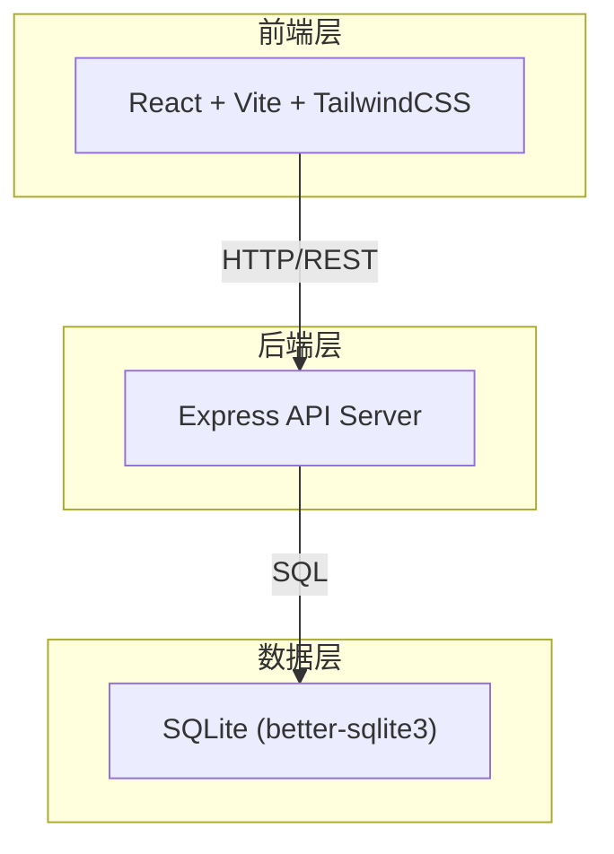
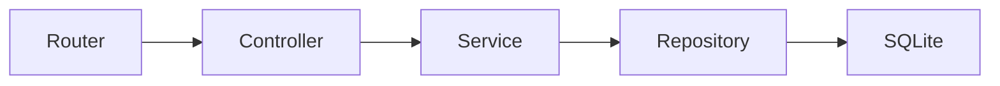
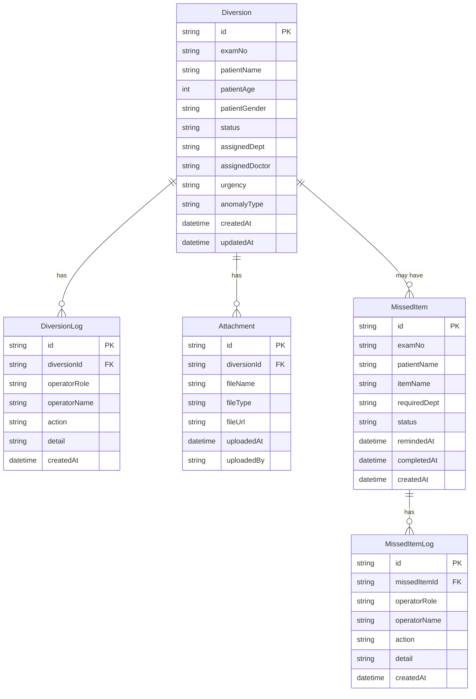

## 1. 架构设计



## 2. 技术说明

- 前端：React@18 + TailwindCSS@3 + Vite
- 初始化工具：Vite
- 后端：Express@4，与前端同一项目 /server 目录
- 数据库：SQLite (better-sqlite3)，文件级数据库，零配置本地运行
- 模拟数据：启动时自动 seed 演示数据（含缺材料、超时、复核不通过异常单）

## 3. 路由定义

| 路由 | 用途 |
|------|------|
| / | 今日待办看板（首页），展示紧急异常、待处理分流、漏项摘要 |
| /diversion | 导检分流列表，含筛选搜索 |
| /diversion/:id | 导检分流详情，含时间线与附件 |
| /missed | 漏项提醒中心，含列表与回看 |
| /missed/:id | 漏项提醒详情，含确认与处理 |

## 4. API 定义

### 4.1 导检分流

```typescript
interface Diversion {
  id: string
  examNo: string
  patientName: string
  patientAge: number
  patientGender: "男" | "女"
  status: "pending" | "diverted" | "confirmed" | "completed" | "rejected"
  assignedDept: string | null
  assignedDoctor: string | null
  urgency: "normal" | "urgent" | "timeout"
  anomalyType: ("missing_material" | "timeout" | "review_failed")[]
  createdAt: string
  updatedAt: string
}

interface DiversionLog {
  id: string
  diversionId: string
  operatorRole: "front_desk" | "doctor" | "reviewer"
  operatorName: string
  action: string
  detail: string
  createdAt: string
}

interface Attachment {
  id: string
  diversionId: string
  fileName: string
  fileType: "补检凭证" | "加项审批" | "其他"
  fileUrl: string | null
  uploadedAt: string | null
  uploadedBy: string | null
}

// GET /api/diversions?status=&urgency=&keyword=
// GET /api/diversions/:id
// GET /api/diversions/:id/logs
// GET /api/diversions/:id/attachments
// POST /api/diversions/:id/divert  { assignedDept, assignedDoctor }
// POST /api/diversions/:id/confirm
// POST /api/diversions/:id/complete
// POST /api/diversions/:id/reject  { reason }
// POST /api/diversions/:id/attachments  { fileType, fileName }
```

### 4.2 漏项提醒

```typescript
interface MissedItem {
  id: string
  examNo: string
  patientName: string
  itemName: string
  requiredDept: string
  status: "pending" | "reminded" | "completed" | "closed"
  remindedAt: string | null
  completedAt: string | null
  createdAt: string
}

interface MissedItemLog {
  id: string
  missedItemId: string
  operatorRole: "front_desk" | "doctor" | "reviewer"
  operatorName: string
  action: string
  detail: string
  createdAt: string
}

// GET /api/missed-items?status=&dept=&dateFrom=&dateTo=
// GET /api/missed-items/:id
// GET /api/missed-items/:id/logs
// POST /api/missed-items/:id/remind
// POST /api/missed-items/:id/confirm
// POST /api/missed-items/:id/complete
// POST /api/missed-items/:id/close
```

### 4.3 今日看板

```typescript
interface DashboardSummary {
  urgentCount: number
  pendingDiversionCount: number
  missedItemTodayCount: number
  anomalies: Diversion[]
}

// GET /api/dashboard
```

## 5. 服务器架构



## 6. 数据模型

### 6.1 数据模型定义



### 6.2 数据定义语言

```sql
CREATE TABLE diversions (
  id TEXT PRIMARY KEY,
  exam_no TEXT NOT NULL,
  patient_name TEXT NOT NULL,
  patient_age INTEGER,
  patient_gender TEXT,
  status TEXT NOT NULL DEFAULT 'pending',
  assigned_dept TEXT,
  assigned_doctor TEXT,
  urgency TEXT NOT NULL DEFAULT 'normal',
  anomaly_type TEXT NOT NULL DEFAULT '[]',
  created_at TEXT NOT NULL,
  updated_at TEXT NOT NULL
);

CREATE TABLE diversion_logs (
  id TEXT PRIMARY KEY,
  diversion_id TEXT NOT NULL REFERENCES diversions(id),
  operator_role TEXT NOT NULL,
  operator_name TEXT NOT NULL,
  action TEXT NOT NULL,
  detail TEXT NOT NULL DEFAULT '',
  created_at TEXT NOT NULL
);

CREATE TABLE attachments (
  id TEXT PRIMARY KEY,
  diversion_id TEXT NOT NULL REFERENCES diversions(id),
  file_name TEXT NOT NULL,
  file_type TEXT NOT NULL,
  file_url TEXT,
  uploaded_at TEXT,
  uploaded_by TEXT
);

CREATE TABLE missed_items (
  id TEXT PRIMARY KEY,
  exam_no TEXT NOT NULL,
  patient_name TEXT NOT NULL,
  item_name TEXT NOT NULL,
  required_dept TEXT NOT NULL,
  status TEXT NOT NULL DEFAULT 'pending',
  reminded_at TEXT,
  completed_at TEXT,
  created_at TEXT NOT NULL
);

CREATE TABLE missed_item_logs (
  id TEXT PRIMARY KEY,
  missed_item_id TEXT NOT NULL REFERENCES missed_items(id),
  operator_role TEXT NOT NULL,
  operator_name TEXT NOT NULL,
  action TEXT NOT NULL,
  detail TEXT NOT NULL DEFAULT '',
  created_at TEXT NOT NULL
);
```
