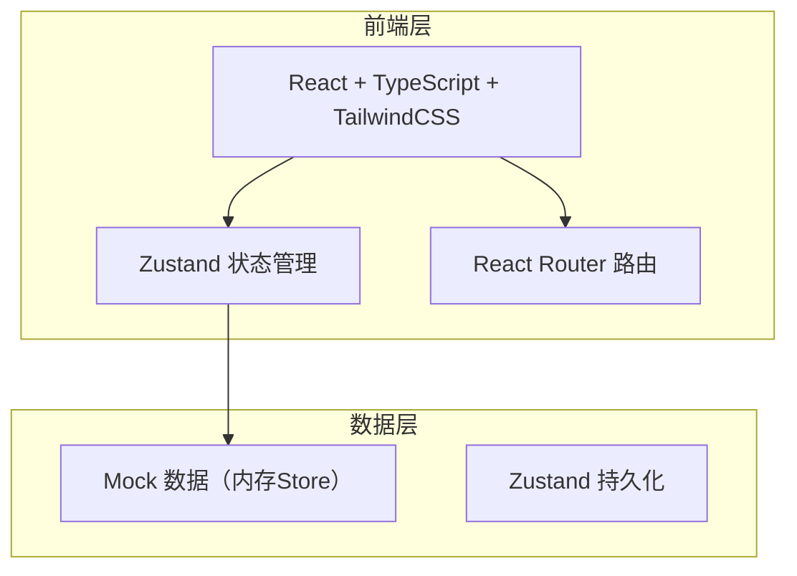
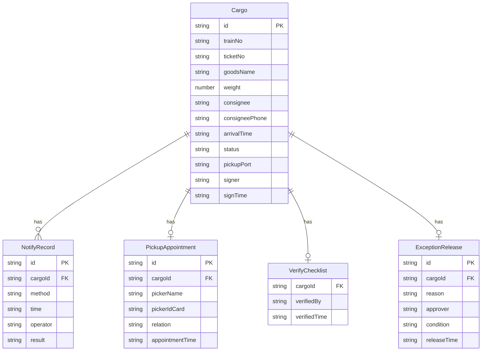

## 1. 架构设计



纯前端方案，使用 Zustand 管理全局状态，数据存储在内存中，页面刷新后通过初始种子数据重建。无需后端服务和数据库。

## 2. 技术说明

- 前端：React@18 + TypeScript + TailwindCSS@3 + Vite
- 初始化工具：vite-init
- 后端：无（纯前端 Mock）
- 数据存储：Zustand 内存Store，含预置种子数据

## 3. 路由定义

| 路由 | 用途 |
|------|------|
| / | 到站总览页（默认页），状态看板+货物列表 |
| /arrival | 到站登记与通知页，到站登记+通知记录 |
| /pickup | 提货校验页，预约+复核+异常放行+签收 |

## 4. API 定义

无后端API，所有数据操作通过 Zustand Store 方法完成：

### 4.1 数据类型定义

```typescript
type CargoStatus = "待通知" | "已通知" | "已预约" | "提货中" | "超期未提" | "已完成"
type NotifyMethod = "短信" | "电话"
type VerifyItem = "身份证" | "提货单" | "委托书" | "单位证明"

interface Cargo {
  id: string
  trainNo: string
  ticketNo: string
  goodsName: string
  weight: number
  consignee: string
  consigneePhone: string
  arrivalTime: string
  status: CargoStatus
  pickupPort?: string
  signer?: string
  signTime?: string
}

interface NotifyRecord {
  id: string
  cargoId: string
  method: NotifyMethod
  time: string
  operator: string
  result: string
}

interface PickupAppointment {
  id: string
  cargoId: string
  pickerName: string
  pickerIdCard: string
  relation: string
  appointmentTime: string
}

interface VerifyChecklist {
  cargoId: string
  items: { name: VerifyItem; passed: boolean }[]
  verifiedBy: string
  verifiedTime: string
}

interface ExceptionRelease {
  id: string
  cargoId: string
  reason: string
  approver: string
  condition: string
  releaseTime: string
}
```

### 4.2 Store 方法

| 方法 | 说明 |
|------|------|
| addCargo(cargo) | 新增到站货物 |
| sendNotify(cargoId, method) | 发送通知，自动增加通知记录，更新状态 |
| makeAppointment(appointment) | 预约提货，更新状态为"已预约" |
| verifyChecklist(checklist) | 证件复核，更新状态为"提货中" |
| exceptionRelease(release) | 异常放行，记录异常信息，更新状态 |
| signOff(cargoId, signer, port, time) | 签收完成，更新状态为"已完成" |

## 5. 数据模型

### 5.1 数据模型图



### 5.2 初始种子数据

- HP2026060101：汽车配件，到站12天，3次通知无人响应，状态"超期未提"
- HP2026060102：机电设备，委托人王芳提货，委托人身份证缺失，状态"已预约"
- HP2026060103：建材水泥，本人正常提货，状态"已完成"
