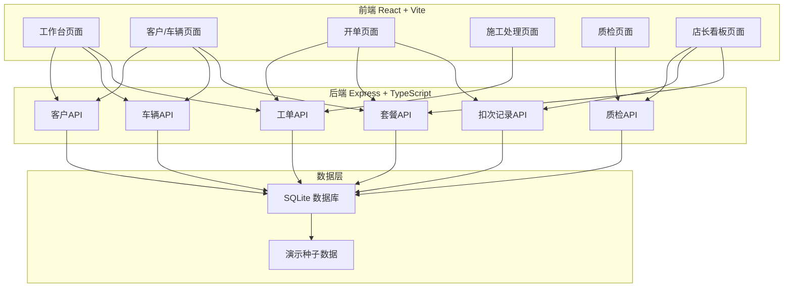
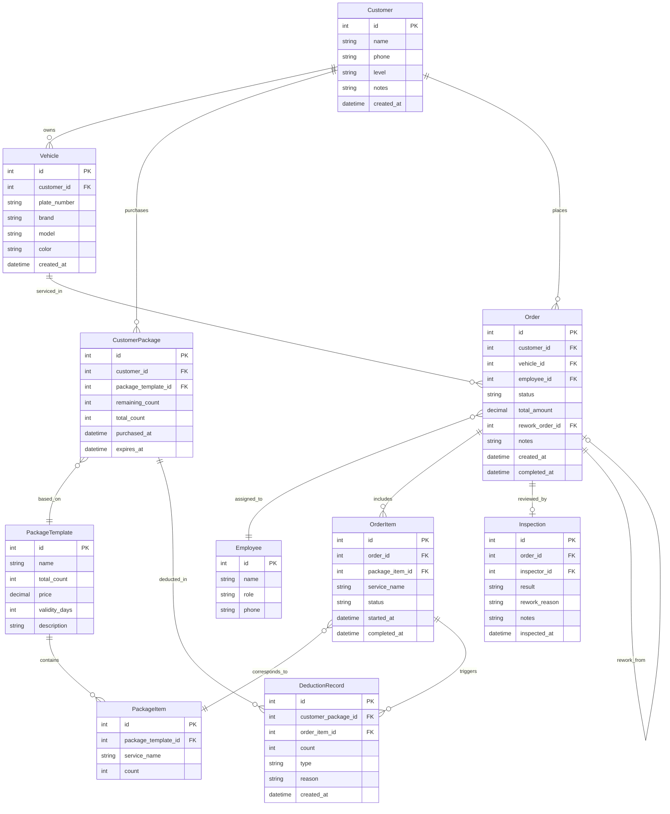

## 1. 架构设计



## 2. 技术说明

- **前端**：React@18 + TypeScript + TailwindCSS@3 + Vite + Zustand + React Router DOM
- **初始化工具**：vite-init (react-express-ts 模板)
- **后端**：Express@4 + TypeScript (ESM)
- **数据库**：SQLite (better-sqlite3)，内置演示种子数据
- **状态管理**：Zustand
- **图表**：Recharts
- **图标**：lucide-react

## 3. 路由定义

| 路由 | 用途 |
|------|------|
| / | 工作台 - 今日施工队列、车牌搜索、统计概览 |
| /customer/:id | 客户详情 - 客户信息、车辆、套餐、历史 |
| /order/new | 开单 - 新建施工工单 |
| /order/:id | 工单详情 - 施工进度、质检记录 |
| /construction | 施工处理 - 技师视角施工队列 |
| /inspection | 质检 - 待质检工单列表 |
| /dashboard | 店长看板 - 返工率、套餐消耗、补偿记录 |

## 4. API 定义

### 客户相关
- `GET /api/customers` - 获取客户列表（支持搜索）
- `GET /api/customers/:id` - 获取客户详情（含车辆、套餐）
- `POST /api/customers` - 新建客户

### 车辆相关
- `GET /api/vehicles?plate=xxx` - 按车牌搜索车辆
- `GET /api/vehicles/:id` - 获取车辆详情
- `POST /api/vehicles` - 新建车辆

### 套餐相关
- `GET /api/packages` - 获取套餐模板列表
- `GET /api/customer-packages/:customerId` - 获取客户已购套餐及余量
- `POST /api/customer-packages` - 购买套餐
- `PUT /api/customer-packages/:id/deduct` - 扣次（含返工补偿）

### 工单相关
- `GET /api/orders?date=today&status=xxx` - 获取工单列表
- `GET /api/orders/:id` - 获取工单详情
- `POST /api/orders` - 新建工单（含扣次）
- `PUT /api/orders/:id/status` - 更新工单状态
- `PUT /api/orders/:id/assign` - 分配技师

### 质检相关
- `GET /api/inspections?status=pending` - 获取待质检列表
- `POST /api/inspections` - 提交质检结果
- `POST /api/inspections/:id/rework` - 标记返工

### 统计相关
- `GET /api/stats/rework-rate` - 返工率统计
- `GET /api/stats/package-consumption` - 套餐消耗统计
- `GET /api/stats/compensation` - 补偿记录统计
- `GET /api/stats/today` - 今日统计概览

### 扣次记录
- `GET /api/deduction-records?customerId=xxx` - 获取扣次记录
- `GET /api/deduction-records?orderId=xxx` - 获取工单关联扣次记录

## 5. 数据模型

### 5.1 数据模型定义



### 5.2 数据定义语言

```sql
CREATE TABLE customers (
    id INTEGER PRIMARY KEY AUTOINCREMENT,
    name TEXT NOT NULL,
    phone TEXT NOT NULL,
    level TEXT DEFAULT 'normal',
    notes TEXT DEFAULT '',
    created_at DATETIME DEFAULT CURRENT_TIMESTAMP
);

CREATE TABLE vehicles (
    id INTEGER PRIMARY KEY AUTOINCREMENT,
    customer_id INTEGER NOT NULL REFERENCES customers(id),
    plate_number TEXT NOT NULL UNIQUE,
    brand TEXT NOT NULL,
    model TEXT NOT NULL,
    color TEXT DEFAULT '',
    created_at DATETIME DEFAULT CURRENT_TIMESTAMP
);

CREATE TABLE package_templates (
    id INTEGER PRIMARY KEY AUTOINCREMENT,
    name TEXT NOT NULL,
    total_count INTEGER NOT NULL,
    price DECIMAL(10,2) NOT NULL,
    validity_days INTEGER NOT NULL,
    description TEXT DEFAULT ''
);

CREATE TABLE package_items (
    id INTEGER PRIMARY KEY AUTOINCREMENT,
    package_template_id INTEGER NOT NULL REFERENCES package_templates(id),
    service_name TEXT NOT NULL,
    count INTEGER NOT NULL DEFAULT 1
);

CREATE TABLE customer_packages (
    id INTEGER PRIMARY KEY AUTOINCREMENT,
    customer_id INTEGER NOT NULL REFERENCES customers(id),
    package_template_id INTEGER NOT NULL REFERENCES package_templates(id),
    remaining_count INTEGER NOT NULL,
    total_count INTEGER NOT NULL,
    purchased_at DATETIME DEFAULT CURRENT_TIMESTAMP,
    expires_at DATETIME NOT NULL
);

CREATE TABLE employees (
    id INTEGER PRIMARY KEY AUTOINCREMENT,
    name TEXT NOT NULL,
    role TEXT NOT NULL,
    phone TEXT DEFAULT ''
);

CREATE TABLE orders (
    id INTEGER PRIMARY KEY AUTOINCREMENT,
    customer_id INTEGER NOT NULL REFERENCES customers(id),
    vehicle_id INTEGER NOT NULL REFERENCES vehicles(id),
    employee_id INTEGER REFERENCES employees(id),
    status TEXT NOT NULL DEFAULT 'pending',
    total_amount DECIMAL(10,2) DEFAULT 0,
    rework_order_id INTEGER REFERENCES orders(id),
    notes TEXT DEFAULT '',
    created_at DATETIME DEFAULT CURRENT_TIMESTAMP,
    completed_at DATETIME
);

CREATE TABLE order_items (
    id INTEGER PRIMARY KEY AUTOINCREMENT,
    order_id INTEGER NOT NULL REFERENCES orders(id),
    package_item_id INTEGER REFERENCES package_items(id),
    service_name TEXT NOT NULL,
    status TEXT NOT NULL DEFAULT 'pending',
    started_at DATETIME,
    completed_at DATETIME
);

CREATE TABLE inspections (
    id INTEGER PRIMARY KEY AUTOINCREMENT,
    order_id INTEGER NOT NULL REFERENCES orders(id),
    inspector_id INTEGER REFERENCES employees(id),
    result TEXT NOT NULL,
    rework_reason TEXT DEFAULT '',
    notes TEXT DEFAULT '',
    inspected_at DATETIME DEFAULT CURRENT_TIMESTAMP
);

CREATE TABLE deduction_records (
    id INTEGER PRIMARY KEY AUTOINCREMENT,
    customer_package_id INTEGER NOT NULL REFERENCES customer_packages(id),
    order_item_id INTEGER REFERENCES order_items(id),
    count INTEGER NOT NULL DEFAULT 1,
    type TEXT NOT NULL,
    reason TEXT DEFAULT '',
    created_at DATETIME DEFAULT CURRENT_TIMESTAMP
);

CREATE INDEX idx_vehicles_plate ON vehicles(plate_number);
CREATE INDEX idx_orders_status ON orders(status);
CREATE INDEX idx_orders_created ON orders(created_at);
CREATE INDEX idx_orders_customer ON orders(customer_id);
CREATE INDEX idx_orders_vehicle ON orders(vehicle_id);
CREATE INDEX idx_orders_rework ON orders(rework_order_id);
CREATE INDEX idx_deduction_package ON deduction_records(customer_package_id);
CREATE INDEX idx_deduction_order ON deduction_records(order_item_id);
```

## 6. 演示数据设计

### 客户与车辆
- **张伟**（老客户，3辆车：京A88888/京B66666/京C12345，购买了镀膜套餐和精洗套餐）
- **李娜**（新客户，1辆车：沪D99999，仅单次消费）
- **王强**（VIP客户，2辆车：粤E55555/粤F77777，多个套餐，其中镀膜套餐仅剩1次）
- **陈敏**（投诉客户，1辆车：京G33333，施工返工后要求补偿）

### 套餐模板
- **至尊镀膜套餐**：5次镀膜 + 3次精洗，¥2980，有效期180天
- **年度精洗套餐**：12次精洗，¥960，有效期365天
- **漆面养护套餐**：3次打蜡 + 2次抛光，¥1680，有效期180天

### 工单与返工
- 张伟京A88888镀膜施工（正常完成）
- 王强粤E55555镀膜施工（质检发现细微划痕，返工，补偿返还1次）
- 陈敏京G33333精洗+打蜡（质检返工2次，客户不满，店长补偿额外赠送1次精洗）

### 员工
- 李师傅（技师）
- 赵师傅（技师）
- 孙质检（质检员）
- 周经理（店长/质检员）
