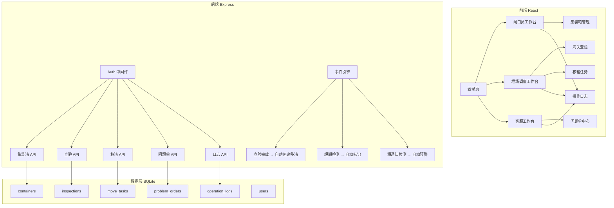
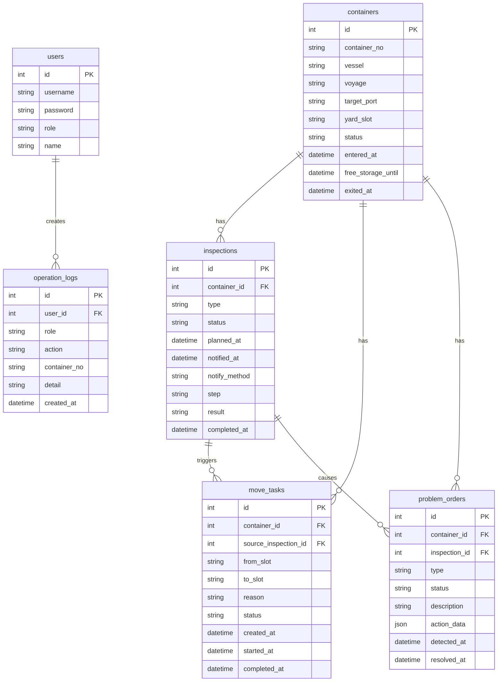

## 1. 架构设计



## 2. 技术说明

- 前端: React@18 + tailwindcss@3 + vite + zustand + react-router-dom
- 初始化工具: vite-init (react-express-ts 模板)
- 后端: Express@4 + TypeScript (ESM)
- 数据库: SQLite (better-sqlite3)，无需额外服务
- 认证: JWT 简易令牌，演示账号硬编码

## 3. 路由定义

| 路由 | 用途 |
|------|------|
| /login | 登录页，三角色选择 |
| /gate | 闸口员工作台 |
| /gate/register | 进场登记 |
| /gate/containers | 集装箱查询 |
| /dispatch | 堆场调度工作台 |
| /dispatch/yard | 堆位状态图 |
| /dispatch/inspection | 海关查验 |
| /dispatch/move-tasks | 移箱任务 |
| /service | 客服工作台 |
| /service/problems | 问题单中心 |
| /service/problems/:id | 问题单详情与处理 |
| /logs | 操作日志 |

## 4. API 定义

### 4.1 认证

```typescript
POST /api/auth/login
  Request:  { username: string; password: string }
  Response: { token: string; role: "gate" | "dispatch" | "service"; name: string }

GET /api/auth/me
  Headers: Authorization: Bearer <token>
  Response: { id: number; username: string; role: string; name: string }
```

### 4.2 集装箱

```typescript
GET /api/containers
  Query: { status?: string; search?: string; page?: number; size?: number }
  Response: { data: Container[]; total: number }

GET /api/containers/:id
  Response: Container & { timeline: TimelineEvent[] }

POST /api/containers
  Request: { containerNo: string; vessel: string; voyage: string; targetPort: string; yardSlot?: string }
  Response: Container

PUT /api/containers/:id/status
  Request: { status: ContainerStatus; remark?: string }
  Response: Container
```

### 4.3 海关查验

```typescript
GET /api/inspections
  Query: { status?: string; containerNo?: string }
  Response: Inspection[]

POST /api/inspections
  Request: { containerId: number; type: "open" | "full" | "random"; plannedAt: string }
  Response: Inspection

PUT /api/inspections/:id/execute
  Request: { step: "open_box" | "unpack" | "repack" | "result"; result?: "released" | "abnormal" | "detained"; remark?: string }
  Response: Inspection

PUT /api/inspections/:id/notify
  Request: { method: "sms" | "email" | "phone" }
  Response: Inspection
```

### 4.4 移箱任务

```typescript
GET /api/move-tasks
  Query: { status?: string; containerNo?: string }
  Response: MoveTask[]

POST /api/move-tasks
  Request: { containerId: number; fromSlot: string; toSlot: string; reason: string; sourceInspectionId?: number }
  Response: MoveTask

PUT /api/move-tasks/:id/execute
  Request: { action: "start" | "complete"; remark?: string }
  Response: MoveTask

GET /api/move-tasks/:id/history
  Response: MoveTaskHistory[]
```

### 4.5 问题单

```typescript
GET /api/problems
  Query: { type?: "misplaced" | "overdue" | "missed_notify"; status?: string }
  Response: ProblemOrder[]

GET /api/problems/:id
  Response: ProblemOrder & { relatedContainer: Container; relatedInspection?: Inspection }

PUT /api/problems/:id/action
  Request: { action: "reschedule" | "supplement" | "reject"; data: Record<string, any>; remark: string }
  Response: ProblemOrder
```

### 4.6 操作日志

```typescript
GET /api/logs
  Query: { containerNo?: string; role?: string; action?: string; startTime?: string; endTime?: string; page?: number; size?: number }
  Response: { data: OperationLog[]; total: number }
```

### 4.7 工作台统计

```typescript
GET /api/dashboard/:role
  Response: {
    pendingCount: number;
    stuckOrders: StuckOrder[];
    todayStats: { inbound: number; outbound: number; inspected: number; moved: number };
  }
```

## 5. 服务端架构图

```mermaid
graph LR
    "Router" --> "Auth Middleware"
    "Auth Middleware" --> "Container Controller"
    "Auth Middleware" --> "Inspection Controller"
    "Auth Middleware" --> "MoveTask Controller"
    "Auth Middleware" --> "Problem Controller"
    "Auth Middleware" --> "Log Controller"
    "Container Controller" --> "Container Service"
    "Inspection Controller" --> "Inspection Service"
    "MoveTask Controller" --> "MoveTask Service"
    "Problem Controller" --> "Problem Service"
    "Log Controller" --> "Log Service"
    "Container Service" --> "Database"
    "Inspection Service" --> "Database"
    "Inspection Service" --> "Event Engine"
    "MoveTask Service" --> "Database"
    "Problem Service" --> "Database"
    "Log Service" --> "Database"
    "Event Engine" --> "MoveTask Service"
    "Event Engine" --> "Problem Service"
```

## 6. 数据模型

### 6.1 数据模型定义



### 6.2 数据定义语言

```sql
CREATE TABLE users (
  id INTEGER PRIMARY KEY AUTOINCREMENT,
  username TEXT NOT NULL UNIQUE,
  password TEXT NOT NULL,
  role TEXT NOT NULL CHECK(role IN ('gate','dispatch','service')),
  name TEXT NOT NULL
);

CREATE TABLE containers (
  id INTEGER PRIMARY KEY AUTOINCREMENT,
  container_no TEXT NOT NULL UNIQUE,
  vessel TEXT NOT NULL,
  voyage TEXT NOT NULL,
  target_port TEXT NOT NULL,
  yard_slot TEXT,
  status TEXT NOT NULL DEFAULT 'entered' CHECK(status IN ('entered','yarded','inspecting','inspection_done','moving','ready_out','exited')),
  entered_at TEXT NOT NULL DEFAULT (datetime('now')),
  free_storage_until TEXT,
  exited_at TEXT
);

CREATE TABLE inspections (
  id INTEGER PRIMARY KEY AUTOINCREMENT,
  container_id INTEGER NOT NULL REFERENCES containers(id),
  type TEXT NOT NULL CHECK(type IN ('open','full','random')),
  status TEXT NOT NULL DEFAULT 'planned' CHECK(status IN ('planned','notified','executing','completed')),
  planned_at TEXT NOT NULL,
  notified_at TEXT,
  notify_method TEXT CHECK(notify_method IN ('sms','email','phone')),
  step TEXT DEFAULT 'open_box' CHECK(step IN ('open_box','unpack','repack','result')),
  result TEXT CHECK(result IN ('released','abnormal','detained')),
  completed_at TEXT
);

CREATE TABLE move_tasks (
  id INTEGER PRIMARY KEY AUTOINCREMENT,
  container_id INTEGER NOT NULL REFERENCES containers(id),
  source_inspection_id INTEGER REFERENCES inspections(id),
  from_slot TEXT NOT NULL,
  to_slot TEXT NOT NULL,
  reason TEXT NOT NULL,
  status TEXT NOT NULL DEFAULT 'pending' CHECK(status IN ('pending','executing','completed','cancelled')),
  created_at TEXT NOT NULL DEFAULT (datetime('now')),
  started_at TEXT,
  completed_at TEXT
);

CREATE TABLE problem_orders (
  id INTEGER PRIMARY KEY AUTOINCREMENT,
  container_id INTEGER NOT NULL REFERENCES containers(id),
  inspection_id INTEGER REFERENCES inspections(id),
  type TEXT NOT NULL CHECK(type IN ('misplaced','overdue','missed_notify')),
  status TEXT NOT NULL DEFAULT 'open' CHECK(status IN ('open','rescheduled','supplemented','rejected','resolved')),
  description TEXT NOT NULL,
  action_data TEXT DEFAULT '{}',
  detected_at TEXT NOT NULL DEFAULT (datetime('now')),
  resolved_at TEXT
);

CREATE TABLE operation_logs (
  id INTEGER PRIMARY KEY AUTOINCREMENT,
  user_id INTEGER NOT NULL REFERENCES users(id),
  role TEXT NOT NULL,
  action TEXT NOT NULL,
  container_no TEXT,
  detail TEXT NOT NULL DEFAULT '',
  created_at TEXT NOT NULL DEFAULT (datetime('now'))
);

-- 初始演示账号
INSERT INTO users (username, password, role, name) VALUES
  ('gate01', 'gate01', 'gate', '闸口员-王明'),
  ('dispatch01', 'dispatch01', 'dispatch', '调度员-李强'),
  ('service01', 'service01', 'service', '客服-张丽');

-- 正常单种子数据
INSERT INTO containers (container_no, vessel, voyage, target_port, yard_slot, status, entered_at, free_storage_until) VALUES
  ('MSKU1234567', 'COSCO SHIPPING', 'V023E', 'SHANGHAI', 'A-01-03', 'inspecting', '2026-06-07 08:30:00', '2026-06-17 08:30:00'),
  ('CSLU2345678', 'MAERSK ELBA', 'V118W', 'NINGBO', 'A-02-01', 'yarded', '2026-06-06 14:20:00', '2026-06-16 14:20:00'),
  ('TCLU3456789', 'EVERGREEN', 'V045E', 'SHANGHAI', 'B-01-02', 'inspection_done', '2026-06-05 09:00:00', '2026-06-15 09:00:00');

-- 问题单种子数据
INSERT INTO containers (container_no, vessel, voyage, target_port, yard_slot, status, entered_at, free_storage_until) VALUES
  ('MSKU9999001', 'COSCO SHIPPING', 'V023E', 'SHANGHAI', 'C-03-05', 'yarded', '2026-05-20 10:00:00', '2026-05-30 10:00:00'),
  ('CSLU9999002', 'MAERSK ELBA', 'V118W', 'NINGBO', 'B-02-04', 'yarded', '2026-06-08 11:00:00', '2026-06-18 11:00:00'),
  ('TCLU9999003', 'EVERGREEN', 'V045E', 'SHANGHAI', 'A-01-01', 'inspecting', '2026-06-07 16:00:00', '2026-06-17 16:00:00');

-- 查验记录
INSERT INTO inspections (container_id, type, status, planned_at, notified_at, notify_method, step, result, completed_at) VALUES
  (1, 'full', 'executing', '2026-06-09 09:00:00', '2026-06-08 15:00:00', 'sms', 'unpack', NULL, NULL),
  (3, 'random', 'completed', '2026-06-08 10:00:00', '2026-06-07 16:00:00', 'email', 'result', 'released', '2026-06-08 11:30:00'),
  (6, 'full', 'planned', '2026-06-10 09:00:00', NULL, NULL, 'open_box', NULL, NULL);

-- 移箱任务(查验完成后自动生成)
INSERT INTO move_tasks (container_id, source_inspection_id, from_slot, to_slot, reason, status, created_at, started_at, completed_at) VALUES
  (3, 2, 'B-01-02', 'D-01-01', '查验放行后移至出场区', 'pending', '2026-06-08 11:30:00', NULL, NULL);

-- 问题单
INSERT INTO problem_orders (container_id, inspection_id, type, status, description, action_data, detected_at) VALUES
  (4, NULL, 'overdue', 'open', '免堆期已过10天未提箱', '{}', '2026-05-30 10:00:00'),
  (5, NULL, 'misplaced', 'open', '系统分配A-03-02，实际在B-02-04', '{"expected":"A-03-02","actual":"B-02-04"}', '2026-06-08 12:00:00'),
  (6, 3, 'missed_notify', 'open', '查验计划已生成但未通知客户', '{}', '2026-06-09 08:00:00');
```
