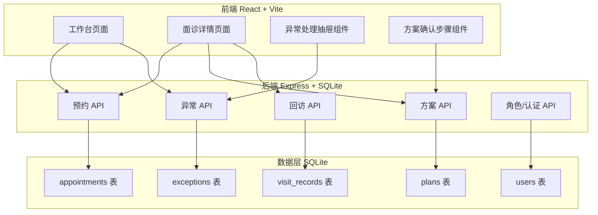
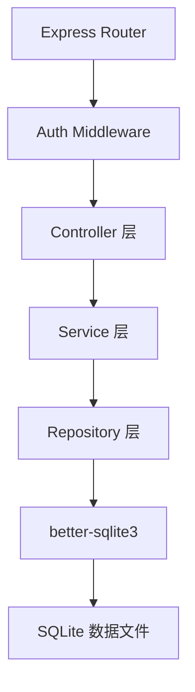
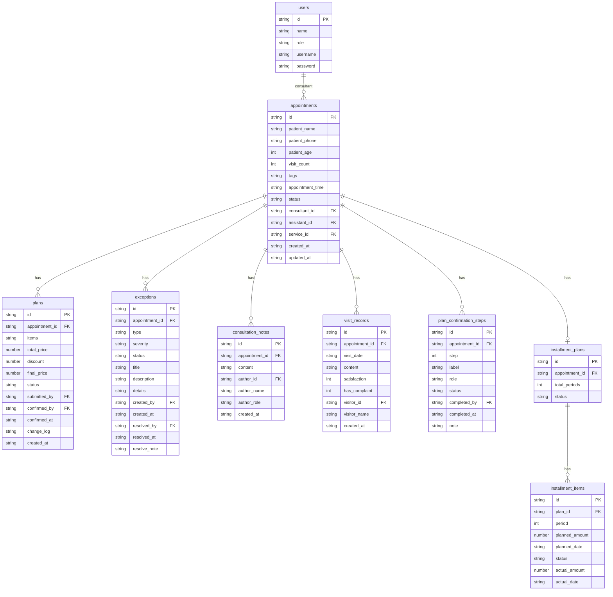

## 1. 架构设计



## 2. 技术说明

- **前端**: React@18 + tailwindcss@3 + vite + TypeScript
- **初始化工具**: vite-init (react-ts 模板)
- **后端**: Express@4 + better-sqlite3 + TypeScript
- **数据库**: SQLite（本地文件数据库，零配置启动）
- **状态管理**: React Context + useReducer
- **路由**: react-router-dom@6
- **UI动效**: framer-motion
- **图标**: lucide-react
- **日期处理**: dayjs

## 3. 路由定义

| 路由 | 用途 |
|------|------|
| `/` | 工作台首页，展示今日预约、异常预警、待处理任务 |
| `/appointment/:id` | 面诊详情页，包含患者信息、咨询记录、方案确认流程 |
| `/login` | 演示账号登录页 |

## 4. API 定义

### 4.1 认证相关

```typescript
interface LoginRequest {
  username: string;
  password: string;
}

interface LoginResponse {
  token: string;
  user: {
    id: string;
    name: string;
    role: "consultant" | "assistant" | "service";
  };
}
```

### 4.2 预约相关

```typescript
interface Appointment {
  id: string;
  patientName: string;
  patientPhone: string;
  patientAge: number;
  visitCount: number;
  tags: string[];
  appointmentTime: string;
  status: "pending" | "in_consultation" | "plan_submitted" | "plan_confirmed" | "in_service" | "completed";
  consultantId: string;
  assistantId: string | null;
  serviceId: string | null;
  createdAt: string;
  updatedAt: string;
}

interface AppointmentListResponse {
  items: Appointment[];
  total: number;
}

interface AppointmentDetailResponse {
  appointment: Appointment;
  exceptions: Exception[];
  plans: Plan[];
  visitRecords: VisitRecord[];
  consultationNotes: ConsultationNote[];
}
```

### 4.3 方案相关

```typescript
interface Plan {
  id: string;
  appointmentId: string;
  items: PlanItem[];
  totalPrice: number;
  discount: number;
  finalPrice: number;
  status: "draft" | "submitted" | "confirmed" | "archived";
  submittedBy: string;
  confirmedBy: string | null;
  confirmedAt: string | null;
  changeLog: PlanChangeLog[];
}

interface PlanItem {
  name: string;
  area: string;
  unitPrice: number;
  quantity: number;
  subtotal: number;
  note: string;
}
```

### 4.4 异常相关

```typescript
interface Exception {
  id: string;
  appointmentId: string;
  type: "wording_mismatch" | "post_surgery_complaint" | "installment_mismatch";
  severity: "high" | "medium" | "low";
  status: "open" | "processing" | "resolved";
  title: string;
  description: string;
  details: ExceptionDetails;
  createdBy: string;
  createdAt: string;
  resolvedBy: string | null;
  resolvedAt: string | null;
  resolveNote: string | null;
}

type ExceptionDetails =
  | WordingMismatchDetails
  | PostSurgeryComplaintDetails
  | InstallmentMismatchDetails;

interface WordingMismatchDetails {
  consultantWording: string;
  doctorWording: string;
  conflictItems: string[];
}

interface PostSurgeryComplaintDetails {
  complaintContent: string;
  relatedProject: string;
  surgeryDate: string;
  complaintDate: string;
}

interface InstallmentMismatchDetails {
  plannedInstallments: InstallmentItem[];
  actualPayments: ActualPayment[];
  differenceItems: DifferenceItem[];
}

interface InstallmentItem {
  period: number;
  plannedAmount: number;
  plannedDate: string;
  status: string;
}

interface ActualPayment {
  period: number;
  paidAmount: number;
  paidDate: string;
}

interface DifferenceItem {
  period: number;
  plannedAmount: number;
  actualAmount: number;
  difference: number;
}
```

### 4.5 咨询记录

```typescript
interface ConsultationNote {
  id: string;
  appointmentId: string;
  content: string;
  authorId: string;
  authorName: string;
  authorRole: string;
  createdAt: string;
}

interface AddNoteRequest {
  appointmentId: string;
  content: string;
}
```

### 4.6 术后回访

```typescript
interface VisitRecord {
  id: string;
  appointmentId: string;
  visitDate: string;
  content: string;
  satisfaction: number;
  hasComplaint: boolean;
  visitorId: string;
  visitorName: string;
  createdAt: string;
}
```

### 4.7 方案确认流程

```typescript
interface PlanConfirmationStep {
  step: number;
  label: string;
  role: "consultant" | "assistant" | "service";
  status: "pending" | "current" | "completed";
  completedBy: string | null;
  completedAt: string | null;
  note: string | null;
}

interface ConfirmPlanRequest {
  appointmentId: string;
  step: number;
  note?: string;
}
```

## 5. 服务器架构图



## 6. 数据模型

### 6.1 数据模型定义



### 6.2 数据定义语言

```sql
CREATE TABLE users (
  id TEXT PRIMARY KEY,
  name TEXT NOT NULL,
  role TEXT NOT NULL CHECK(role IN ('consultant', 'assistant', 'service')),
  username TEXT NOT NULL UNIQUE,
  password TEXT NOT NULL
);

CREATE TABLE appointments (
  id TEXT PRIMARY KEY,
  patient_name TEXT NOT NULL,
  patient_phone TEXT NOT NULL,
  patient_age INTEGER,
  visit_count INTEGER DEFAULT 1,
  tags TEXT DEFAULT '[]',
  appointment_time TEXT NOT NULL,
  status TEXT NOT NULL DEFAULT 'pending' CHECK(status IN ('pending', 'in_consultation', 'plan_submitted', 'plan_confirmed', 'in_service', 'completed')),
  consultant_id TEXT NOT NULL,
  assistant_id TEXT,
  service_id TEXT,
  created_at TEXT NOT NULL,
  updated_at TEXT NOT NULL,
  FOREIGN KEY (consultant_id) REFERENCES users(id),
  FOREIGN KEY (assistant_id) REFERENCES users(id),
  FOREIGN KEY (service_id) REFERENCES users(id)
);

CREATE TABLE plans (
  id TEXT PRIMARY KEY,
  appointment_id TEXT NOT NULL,
  items TEXT NOT NULL DEFAULT '[]',
  total_price REAL NOT NULL,
  discount REAL DEFAULT 0,
  final_price REAL NOT NULL,
  status TEXT NOT NULL DEFAULT 'draft' CHECK(status IN ('draft', 'submitted', 'confirmed', 'archived')),
  submitted_by TEXT,
  confirmed_by TEXT,
  confirmed_at TEXT,
  change_log TEXT DEFAULT '[]',
  created_at TEXT NOT NULL,
  FOREIGN KEY (appointment_id) REFERENCES appointments(id),
  FOREIGN KEY (submitted_by) REFERENCES users(id),
  FOREIGN KEY (confirmed_by) REFERENCES users(id)
);

CREATE TABLE exceptions (
  id TEXT PRIMARY KEY,
  appointment_id TEXT NOT NULL,
  type TEXT NOT NULL CHECK(type IN ('wording_mismatch', 'post_surgery_complaint', 'installment_mismatch')),
  severity TEXT NOT NULL CHECK(severity IN ('high', 'medium', 'low')),
  status TEXT NOT NULL DEFAULT 'open' CHECK(status IN ('open', 'processing', 'resolved')),
  title TEXT NOT NULL,
  description TEXT NOT NULL,
  details TEXT NOT NULL DEFAULT '{}',
  created_by TEXT NOT NULL,
  created_at TEXT NOT NULL,
  resolved_by TEXT,
  resolved_at TEXT,
  resolve_note TEXT,
  FOREIGN KEY (appointment_id) REFERENCES appointments(id),
  FOREIGN KEY (created_by) REFERENCES users(id),
  FOREIGN KEY (resolved_by) REFERENCES users(id)
);

CREATE TABLE consultation_notes (
  id TEXT PRIMARY KEY,
  appointment_id TEXT NOT NULL,
  content TEXT NOT NULL,
  author_id TEXT NOT NULL,
  author_name TEXT NOT NULL,
  author_role TEXT NOT NULL,
  created_at TEXT NOT NULL,
  FOREIGN KEY (appointment_id) REFERENCES appointments(id),
  FOREIGN KEY (author_id) REFERENCES users(id)
);

CREATE TABLE visit_records (
  id TEXT PRIMARY KEY,
  appointment_id TEXT NOT NULL,
  visit_date TEXT NOT NULL,
  content TEXT NOT NULL,
  satisfaction INTEGER,
  has_complaint INTEGER DEFAULT 0,
  visitor_id TEXT NOT NULL,
  visitor_name TEXT NOT NULL,
  created_at TEXT NOT NULL,
  FOREIGN KEY (appointment_id) REFERENCES appointments(id),
  FOREIGN KEY (visitor_id) REFERENCES users(id)
);

CREATE TABLE plan_confirmation_steps (
  id TEXT PRIMARY KEY,
  appointment_id TEXT NOT NULL,
  step INTEGER NOT NULL,
  label TEXT NOT NULL,
  role TEXT NOT NULL CHECK(role IN ('consultant', 'assistant', 'service')),
  status TEXT NOT NULL DEFAULT 'pending' CHECK(status IN ('pending', 'current', 'completed')),
  completed_by TEXT,
  completed_at TEXT,
  note TEXT,
  FOREIGN KEY (appointment_id) REFERENCES appointments(id),
  FOREIGN KEY (completed_by) REFERENCES users(id)
);

CREATE TABLE installment_plans (
  id TEXT PRIMARY KEY,
  appointment_id TEXT NOT NULL,
  total_periods INTEGER NOT NULL,
  status TEXT NOT NULL DEFAULT 'active',
  FOREIGN KEY (appointment_id) REFERENCES appointments(id)
);

CREATE TABLE installment_items (
  id TEXT PRIMARY KEY,
  plan_id TEXT NOT NULL,
  period INTEGER NOT NULL,
  planned_amount REAL NOT NULL,
  planned_date TEXT NOT NULL,
  status TEXT NOT NULL DEFAULT 'pending',
  actual_amount REAL,
  actual_date TEXT,
  FOREIGN KEY (plan_id) REFERENCES installment_plans(id)
);
```

## 7. 演示账号

| 角色 | 用户名 | 密码 |
|------|--------|------|
| 咨询师 | consultant | demo123 |
| 医生助理 | assistant | demo123 |
| 客服 | service | demo123 |

## 8. 项目结构

```
project/
├── server/
│   ├── index.ts            # Express 入口
│   ├── db/
│   │   ├── init.ts         # SQLite 初始化 + 种子数据
│   │   └── schema.sql      # 建表语句
│   ├── routes/
│   │   ├── auth.ts         # 登录接口
│   │   ├── appointments.ts # 预约接口
│   │   ├── plans.ts        # 方案接口
│   │   ├── exceptions.ts   # 异常接口
│   │   ├── notes.ts        # 咨询记录接口
│   │   └── visits.ts       # 回访记录接口
│   └── middleware/
│       └── auth.ts         # JWT 认证中间件
├── src/
│   ├── main.tsx
│   ├── App.tsx
│   ├── contexts/
│   │   └── AuthContext.tsx  # 认证上下文
│   ├── pages/
│   │   ├── Login.tsx       # 登录页
│   │   ├── Dashboard.tsx   # 工作台
│   │   └── AppointmentDetail.tsx # 面诊详情页
│   ├── components/
│   │   ├── Layout.tsx           # 布局框架
│   │   ├── RoleSwitcher.tsx    # 角色切换
│   │   ├── AppointmentTimeline.tsx  # 预约时间线
│   │   ├── ExceptionCard.tsx   # 异常预警卡片
│   │   ├── TaskQueue.tsx       # 待处理任务
│   │   ├── PatientInfo.tsx     # 患者信息卡
│   │   ├── ConsultationNotes.tsx # 咨询记录
│   │   ├── PlanQuote.tsx       # 方案报价单
│   │   ├── VisitRecord.tsx     # 术后回访表
│   │   ├── PlanConfirmation.tsx # 方案确认步骤条
│   │   ├── ExceptionMarker.tsx  # 异常标记区
│   │   └── ExceptionDrawer.tsx  # 异常处理抽屉
│   ├── api/
│   │   └── client.ts       # API 客户端
│   ├── types/
│   │   └── index.ts        # TypeScript 类型定义
│   └── data/
│       └── seed.ts          # 前端兜底数据
├── package.json
├── vite.config.ts
├── tsconfig.json
└── tailwind.config.js
```
