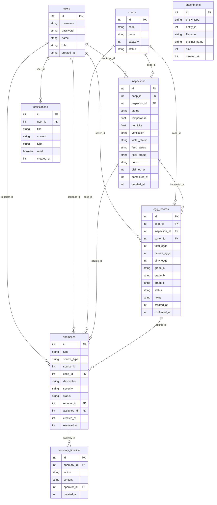

## 1. 架构设计

```mermaid
graph TB
    subgraph "前端层"
        "React SPA" --> "Zustand 状态管理"
        "React SPA" --> "React Router"
        "React SPA" --> "Tailwind CSS"
    end
    subgraph "后端层"
        "Express API" --> "路由层"
        "路由层" --> "业务逻辑层"
        "业务逻辑层" --> "数据访问层"
    end
    subgraph "数据层"
        "SQLite 数据库" --> "巡检卡表"
        "SQLite 数据库" --> "产蛋记录表"
        "SQLite 数据库" --> "异常表"
        "SQLite 数据库" --> "用户表"
        "SQLite 数据库" --> "通知表"
        "文件系统" --> "uploads/ 附件目录"
    end
    "React SPA" -->|"HTTP API"| "Express API"
    "Express API" -->|"better-sqlite3"| "SQLite 数据库"
```

## 2. 技术说明

- **前端**：React@18 + TypeScript + Tailwind CSS@3 + Vite
- **状态管理**：Zustand
- **路由**：react-router-dom@6
- **后端**：Express@4 + TypeScript (ESM)
- **数据库**：SQLite (better-sqlite3)，文件存储在项目根目录 `data/farm.db`
- **附件存储**：服务端 `uploads/` 目录
- **图标**：lucide-react
- **初始化工具**：vite-init (react-express-ts 模板)

## 3. 路由定义

| 路由 | 用途 |
|------|------|
| `/` | 工作台总览页，压力指标+待办+卡位图 |
| `/inspection` | 鸡舍巡检处理页，巡检卡列表与详情 |
| `/inspection/:id` | 巡检卡详情页，逐项填写巡检项 |
| `/egg-records` | 产蛋记录回看页，列表与筛选 |
| `/egg-records/:id` | 产蛋记录详情页，关联巡检卡 |
| `/login` | 登录页，演示账号选择 |

## 4. API 定义

### 4.1 认证

```
POST /api/auth/login
  Body: { username: string, password: string }
  Response: { token: string, user: { id, name, role } }
```

### 4.2 巡检卡

```
GET    /api/inspections              获取巡检卡列表（支持 ?status=&coop=&overdue= 筛选）
GET    /api/inspections/:id          获取巡检卡详情
POST   /api/inspections              创建巡检卡（饲养员发起）
PATCH  /api/inspections/:id          更新巡检卡状态/填写巡检项
POST   /api/inspections/:id/claim    领取巡检卡（饲养员领取）
POST   /api/inspections/:id/confirm  确认巡检卡（分拣员确认）
```

### 4.3 产蛋记录

```
GET    /api/egg-records              获取产蛋记录列表（支持 ?coop=&date=&status= 筛选）
GET    /api/egg-records/:id          获取产蛋记录详情
POST   /api/egg-records              创建产蛋记录（分拣员提交）
PATCH  /api/egg-records/:id          更新产蛋记录
GET    /api/egg-records/export       导出产蛋记录 CSV
```

### 4.4 异常

```
GET    /api/anomalies                获取异常列表（支持 ?status=&coop= 筛选）
GET    /api/anomalies/:id            获取异常详情
POST   /api/anomalies                上报异常
PATCH  /api/anomalies/:id            更新异常（指派/催办/驳回/关闭）
GET    /api/anomalies/:id/timeline   获取异常处理时间线
```

### 4.5 通知

```
GET    /api/notifications            获取通知列表
PATCH  /api/notifications/:id/read   标记通知已读
PATCH  /api/notifications/read-all   全部标记已读
```

### 4.6 附件

```
POST   /api/upload                   上传附件（multipart/form-data）
GET    /api/uploads/:filename        获取附件文件
```

### 4.7 工作台

```
GET    /api/dashboard/stats          获取压力指标（超时巡检数、未完成产蛋数、待处理异常数）
GET    /api/dashboard/todos          获取当前用户待办列表
GET    /api/dashboard/coop-status    获取各鸡舍状态（卡位图数据）
```

### 4.8 导出

```
GET    /api/inspections/export       导出巡检记录 CSV
GET    /api/egg-records/export       导出产蛋记录 CSV
```

## 5. 服务端架构图

```mermaid
graph LR
    "Controller 层" --> "Service 层"
    "Service 层" --> "Repository 层"
    "Repository 层" --> "SQLite 数据库"
    "Service 层" --> "文件系统 (uploads)"
```

## 6. 数据模型

### 6.1 数据模型定义



### 6.2 数据定义语言

```sql
CREATE TABLE users (
  id INTEGER PRIMARY KEY AUTOINCREMENT,
  username TEXT NOT NULL UNIQUE,
  password TEXT NOT NULL,
  name TEXT NOT NULL,
  role TEXT NOT NULL CHECK(role IN ('feeder','sorter','manager')),
  created_at INTEGER NOT NULL DEFAULT (unixepoch())
);

CREATE TABLE coops (
  id INTEGER PRIMARY KEY AUTOINCREMENT,
  code TEXT NOT NULL UNIQUE,
  name TEXT NOT NULL,
  capacity INTEGER NOT NULL DEFAULT 5000,
  status TEXT NOT NULL DEFAULT 'active'
);

CREATE TABLE inspections (
  id INTEGER PRIMARY KEY AUTOINCREMENT,
  coop_id INTEGER NOT NULL REFERENCES coops(id),
  inspector_id INTEGER REFERENCES users(id),
  status TEXT NOT NULL DEFAULT 'pending' CHECK(status IN ('pending','in_progress','pending_confirm','completed','anomaly')),
  temperature REAL,
  humidity REAL,
  ventilation TEXT,
  water_status TEXT,
  feed_status TEXT,
  flock_status TEXT,
  notes TEXT,
  claimed_at INTEGER,
  completed_at INTEGER,
  created_at INTEGER NOT NULL DEFAULT (unixepoch())
);

CREATE TABLE egg_records (
  id INTEGER PRIMARY KEY AUTOINCREMENT,
  coop_id INTEGER NOT NULL REFERENCES coops(id),
  inspection_id INTEGER REFERENCES inspections(id),
  sorter_id INTEGER REFERENCES users(id),
  total_eggs INTEGER NOT NULL DEFAULT 0,
  broken_eggs INTEGER NOT NULL DEFAULT 0,
  dirty_eggs INTEGER NOT NULL DEFAULT 0,
  grade_a INTEGER NOT NULL DEFAULT 0,
  grade_b INTEGER NOT NULL DEFAULT 0,
  grade_c INTEGER NOT NULL DEFAULT 0,
  status TEXT NOT NULL DEFAULT 'pending' CHECK(status IN ('pending','completed','anomaly')),
  notes TEXT,
  created_at INTEGER NOT NULL DEFAULT (unixepoch()),
  confirmed_at INTEGER
);

CREATE TABLE anomalies (
  id INTEGER PRIMARY KEY AUTOINCREMENT,
  type TEXT NOT NULL CHECK(type IN ('inspection','egg','equipment','environment')),
  source_type TEXT CHECK(source_type IN ('inspection','egg_record')),
  source_id INTEGER,
  coop_id INTEGER NOT NULL REFERENCES coops(id),
  description TEXT NOT NULL,
  severity TEXT NOT NULL DEFAULT 'medium' CHECK(severity IN ('low','medium','high','critical')),
  status TEXT NOT NULL DEFAULT 'open' CHECK(status IN ('open','assigned','processing','resolved','closed')),
  reporter_id INTEGER NOT NULL REFERENCES users(id),
  assignee_id INTEGER REFERENCES users(id),
  created_at INTEGER NOT NULL DEFAULT (unixepoch()),
  resolved_at INTEGER
);

CREATE TABLE anomaly_timeline (
  id INTEGER PRIMARY KEY AUTOINCREMENT,
  anomaly_id INTEGER NOT NULL REFERENCES anomalies(id),
  action TEXT NOT NULL,
  content TEXT,
  operator_id INTEGER NOT NULL REFERENCES users(id),
  created_at INTEGER NOT NULL DEFAULT (unixepoch())
);

CREATE TABLE notifications (
  id INTEGER PRIMARY KEY AUTOINCREMENT,
  user_id INTEGER NOT NULL REFERENCES users(id),
  title TEXT NOT NULL,
  content TEXT NOT NULL,
  type TEXT NOT NULL CHECK(type IN ('anomaly','reminder','escalation','system')),
  read INTEGER NOT NULL DEFAULT 0,
  created_at INTEGER NOT NULL DEFAULT (unixepoch())
);

CREATE TABLE attachments (
  id INTEGER PRIMARY KEY AUTOINCREMENT,
  entity_type TEXT NOT NULL CHECK(entity_type IN ('inspection','anomaly')),
  entity_id INTEGER NOT NULL,
  filename TEXT NOT NULL,
  original_name TEXT NOT NULL,
  size INTEGER NOT NULL,
  created_at INTEGER NOT NULL DEFAULT (unixepoch())
);

-- 初始数据：演示账号
INSERT INTO users (username, password, name, role) VALUES ('feeder1', '123456', '张饲养', 'feeder');
INSERT INTO users (username, password, name, role) VALUES ('sorter1', '123456', '李分拣', 'sorter');
INSERT INTO users (username, password, name, role) VALUES ('manager1', '123456', '王场长', 'manager');

-- 初始数据：鸡舍
INSERT INTO coops (code, name, capacity) VALUES ('A1', 'A1号鸡舍', 5000);
INSERT INTO coops (code, name, capacity) VALUES ('A2', 'A2号鸡舍', 4800);
INSERT INTO coops (code, name, capacity) VALUES ('A3', 'A3号鸡舍', 5200);
INSERT INTO coops (code, name, capacity) VALUES ('B1', 'B1号鸡舍', 4500);
INSERT INTO coops (code, name, capacity) VALUES ('B2', 'B2号鸡舍', 5000);
INSERT INTO coops (code, name, capacity) VALUES ('B3', 'B3号鸡舍', 4600);
```
