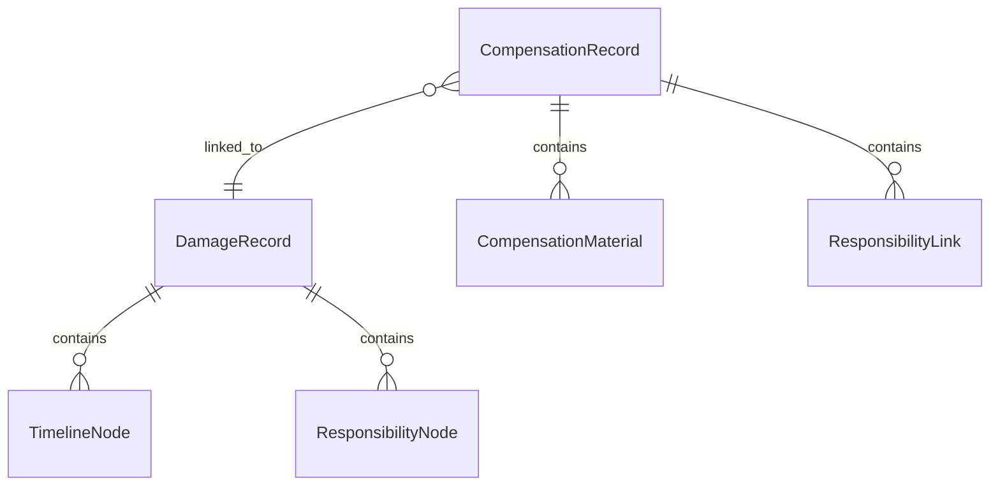

## 1. 架构设计

```mermaid
graph TD
    "前端 SvelteKit" --> "Svelte Store 状态管理"
    "Svelte Store 状态管理" --> "Mock 数据层"
    "Mock 数据层" --> "样例数据 JSON"
```

纯前端原型，无后端服务，使用 SvelteKit + Svelte Store 管理状态，Mock 数据提供样例。

## 2. 技术说明

- 前端：SvelteKit (Svelte 5) + Tailwind CSS 4 + Vite
- 初始化工具：`npx sv create`
- 后端：无（纯前端原型，Mock 数据）
- 数据库：无（使用内存 Store + JSON 样例数据）

## 3. 路由定义

| 路由 | 用途 |
|------|------|
| / | 工作台首页：待办、异常、已完成 |
| /damage | 货损登记列表 |
| /damage/[id] | 货损登记详情（含侧栏、时间线、责任链） |
| /compensation | 赔付材料列表 |
| /compensation/[id] | 赔付材料详情（含材料回看、责任衔接检查） |

## 4. API 定义

无后端 API。数据通过 Svelte Store 在前端内存中管理。

### 4.1 核心 TypeScript 类型

```typescript
interface DamageRecord {
  id: string
  ticketNo: string
  goodsName: string
  goodsType: string
  damageType: string
  status: 'pending' | 'processing' | 'anomaly' | 'completed'
  createdAt: string
  updatedAt: string
  timeline: TimelineNode[]
  responsibilityChain: ResponsibilityNode[]
  currentResponsible: { name: string; role: string } | null
  hasGap: boolean
}

interface TimelineNode {
  id: string
  event: string
  timestamp: string
  responsible: { name: string; role: string } | null
  description: string
  isGap: boolean
}

interface ResponsibilityNode {
  id: string
  name: string
  role: string
  segment: string
  startTime: string
  endTime: string | null
  isGap: boolean
}

interface CompensationRecord {
  id: string
  damageRecordId: string
  compNo: string
  amount: number
  status: 'pending' | 'accepted' | 'material_incomplete' | 'reviewing' | 'completed'
  createdAt: string
  updatedAt: string
  materials: CompensationMaterial[]
  responsibilityLink: ResponsibilityLink[]
  hasGap: boolean
}

interface CompensationMaterial {
  id: string
  name: string
  type: string
  submittedAt: string | null
  submittedBy: string | null
  status: 'missing' | 'submitted' | 'verified'
}

interface ResponsibilityLink {
  from: { name: string; role: string; segment: string }
  to: { name: string; role: string; segment: string }
  isGap: boolean
}

type UserRole = 'freight_clerk' | 'loading_leader' | 'customer_service' | 'station_manager'
```

## 5. 服务器架构

不适用（纯前端）

## 6. 数据模型

### 6.1 数据模型定义



### 6.2 样例数据

预设 5-8 条货损登记记录和 3-5 条赔付记录，涵盖以下场景：
- 待处理（新登记未指定责任人）
- 处理中（已指定责任人，有/无责任空档）
- 异常（责任链有空档、超期未处理）
- 已完成（赔付完成，全链路可追溯）
