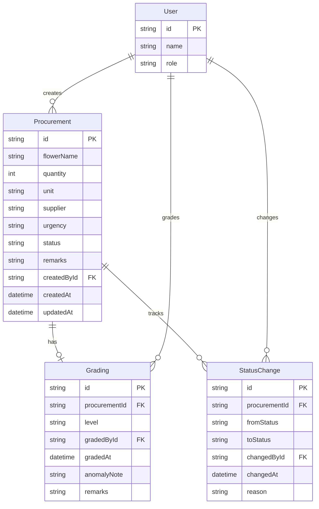

## 1. 架构设计

```mermaid
graph TB
    "浏览器" --> "Remix 前端(React)"
    "Remix 前端(React)" --> "Remix Loader/Action"
    "Remix Loader/Action" --> "PostgreSQL 数据库"
```

## 2. 技术说明
- 前端: Remix (React) + Tailwind CSS
- 初始化工具: npx create-remix
- 后端: Remix 内置 Loader/Action (服务端渲染)
- 数据库: PostgreSQL
- ORM: Prisma
- 状态管理: Remix 内置机制 (loader/action/form) + Zustand (客户端状态)

## 3. 路由定义
| 路由 | 用途 |
|------|------|
| / | 登录页，角色选择 |
| /florist | 花艺师工作台：采购处理与筛选列表 |
| /florist/procurement/:id | 采购单详情/编辑 |
| /dispatcher | 配送调度工作台：待分级队列与分级操作 |
| /dispatcher/grading/:id | 到货分级操作面板 |
| /aftercare | 售后客服工作台：全量回查与申诉处理 |
| /aftercare/review/:id | 单据链路回看 |
| /trace/:id | 到货分级链路追踪（跨角色通用） |

## 4. API 定义

### 4.1 数据类型
```typescript
type ProcurementStatus = "PENDING" | "IN_PROGRESS" | "REJECTED" | "CLOSED" | "NEEDS_REVIEW"

type GradingLevel = "A" | "B" | "C" | "SCRAP"

type UserRole = "FLORIST" | "DISPATCHER" | "AFTERCARE"

interface Procurement {
  id: string
  flowerName: string
  quantity: number
  unit: string
  supplier: string
  urgency: "NORMAL" | "URGENT" | "CRITICAL"
  status: ProcurementStatus
  remarks: string
  createdBy: string
  createdAt: string
  updatedAt: string
  grading: Grading | null
  statusHistory: StatusChange[]
}

interface Grading {
  id: string
  procurementId: string
  level: GradingLevel
  gradedBy: string
  gradedAt: string
  anomalyNote: string
  remarks: string
}

interface StatusChange {
  id: string
  procurementId: string
  fromStatus: ProcurementStatus
  toStatus: ProcurementStatus
  changedBy: string
  changedAt: string
  reason: string
}

interface User {
  id: string
  name: string
  role: UserRole
}
```

### 4.2 接口定义
| 方法 | 路径 | 描述 |
|------|------|------|
| GET | /api/procurements | 获取采购单列表（支持状态筛选、搜索） |
| POST | /api/procurements | 创建采购单 |
| GET | /api/procurements/:id | 获取采购单详情（含分级和状态历史） |
| PATCH | /api/procurements/:id | 更新采购单 |
| POST | /api/procurements/:id/submit | 提交采购单（状态变更为处理中） |
| POST | /api/procurements/:id/reject | 退回采购单 |
| POST | /api/procurements/:id/close | 关闭采购单 |
| GET | /api/gradings/pending | 获取待分级列表 |
| POST | /api/gradings | 创建分级记录 |
| GET | /api/gradings/:id | 获取分级详情 |
| POST | /api/auth/login | 角色登录 |

## 5. 服务端架构

```mermaid
graph LR
    "Remix Route Loader/Action" --> "Service 层"
    "Service 层" --> "Prisma ORM"
    "Prisma ORM" --> "PostgreSQL"
```

## 6. 数据模型

### 6.1 数据模型定义



### 6.2 数据定义语言
```sql
CREATE TABLE "User" (
  id UUID PRIMARY KEY DEFAULT gen_random_uuid(),
  name VARCHAR(100) NOT NULL,
  role VARCHAR(20) NOT NULL CHECK (role IN ('FLORIST', 'DISPATCHER', 'AFTERCARE'))
);

CREATE TABLE "Procurement" (
  id UUID PRIMARY KEY DEFAULT gen_random_uuid(),
  "flowerName" VARCHAR(200) NOT NULL,
  quantity INTEGER NOT NULL,
  unit VARCHAR(20) NOT NULL DEFAULT '扎',
  supplier VARCHAR(200) NOT NULL,
  urgency VARCHAR(20) NOT NULL DEFAULT 'NORMAL' CHECK (urgency IN ('NORMAL', 'URGENT', 'CRITICAL')),
  status VARCHAR(20) NOT NULL DEFAULT 'PENDING' CHECK (status IN ('PENDING', 'IN_PROGRESS', 'REJECTED', 'CLOSED', 'NEEDS_REVIEW')),
  remarks TEXT,
  "createdById" UUID NOT NULL REFERENCES "User"(id),
  "createdAt" TIMESTAMP NOT NULL DEFAULT NOW(),
  "updatedAt" TIMESTAMP NOT NULL DEFAULT NOW()
);

CREATE TABLE "Grading" (
  id UUID PRIMARY KEY DEFAULT gen_random_uuid(),
  "procurementId" UUID NOT NULL REFERENCES "Procurement"(id) ON DELETE CASCADE,
  level VARCHAR(10) NOT NULL CHECK (level IN ('A', 'B', 'C', 'SCRAP')),
  "gradedById" UUID NOT NULL REFERENCES "User"(id),
  "gradedAt" TIMESTAMP NOT NULL DEFAULT NOW(),
  "anomalyNote" TEXT,
  remarks TEXT
);

CREATE TABLE "StatusChange" (
  id UUID PRIMARY KEY DEFAULT gen_random_uuid(),
  "procurementId" UUID NOT NULL REFERENCES "Procurement"(id) ON DELETE CASCADE,
  "fromStatus" VARCHAR(20) NOT NULL,
  "toStatus" VARCHAR(20) NOT NULL,
  "changedById" UUID NOT NULL REFERENCES "User"(id),
  "changedAt" TIMESTAMP NOT NULL DEFAULT NOW(),
  reason TEXT
);

CREATE INDEX idx_procurement_status ON "Procurement"(status);
CREATE INDEX idx_procurement_created_by ON "Procurement"("createdById");
CREATE INDEX idx_procurement_urgency ON "Procurement"(urgency);
CREATE INDEX idx_grading_procurement ON "Grading"("procurementId");
CREATE INDEX idx_status_change_procurement ON "StatusChange"("procurementId");

INSERT INTO "User" (id, name, role) VALUES
  ('a0000000-0000-0000-0000-000000000001', '花艺师-小林', 'FLORIST'),
  ('a0000000-0000-0000-0000-000000000002', '配送调度-老周', 'DISPATCHER'),
  ('a0000000-0000-0000-0000-000000000003', '售后客服-小张', 'AFTERCARE');
```
