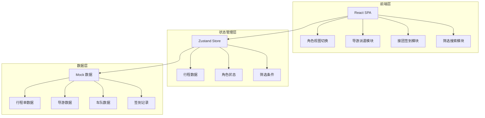
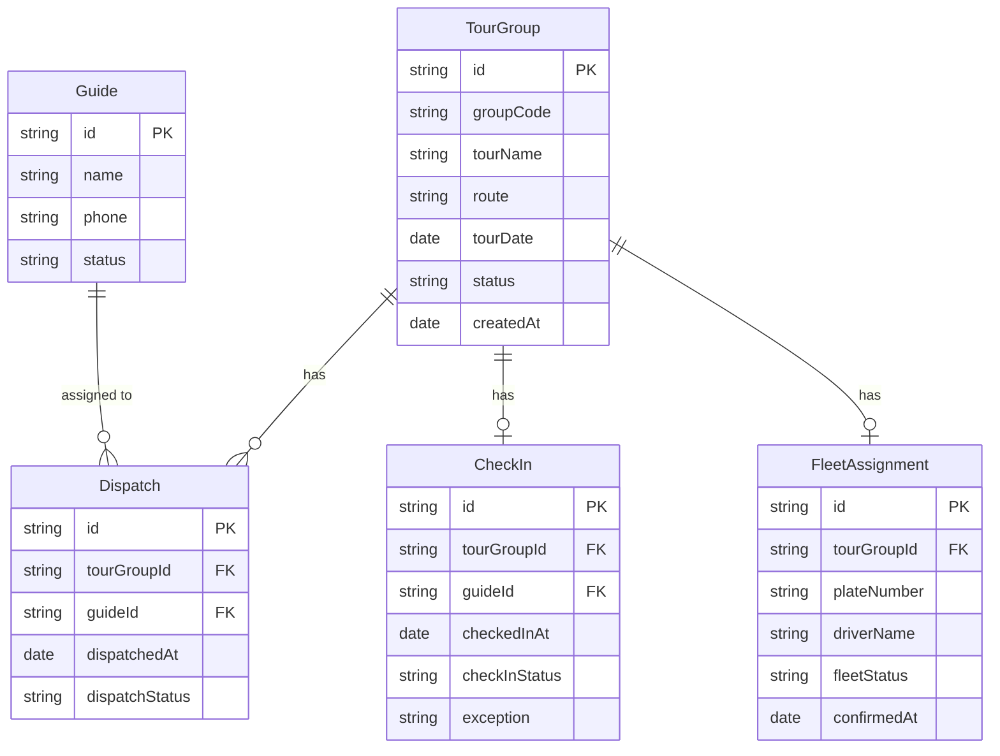

## 1. 架构设计



## 2. 技术说明

- **前端框架**：React 18 + TypeScript + Tailwind CSS 3
- **构建工具**：Vite
- **状态管理**：Zustand
- **路由**：React Router DOM（单页面内角色 Tab 切换，不使用路由跳转）
- **后端**：无（纯前端 Mock 数据）
- **图标**：lucide-react

## 3. 路由定义

| 路由 | 用途 |
|------|------|
| / | 主页面，包含角色切换 Tab 和所有功能模块 |

## 4. 数据模型

### 4.1 数据模型定义



### 4.2 状态枚举

```typescript
type TourGroupStatus = 
    | 'pending_dispatch'    // 待派遣
    | 'dispatched'          // 已派遣
    | 'checked_in'          // 已签到
    | 'fleet_ready'        // 车队就位
    | 'completed'           // 正常关闭
    | 'stuck';              // 卡住/异常

type DispatchStatus = 
    | 'pending'    // 待派遣
    | 'dispatched' // 已派遣
    | 'confirmed'; // 导游已确认

type CheckInStatus = 
    | 'pending'     // 待签到
    | 'checked_in'  // 已签到
    | 'exception';  // 异常上报

type FleetStatus = 
    | 'pending'    // 待确认
    | 'ready'      // 就位
    | 'delayed';   // 延误
```

## 5. 组件结构

```
src/
├── components/
│   ├── RoleTabs.tsx           // 角色切换 Tab
│   ├── DispatcherBoard.tsx    // 计调看板
│   ├── GuideBoard.tsx         // 导游看板
│   ├── FleetBoard.tsx        // 车队调度看板
│   ├── DispatchPanel.tsx      // 派遣操作面板
│   ├── CheckInPanel.tsx       // 签到面板
│   ├── FilterBar.tsx          // 筛选搜索栏
│   ├── TourGroupCard.tsx      // 行程卡片
│   ├── StatusBadge.tsx        // 状态标签
│   ├── TimelineView.tsx       // 时间轴回看
│   └── StatCard.tsx           // 统计卡片
├── store/
│   └── useAppStore.ts         // Zustand 全局状态
├── data/
│   └── mockData.ts            // Mock 测试数据
├── types/
│   └── index.ts               // TypeScript 类型定义
├── pages/
│   └── Dashboard.tsx          // 主页面
├── App.tsx
└── main.tsx
```

## 6. 关键交互设计

### 6.1 派遣→签到自然衔接

1. 计调在派遣面板选择导游 → 点击「确认派遣」
2. 派遣成功后，面板自动切换到「签到预览」视图，显示导游将收到的签到任务信息
3. 导游端看板实时更新，待签到任务列表新增一条
4. 无需额外消息/通知，导游端「待签到」区域自然承接

### 6.2 卡住记录视觉处理

- 卡住状态的行程卡片左侧显示琥珀色竖条
- 状态标签使用脉冲动画（animate-pulse）持续提醒
- 计调看板顶部单独展示「异常预警」统计卡片
