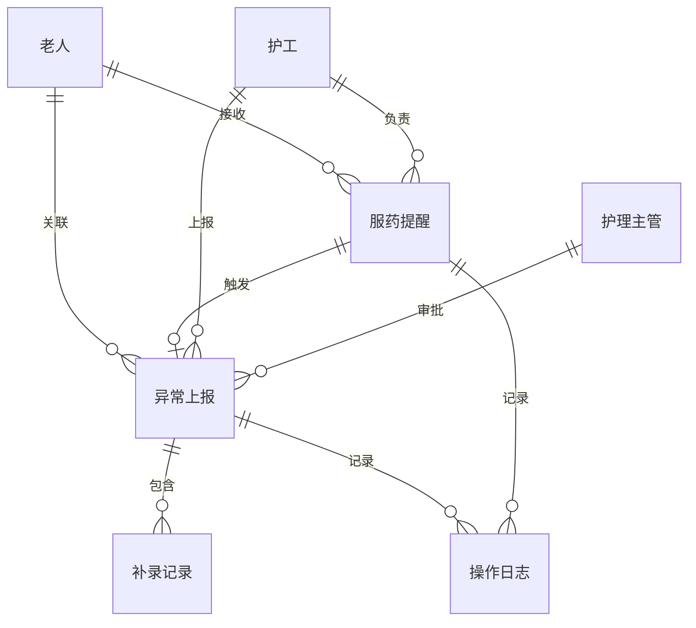

## 1. 架构设计

```mermaid
flowchart TB
    subgraph "前端层 (Vite + React + TypeScript)"
        "角色选择页" --> "护理主管工作台"
        "角色选择页" --> "责任护工工作台"
        "角色选择页" --> "社工工作台"
        "护理主管工作台" --> "概览台"
        "护理主管工作台" --> "审批台"
        "责任护工工作台" --> "提醒台"
        "责任护工工作台" --> "上报台"
        "社工工作台" --> "沟通台"
    end

    subgraph "数据层 (Mock)"
        "Mock API Service" --> "提醒数据"
        "Mock API Service" --> "上报数据"
        "Mock API Service" --> "审批数据"
        "Mock API Service" --> "操作日志"
    end

    "前端层" -->|"zustand 状态管理"| "Mock API Service"
```

## 2. 技术说明

- **前端**：React 18 + TypeScript + TailwindCSS 3 + Vite
- **初始化工具**：vite-init（react-ts 模板）
- **后端**：无，纯前端原型，使用 Mock 数据
- **数据库**：无，使用 localStorage 持久化 + 内存 Mock 数据
- **状态管理**：Zustand
- **路由**：react-router-dom v6
- **图标**：lucide-react

## 3. 路由定义

| 路由 | 用途 |
|------|------|
| `/` | 角色选择页（三角色入口卡片） |
| `/supervisor` | 护理主管-概览台 |
| `/supervisor/approval` | 护理主管-审批台 |
| `/caregiver` | 责任护工-提醒台 |
| `/caregiver/report` | 责任护工-上报台 |
| `/social-worker` | 社工-沟通台 |

## 4. API 定义（Mock）

### 4.1 服药提醒相关

```typescript
interface MedicationReminder {
  id: string
  elderId: string
  elderName: string
  bedNo: string
  medicationName: string
  dosage: string
  scheduledTime: string
  status: 'pending' | 'confirmed' | 'abnormal' | 'timeout'
  caregiverId: string
  caregiverName: string
  confirmedAt?: string
  abnormalNote?: string
  reportId?: string
}

// GET /api/reminders?caregiverId=xxx
// POST /api/reminders/:id/confirm
// POST /api/reminders/:id/mark-abnormal → 自动创建异常上报草稿
```

### 4.2 异常上报相关

```typescript
interface AnomalyReport {
  id: string
  reminderId: string
  elderId: string
  elderName: string
  bedNo: string
  reporterId: string
  reporterName: string
  anomalyType: 'medication_refused' | 'adverse_reaction' | 'timeout' | 'other'
  description: string
  severity: 'low' | 'medium' | 'high'
  status: 'draft' | 'submitted' | 'approved' | 'rejected' | 'supplemented'
  submittedAt?: string
  reviewedBy?: string
  reviewedAt?: string
  rejectionReason?: string
  supplementHistory: SupplementRecord[]
  involvesFamily: boolean
  familyNotified: boolean
  familyConfirmed: boolean
}

interface SupplementRecord {
  id: string
  reportId: string
  supplementContent: string
  supplementedBy: string
  supplementedAt: string
}

// GET /api/reports?status=xxx&reporterId=xxx
// POST /api/reports （创建草稿）
// PUT /api/reports/:id/submit （提交上报）
// PUT /api/reports/:id/approve （审批通过）
// PUT /api/reports/:id/reject （驳回，body 含 rejectionReason）
// POST /api/reports/:id/supplement （补录）
// PUT /api/reports/:id/family-notify （社工标记家属通知）
```

### 4.3 操作日志

```typescript
interface OperationLog {
  id: string
  entityType: 'reminder' | 'report'
  entityId: string
  action: string
  operatorId: string
  operatorName: string
  operatorRole: 'supervisor' | 'caregiver' | 'social_worker'
  timestamp: string
  detail: string
}

// GET /api/logs?entityId=xxx
```

## 5. 数据模型

### 5.1 实体关系



### 5.2 Mock 数据定义

系统启动时预置以下 Mock 数据：
- 8 位老人信息
- 12 条服药提醒（覆盖 pending/confirmed/abnormal/timeout 四种状态）
- 5 条异常上报（覆盖 draft/submitted/approved/rejected/supplemented 五种状态）
- 3 条补录记录
- 完整操作日志
