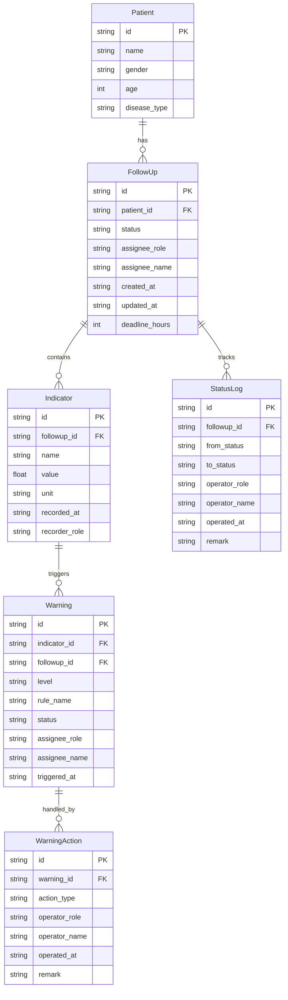

## 1. 架构设计

```mermaid
flowchart TB
    subgraph "前端层"
        "React 18 + TypeScript"
        "Tailwind CSS"
        "Zustand 状态管理"
        "React Router"
    end
    subgraph "数据层"
        "Mock 数据引擎"
        "状态流转引擎"
        "预警检测引擎"
    end
    "前端层" --> "数据层"
```

纯前端架构，Mock 数据引擎模拟后端，状态流转引擎和预警检测引擎在前端运行，确保随访→预警全链路可用。

## 2. 技术说明

- 前端：React@18 + TypeScript + Tailwind CSS@3 + Vite
- 初始化工具：vite-init（react-ts 模板）
- 状态管理：Zustand
- 后端：无（纯前端 Mock）
- 数据库：无（内存数据 + Mock）

## 3. 路由定义

| 路由 | 用途 |
|------|------|
| / | 角色选择页，选择全科医生/护士/公共卫生专员后跳转工作台 |
| /followup | 慢病随访工作台，含待办列表和详情面板 |
| /warning | 指标预警中心，含预警列表、回看、异常提醒和批量动作 |

## 4. 数据模型

### 4.1 数据模型定义



### 4.2 核心状态枚举

```typescript
type FollowUpStatus = 'pending' | 'in_progress' | 'pending_review' | 'completed' | 'warned'

type WarningLevel = 'red' | 'orange' | 'yellow'

type WarningStatus = 'active' | 'processing' | 'resolved' | 'returned'

type Role = 'doctor' | 'nurse' | 'ph_specialist'

type WarningActionType = 'remind' | 'confirm' | 'return' | 'assign' | 'batch_confirm' | 'batch_assign' | 'batch_return'
```

### 4.3 预警检测规则

| 规则名称 | 指标 | 条件 | 预警级别 |
|----------|------|------|----------|
| 血糖持续偏高 | 空腹血糖 | ≥ 7.0 mmol/L | 红色 |
| 血压波动异常 | 收缩压/舒张压 | ≥ 180/110 mmHg | 橙色 |
| 随访超时 | 时效 | 超过48小时未流转 | 黄色 |

## 5. 组件结构

```
src/
├── pages/
│   ├── RoleSelect.tsx          # 角色选择页
│   ├── FollowUp.tsx            # 慢病随访工作台
│   └── WarningCenter.tsx       # 指标预警中心
├── components/
│   ├── RoleSwitcher.tsx        # 角色切换栏
│   ├── FollowUpCard.tsx        # 随访卡片
│   ├── FollowUpDetail.tsx      # 随访详情面板
│   ├── StatusTimeline.tsx      # 状态时间线
│   ├── WarningCard.tsx         # 预警卡片
│   ├── WarningTimeline.tsx     # 预警回看时间线
│   ├── WarningAction.tsx       # 异常提醒/退回操作
│   ├── BatchActionBar.tsx      # 批量动作栏
│   └── IndicatorChart.tsx      # 指标趋势迷你图
├── store/
│   ├── useFollowUpStore.ts     # 随访状态管理
│   ├── useWarningStore.ts      # 预警状态管理
│   └── useRoleStore.ts         # 角色状态管理
├── utils/
│   ├── mockData.ts             # Mock 数据生成
│   ├── warningEngine.ts        # 预警检测引擎
│   └── statusEngine.ts         # 状态流转引擎
└── types/
    └── index.ts                # 类型定义
```
