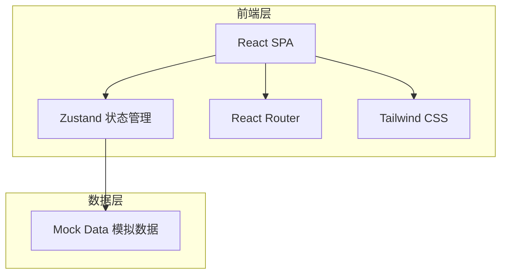
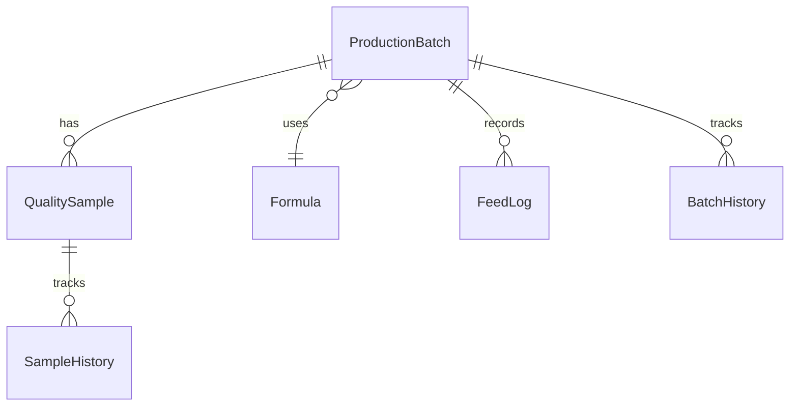

## 1. 架构设计



纯前端架构，不接入真实后端接口，使用内存 Mock 数据驱动所有交互。

## 2. 技术说明

- **前端**：React 18 + TypeScript + Vite + Tailwind CSS 3
- **状态管理**：Zustand（轻量、无 boilerplate）
- **路由**：React Router DOM v6
- **图表**：Recharts（质检留样回看趋势图）
- **图标**：Lucide React
- **初始化工具**：vite-init (react-ts 模板)
- **后端**：无（纯 Mock 数据）
- **数据库**：无（内存状态 + localStorage 持久化可选）

## 3. 路由定义

| 路由 | 用途 |
|------|------|
| `/` | 工作台看板 - 默认首页，优先级全局视图 |
| `/batches` | 生产批次列表 |
| `/batches/:id` | 生产批次详情（侧栏模式，不跳转） |
| `/samples` | 质检留样列表 |
| `/samples/:id` | 质检留样详情（侧栏模式，不跳转） |
| `/formulas` | 配方单列表（背景模块） |
| `/feed-logs` | 投料记录（背景模块） |

## 4. 数据模型

### 4.1 数据模型定义



### 4.2 核心类型定义

```typescript
type BatchStatus = 'pending_feed' | 'in_production' | 'pending_qc' | 'completed' | 'abnormal'

type SampleStatus = 'pending_sample' | 'testing' | 'qualified' | 'unqualified' | 'archived' | 'destroyed'

type UserRole = 'formulator' | 'production_lead' | 'qc_inspector' | 'manager'

interface ProductionBatch {
  id: string
  batchNo: string
  formulaId: string
  formulaName: string
  status: BatchStatus
  progress: number
  createdBy: string
  createdAt: string
  updatedAt: string
  lastModifiedBy: string
  plannedQty: number
  actualQty: number | null
  feedLogs: FeedLog[]
  samples: QualitySample[]
  history: BatchHistoryEntry[]
}

interface QualitySample {
  id: string
  sampleNo: string
  batchId: string
  batchNo: string
  status: SampleStatus
 指标: Record<string, number>
  tester: string
  testedAt: string | null
  createdAt: string
  history: SampleHistoryEntry[]
  retentionExpiry: string | null
}

interface BatchHistoryEntry {
  id: string
  batchId: string
  fromStatus: BatchStatus | null
  toStatus: BatchStatus
  operator: string
  operatorRole: UserRole
  remark: string
  timestamp: string
}

interface SampleHistoryEntry {
  id: string
  sampleId: string
  fromStatus: SampleStatus | null
  toStatus: SampleStatus
  operator: string
  operatorRole: UserRole
  remark: string
  timestamp: string
}

interface Formula {
  id: string
  name: string
  code: string
  batchCount: number
  lastUsedAt: string
}

interface FeedLog {
  id: string
  batchId: string
  material: string
  weight: number
  operator: string
  timestamp: string
}

interface ActivityItem {
  id: string
  type: 'batch' | 'sample' | 'formula'
  action: string
  operator: string
  operatorRole: UserRole
  targetId: string
  targetName: string
  timestamp: string
  priority: 'urgent' | 'normal' | 'low'
}
```

## 5. 状态管理设计

使用 Zustand 创建以下 Store：

- **useBatchStore**：生产批次列表、当前选中批次、CRUD 操作、状态流转
- **useSampleStore**：质检留样列表、当前选中留样、检测数据更新、留样回看
- **useUIStore**：侧栏开关、当前角色、筛选条件、视图状态
- **useActivityStore**：最近活动流、优先级排序

## 6. 组件结构

```
src/
├── components/
│   ├── layout/
│   │   ├── AppLayout.tsx        # 主布局：侧栏导航 + 内容区
│   │   ├── Sidebar.tsx          # 左侧导航栏
│   │   └── DetailPanel.tsx      # 右侧详情侧栏
│   ├── dashboard/
│   │   ├── PriorityBoard.tsx    # 优先级看板
│   │   ├── UrgentCard.tsx       # 卡住/紧急卡片
│   │   ├── PendingCard.tsx      # 待处理卡片
│   │   ├── RecentActivity.tsx   # 最近活动流
│   │   └── RoleActions.tsx      # 角色快捷入口
│   ├── batch/
│   │   ├── BatchList.tsx        # 批次列表
│   │   ├── BatchCard.tsx        # 批次卡片
│   │   ├── BatchStatusBadge.tsx # 批次状态标签
│   │   ├── BatchDetail.tsx      # 批次详情（侧栏内）
│   │   ├── BatchHistory.tsx     # 批次历史时间线
│   │   └── BatchActions.tsx     # 批次快捷动作
│   ├── sample/
│   │   ├── SampleList.tsx       # 留样列表
│   │   ├── SampleCard.tsx       # 留样卡片
│   │   ├── SampleStatusBadge.tsx# 留样状态标签
│   │   ├── SampleDetail.tsx     # 留样详情（侧栏内）
│   │   ├── SampleHistory.tsx    # 留样历史
│   │   └── SampleTrendChart.tsx # 留样趋势图
│   ├── formula/
│   │   ├── FormulaList.tsx      # 配方列表
│   │   └── FormulaCard.tsx      # 配方卡片
│   ├── feed-log/
│   │   └── FeedLogList.tsx      # 投料记录
│   └── shared/
│       ├── StatusBadge.tsx      # 通用状态标签
│       ├── Timeline.tsx         # 通用时间线
│       └── EmptyState.tsx       # 空状态占位
├── stores/
│   ├── batchStore.ts
│   ├── sampleStore.ts
│   ├── uiStore.ts
│   └── activityStore.ts
├── pages/
│   ├── Dashboard.tsx
│   ├── Batches.tsx
│   ├── Samples.tsx
│   ├── Formulas.tsx
│   └── FeedLogs.tsx
├── data/
│   └── mock.ts                 # Mock 数据
├── types/
│   └── index.ts                # 类型定义
├── hooks/
│   └── useRole.ts              # 角色相关 Hook
├── App.tsx
└── main.tsx
```
