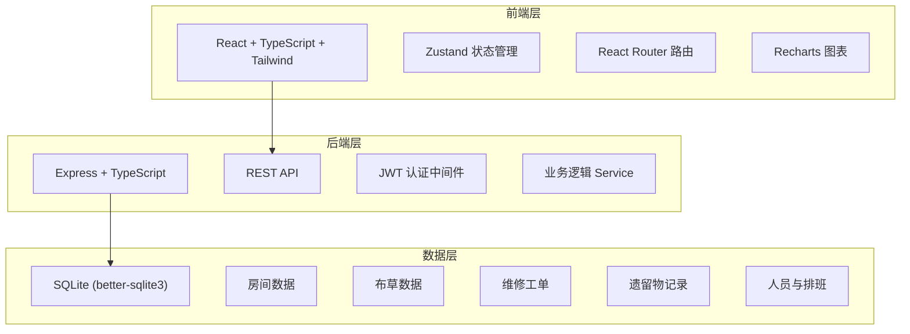
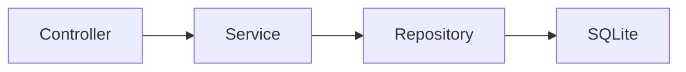
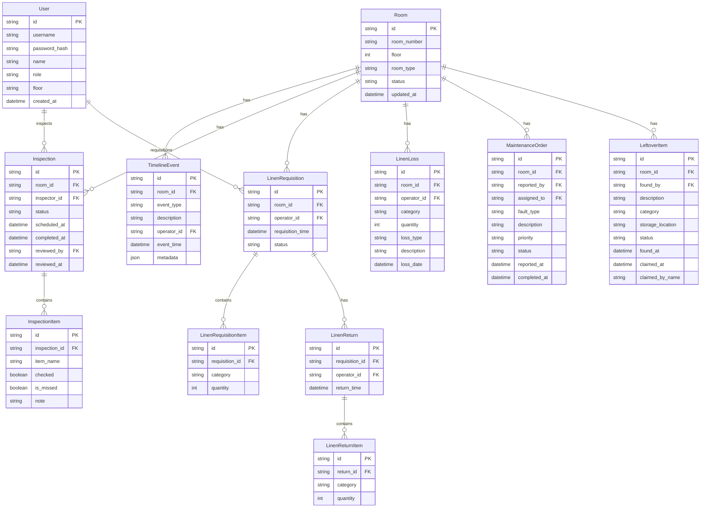

## 1. 架构设计



## 2. 技术说明

- 前端：React@18 + Tailwind CSS@3 + Vite
- 初始化工具：vite-init
- 后端：Express@4 + TypeScript
- 数据库：SQLite (better-sqlite3)，适合单机部署的酒店场景
- 认证：JWT Token
- 图表：Recharts
- 状态管理：Zustand
- 路由：React Router DOM v6

## 3. 路由定义

| 路由 | 用途 |
|------|------|
| `/` | 工作台总览，房态看板+今日待办+预警 |
| `/rooms` | 房态管理列表 |
| `/rooms/:id` | 房间详情+时间线 |
| `/rooms/:id/inspection` | 查房记录 |
| `/linen` | 布草管理总览 |
| `/linen/requisition` | 布草领用登记 |
| `/linen/return` | 布草归还记录 |
| `/linen/loss` | 损耗登记 |
| `/linen/inventory` | 盘点对账 |
| `/maintenance` | 维修工单列表 |
| `/maintenance/:id` | 工单详情 |
| `/maintenance/new` | 新建报修 |
| `/leftovers` | 遗留物列表 |
| `/leftovers/:id` | 遗留物详情 |
| `/statistics` | 数据统计 |
| `/staff` | 人员与排班 |

## 4. API 定义

### 4.1 认证

```typescript
POST /api/auth/login
  Request: { username: string; password: string }
  Response: { token: string; user: User }

GET /api/auth/me
  Response: User
```

### 4.2 房间

```typescript
GET /api/rooms
  Query: { floor?: number; status?: RoomStatus }
  Response: Room[]

GET /api/rooms/:id
  Response: Room & { timeline: TimelineEvent[] }

PATCH /api/rooms/:id/status
  Request: { status: RoomStatus; operatorId: string }
  Response: Room
```

### 4.3 查房

```typescript
GET /api/inspections
  Query: { roomId?: string; inspectorId?: string; date?: string; status?: InspectionStatus }
  Response: Inspection[]

POST /api/inspections
  Request: { roomId: string; inspectorId: string; items: InspectionItem[]; missedItems?: string[]; photos?: string[]; leftoverFound?: boolean; maintenanceNeeded?: boolean }
  Response: Inspection

PATCH /api/inspections/:id
  Request: { status?: InspectionStatus; reviewedBy?: string; reviewNote?: string }
  Response: Inspection
```

### 4.4 布草

```typescript
GET /api/linen/inventory
  Query: { floor?: number; category?: string }
  Response: LinenInventoryItem[]

POST /api/linen/requisitions
  Request: { roomId: string; operatorId: string; items: { category: string; quantity: number }[] }
  Response: LinenRequisition

GET /api/linen/requisitions
  Query: { date?: string; operatorId?: string; roomId?: string }
  Response: LinenRequisition[]

POST /api/linen/returns
  Request: { requisitionId: string; operatorId: string; items: { category: string; quantity: number }[] }
  Response: LinenReturn & { discrepancies: DiscrepancyItem[] }

POST /api/linen/losses
  Request: { roomId: string; operatorId: string; items: { category: string; quantity: number; type: LossType; description?: string }[] }
  Response: LinenLoss[]

GET /api/linen/losses
  Query: { dateFrom?: string; dateTo?: string; floor?: number; operatorId?: string }
  Response: LinenLoss[]
```

### 4.5 维修

```typescript
GET /api/maintenance
  Query: { status?: MaintenanceStatus; roomId?: string; priority?: Priority }
  Response: MaintenanceOrder[]

POST /api/maintenance
  Request: { roomId: string; reportedBy: string; faultType: string; description: string; priority: Priority; photos?: string[] }
  Response: MaintenanceOrder

PATCH /api/maintenance/:id
  Request: { status?: MaintenanceStatus; assignedTo?: string; completionNote?: string; completionPhotos?: string[] }
  Response: MaintenanceOrder
```

### 4.6 遗留物

```typescript
GET /api/leftovers
  Query: { status?: LeftoverStatus; roomId?: string }
  Response: LeftoverItem[]

POST /api/leftovers
  Request: { roomId: string; foundBy: string; description: string; category: string; photos?: string[]; storageLocation: string }
  Response: LeftoverItem

PATCH /api/leftovers/:id
  Request: { status?: LeftoverStatus; claimedBy?: string; claimNote?: string }
  Response: LeftoverItem
```

### 4.7 统计

```typescript
GET /api/statistics/linen-loss
  Query: { dateFrom: string; dateTo: string; groupBy: 'floor' | 'operator' | 'category' }
  Response: LinenLossStatistics

GET /api/statistics/inspection-miss
  Query: { dateFrom: string; dateTo: string; groupBy: 'operator' | 'floor' | 'item' }
  Response: InspectionMissStatistics

GET /api/statistics/maintenance-response
  Query: { dateFrom: string; dateTo: string }
  Response: MaintenanceResponseStatistics
```

## 5. 服务端架构图



## 6. 数据模型

### 6.1 数据模型定义



### 6.2 数据定义语言

```sql
CREATE TABLE users (
  id TEXT PRIMARY KEY,
  username TEXT UNIQUE NOT NULL,
  password_hash TEXT NOT NULL,
  name TEXT NOT NULL,
  role TEXT NOT NULL CHECK(role IN ('supervisor','floor_leader','attendant','linen_staff')),
  floor INTEGER,
  created_at TEXT DEFAULT (datetime('now'))
);

CREATE TABLE rooms (
  id TEXT PRIMARY KEY,
  room_number TEXT UNIQUE NOT NULL,
  floor INTEGER NOT NULL,
  room_type TEXT NOT NULL,
  status TEXT NOT NULL DEFAULT 'vacant' CHECK(status IN ('vacant','occupied','cleaning','inspecting','maintenance')),
  updated_at TEXT DEFAULT (datetime('now'))
);

CREATE TABLE timeline_events (
  id TEXT PRIMARY KEY,
  room_id TEXT NOT NULL REFERENCES rooms(id),
  event_type TEXT NOT NULL,
  description TEXT,
  operator_id TEXT NOT NULL REFERENCES users(id),
  event_time TEXT DEFAULT (datetime('now')),
  metadata TEXT
);

CREATE TABLE inspections (
  id TEXT PRIMARY KEY,
  room_id TEXT NOT NULL REFERENCES rooms(id),
  inspector_id TEXT NOT NULL REFERENCES users(id),
  status TEXT NOT NULL DEFAULT 'pending' CHECK(status IN ('pending','in_progress','completed','reviewed')),
  scheduled_at TEXT,
  completed_at TEXT,
  reviewed_by TEXT REFERENCES users(id),
  reviewed_at TEXT
);

CREATE TABLE inspection_items (
  id TEXT PRIMARY KEY,
  inspection_id TEXT NOT NULL REFERENCES inspections(id) ON DELETE CASCADE,
  item_name TEXT NOT NULL,
  checked INTEGER DEFAULT 0,
  is_missed INTEGER DEFAULT 0,
  note TEXT
);

CREATE TABLE linen_requisitions (
  id TEXT PRIMARY KEY,
  room_id TEXT NOT NULL REFERENCES rooms(id),
  operator_id TEXT NOT NULL REFERENCES users(id),
  requisition_time TEXT DEFAULT (datetime('now')),
  status TEXT NOT NULL DEFAULT 'pending' CHECK(status IN ('pending','fulfilled','returned'))
);

CREATE TABLE linen_requisition_items (
  id TEXT PRIMARY KEY,
  requisition_id TEXT NOT NULL REFERENCES linen_requisitions(id) ON DELETE CASCADE,
  category TEXT NOT NULL,
  quantity INTEGER NOT NULL
);

CREATE TABLE linen_returns (
  id TEXT PRIMARY KEY,
  requisition_id TEXT NOT NULL REFERENCES linen_requisitions(id),
  operator_id TEXT NOT NULL REFERENCES users(id),
  return_time TEXT DEFAULT (datetime('now'))
);

CREATE TABLE linen_return_items (
  id TEXT PRIMARY KEY,
  return_id TEXT NOT NULL REFERENCES linen_returns(id) ON DELETE CASCADE,
  category TEXT NOT NULL,
  quantity INTEGER NOT NULL
);

CREATE TABLE linen_losses (
  id TEXT PRIMARY KEY,
  room_id TEXT NOT NULL REFERENCES rooms(id),
  operator_id TEXT NOT NULL REFERENCES users(id),
  category TEXT NOT NULL,
  quantity INTEGER NOT NULL,
  loss_type TEXT NOT NULL CHECK(loss_type IN ('wear','stain','missing')),
  description TEXT,
  loss_date TEXT DEFAULT (datetime('now'))
);

CREATE TABLE maintenance_orders (
  id TEXT PRIMARY KEY,
  room_id TEXT NOT NULL REFERENCES rooms(id),
  reported_by TEXT NOT NULL REFERENCES users(id),
  assigned_to TEXT REFERENCES users(id),
  fault_type TEXT NOT NULL,
  description TEXT,
  priority TEXT NOT NULL DEFAULT 'normal' CHECK(priority IN ('low','normal','high','urgent')),
  status TEXT NOT NULL DEFAULT 'reported' CHECK(status IN ('reported','assigned','in_progress','completed','verified')),
  reported_at TEXT DEFAULT (datetime('now')),
  completed_at TEXT
);

CREATE TABLE leftover_items (
  id TEXT PRIMARY KEY,
  room_id TEXT NOT NULL REFERENCES rooms(id),
  found_by TEXT NOT NULL REFERENCES users(id),
  description TEXT NOT NULL,
  category TEXT NOT NULL,
  storage_location TEXT NOT NULL,
  status TEXT NOT NULL DEFAULT 'found' CHECK(status IN ('found','stored','claimed','disposed')),
  found_at TEXT DEFAULT (datetime('now')),
  claimed_at TEXT,
  claimed_by_name TEXT
);

CREATE INDEX idx_rooms_floor ON rooms(floor);
CREATE INDEX idx_rooms_status ON rooms(status);
CREATE INDEX idx_timeline_room ON timeline_events(room_id);
CREATE INDEX idx_timeline_operator ON timeline_events(operator_id);
CREATE INDEX idx_inspections_room ON inspections(room_id);
CREATE INDEX idx_inspections_inspector ON inspections(inspector_id);
CREATE INDEX idx_linen_requisitions_room ON linen_requisitions(room_id);
CREATE INDEX idx_linen_requisitions_operator ON linen_requisitions(operator_id);
CREATE INDEX idx_linen_losses_date ON linen_losses(loss_date);
CREATE INDEX idx_maintenance_status ON maintenance_orders(status);
CREATE INDEX idx_leftovers_status ON leftover_items(status);
```
