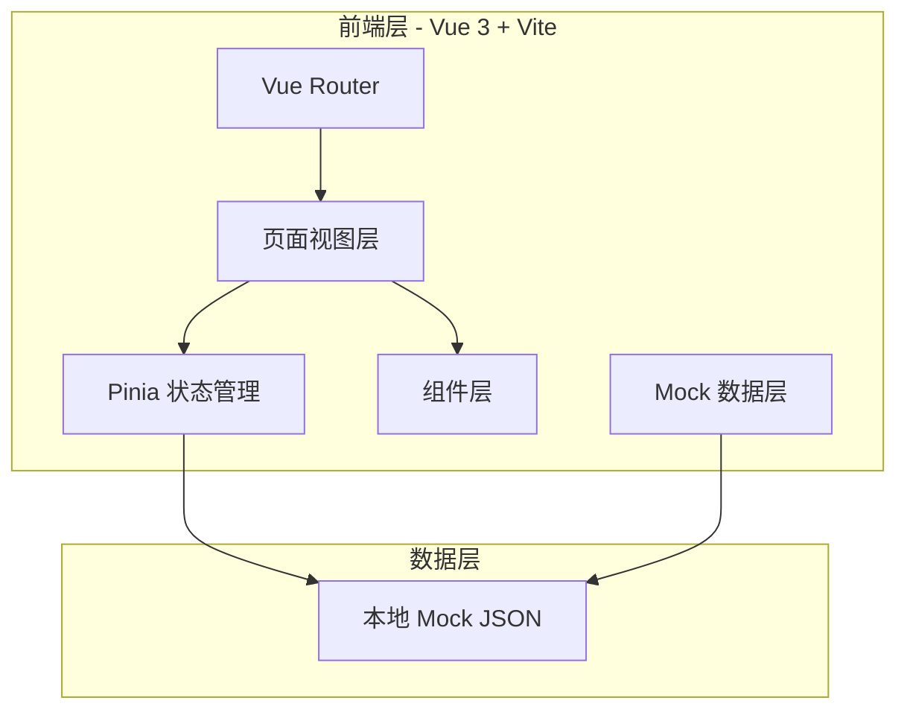
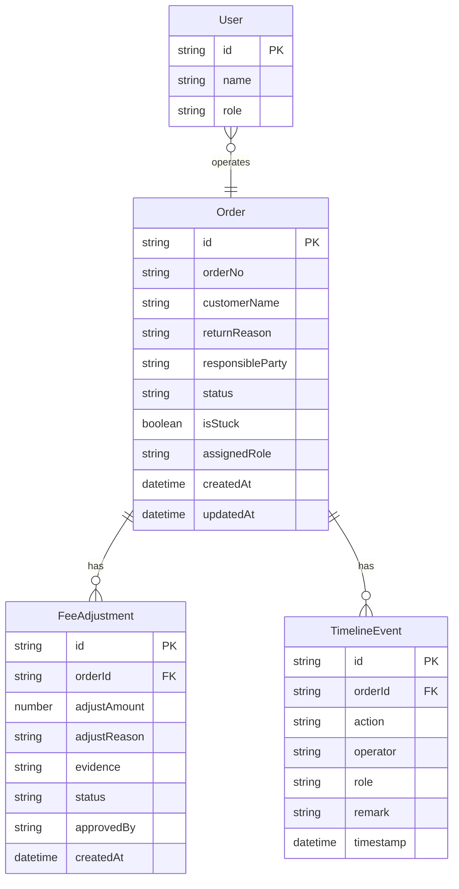

## 1. 架构设计



## 2. 技术说明

- **前端框架**：Vue 3 + Composition API + `<script setup>` 语法
- **构建工具**：Vite
- **样式方案**：Tailwind CSS 3
- **路由**：Vue Router 4
- **状态管理**：Pinia
- **图标**：Material Icons（通过 CDN）
- **后端**：无（纯前端原型，使用 Mock 数据）
- **数据库**：无（Mock 数据存于 `src/mock/` 目录）

## 3. 路由定义

| 路由 | 用途 | 权限角色 |
|------|------|----------|
| `/` | 角色视图首页（待办看板） | 全部角色 |
| `/aftersales` | 售后退换处理页 | 全部角色（操作按钮按角色显示） |
| `/fee-adjustment` | 费用调整回看页 | 销售内勤、售后专员 |

## 4. 数据模型

### 4.1 数据模型定义



### 4.2 TypeScript 类型定义

```typescript
interface Order {
  id: string
  orderNo: string
  customerName: string
  productName: string
  quantity: number
  returnReason: string
  responsibleParty: string
  returnType: 'return' | 'exchange'
  status: 'pending_review' | 'approved' | 'rejected' | 'warehousing' | 'fee_adjusting' | 'completed'
  isStuck: boolean
  assignedRole: 'sales_clerk' | 'warehouse' | 'after_sales'
  feeAdjustment?: FeeAdjustment
  remarks: Remark[]
  createdAt: string
  updatedAt: string
}

interface FeeAdjustment {
  id: string
  orderId: string
  adjustAmount: number
  adjustReason: string
  evidenceSummary: string
  screenshotThumbnails: string[]
  status: 'pending' | 'approved' | 'rejected'
  approvedBy: string
  createdAt: string
}

interface TimelineEvent {
  id: string
  orderId: string
  action: string
  operator: string
  role: string
  remark: string
  timestamp: string
}

interface Remark {
  id: string
  author: string
  role: string
  content: string
  createdAt: string
}

interface User {
  id: string
  name: string
  role: 'sales_clerk' | 'warehouse' | 'after_sales'
  avatar: string
}
```

## 5. 组件结构

```
src/
├── App.vue
├── main.ts
├── router/
│   └── index.ts
├── stores/
│   ├── role.ts
│   └── orders.ts
├── views/
│   ├── DashboardView.vue
│   ├── AfterSalesView.vue
│   └── FeeAdjustmentView.vue
├── components/
│   ├── RoleSwitcher.vue
│   ├── StuckAlert.vue
│   ├── OrderCard.vue
│   ├── OrderDetailPanel.vue
│   ├── TimelineView.vue
│   ├── FeeAdjustmentInline.vue
│   ├── EvidenceAggregation.vue
│   └── RemarkInput.vue
├── mock/
│   ├── orders.ts
│   ├── feeAdjustments.ts
│   ├── timeline.ts
│   └── users.ts
├── types/
│   └── index.ts
└── assets/
    └── styles/
```

## 6. 关键交互逻辑

### 6.1 角色切换

- 全局 Pinia store `useRoleStore` 管理当前角色
- 切换角色时自动过滤待办列表（按 `assignedRole` 字段）
- 导航栏角色切换器实时更新待办计数徽标

### 6.2 卡单暴露

- Mock 数据中 `isStuck: true` 标记卡单
- Dashboard 顶部 `StuckAlert` 组件自动汇总卡单数量
- 列表中 `OrderCard` 对卡单加红色边框 + 脉冲动画

### 6.3 费用调整内联

- `OrderCard` 内嵌 `FeeAdjustmentInline` 折叠区域
- 展开后显示调整金额、依据摘要，点击"查看完整依据"打开 `EvidenceAggregation` 面板
- 无需页面跳转

### 6.4 侧滑详情面板

- 点击卡片打开 `OrderDetailPanel` 侧滑面板
- 面板内含 `TimelineView` 时间线 + 操作按钮 + `RemarkInput` 备注输入
- 操作按钮按当前角色动态显示
