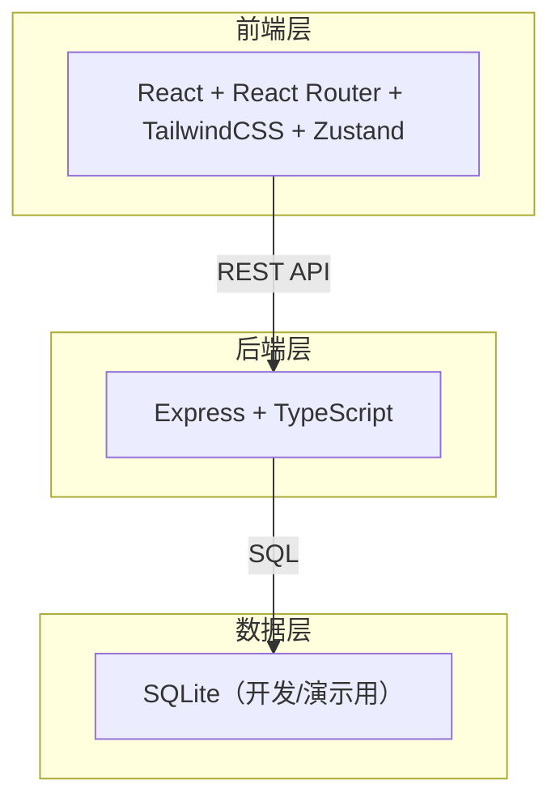
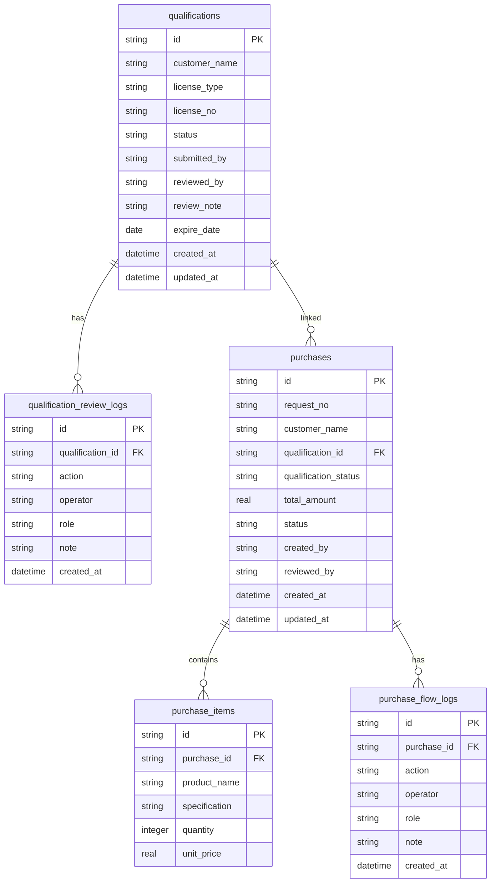

## 1. 架构设计



## 2. 技术说明

- 前端：React@18 + TailwindCSS@3 + Vite + Zustand（状态管理）
- 初始化工具：vite-init（react-express-ts 模板）
- 后端：Express@4 + TypeScript（ESM 模式）
- 数据库：SQLite（better-sqlite3，演示/开发场景，数据重置直接删除db文件）
- 无外部服务依赖

## 3. 路由定义

| 路由 | 用途 |
|------|------|
| / | 角色入口页，选择角色并进入对应工作台 |
| /qualifications | 客户资质列表页（含筛选） |
| /qualifications/:id | 客户资质详情页（含审核操作） |
| /purchases | 采购申请列表页（含筛选） |
| /purchases/:id | 采购申请详情页（含状态操作+资质关联） |
| /dashboard | 主管总览看板 |

## 4. API 定义

### 4.1 角色与会话

```
GET    /api/roles                    # 获取角色列表
POST   /api/session                  # 设置当前角色（模拟登录）
GET    /api/session                  # 获取当前角色
```

### 4.2 客户资质

```
GET    /api/qualifications           # 列表（支持筛选：status, customer, expiring）
GET    /api/qualifications/:id       # 详情（含审核记录）
POST   /api/qualifications           # 创建资质
PUT    /api/qualifications/:id       # 更新资质
POST   /api/qualifications/:id/review   # 审核（通过/驳回）
```

### 4.3 采购申请

```
GET    /api/purchases                # 列表（支持筛选：status, customer, applicant, dateRange）
GET    /api/purchases/:id            # 详情（含流转记录+关联资质）
POST   /api/purchases                # 创建采购申请（含资质校验）
POST   /api/purchases/:id/approve    # 主管审核
POST   /api/purchases/:id/confirm-out  # 仓库员确认出库
POST   /api/purchases/:id/ship       # 仓库员标记发货
POST   /api/purchases/:id/complete   # 标记完成
```

### 4.4 主管看板

```
GET    /api/dashboard/stats          # 统计数据
GET    /api/dashboard/alerts         # 异常提醒列表
```

### 4.5 数据类型定义

```typescript
type Role = 'sales_clerk' | 'warehouse' | 'after_sales' | 'director'

interface Qualification {
  id: string
  customer_name: string
  license_type: string
  license_no: string
  status: 'pending' | 'approved' | 'rejected' | 'expiring_soon' | 'expired'
  submitted_by: string
  reviewed_by?: string
  review_note?: string
  expire_date: string
  created_at: string
  updated_at: string
}

interface QualificationReviewLog {
  id: string
  qualification_id: string
  action: 'submit' | 'approve' | 'reject' | 'resubmit' | 'expire_warning' | 'expire'
  operator: string
  role: Role
  note?: string
  created_at: string
}

interface Purchase {
  id: string
  request_no: string
  customer_name: string
  qualification_id: string
  qualification_status: Qualification['status']
  items: PurchaseItem[]
  total_amount: number
  status: 'draft' | 'pending_review' | 'approved' | 'rejected' | 'confirming_out' | 'shipping' | 'completed'
  created_by: string
  reviewed_by?: string
  created_at: string
  updated_at: string
}

interface PurchaseItem {
  product_name: string
  specification: string
  quantity: number
  unit_price: number
}

interface PurchaseFlowLog {
  id: string
  purchase_id: string
  action: 'create' | 'approve' | 'reject' | 'confirm_out' | 'ship' | 'complete' | 'block'
  operator: string
  role: Role
  note?: string
  created_at: string
}
```

## 5. 服务器架构图


## 6. 数据模型

### 6.1 数据模型定义



### 6.2 数据定义语言

```sql
CREATE TABLE qualifications (
  id TEXT PRIMARY KEY,
  customer_name TEXT NOT NULL,
  license_type TEXT NOT NULL,
  license_no TEXT NOT NULL,
  status TEXT NOT NULL DEFAULT 'pending',
  submitted_by TEXT NOT NULL,
  reviewed_by TEXT,
  review_note TEXT,
  expire_date TEXT NOT NULL,
  created_at TEXT NOT NULL DEFAULT (datetime('now')),
  updated_at TEXT NOT NULL DEFAULT (datetime('now'))
);

CREATE TABLE qualification_review_logs (
  id TEXT PRIMARY KEY,
  qualification_id TEXT NOT NULL REFERENCES qualifications(id),
  action TEXT NOT NULL,
  operator TEXT NOT NULL,
  role TEXT NOT NULL,
  note TEXT,
  created_at TEXT NOT NULL DEFAULT (datetime('now'))
);

CREATE TABLE purchases (
  id TEXT PRIMARY KEY,
  request_no TEXT NOT NULL UNIQUE,
  customer_name TEXT NOT NULL,
  qualification_id TEXT NOT NULL REFERENCES qualifications(id),
  qualification_status TEXT NOT NULL,
  total_amount REAL NOT NULL DEFAULT 0,
  status TEXT NOT NULL DEFAULT 'draft',
  created_by TEXT NOT NULL,
  reviewed_by TEXT,
  created_at TEXT NOT NULL DEFAULT (datetime('now')),
  updated_at TEXT NOT NULL DEFAULT (datetime('now'))
);

CREATE TABLE purchase_items (
  id TEXT PRIMARY KEY,
  purchase_id TEXT NOT NULL REFERENCES purchases(id),
  product_name TEXT NOT NULL,
  specification TEXT NOT NULL,
  quantity INTEGER NOT NULL,
  unit_price REAL NOT NULL
);

CREATE TABLE purchase_flow_logs (
  id TEXT PRIMARY KEY,
  purchase_id TEXT NOT NULL REFERENCES purchases(id),
  action TEXT NOT NULL,
  operator TEXT NOT NULL,
  role TEXT NOT NULL,
  note TEXT,
  created_at TEXT NOT NULL DEFAULT (datetime('now'))
);

CREATE INDEX idx_qualifications_status ON qualifications(status);
CREATE INDEX idx_qualifications_expire ON qualifications(expire_date);
CREATE INDEX idx_purchases_status ON purchases(status);
CREATE INDEX idx_purchases_customer ON purchases(customer_name);
CREATE INDEX idx_purchases_qualification ON purchases(qualification_id);
```
