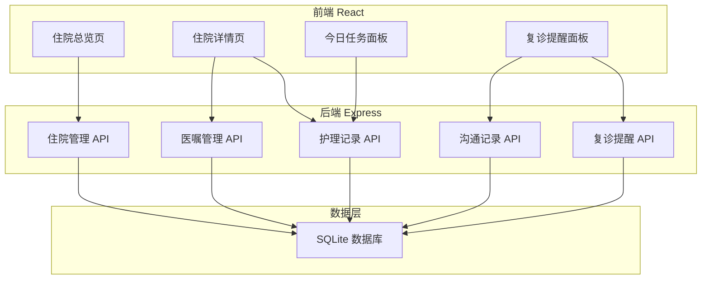
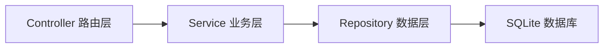
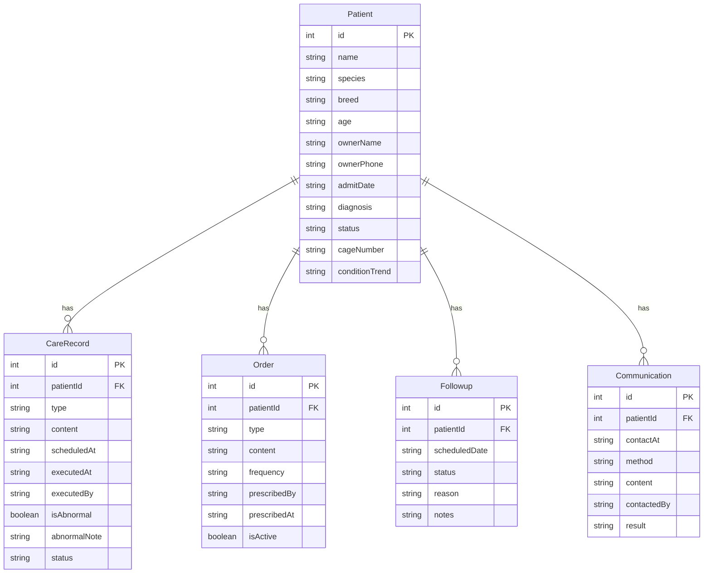

## 1. 架构设计



## 2. 技术说明

- **前端**：React 18 + TypeScript + Tailwind CSS 3 + Vite + Zustand
- **初始化工具**：vite-init (react-express-ts 模板)
- **后端**：Express 4 + TypeScript (ESM)
- **数据库**：SQLite (better-sqlite3)，无需额外安装数据库服务
- **路由**：react-router-dom v6
- **图标**：lucide-react

## 3. 路由定义

| 路由 | 用途 |
|------|------|
| `/` | 住院总览页（根据角色显示不同内容） |
| `/patient/:id` | 住院详情页（护理时间线、医嘱、沟通记录） |
| `/tasks` | 今日任务面板（护士专用视图） |
| `/followups` | 复诊提醒面板（前台专用视图） |

## 4. API 定义

### 4.1 住院管理

```
GET    /api/patients          — 获取住院宠物列表（支持角色筛选参数）
GET    /api/patients/:id      — 获取单个宠物详情
POST   /api/patients          — 新增住院宠物
PUT    /api/patients/:id      — 更新宠物信息（含出院操作）
```

### 4.2 护理记录

```
GET    /api/patients/:id/care-records    — 获取护理时间线（支持类型筛选）
POST   /api/patients/:id/care-records    — 新增护理记录
PUT    /api/care-records/:id             — 更新护理记录（标记完成等）
```

### 4.3 医嘱管理

```
GET    /api/patients/:id/orders          — 获取医嘱列表
POST   /api/patients/:id/orders          — 新增医嘱
PUT    /api/orders/:id/status            — 更新医嘱执行状态
```

### 4.4 复诊提醒

```
GET    /api/followups                    — 获取复诊列表（支持状态筛选）
POST   /api/followups                    — 新增复诊安排
PUT    /api/followups/:id                — 更新复诊状态（确认预约/改期）
```

### 4.5 沟通记录

```
GET    /api/patients/:id/communications  — 获取沟通记录
POST   /api/patients/:id/communications  — 新增沟通记录
```

### 4.6 数据类型定义

```typescript
interface Patient {
  id: number;
  name: string;
  species: string;
  breed: string;
  age: string;
  ownerName: string;
  ownerPhone: string;
  admitDate: string;
  diagnosis: string;
  status: 'hospitalized' | 'discharged';
  cageNumber: string;
  conditionTrend?: 'improving' | 'stable' | 'worsening';
}

interface CareRecord {
  id: number;
  patientId: number;
  type: 'medication' | 'dressing' | 'feeding' | 'iv_fluid' | 'observation' | 'vitals' | 'other';
  content: string;
  scheduledAt: string;
  executedAt?: string;
  executedBy?: string;
  isAbnormal: boolean;
  abnormalNote?: string;
  status: 'pending' | 'completed' | 'missed' | 'delayed';
}

interface Order {
  id: number;
  patientId: number;
  type: 'medication' | 'nursing' | 'examination';
  content: string;
  frequency: string;
  prescribedBy: string;
  prescribedAt: string;
  isActive: boolean;
}

interface Followup {
  id: number;
  patientId: number;
  scheduledDate: string;
  status: 'pending' | 'confirmed' | 'completed' | 'overdue' | 'rescheduled';
  reason: string;
  notes?: string;
}

interface Communication {
  id: number;
  patientId: number;
  contactAt: string;
  method: 'phone' | 'wechat' | 'in_person';
  content: string;
  contactedBy: string;
  result: string;
}
```

## 5. 服务端架构图



## 6. 数据模型

### 6.1 ER 图



### 6.2 DDL

```sql
CREATE TABLE patients (
  id INTEGER PRIMARY KEY AUTOINCREMENT,
  name TEXT NOT NULL,
  species TEXT NOT NULL,
  breed TEXT NOT NULL,
  age TEXT NOT NULL,
  owner_name TEXT NOT NULL,
  owner_phone TEXT NOT NULL,
  admit_date TEXT NOT NULL,
  diagnosis TEXT NOT NULL,
  status TEXT NOT NULL DEFAULT 'hospitalized',
  cage_number TEXT NOT NULL,
  condition_trend TEXT
);

CREATE TABLE care_records (
  id INTEGER PRIMARY KEY AUTOINCREMENT,
  patient_id INTEGER NOT NULL,
  type TEXT NOT NULL,
  content TEXT NOT NULL,
  scheduled_at TEXT NOT NULL,
  executed_at TEXT,
  executed_by TEXT,
  is_abnormal INTEGER NOT NULL DEFAULT 0,
  abnormal_note TEXT,
  status TEXT NOT NULL DEFAULT 'pending',
  FOREIGN KEY (patient_id) REFERENCES patients(id)
);

CREATE TABLE orders (
  id INTEGER PRIMARY KEY AUTOINCREMENT,
  patient_id INTEGER NOT NULL,
  type TEXT NOT NULL,
  content TEXT NOT NULL,
  frequency TEXT NOT NULL,
  prescribed_by TEXT NOT NULL,
  prescribed_at TEXT NOT NULL,
  is_active INTEGER NOT NULL DEFAULT 1,
  FOREIGN KEY (patient_id) REFERENCES patients(id)
);

CREATE TABLE followups (
  id INTEGER PRIMARY KEY AUTOINCREMENT,
  patient_id INTEGER NOT NULL,
  scheduled_date TEXT NOT NULL,
  status TEXT NOT NULL DEFAULT 'pending',
  reason TEXT NOT NULL,
  notes TEXT,
  FOREIGN KEY (patient_id) REFERENCES patients(id)
);

CREATE TABLE communications (
  id INTEGER PRIMARY KEY AUTOINCREMENT,
  patient_id INTEGER NOT NULL,
  contact_at TEXT NOT NULL,
  method TEXT NOT NULL,
  content TEXT NOT NULL,
  contacted_by TEXT NOT NULL,
  result TEXT NOT NULL,
  FOREIGN KEY (patient_id) REFERENCES patients(id)
);
```
