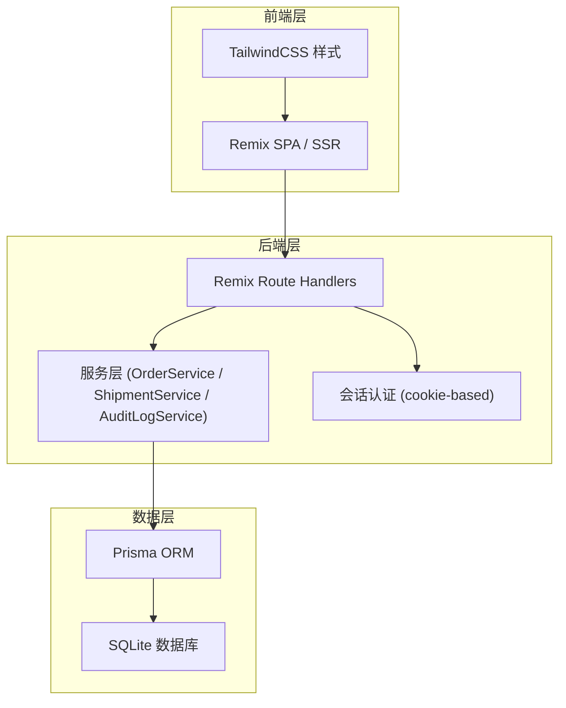
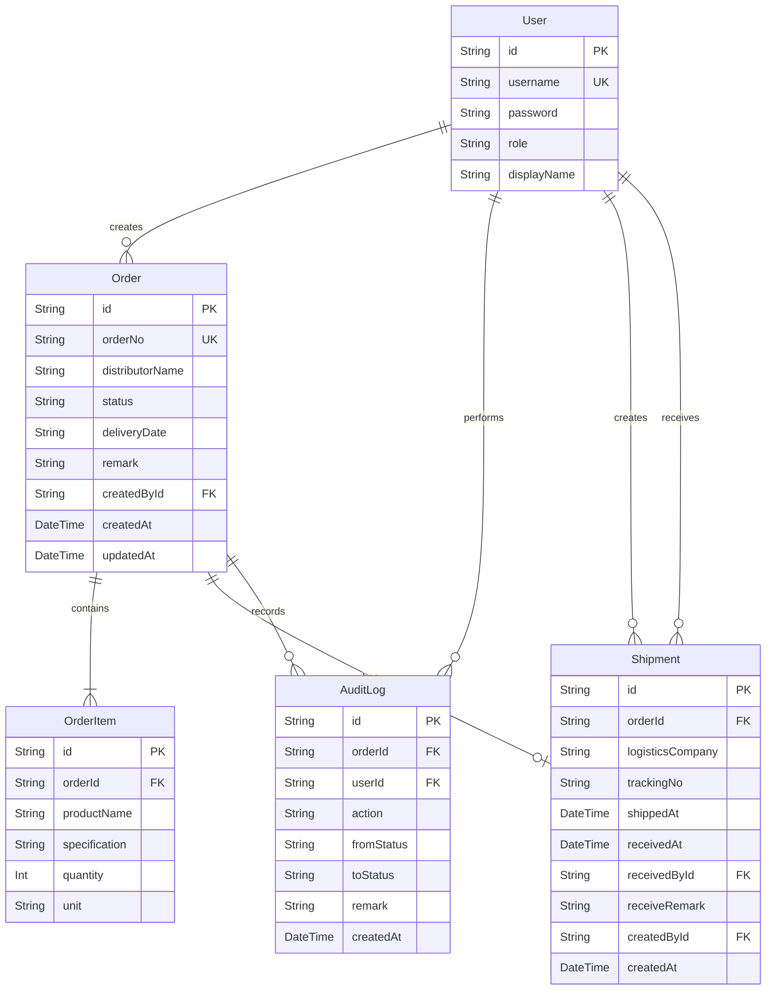

## 1. 架构设计



## 2. 技术说明

- **前端**: React 18 + Remix 2 + TailwindCSS 3 + Vite
- **后端**: Remix Route Handlers（全栈同构）
- **数据库**: SQLite（通过 Prisma ORM，生产环境可迁移至 PostgreSQL）
- **认证**: Remix cookie session（演示账号，无第三方登录）
- **初始化工具**: npx create-remix

## 3. 路由定义

| 路由 | 用途 |
|------|------|
| `/` | 工作台首页，待办看板+异常提醒 |
| `/login` | 登录页，演示账号选择 |
| `/orders` | 经销订单列表 |
| `/orders/new` | 新建经销订单 |
| `/orders/:id` | 订单详情+状态流转操作 |
| `/shipments` | 发货跟踪列表 |
| `/shipments/:id/confirm` | 发货确认弹窗页 |
| `/logs` | 操作日志列表 |

## 4. API 定义

### 4.1 类型定义

```typescript
type OrderStatus =
  | "DRAFT"
  | "PENDING_CONFIRM"
  | "IN_PRODUCTION"
  | "READY_TO_SHIP"
  | "SHIPPED"
  | "COMPLETED"
  | "RETURNED"
  | "EXCEPTION";

type Role = "SALES" | "BREWER" | "PACKER" | "ADMIN";

interface User {
  id: string;
  username: string;
  role: Role;
  displayName: string;
}

interface OrderItem {
  id: string;
  orderId: string;
  productName: string;
  specification: string;
  quantity: number;
  unit: string;
}

interface Order {
  id: string;
  orderNo: string;
  distributorName: string;
  status: OrderStatus;
  deliveryDate: string;
  remark: string | null;
  createdBy: string;
  createdAt: string;
  updatedAt: string;
  items: OrderItem[];
}

interface Shipment {
  id: string;
  orderId: string;
  logisticsCompany: string | null;
  trackingNo: string | null;
  shippedAt: string | null;
  receivedAt: string | null;
  receivedBy: string | null;
  receiveRemark: string | null;
  createdBy: string;
  createdAt: string;
}

interface AuditLog {
  id: string;
  orderId: string;
  userId: string;
  action: string;
  fromStatus: OrderStatus | null;
  toStatus: OrderStatus | null;
  remark: string | null;
  createdAt: string;
}
```

### 4.2 接口定义

| 方法 | 路径 | 说明 |
|------|------|------|
| POST | `/api/auth/login` | 登录 |
| POST | `/api/auth/logout` | 登出 |
| GET | `/api/orders` | 订单列表（支持筛选参数） |
| POST | `/api/orders` | 创建订单 |
| GET | `/api/orders/:id` | 订单详情 |
| PATCH | `/api/orders/:id/status` | 状态流转（确认/退回/异常） |
| GET | `/api/shipments` | 发货列表 |
| POST | `/api/shipments` | 创建发货记录 |
| PATCH | `/api/shipments/:id/confirm` | 确认发货 |
| PATCH | `/api/shipments/:id/receive` | 确认签收 |
| GET | `/api/logs` | 操作日志列表 |

## 5. 服务端架构图

```mermaid
flowchart LR
    "Route Handler" --> "OrderService"
    "Route Handler" --> "ShipmentService"
    "Route Handler" --> "AuditLogService"
    "OrderService" --> "Prisma Client"
    "ShipmentService" --> "Prisma Client"
    "AuditLogService" --> "Prisma Client"
    "Prisma Client" --> "SQLite"
```

## 6. 数据模型

### 6.1 实体关系图



### 6.2 数据定义语言

```sql
CREATE TABLE User (
  id TEXT PRIMARY KEY,
  username TEXT UNIQUE NOT NULL,
  password TEXT NOT NULL,
  role TEXT NOT NULL DEFAULT 'SALES',
  displayName TEXT NOT NULL
);

CREATE TABLE "Order" (
  id TEXT PRIMARY KEY,
  orderNo TEXT UNIQUE NOT NULL,
  distributorName TEXT NOT NULL,
  status TEXT NOT NULL DEFAULT 'DRAFT',
  deliveryDate TEXT NOT NULL,
  remark TEXT,
  createdById TEXT NOT NULL REFERENCES User(id),
  createdAt DATETIME NOT NULL DEFAULT CURRENT_TIMESTAMP,
  updatedAt DATETIME NOT NULL DEFAULT CURRENT_TIMESTAMP
);

CREATE TABLE OrderItem (
  id TEXT PRIMARY KEY,
  orderId TEXT NOT NULL REFERENCES "Order"(id) ON DELETE CASCADE,
  productName TEXT NOT NULL,
  specification TEXT NOT NULL,
  quantity INTEGER NOT NULL,
  unit TEXT NOT NULL DEFAULT '箱'
);

CREATE TABLE Shipment (
  id TEXT PRIMARY KEY,
  orderId TEXT UNIQUE NOT NULL REFERENCES "Order"(id),
  logisticsCompany TEXT,
  trackingNo TEXT,
  shippedAt DATETIME,
  receivedAt DATETIME,
  receivedById TEXT REFERENCES User(id),
  receiveRemark TEXT,
  createdById TEXT NOT NULL REFERENCES User(id),
  createdAt DATETIME NOT NULL DEFAULT CURRENT_TIMESTAMP
);

CREATE TABLE AuditLog (
  id TEXT PRIMARY KEY,
  orderId TEXT NOT NULL REFERENCES "Order"(id),
  userId TEXT NOT NULL REFERENCES User(id),
  action TEXT NOT NULL,
  fromStatus TEXT,
  toStatus TEXT,
  remark TEXT,
  createdAt DATETIME NOT NULL DEFAULT CURRENT_TIMESTAMP
);

CREATE INDEX idx_order_status ON "Order"(status);
CREATE INDEX idx_order_createdById ON "Order"(createdById);
CREATE INDEX idx_order_createdAt ON "Order"(createdAt);
CREATE INDEX idx_auditlog_orderId ON AuditLog(orderId);
CREATE INDEX idx_auditlog_userId ON AuditLog(userId);
CREATE INDEX idx_auditlog_createdAt ON AuditLog(createdAt);
CREATE INDEX idx_shipment_orderId ON Shipment(orderId);
```
