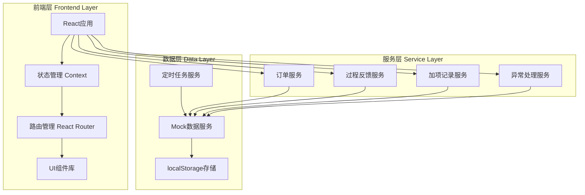
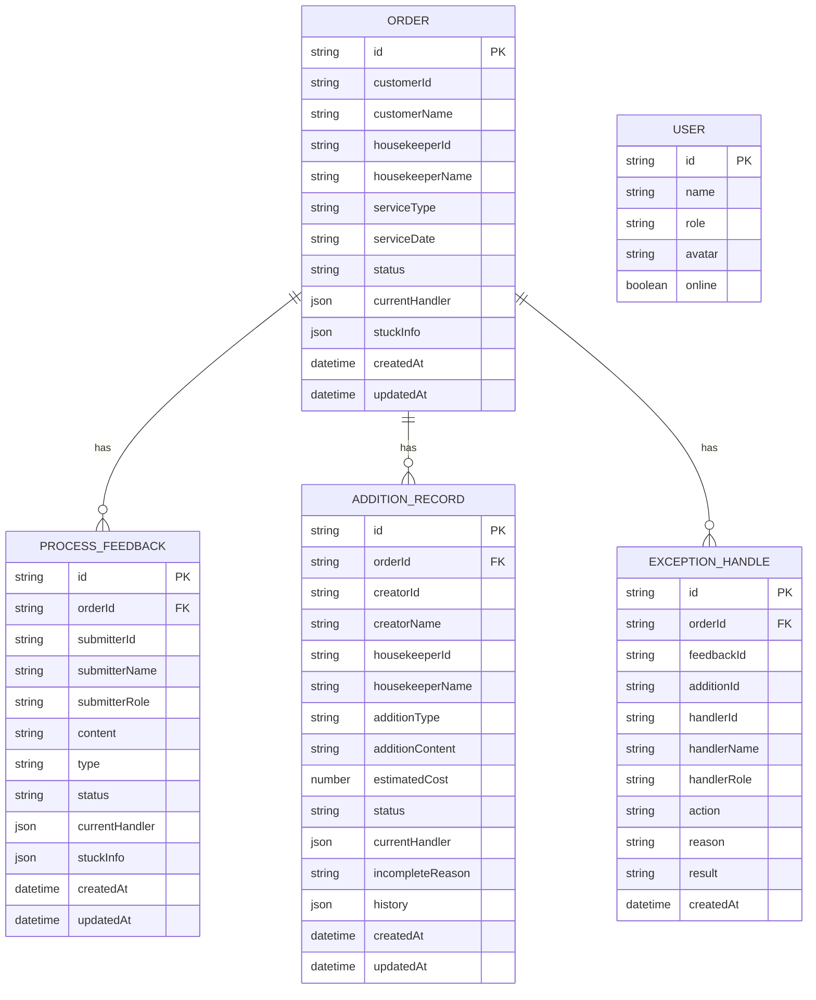

# 技术架构文档

## 1. 架构设计



## 2. 技术说明

- **前端框架**: React@18 + TypeScript
- **样式方案**: Tailwind CSS@3
- **构建工具**: Vite
- **状态管理**: React Context + useReducer
- **路由管理**: React Router@6
- **数据持久化**: localStorage（模拟后端）
- **图表库**: Recharts（用于统计图表）
- **图标库**: Lucide React

## 3. 路由定义

| 路由 | 用途 | 权限 |
|------|------|------|
| `/` | 重定向到监控看板 | 所有角色 |
| `/dashboard` | 监控看板页面 | 所有角色 |
| `/feedback` | 过程反馈管理页面 | 客服、质检主管 |
| `/addition` | 加项记录管理页面 | 客服、质检主管 |
| `/profile` | 个人中心页面 | 所有角色 |

## 4. API定义（模拟）

### 4.1 订单相关API

```typescript
interface Order {
  id: string;
  customerId: string;
  customerName: string;
  housekeeperId: string;
  housekeeperName: string;
  serviceType: string;
  serviceDate: string;
  status: OrderStatus;
  currentHandler?: {
    role: 'customer_service' | 'housekeeper' | 'quality_supervisor';
    name: string;
    id: string;
  };
  stuckInfo?: {
    stuckAt: string;
    stuckDuration: number;
    stuckReason: string;
  };
  createdAt: string;
  updatedAt: string;
}

type OrderStatus = 
  | 'pending'
  | 'in_service'
  | 'feedback_submitted'
  | 'feedback_processing'
  | 'stuck'
  | 'completed';

interface GetOrdersResponse {
  orders: Order[];
  total: number;
  stuckCount: number;
}

interface GetOrderDetailResponse {
  order: Order;
  timeline: TimelineItem[];
}
```

### 4.2 过程反馈相关API

```typescript
interface ProcessFeedback {
  id: string;
  orderId: string;
  submitterId: string;
  submitterName: string;
  submitterRole: 'housekeeper' | 'customer';
  content: string;
  type: 'complaint' | 'suggestion' | 'issue' | 'addition_request';
  status: FeedbackStatus;
  currentHandler?: {
    role: 'customer_service' | 'quality_supervisor';
    name: string;
    id: string;
  };
  stuckInfo?: {
    stuckAt: string;
    stuckDuration: number;
    stuckReason: string;
  };
  createdAt: string;
  updatedAt: string;
}

type FeedbackStatus = 
  | 'pending'
  | 'processing'
  | 'rejected'
  | 'supplemented'
  | 'completed'
  | 'stuck';

interface GetFeedbackListResponse {
  feedbacks: ProcessFeedback[];
  total: number;
  stuckCount: number;
}

interface HandleFeedbackRequest {
  feedbackId: string;
  action: 'reject' | 'supplement' | 'complete' | 'transfer';
  reason: string;
  supplementData?: Record<string, any>;
  transferTo?: string;
}
```

### 4.3 加项记录相关API

```typescript
interface AdditionRecord {
  id: string;
  orderId: string;
  creatorId: string;
  creatorName: string;
  housekeeperId: string;
  housekeeperName: string;
  additionType: string;
  additionContent: string;
  estimatedCost: number;
  status: AdditionStatus;
  currentHandler?: {
    role: 'housekeeper' | 'quality_supervisor';
    name: string;
    id: string;
  };
  incompleteReason?: string;
  history: AdditionHistoryItem[];
  createdAt: string;
  updatedAt: string;
}

type AdditionStatus = 
  | 'pending_confirmation'
  | 'confirmed'
  | 'rejected_by_housekeeper'
  | 'pending_approval'
  | 'approved'
  | 'rejected_by_supervisor'
  | 'in_progress'
  | 'completed'
  | 'incomplete';

interface AdditionHistoryItem {
  id: string;
  action: string;
  operatorId: string;
  operatorName: string;
  operatorRole: string;
  reason?: string;
  timestamp: string;
}

interface GetAdditionRecordsResponse {
  records: AdditionRecord[];
  total: number;
  incompleteCount: number;
}

interface HandleAdditionRequest {
  recordId: string;
  action: 'confirm' | 'reject' | 'approve' | 'complete' | 'mark_incomplete';
  reason?: string;
}
```

### 4.4 异常处理相关API

```typescript
interface ExceptionHandle {
  id: string;
  orderId: string;
  feedbackId?: string;
  additionId?: string;
  handlerId: string;
  handlerName: string;
  handlerRole: string;
  action: 'reject' | 'supplement' | 'transfer' | 'complete' | 'mark_incomplete';
  reason: string;
  result: string;
  createdAt: string;
}

interface HandleExceptionRequest {
  targetType: 'order' | 'feedback' | 'addition';
  targetId: string;
  action: 'reject' | 'supplement' | 'transfer' | 'complete' | 'mark_incomplete';
  reason: string;
  transferTo?: string;
  supplementData?: Record<string, any>;
}

interface GetExceptionHistoryResponse {
  handles: ExceptionHandle[];
}
```

## 5. 数据模型

### 5.1 数据模型定义



### 5.2 数据初始化

系统启动时会自动初始化模拟数据，包括：
- 20个订单数据（其中5个为卡单状态）
- 15条过程反馈（其中3个为卡住状态）
- 10条加项记录（其中2个为未完成状态）
- 6个用户数据（2个客服、2个家政员、1个质检主管、1个管理员）

## 6. 项目结构

```
src/
├── components/          # 公共组件
│   ├── Layout/         # 布局组件
│   ├── Navigation/     # 导航组件
│   ├── Card/           # 卡片组件
│   ├── Table/          # 表格组件
│   ├── Drawer/         # 抽屉组件
│   └── Timeline/        # 时间线组件
├── pages/              # 页面组件
│   ├── Dashboard/      # 监控看板
│   ├── Feedback/       # 过程反馈管理
│   ├── Addition/       # 加项记录管理
│   └── Profile/        # 个人中心
├── services/           # 服务层
│   ├── orderService.ts # 订单服务
│   ├── feedbackService.ts # 过程反馈服务
│   ├── additionService.ts # 加项记录服务
│   ├── exceptionService.ts # 异常处理服务
│   └── mockData.ts     # 模拟数据
├── contexts/           # 状态管理
│   ├── AppContext.tsx  # 应用状态
│   └── UserContext.tsx # 用户状态
├── hooks/              # 自定义Hooks
│   ├── useOrders.ts    # 订单相关
│   ├── useFeedback.ts  # 反馈相关
│   └── useAddition.ts  # 加项相关
├── types/              # TypeScript类型定义
│   └── index.ts
├── utils/              # 工具函数
│   ├── storage.ts      # localStorage工具
│   └── helpers.ts      # 辅助函数
├── App.tsx             # 应用入口
└── main.tsx            # 渲染入口
```

## 7. 核心功能实现

### 7.1 卡单检测机制

系统使用定时任务（每30秒）检测订单状态：
- 订单在"反馈处理中"状态停留超过30分钟 → 标记为卡单
- 加项记录在"待确认"状态停留超过1小时 → 标记为卡单
- 卡单自动推送到监控看板的预警面板

### 7.2 处理人追踪

每个订单/反馈/加项记录都包含`currentHandler`字段，记录当前处理人信息：
- 角色（客服/家政员/质检主管）
- 姓名
- ID
- 在线状态

### 7.3 异常处理抽屉

点击卡单卡片，右侧滑出抽屉，显示：
- 订单基本信息
- 当前处理人
- 卡住原因
- 处理表单（驳回/补录/转交/完成）
- 历史处理记录

### 7.4 数据持久化

所有数据存储在localStorage中：
- `orders`: 订单数据
- `feedbacks`: 过程反馈数据
- `additions`: 加项记录数据
- `users`: 用户数据
- `handles`: 异常处理记录

## 8. 启动与部署

### 8.1 开发环境启动

```bash
# 安装依赖
npm install

# 启动开发服务器
npm run dev
```

### 8.2 数据重置

```bash
# 方式1：在页面上点击"重置数据"按钮
# 方式2：清除localStorage
localStorage.clear()
# 然后刷新页面
```

### 8.3 模拟能力说明

以下功能为模拟实现：
1. **用户登录**：使用固定的模拟用户，无需真实认证
2. **实时推送**：使用定时轮询模拟，非WebSocket
3. **数据持久化**：使用localStorage，非真实数据库
4. **后端API**：所有API返回Mock数据，无真实后端