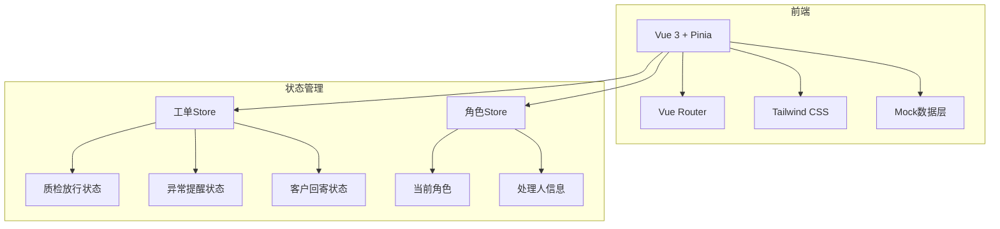
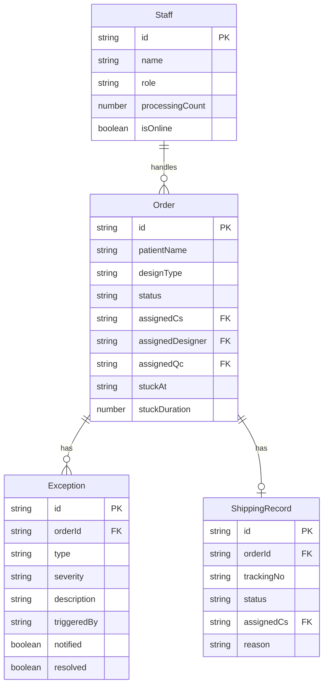

## 1. 架构设计



## 2. 技术说明

- 前端：Vue 3 + Pinia + Vue Router + Tailwind CSS + Vite
- 初始化工具：vite-init（vue-ts模板）
- 后端：无（纯前端原型，使用Mock数据）
- 数据库：无（Pinia Store + Mock数据）

## 3. 路由定义

| 路由 | 用途 |
|------|------|
| / | 首页仪表盘，今日待处理概览 |
| /qc | 质检放行处理页，工单列表与放行/退回操作 |
| /exceptions | 异常提醒中心，异常列表与触发操作 |
| /shipping | 客户回寄追踪页，回寄状态与回看 |

## 4. API定义

无后端API，所有数据通过Pinia Store管理，Mock数据在Store初始化时注入。

### 4.1 核心数据类型

```typescript
type OrderStatus = 'pending_design' | 'designing' | 'pending_qc' | 'qc_in_progress' | 'passed' | 'rejected' | 'pending_shipping' | 'shipped' | 'delivered'

type ExceptionSeverity = 'high' | 'medium' | 'low'

type ExceptionType = 'color_mismatch' | 'shape_issue' | 'bite_issue' | 'material_defect' | 'other'

type RoleType = 'cs' | 'designer' | 'qc'

interface Order {
  id: string
  patientName: string
  designType: string
  status: OrderStatus
  assignedCs: string
  assignedDesigner: string
  assignedQc: string
  createdAt: string
  updatedAt: string
  stuckAt?: string
  stuckDuration?: number
}

interface Exception {
  id: string
  orderId: string
  type: ExceptionType
  severity: ExceptionSeverity
  description: string
  triggeredBy: string
  triggeredAt: string
  notified: boolean
  resolved: boolean
}

interface ShippingRecord {
  id: string
  orderId: string
  trackingNo: string
  carrier: string
  status: 'pending' | 'shipped' | 'delivered'
  shippedAt?: string
  deliveredAt?: string
  assignedCs: string
  reason?: string
}

interface Staff {
  id: string
  name: string
  role: RoleType
  avatar: string
  processingCount: number
  isOnline: boolean
}
```

## 5. 服务器架构

不适用（纯前端项目）

## 6. 数据模型

### 6.1 数据模型定义



### 6.2 数据定义语言

使用Pinia Store初始化Mock数据，包含：
- 12条工单数据（覆盖各状态）
- 5条异常数据（覆盖高/中/低严重度）
- 6条回寄记录（覆盖待回寄/已寄出/已签收）
- 6名员工数据（每角色2人）
