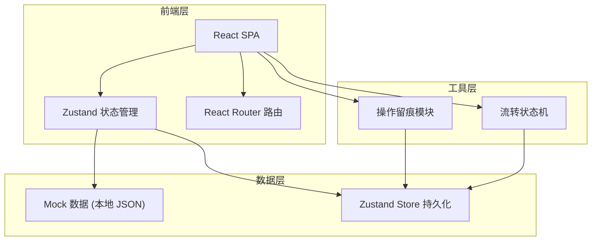
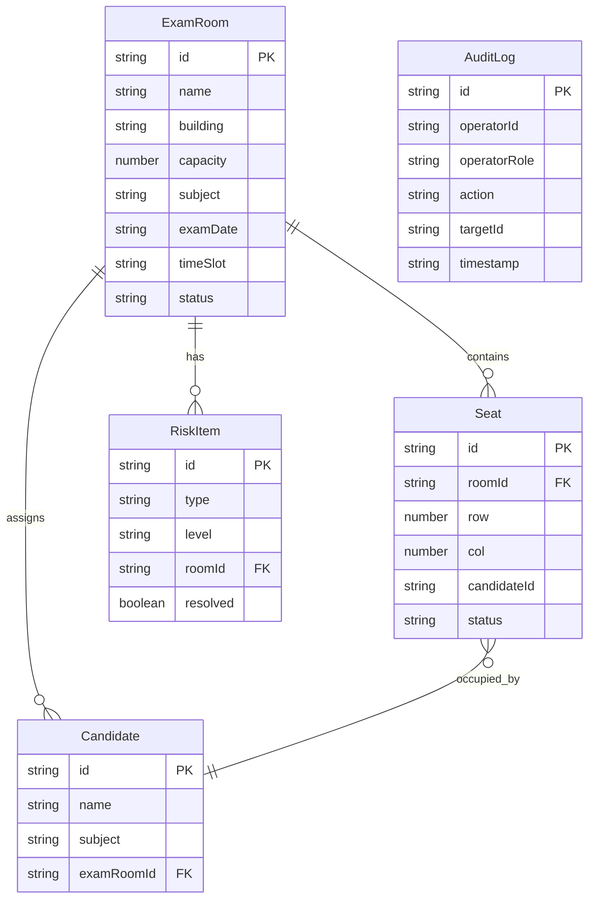

## 1. 架构设计



纯前端项目，无后端服务。所有数据通过 Mock JSON 初始化，操作流转通过 Zustand Store 管理并持久化到 localStorage，实现本地流转闭环。

## 2. 技术说明

- 前端：React@18 + TypeScript + Tailwind CSS@3 + Vite
- 初始化工具：vite-init（react-ts 模板）
- 状态管理：Zustand（含 persist 中间件持久化到 localStorage）
- 路由：React Router DOM v6
- 后端：无
- 数据库：无，使用 Mock 数据 + localStorage 持久化

## 3. 路由定义

| 路由 | 用途 |
|------|------|
| / | 工作台首页 - 待处理队列、风险项、最近变更、统计概览 |
| /arrangement | 考场编排 - 考场列表、编排表单、批量操作 |
| /seat-allocation | 座位分配 - 座位可视化、分配操作、回看快照、确认流转 |
| /audit-trail | 流转记录 - 操作日志、角色筛选、状态时间线 |

## 4. API 定义

无后端 API。数据交互通过 Zustand Store 直接操作本地状态。

### 4.1 Store 定义

```typescript
interface ExamRoom {
  id: string
  name: string
  building: string
  floor: number
  capacity: number
  subject: string
  examDate: string
  timeSlot: string
  status: "pending" | "arranged" | "submitted" | "returned"
  arrangedBy?: string
  arrangedAt?: string
  seats: Seat[]
}

interface Seat {
  id: string
  row: number
  col: number
  candidateId?: string
  candidateName?: string
  status: "empty" | "assigned" | "conflict"
}

interface AuditLog {
  id: string
  operatorId: string
  operatorName: string
  operatorRole: "exam_staff" | "invigilator" | "tech_support"
  action: string
  targetId: string
  targetType: "exam_room" | "seat"
  detail: string
  timestamp: string
}

interface RiskItem {
  id: string
  type: "capacity_overflow" | "seat_conflict" | "no_invigilator" | "time_conflict"
  level: "high" | "medium" | "low"
  roomId: string
  roomName: string
  description: string
  resolved: boolean
}
```

## 5. 服务端架构图

不适用（纯前端项目）

## 6. 数据模型

### 6.1 数据模型定义



### 6.2 数据定义语言

使用 TypeScript 类型定义代替 DDL，数据以 JSON 格式存储在 Zustand Store 并持久化到 localStorage。Mock 数据在 `src/data/` 目录下以 TS 文件导出。
