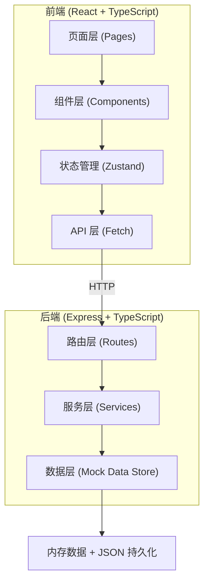
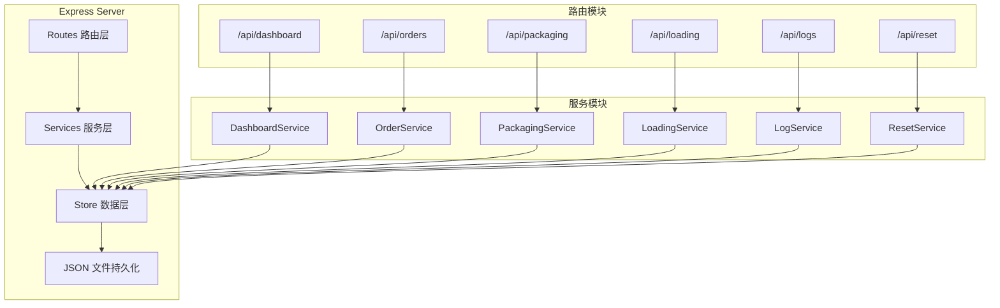
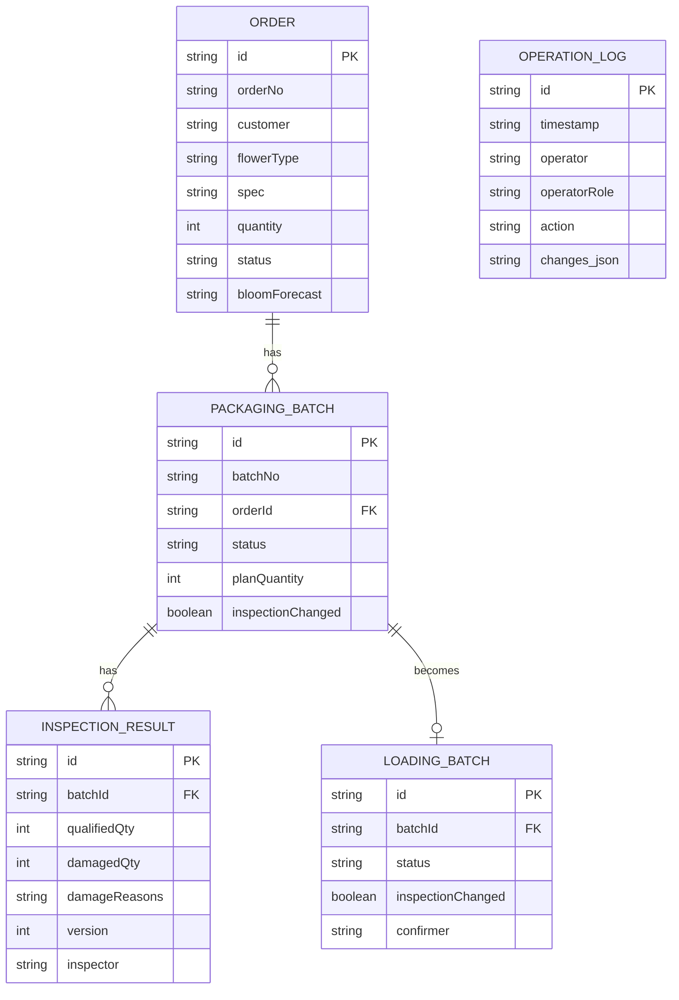

## 1. 架构设计



## 2. 技术描述

- **前端**：React@18 + TypeScript + Vite + TailwindCSS@3 + Zustand + React Router
- **后端**：Express@4 + TypeScript
- **数据存储**：内存数据存储 + JSON 文件持久化（模拟数据库，便于演示和重置）
- **初始化工具**：vite-init（react-express-ts 模板）

## 3. 路由定义

### 前端路由

| 路由路径 | 页面名称 | 说明 |
|----------|----------|------|
| / | 工作台 | 首页，展示待办、风险、最近变更 |
| /orders | 订单排产 | 订单列表和排产管理 |
| /orders/:id | 订单详情 | 单个订单的详细信息和变更历史 |
| /packaging | 包装质检 | 待质检列表和质检操作 |
| /loading | 装车复核 | 待复核列表和复核操作 |
| /logs | 操作日志 | 全链路操作记录查询 |

### 后端 API 路由

| 方法 | 路径 | 用途 |
|------|------|------|
| GET | /api/dashboard | 获取工作台数据（待办、风险、统计） |
| GET | /api/orders | 获取订单列表 |
| GET | /api/orders/:id | 获取订单详情 |
| PUT | /api/orders/:id | 修改订单规格 |
| GET | /api/packaging/batches | 获取包装批次列表 |
| POST | /api/packaging/batches/:id/inspect | 提交质检结果 |
| PUT | /api/packaging/inspections/:id | 修改质检结果 |
| GET | /api/loading/batches | 获取待装车批次列表 |
| POST | /api/loading/batches/:id/confirm | 确认装车复核 |
| GET | /api/logs | 获取操作日志列表 |
| POST | /api/reset | 重置所有数据 |

## 4. API 定义

### 通用响应结构

```typescript
interface ApiResponse<T> {
  success: boolean;
  data: T;
  message?: string;
}
```

### 数据类型定义

```typescript
// 订单
interface Order {
  id: string;
  orderNo: string;
  customer: string;
  flowerType: string;
  spec: string;
  quantity: number;
  unit: string;
  deliveryDate: string;
  status: 'pending' | 'scheduled' | 'packaging' | 'inspected' | 'loading' | 'completed';
  bloomForecast: string;
  bloomActual?: string;
  createdAt: string;
  updatedAt: string;
  specChanged?: boolean;
}

// 包装批次
interface PackagingBatch {
  id: string;
  batchNo: string;
  orderId: string;
  orderNo: string;
  flowerType: string;
  spec: string;
  planQuantity: number;
  actualQuantity?: number;
  status: 'pending' | 'inspecting' | 'inspected' | 'rework';
  inspector?: string;
  inspectedAt?: string;
  inspectionResult?: InspectionResult;
  inspectionChanged?: boolean;
}

// 质检结果
interface InspectionResult {
  id: string;
  batchId: string;
  qualifiedQty: number;
  damagedQty: number;
  damageReasons: string[];
  remark?: string;
  inspector: string;
  createdAt: string;
  updatedAt: string;
  version: number;
}

// 装车复核
interface LoadingBatch {
  id: string;
  batchId: string;
  batchNo: string;
  orderId: string;
  orderNo: string;
  customer: string;
  flowerType: string;
  spec: string;
  quantity: number;
  inspectionStatus: 'qualified' | 'damaged' | 'rework';
  inspectionChanged: boolean;
  lastInspectionChange?: string;
  status: 'pending' | 'confirmed' | 'rejected';
  confirmedAt?: string;
  confirmer?: string;
}

// 操作日志
interface OperationLog {
  id: string;
  timestamp: string;
  operator: string;
  operatorRole: string;
  action: string;
  targetType: string;
  targetId: string;
  targetName: string;
  description: string;
  changes?: {
    field: string;
    oldValue: string;
    newValue: string;
  }[];
}

// 工作台数据
interface DashboardData {
  stats: {
    totalOrders: number;
    pendingInspection: number;
    pendingLoading: number;
    damageRate: number;
  };
  tasks: TaskItem[];
  risks: RiskItem[];
  recentChanges: OperationLog[];
}
```

## 5. 服务架构图



## 6. 数据模型

### 6.1 数据模型定义



### 6.2 初始数据

系统启动时加载以下演示数据：

- **订单**：5 个不同状态的订单（待排产、已排产、包装中、已质检、待装车）
- **包装批次**：3 个待质检批次 + 2 个已质检批次（其中 1 个有破损）
- **装车批次**：2 个待复核批次（其中 1 个有质检变更提醒）
- **操作日志**：10 条最近操作记录（覆盖各角色操作）
- **风险项**：3 个风险示例（花期偏差、包装破损、规格变更）
