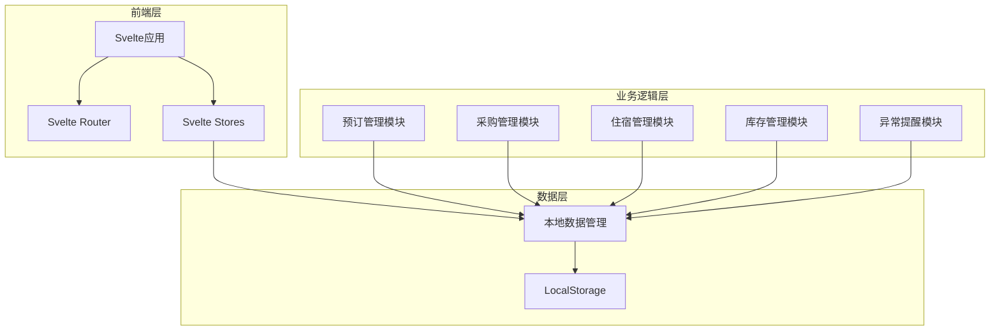
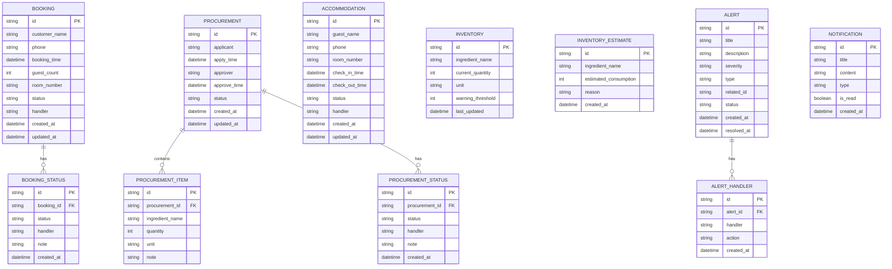

# 农家乐经营-食材采购与库存预估 技术架构文档

## 1. 架构设计



## 2. 技术说明
- **前端框架**：Svelte@4 + SvelteKit
- **样式方案**：Tailwind CSS@3
- **构建工具**：Vite
- **路由**：SvelteKit内置路由
- **状态管理**：Svelte Stores（writable, derived）
- **数据持久化**：LocalStorage（模拟本地数据存储）
- **通知系统**：本地通知记录（模拟真实通知）

## 3. 路由定义
| 路由 | 页面 | 说明 |
|------|------|------|
| `/` | 首页仪表盘 | 流程概览、待办事项、异常提醒 |
| `/bookings` | 包间预订列表 | 显示所有预订 |
| `/bookings/[id]` | 预订详情 | 查看预订详情和状态流转 |
| `/bookings/new` | 新建预订 | 创建新预订 |
| `/procurement` | 食材采购列表 | 显示所有采购申请 |
| `/procurement/[id]` | 采购详情 | 查看采购详情和跟踪进度 |
| `/procurement/new` | 新建采购申请 | 后厨提交采购申请 |
| `/accommodation` | 住宿登记列表 | 显示所有住宿记录 |
| `/accommodation/[id]` | 住宿详情 | 查看住宿详情 |
| `/accommodation/new` | 新建入住登记 | 登记入住信息 |
| `/inventory` | 库存预估 | 库存盘点和采购建议 |
| `/alerts` | 异常提醒中心 | 显示所有异常和处理记录 |

## 4. 数据模型定义

### 4.1 数据模型图



### 4.2 数据定义语言

```typescript
interface Booking {
  id: string;
  customer_name: string;
  phone: string;
  booking_time: string;
  guest_count: number;
  room_number: string;
  status: 'pending' | 'confirmed' | 'arrived' | 'dining' | 'billing' | 'completed' | 'cancelled';
  handler: string;
  created_at: string;
  updated_at: string;
  status_history: BookingStatus[];
}

interface BookingStatus {
  id: string;
  booking_id: string;
  status: string;
  handler: string;
  note: string;
  created_at: string;
}

interface Procurement {
  id: string;
  applicant: string;
  apply_time: string;
  approver: string | null;
  approve_time: string | null;
  status: 'pending' | 'approved' | 'rejected' | 'purchasing' | 'received' | 'completed';
  items: ProcurementItem[];
  status_history: ProcurementStatus[];
  created_at: string;
  updated_at: string;
}

interface ProcurementItem {
  id: string;
  procurement_id: string;
  ingredient_name: string;
  quantity: number;
  unit: string;
  note: string;
}

interface ProcurementStatus {
  id: string;
  procurement_id: string;
  status: string;
  handler: string;
  note: string;
  created_at: string;
}

interface Accommodation {
  id: string;
  guest_name: string;
  phone: string;
  room_number: string;
  check_in_time: string;
  check_out_time: string | null;
  status: 'checked_in' | 'checked_out';
  handler: string;
  created_at: string;
  updated_at: string;
}

interface Inventory {
  id: string;
  ingredient_name: string;
  current_quantity: number;
  unit: string;
  warning_threshold: number;
  last_updated: string;
}

interface InventoryEstimate {
  id: string;
  ingredient_name: string;
  estimated_consumption: number;
  reason: string;
  created_at: string;
}

interface Alert {
  id: string;
  title: string;
  description: string;
  severity: 'high' | 'medium' | 'low';
  type: 'inventory' | 'procurement' | 'booking' | 'accommodation';
  related_id: string;
  status: 'active' | 'resolved';
  created_at: string;
  resolved_at: string | null;
  handlers: AlertHandler[];
}

interface AlertHandler {
  id: string;
  alert_id: string;
  handler: string;
  action: string;
  created_at: string;
}

interface Notification {
  id: string;
  title: string;
  content: string;
  type: 'alert' | 'info' | 'success';
  is_read: boolean;
  created_at: string;
}
```

## 5. 本地数据存储策略

### 5.1 LocalStorage键名定义
- `farm_bookings`: 预订数据
- `farm_procurements`: 采购数据
- `farm_accommodations`: 住宿数据
- `farm_inventory`: 库存数据
- `farm_alerts`: 异常数据
- `farm_notifications`: 通知数据

### 5.2 初始化数据
系统启动时检查LocalStorage，如无数据则初始化示例数据：
- 5条预订记录（不同状态）
- 5条采购记录（不同状态）
- 5条住宿记录
- 10条库存记录
- 3条异常记录
- 5条通知记录

## 6. 核心功能实现

### 6.1 状态流转追踪
每个业务对象维护一个`status_history`数组，记录所有状态变更：
- 变更时间
- 变更人
- 新状态
- 备注

### 6.2 异常检测规则
- 库存低于预警阈值
- 采购申请超过24小时未审批
- 预订确认后超过2小时未到店
- 住宿超过预计退房时间未退房

### 6.3 本地通知模拟
- 异常产生时，在LocalStorage中创建通知记录
- 页面顶部显示通知横幅
- 通知中心显示所有通知列表
- 支持标记已读和删除

### 6.4 库存预估算法
- 基于历史预订数据计算平均消耗
- 结合未来预订预测需求
- 考虑季节性因素（简化处理）
- 生成采购建议列表

## 7. 组件结构

```
src/
├── lib/
│   ├── stores/
│   │   ├── bookings.ts
│   │   ├── procurements.ts
│   │   ├── accommodations.ts
│   │   ├── inventory.ts
│   │   ├── alerts.ts
│   │   └── notifications.ts
│   ├── utils/
│   │   ├── storage.ts
│   │   ├── helpers.ts
│   │   └── constants.ts
│   └── components/
│       ├── common/
│       │   ├── Button.svelte
│       │   ├── Card.svelte
│       │   ├── Badge.svelte
│       │   ├── Timeline.svelte
│       │   └── Notification.svelte
│       ├── layout/
│       │   ├── Header.svelte
│       │   ├── Sidebar.svelte
│       │   └── Layout.svelte
│       └── business/
│           ├── BookingCard.svelte
│           ├── ProcurementTracker.svelte
│           ├── InventoryTable.svelte
│           └── AlertPanel.svelte
├── routes/
│   ├── +layout.svelte
│   ├── +page.svelte
│   ├── bookings/
│   ├── procurement/
│   ├── accommodation/
│   ├── inventory/
│   └── alerts/
└── app.html
```