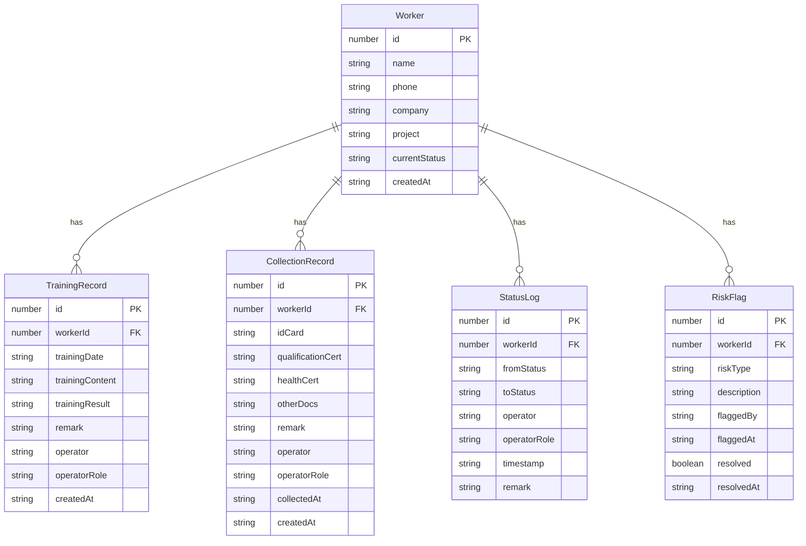

## 1. 架构设计

```mermaid
flowchart TB
    subgraph "前端层"
        "Vue 3 + TypeScript"
        "Vue Router"
        "Tailwind CSS"
        "Pinia 状态管理"
    end
    subgraph "后端层"
        "Express + TypeScript"
        "RESTful API"
    end
    subgraph "数据层"
        "SQLite (better-sqlite3)"
        "初始种子数据"
    end
    "前端层" --> "后端层"
    "后端层" --> "数据层"
```

## 2. 技术说明

- 前端：Vue 3 + TypeScript + Tailwind CSS + Pinia
- 初始化工具：vite-init
- 后端：Express + TypeScript
- 数据库：SQLite (better-sqlite3)，内置种子数据

## 3. 路由定义

| 路由 | 用途 |
|------|------|
| / | 仪表盘，风险预警与流程概览 |
| /training | 入场培训列表与处理 |
| /collection | 证件收集列表与处理 |
| /worker/:id | 人员详情与时间线 |

## 4. API 定义

### 4.1 人员管理

```typescript
interface Worker {
  id: number
  name: string
  phone: string
  company: string
  project: string
  currentStatus: WorkerStatus
  createdAt: string
}

type WorkerStatus =
  | "pending_training"
  | "in_training"
  | "training_completed"
  | "pending_collection"
  | "in_collection"
  | "collection_completed"
```

### 4.2 状态变更记录

```typescript
interface StatusLog {
  id: number
  workerId: number
  fromStatus: WorkerStatus | null
  toStatus: WorkerStatus
  operator: string
  operatorRole: "recruiter" | "supervisor" | "accountant"
  timestamp: string
  remark: string
}
```

### 4.3 入场培训

```typescript
interface TrainingRecord {
  id: number
  workerId: number
  trainingDate: string
  trainingContent: string
  trainingResult: "passed" | "failed" | "pending"
  remark: string
  operator: string
  operatorRole: string
  createdAt: string
}
```

### 4.4 证件收集

```typescript
interface CollectionRecord {
  id: number
  workerId: number
  idCard: "pending" | "collected" | "missing"
  qualificationCert: "pending" | "collected" | "missing"
  healthCert: "pending" | "collected" | "missing"
  otherDocs: "pending" | "collected" | "missing"
  remark: string
  operator: string
  operatorRole: string
  collectedAt: string | null
  createdAt: string
}
```

### 4.5 风险标记

```typescript
interface RiskFlag {
  id: number
  workerId: number
  riskType: "temp_absence" | "attendance_dispute" | "deduction_unclear"
  description: string
  flaggedBy: string
  flaggedAt: string
  resolved: boolean
  resolvedAt: string | null
}
```

### 4.6 API 端点

| 方法 | 路径 | 描述 |
|------|------|------|
| GET | /api/workers | 获取人员列表（支持筛选） |
| GET | /api/workers/:id | 获取人员详情 |
| POST | /api/workers | 新增人员 |
| PUT | /api/workers/:id | 更新人员信息 |
| DELETE | /api/workers/:id | 删除人员 |
| POST | /api/workers/:id/reset | 重置人员流程状态 |
| GET | /api/workers/:id/timeline | 获取人员状态时间线 |
| GET | /api/trainings | 获取培训记录列表 |
| POST | /api/trainings | 新增培训记录 |
| PUT | /api/trainings/:id | 更新培训记录 |
| POST | /api/trainings/batch | 批量处理培训 |
| GET | /api/collections | 获取证件收集列表 |
| POST | /api/collections | 新增收集记录 |
| PUT | /api/collections/:id | 更新收集记录 |
| GET | /api/risks | 获取风险标记列表 |
| POST | /api/risks | 新增风险标记 |
| PUT | /api/risks/:id | 更新风险标记（解决） |
| GET | /api/dashboard/stats | 获取仪表盘统计数据 |
| GET | /api/dashboard/gaps | 获取责任空档列表 |

## 5. 服务端架构图

```mermaid
flowchart TD
    "Router 路由层" --> "Controller 控制层"
    "Controller 控制层" --> "Service 业务层"
    "Service 业务层" --> "Repository 数据层"
    "Repository 数据层" --> "SQLite 数据库"
```

## 6. 数据模型

### 6.1 数据模型定义



### 6.2 数据定义语言

```sql
CREATE TABLE workers (
  id INTEGER PRIMARY KEY AUTOINCREMENT,
  name TEXT NOT NULL,
  phone TEXT NOT NULL,
  company TEXT NOT NULL,
  project TEXT NOT NULL,
  current_status TEXT NOT NULL DEFAULT 'pending_training',
  created_at TEXT NOT NULL DEFAULT (datetime('now'))
);

CREATE TABLE training_records (
  id INTEGER PRIMARY KEY AUTOINCREMENT,
  worker_id INTEGER NOT NULL REFERENCES workers(id),
  training_date TEXT NOT NULL,
  training_content TEXT NOT NULL DEFAULT '',
  training_result TEXT NOT NULL DEFAULT 'pending',
  remark TEXT NOT NULL DEFAULT '',
  operator TEXT NOT NULL,
  operator_role TEXT NOT NULL,
  created_at TEXT NOT NULL DEFAULT (datetime('now'))
);

CREATE TABLE collection_records (
  id INTEGER PRIMARY KEY AUTOINCREMENT,
  worker_id INTEGER NOT NULL REFERENCES workers(id),
  id_card TEXT NOT NULL DEFAULT 'pending',
  qualification_cert TEXT NOT NULL DEFAULT 'pending',
  health_cert TEXT NOT NULL DEFAULT 'pending',
  other_docs TEXT NOT NULL DEFAULT 'pending',
  remark TEXT NOT NULL DEFAULT '',
  operator TEXT NOT NULL,
  operator_role TEXT NOT NULL,
  collected_at TEXT,
  created_at TEXT NOT NULL DEFAULT (datetime('now'))
);

CREATE TABLE status_logs (
  id INTEGER PRIMARY KEY AUTOINCREMENT,
  worker_id INTEGER NOT NULL REFERENCES workers(id),
  from_status TEXT,
  to_status TEXT NOT NULL,
  operator TEXT NOT NULL,
  operator_role TEXT NOT NULL,
  timestamp TEXT NOT NULL DEFAULT (datetime('now')),
  remark TEXT NOT NULL DEFAULT ''
);

CREATE TABLE risk_flags (
  id INTEGER PRIMARY KEY AUTOINCREMENT,
  worker_id INTEGER NOT NULL REFERENCES workers(id),
  risk_type TEXT NOT NULL,
  description TEXT NOT NULL DEFAULT '',
  flagged_by TEXT NOT NULL,
  flagged_at TEXT NOT NULL DEFAULT (datetime('now')),
  resolved INTEGER NOT NULL DEFAULT 0,
  resolved_at TEXT
);

CREATE INDEX idx_workers_status ON workers(current_status);
CREATE INDEX idx_training_worker ON training_records(worker_id);
CREATE INDEX idx_collection_worker ON collection_records(worker_id);
CREATE INDEX idx_status_logs_worker ON status_logs(worker_id);
CREATE INDEX idx_risk_flags_worker ON risk_flags(worker_id);
CREATE INDEX idx_risk_flags_type ON risk_flags(risk_type);
```
