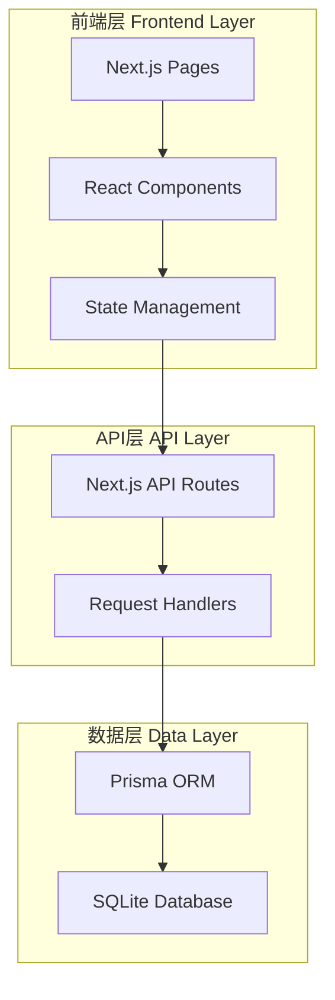
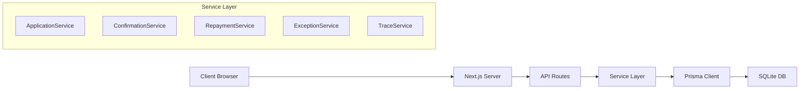
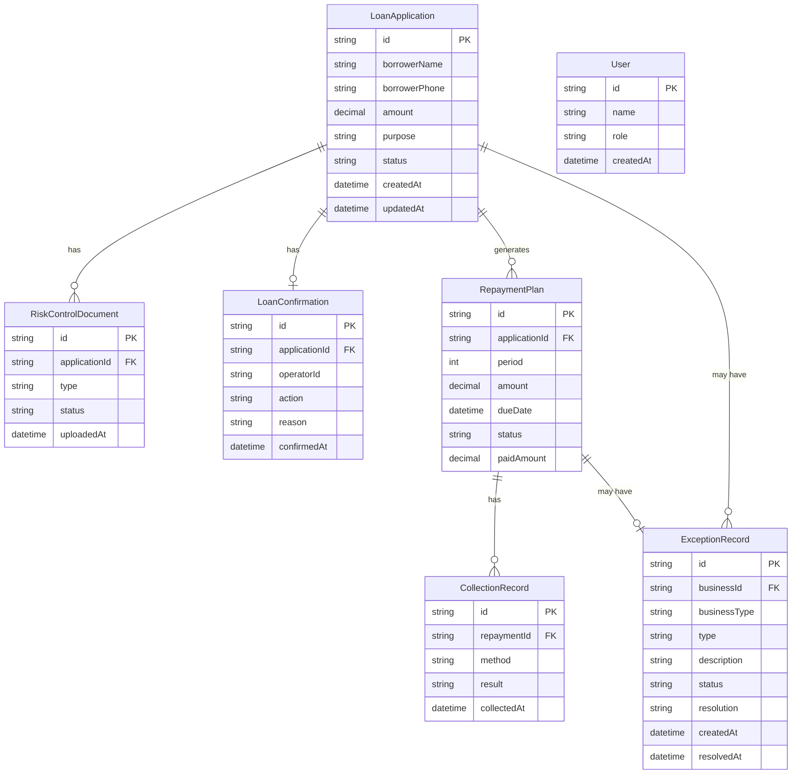

# 小贷公司放款确认与还款计划管理系统 - 技术架构文档

## 1. 架构设计



## 2. 技术栈说明

### 2.1 前端技术
- **框架**：Next.js 14 (App Router)
- **UI库**：React 18
- **样式**：Tailwind CSS 3
- **组件库**：shadcn/ui（基于Radix UI）
- **图标**：Lucide React
- **状态管理**：React Context + useReducer
- **表单处理**：React Hook Form + Zod
- **动画**：Framer Motion

### 2.2 后端技术
- **运行时**：Node.js
- **API框架**：Next.js API Routes
- **ORM**：Prisma
- **数据库**：SQLite（开发环境，可迁移至PostgreSQL/MySQL）

### 2.3 开发工具
- **包管理器**：npm
- **代码规范**：ESLint + Prettier
- **类型检查**：TypeScript

## 3. 路由定义

| 路由路径 | 页面名称 | 功能描述 |
|---------|---------|---------|
| `/login` | 登录页面 | 角色选择和身份验证 |
| `/` | 放款确认页面 | 显示待处理的借款申请列表 |
| `/repayment` | 还款计划页面 | 管理和查看还款计划 |
| `/trace` | 数据追溯页面 | 查看业务流程历史记录 |

## 4. API定义

### 4.1 借款申请相关API

```typescript
// 获取借款申请列表
GET /api/applications
Query: {
  status?: 'PENDING' | 'RISK_REVIEW' | 'APPROVED' | 'CONFIRMED' | 'DISBURSED' | 'REJECTED'
  page?: number
  pageSize?: number
}
Response: {
  data: LoanApplication[]
  total: number
  page: number
  pageSize: number
}

// 获取单个借款申请详情
GET /api/applications/:id
Response: LoanApplication & {
  riskDocuments: RiskControlDocument[]
  confirmation: LoanConfirmation
  repaymentPlans: RepaymentPlan[]
}

// 创建借款申请
POST /api/applications
Body: {
  borrowerName: string
  borrowerPhone: string
  amount: number
  purpose: string
}
Response: LoanApplication
```

### 4.2 放款确认相关API

```typescript
// 确认放款
POST /api/confirmations
Body: {
  applicationId: string
  action: 'CONFIRM' | 'REJECT' | 'REQUEST_INFO'
  reason?: string
  requiredDocuments?: string[]
}
Response: LoanConfirmation

// 获取放款确认记录
GET /api/confirmations/:id
Response: LoanConfirmation & {
  application: LoanApplication
  operator: { name: string }
}
```

### 4.3 还款计划相关API

```typescript
// 获取还款计划列表
GET /api/repayments
Query: {
  status?: 'PENDING' | 'PAID' | 'OVERDUE' | 'PARTIAL_PAID'
  applicationId?: string
}
Response: RepaymentPlan[]

// 更新还款状态
PATCH /api/repayments/:id
Body: {
  status: 'PAID' | 'OVERDUE' | 'PARTIAL_PAID'
  paidAmount?: number
  exceptionNote?: string
}
Response: RepaymentPlan

// 标记还款异常
POST /api/repayments/:id/exception
Body: {
  type: 'OVERDUE' | 'PARTIAL_PAYMENT' | 'OTHER'
  description: string
}
Response: ExceptionRecord
```

### 4.4 异常处理相关API

```typescript
// 获取异常记录列表
GET /api/exceptions
Query: {
  status?: 'OPEN' | 'PROCESSING' | 'RESOLVED'
  type?: string
}
Response: ExceptionRecord[]

// 处理异常
POST /api/exceptions/:id/handle
Body: {
  action: 'REMIND' | 'RETURN' | 'SUPPLEMENT' | 'COLLECTION'
  note: string
}
Response: ExceptionRecord
```

### 4.5 数据追溯相关API

```typescript
// 获取业务流程历史
GET /api/trace/:businessId
Response: {
  businessId: string
  businessType: 'APPLICATION' | 'REPAYMENT'
  timeline: TimelineEvent[]
}

// TimelineEvent结构
type TimelineEvent = {
  id: string
  timestamp: Date
  action: string
  operator: string
  fromStatus?: string
  toStatus?: string
  details: Record<string, any>
}
```

## 5. 服务器架构图



## 6. 数据模型

### 6.1 数据模型定义



### 6.2 Prisma Schema定义

```prisma
// Prisma Schema

generator client {
  provider = "prisma-client-js"
}

datasource db {
  provider = "sqlite"
  url      = "file:./dev.db"
}

model User {
  id        String   @id @default(uuid())
  name      String
  role      String   // "OPERATOR" | "ADMIN"
  createdAt DateTime @default(now())
  
  confirmations LoanConfirmation[]
}

model LoanApplication {
  id              String   @id @default(uuid())
  borrowerName    String
  borrowerPhone   String
  amount          Float
  purpose         String
  status          String   @default("PENDING") // PENDING, RISK_REVIEW, APPROVED, CONFIRMED, DISBURSED, REJECTED
  createdAt       DateTime @default(now())
  updatedAt       DateTime @updatedAt
  
  riskDocuments   RiskControlDocument[]
  confirmation    LoanConfirmation?
  repaymentPlans  RepaymentPlan[]
  exceptions      ExceptionRecord[]
}

model RiskControlDocument {
  id             String   @id @default(uuid())
  applicationId  String
  type           String   // 身份证、收入证明、征信报告等
  status         String   @default("PENDING") // PENDING, APPROVED, REJECTED
  uploadedAt     DateTime @default(now())
  
  application    LoanApplication @relation(fields: [applicationId], references: [id])
}

model LoanConfirmation {
  id             String   @id @default(uuid())
  applicationId  String
  operatorId     String
  action         String   // CONFIRM, REJECT, REQUEST_INFO
  reason         String?
  confirmedAt    DateTime @default(now())
  
  application    LoanApplication @relation(fields: [applicationId], references: [id])
  operator       User             @relation(fields: [operatorId], references: [id])
}

model RepaymentPlan {
  id             String   @id @default(uuid())
  applicationId  String
  period         Int
  amount         Float
  dueDate        DateTime
  status         String   @default("PENDING") // PENDING, PAID, OVERDUE, PARTIAL_PAID
  paidAmount     Float    @default(0)
  
  application    LoanApplication @relation(fields: [applicationId], references: [id])
  collections    CollectionRecord[]
  exceptions     ExceptionRecord[]
}

model CollectionRecord {
  id            String   @id @default(uuid())
  repaymentId   String
  method        String   // 电话、短信、上门等
  result        String
  collectedAt   DateTime @default(now())
  
  repayment     RepaymentPlan @relation(fields: [repaymentId], references: [id])
}

model ExceptionRecord {
  id            String   @id @default(uuid())
  businessId    String
  businessType  String   // APPLICATION, REPAYMENT
  type          String   // OVERDUE, PARTIAL_PAYMENT, REJECTION, INFO_MISSING
  description   String
  status        String   @default("OPEN") // OPEN, PROCESSING, RESOLVED
  resolution    String?
  createdAt     DateTime @default(now())
  resolvedAt    DateTime?
  
  application   LoanApplication? @relation(fields: [businessId], references: [id])
  repayment     RepaymentPlan?   @relation(fields: [businessId], references: [id])
}
```

## 7. 项目初始化步骤

### 7.1 创建Next.js项目
```bash
npx create-next-app@latest . --typescript --tailwind --app --no-src-dir
```

### 7.2 安装依赖
```bash
npm install prisma @prisma/client
npm install lucide-react
npm install framer-motion
npm install react-hook-form zod @hookform/resolvers
npm install date-fns
```

### 7.3 初始化Prisma
```bash
npx prisma init --datasource-provider sqlite
```

### 7.4 生成Prisma客户端
```bash
npx prisma generate
npx prisma db push
```

### 7.5 种子数据
创建初始演示数据，包括：
- 2个用户（1个管理员，1个操作员）
- 10个借款申请（不同状态）
- 对应的风控资料
- 部分放款确认记录
- 还款计划
- 异常记录样本

## 8. 关键技术决策

### 8.1 为什么选择SQLite
- 开发环境轻量级，无需额外数据库服务
- 可轻松迁移至PostgreSQL或MySQL
- 适合演示和测试

### 8.2 为什么使用Next.js App Router
- 支持服务端渲染和API路由
- 内置路由系统
- 优秀的开发体验

### 8.3 状态管理策略
- 使用React Context管理全局状态（用户信息、通知）
- 使用URL参数管理列表筛选状态
- 使用React Hook Form管理表单状态

### 8.4 异常处理策略
- 前端：使用try-catch捕获API错误，显示友好提示
- 后端：统一错误处理中间件，记录错误日志
- 数据库：使用事务确保数据一致性

## 9. 性能优化策略

### 9.1 前端优化
- 使用Next.js的Image组件优化图片
- 使用动态导入减少首屏加载
- 使用React.memo减少不必要的重渲染

### 9.2 后端优化
- 使用Prisma的select只查询需要的字段
- 添加数据库索引（status、createdAt字段）
- 使用分页避免大量数据查询

### 9.3 数据库优化
- 为常用查询字段添加索引
- 定期清理历史数据
- 使用连接池（生产环境）