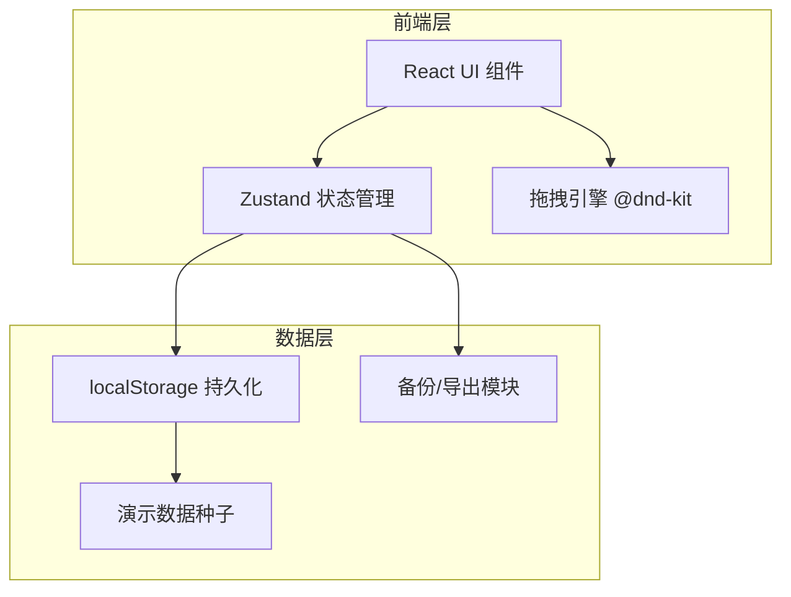
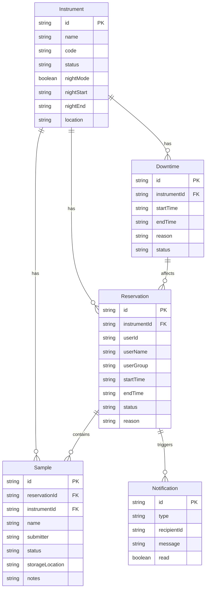

## 1. 架构设计



纯前端单页应用，无后端服务。所有数据通过 localStorage 持久化，状态管理使用 Zustand。

## 2. 技术说明

- **前端框架**：React 18 + TypeScript
- **构建工具**：Vite
- **样式方案**：Tailwind CSS 3（utility-first，工具型界面首选）
- **状态管理**：Zustand（轻量、支持 persist middleware 直接对接 localStorage）
- **拖拽**：@dnd-kit/core + @dnd-kit/sortable（日历时段拖拽调整）
- **日期处理**：date-fns
- **图标**：lucide-react
- **ID生成**：nanoid
- **后端**：无
- **数据库**：localStorage + JSON 导出/导入

## 3. 路由定义

| 路由 | 用途 |
|------|------|
| / | 仪器日历（默认页） |
| /queue | 预约队列 |
| /samples | 样本登记 |
| /downtime | 故障停机 |
| /postpone | 顺延处理 |
| /notifications | 通知记录 |
| /settings | 设置（角色切换/备份导出） |

## 4. API 定义

无后端 API，全部通过 Zustand store 操作。核心 Store 接口：

```typescript
interface Instrument {
  id: string;
  name: string;
  code: string;
  status: 'normal' | 'fault' | 'maintenance';
  nightMode: boolean;
  nightStart: string;
  nightEnd: string;
  location: string;
}

interface Reservation {
  id: string;
  instrumentId: string;
  userId: string;
  userName: string;
  userGroup: string;
  startTime: string;
  endTime: string;
  status: 'pending' | 'approved' | 'rejected' | 'postponed' | 'cancelled';
  reason: string;
  sampleIds: string[];
  createdAt: string;
}

interface Sample {
  id: string;
  reservationId: string;
  instrumentId: string;
  name: string;
  submitter: string;
  group: string;
  status: 'waiting' | 'testing' | 'done' | 'abnormal';
  storageLocation: string;
  notes: string;
  createdAt: string;
}

interface Downtime {
  id: string;
  instrumentId: string;
  startTime: string;
  endTime: string;
  reason: string;
  status: 'active' | 'resolved';
  affectedReservations: string[];
  createdAt: string;
}

interface Notification {
  id: string;
  type: 'approval' | 'rejection' | 'postpone' | 'cancel' | 'downtime' | 'restore';
  recipientId: string;
  recipientName: string;
  instrumentId: string;
  reservationId?: string;
  message: string;
  createdAt: string;
  read: boolean;
}

interface AppStore {
  instruments: Instrument[];
  reservations: Reservation[];
  samples: Sample[];
  downtimes: Downtime[];
  notifications: Notification[];
  currentRole: 'admin' | 'leader' | 'student';
  currentUserId: string;
  // actions...
}
```

## 5. 数据模型



## 6. 项目结构

```
src/
├── main.tsx
├── App.tsx
├── index.css
├── store/
│   └── useStore.ts          # Zustand store + persist + 演示数据
├── types/
│   └── index.ts             # 所有类型定义
├── data/
│   └── seed.ts              # 演示数据
├── pages/
│   ├── CalendarPage.tsx     # 仪器日历
│   ├── QueuePage.tsx        # 预约队列
│   ├── SamplesPage.tsx      # 样本登记
│   ├── DowntimePage.tsx     # 故障停机
│   ├── PostponePage.tsx     # 顺延处理
│   ├── NotificationsPage.tsx # 通知记录
│   └── SettingsPage.tsx     # 设置
├── components/
│   ├── Layout.tsx           # 侧边栏 + 顶栏
│   ├── CalendarGrid.tsx     # 日历网格
│   ├── ReservationBlock.tsx # 可拖拽预约块
│   ├── ReservationModal.tsx # 预约详情弹窗
│   ├── SampleForm.tsx       # 样本登记表单
│   ├── DowntimeForm.tsx     # 停机登记表单
│   └── StatusBadge.tsx      # 状态标签
└── utils/
    ├── time.ts              # 时段工具
    └── export.ts            # 导出/导入工具
```
