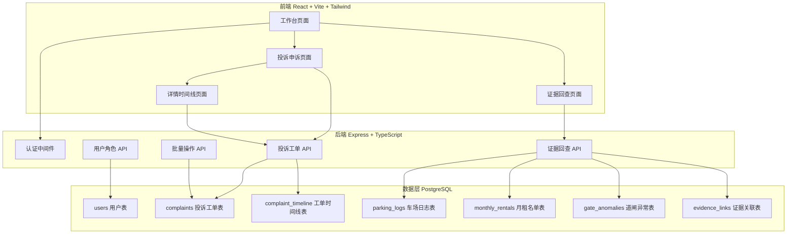
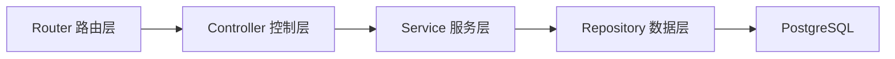
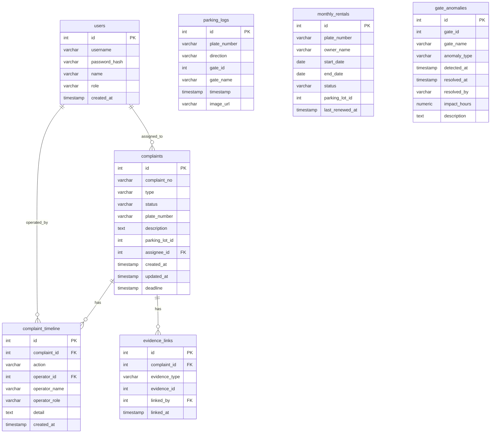

## 1. 架构设计



## 2. 技术说明

- 前端：React@18 + TailwindCSS@3 + Vite + Zustand
- 初始化工具：vite-init (react-express-ts 模板)
- 后端：Express@4 + TypeScript (ESM)
- 数据库：PostgreSQL
- 认证：JWT Token 简化登录

## 3. 路由定义

| 路由 | 用途 |
|------|------|
| /login | 登录页面，角色选择与认证 |
| / | 工作台首页，展示今日待办、已拖延、退回工单 |
| /complaints | 投诉申诉列表，筛选与搜索 |
| /complaints/:id | 投诉申诉详情，时间线与证据回查 |
| /evidence | 证据回查独立页面，车场日志/月租/道闸异常查询 |

## 4. API 定义

### 4.1 认证 API

```
POST /api/auth/login
  Request:  { username: string, password: string }
  Response: { token: string, user: { id, name, role } }
```

### 4.2 投诉工单 API

```
GET    /api/complaints?status=&type=&assignee=&overdue=&page=&limit=
  Response: { data: Complaint[], total: number, page: number }

GET    /api/complaints/:id
  Response: Complaint & { timeline: TimelineEvent[], evidence: Evidence[] }

POST   /api/complaints
  Request:  { type, plateNumber, description, parkingLotId }
  Response: Complaint

PATCH  /api/complaints/:id
  Request:  { status?, assigneeId?, appealReason? }
  Response: Complaint

POST   /api/complaints/batch
  Request:  { ids: number[], action: 'assign'|'process'|'close', assigneeId? }
  Response: { updated: number }
```

### 4.3 证据回查 API

```
GET    /api/evidence/parking-logs?plateNumber=&startTime=&endTime=
  Response: ParkingLog[]

GET    /api/evidence/monthly-rentals?plateNumber=&status=
  Response: MonthlyRental[]

GET    /api/evidence/gate-anomalies?gateId=&startTime=&endTime=
  Response: GateAnomaly[]

GET    /api/evidence/complaint/:complaintId
  Response: { parkingLogs, monthlyRentals, gateAnomalies }
```

### 4.4 用户 API

```
GET    /api/users?role=
  Response: User[]
```

### 4.5 数据类型定义

```typescript
type UserRole = 'operations' | 'customer_service' | 'maintenance'

interface User {
  id: number
  username: string
  name: string
  role: UserRole
}

type ComplaintType = 'monthly_rental_expired' | 'unlicensed_vehicle' | 'gate_malfunction'
type ComplaintStatus = 'pending' | 'assigned' | 'processing' | 'appealing' | 'rejected' | 'closed'

interface Complaint {
  id: number
  complaintNo: string
  type: ComplaintType
  status: ComplaintStatus
  plateNumber: string | null
  description: string
  parkingLotId: number
  assigneeId: number | null
  assigneeName: string | null
  createdAt: string
  updatedAt: string
  deadline: string
  isOverdue: boolean
}

interface TimelineEvent {
  id: number
  complaintId: number
  action: string
  operatorId: number
  operatorName: string
  operatorRole: UserRole
  detail: string
  createdAt: string
}

interface ParkingLog {
  id: number
  plateNumber: string
  direction: 'in' | 'out'
  gateId: number
  gateName: string
  timestamp: string
  imageUrl: string | null
}

interface MonthlyRental {
  id: number
  plateNumber: string
  ownerName: string
  startDate: string
  endDate: string
  status: 'active' | 'expired' | 'suspended'
  parkingLotId: number
  lastRenewedAt: string | null
}

interface GateAnomaly {
  id: number
  gateId: number
  gateName: string
  anomalyType: 'stuck_open' | 'stuck_closed' | 'sensor_error' | 'force_open'
  detectedAt: string
  resolvedAt: string | null
  resolvedBy: string | null
  impactHours: number | null
  description: string
}

interface EvidenceLink {
  id: number
  complaintId: number
  evidenceType: 'parking_log' | 'monthly_rental' | 'gate_anomaly'
  evidenceId: number
  linkedBy: number
  linkedAt: string
}
```

## 5. 服务端架构图



## 6. 数据模型

### 6.1 数据模型定义



### 6.2 数据定义语言

```sql
CREATE TABLE users (
  id SERIAL PRIMARY KEY,
  username VARCHAR(50) UNIQUE NOT NULL,
  password_hash VARCHAR(255) NOT NULL,
  name VARCHAR(100) NOT NULL,
  role VARCHAR(30) NOT NULL CHECK (role IN ('operations', 'customer_service', 'maintenance')),
  created_at TIMESTAMP DEFAULT NOW()
);

CREATE TABLE complaints (
  id SERIAL PRIMARY KEY,
  complaint_no VARCHAR(20) UNIQUE NOT NULL,
  type VARCHAR(30) NOT NULL CHECK (type IN ('monthly_rental_expired', 'unlicensed_vehicle', 'gate_malfunction')),
  status VARCHAR(20) NOT NULL DEFAULT 'pending' CHECK (status IN ('pending', 'assigned', 'processing', 'appealing', 'rejected', 'closed')),
  plate_number VARCHAR(20),
  description TEXT NOT NULL,
  parking_lot_id INT NOT NULL DEFAULT 1,
  assignee_id INT REFERENCES users(id),
  created_at TIMESTAMP DEFAULT NOW(),
  updated_at TIMESTAMP DEFAULT NOW(),
  deadline TIMESTAMP NOT NULL
);

CREATE TABLE complaint_timeline (
  id SERIAL PRIMARY KEY,
  complaint_id INT NOT NULL REFERENCES complaints(id) ON DELETE CASCADE,
  action VARCHAR(50) NOT NULL,
  operator_id INT NOT NULL REFERENCES users(id),
  operator_name VARCHAR(100) NOT NULL,
  operator_role VARCHAR(30) NOT NULL,
  detail TEXT,
  created_at TIMESTAMP DEFAULT NOW()
);

CREATE TABLE parking_logs (
  id SERIAL PRIMARY KEY,
  plate_number VARCHAR(20) NOT NULL,
  direction VARCHAR(5) NOT NULL CHECK (direction IN ('in', 'out')),
  gate_id INT NOT NULL,
  gate_name VARCHAR(50) NOT NULL,
  timestamp TIMESTAMP NOT NULL,
  image_url VARCHAR(500)
);

CREATE TABLE monthly_rentals (
  id SERIAL PRIMARY KEY,
  plate_number VARCHAR(20) NOT NULL,
  owner_name VARCHAR(100) NOT NULL,
  start_date DATE NOT NULL,
  end_date DATE NOT NULL,
  status VARCHAR(15) NOT NULL CHECK (status IN ('active', 'expired', 'suspended')),
  parking_lot_id INT NOT NULL DEFAULT 1,
  last_renewed_at TIMESTAMP
);

CREATE TABLE gate_anomalies (
  id SERIAL PRIMARY KEY,
  gate_id INT NOT NULL,
  gate_name VARCHAR(50) NOT NULL,
  anomaly_type VARCHAR(20) NOT NULL CHECK (anomaly_type IN ('stuck_open', 'stuck_closed', 'sensor_error', 'force_open')),
  detected_at TIMESTAMP NOT NULL,
  resolved_at TIMESTAMP,
  resolved_by VARCHAR(100),
  impact_hours DECIMAL(5,2),
  description TEXT
);

CREATE TABLE evidence_links (
  id SERIAL PRIMARY KEY,
  complaint_id INT NOT NULL REFERENCES complaints(id) ON DELETE CASCADE,
  evidence_type VARCHAR(20) NOT NULL CHECK (evidence_type IN ('parking_log', 'monthly_rental', 'gate_anomaly')),
  evidence_id INT NOT NULL,
  linked_by INT NOT NULL REFERENCES users(id),
  linked_at TIMESTAMP DEFAULT NOW()
);

CREATE INDEX idx_complaints_status ON complaints(status);
CREATE INDEX idx_complaints_type ON complaints(type);
CREATE INDEX idx_complaints_assignee ON complaints(assignee_id);
CREATE INDEX idx_complaints_deadline ON complaints(deadline);
CREATE INDEX idx_parking_logs_plate ON parking_logs(plate_number);
CREATE INDEX idx_parking_logs_timestamp ON parking_logs(timestamp);
CREATE INDEX idx_monthly_rentals_plate ON monthly_rentals(plate_number);
CREATE INDEX idx_gate_anomalies_detected ON gate_anomalies(detected_at);
CREATE INDEX idx_evidence_links_complaint ON evidence_links(complaint_id);
```
