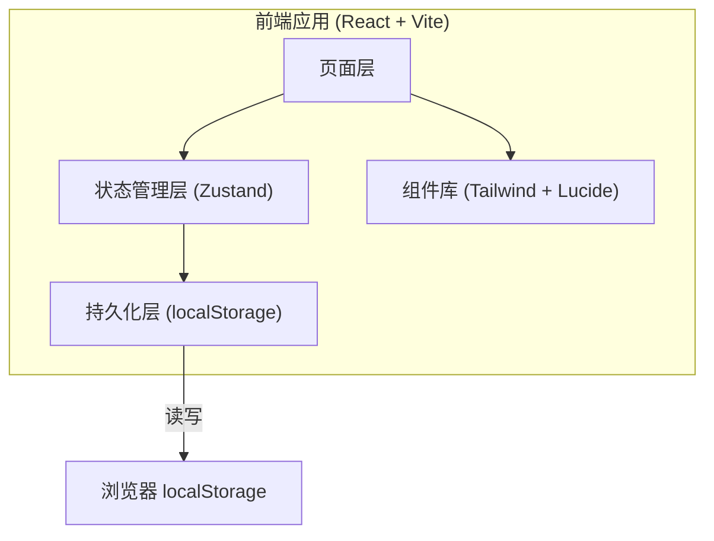
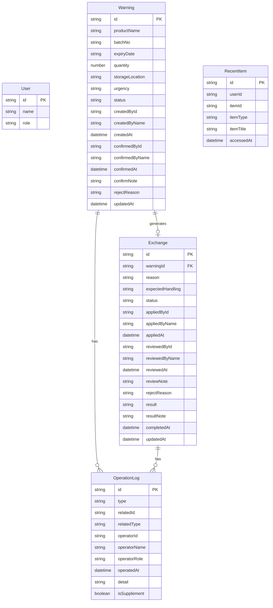

## 1. 架构设计

纯前端应用，所有数据持久化到 localStorage，断网/重启不丢状态。无后端服务，无外部依赖。

## 2. 技术说明

- 前端：React@18 + TypeScript + Tailwind CSS@3 + Vite
- 初始化工具：vite-init
- 后端：无
- 数据库：localStorage（浏览器本地存储）
- 状态管理：Zustand（含 persist 中间件自动同步 localStorage）

## 3. 路由定义

| 路由 | 用途 |
|------|------|
| / | 工作台：临期概览、待办任务、最近打开 |
| /warnings | 临期预警列表 |
| /warnings/new | 提交临期预警 |
| /warnings/:id | 预警详情（含确认/退回操作） |
| /exchanges | 换货处理列表 |
| /exchanges/:id | 换货详情（含审批/补录操作） |
| /history | 操作历史 |

## 4. 数据模型

### 4.1 数据模型定义

### 4.2 数据定义

#### Warning 状态流转

| 状态值 | 含义 | 可执行操作 |
|--------|------|------------|
| pending | 待确认 | 仓库员可确认或退回 |
| confirmed | 已确认 | 仓库员可提交换货申请 |
| rejected | 已退回 | 销售内勤可修改后重新提交 |
| exchanged | 已申请换货 | 关联换货单处理中 |

#### Exchange 状态流转

| 状态值 | 含义 | 可执行操作 |
|--------|------|------------|
| pending | 待审核 | 售后专员可通过或驳回 |
| approved | 已通过 | 售后专员填写处理结果 |
| rejected | 已驳回 | 仓库员可修改后重新提交 |
| completed | 已完成 | 可补录信息 |
| supplemented | 已补录 | 补录完成 |

#### Urgency 紧急程度

| 值 | 含义 | 颜色标识 |
|----|------|----------|
| critical | 7天内到期 | 玫红 #ef4444 |
| urgent | 30天内到期 | 琥珀 #f59e0b |
| normal | 90天内到期 | 蓝色 #3b82f6 |

## 5. 状态管理设计

使用 Zustand 创建以下 Store：

### 5.1 userStore
- currentUser: 当前登录角色信息
- login(role): 选择角色登录
- logout(): 退出

### 5.2 warningStore
- warnings: Warning[]
- addWarning(data): 提交预警
- confirmWarning(id, note): 仓库确认
- rejectWarning(id, reason): 仓库退回
- resubmitWarning(id, data): 重新提交
- linkExchange(warningId, exchangeId): 关联换货单

### 5.3 exchangeStore
- exchanges: Exchange[]
- addExchange(data): 提交换货申请
- approveExchange(id, note): 审批通过
- rejectExchange(id, reason): 驳回
- completeExchange(id, result, note): 填写处理结果
- supplementExchange(id, data): 补录信息

### 5.4 operationLogStore
- logs: OperationLog[]
- addLog(data): 记录操作
- getByRelatedId(id): 获取关联操作记录
- getFiltered(filters): 筛选查询

### 5.5 recentStore
- recentItems: RecentItem[]
- addRecent(item): 记录最近访问
- getByUser(userId): 获取用户最近记录

所有 Store 均使用 Zustand persist 中间件，自动同步到 localStorage，key 前缀为 `dental_`。

## 6. 轻量化说明

| 项目 | 实现方式 | 限制说明 |
|------|----------|----------|
| 账号体系 | 角色选择（无密码/注册） | 非真实账号体系，角色仅控制界面可见操作 |
| 第三方通知 | 不实现 | 不对接短信/邮件/企微推送，仅页面内徽章和列表提醒 |
| 附件上传 | 记录文件名+备注 | 不实际存储文件内容，非真实文件存储 |
| 数据存储 | localStorage | 单域名约5MB限制，适用于中小规模台账 |
