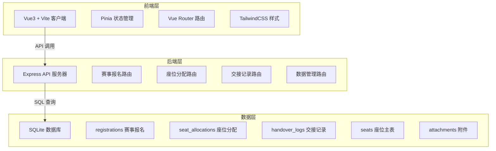
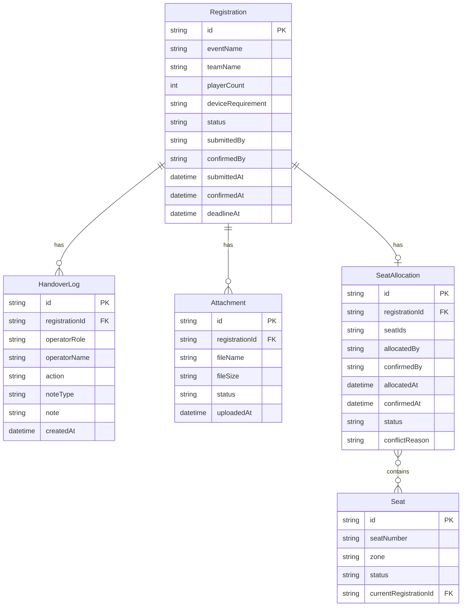

## 1. 架构设计



## 2. 技术说明

- 前端：Vue3 + Vite + TailwindCSS + Vue Router + Pinia
- 初始化工具：vite-init (vue-express-ts 模板)
- 后端：Express4 + TypeScript (ESM)
- 数据库：SQLite3 (better-sqlite3)，预置样例数据
- 字体：Rajdhani (标题) + Noto Sans SC (正文)，通过 Google Fonts CDN 加载

## 3. 路由定义

| 路由 | 用途 |
|------|------|
| / | 现场态势仪表盘 |
| /registrations | 赛事报名列表 |
| /registrations/:id | 赛事报名详情与处理 |
| /seats | 座位分配管理（座位图） |
| /seats/:id | 座位分配详情 |
| /admin | 数据管理（重置、附件） |

## 4. API 定义

### 4.1 赛事报名

```typescript
interface Registration {
  id: string
  eventName: string
  teamName: string
  playerCount: number
  deviceRequirement: string
  status: "pending" | "confirmed" | "seating" | "completed" | "rejected" | "escalated"
  submittedBy: "网管" | "赛事运营"
  confirmedBy?: string
  submittedAt: string
  confirmedAt?: string
  deadlineAt: string
  attachments: Attachment[]
  handoverLogs: HandoverLog[]
}

// GET /api/registrations - 获取报名列表
// GET /api/registrations/:id - 获取报名详情（含交接记录和附件）
// POST /api/registrations - 提交赛事报名
// PATCH /api/registrations/:id - 更新报名状态（确认/驳回/升级）
// POST /api/registrations/:id/notes - 添加备注
```

### 4.2 座位分配

```typescript
interface Seat {
  id: string
  seatNumber: string
  zone: "A" | "B" | "C" | "VIP"
  status: "available" | "occupied" | "reserved" | "maintenance"
  currentRegistrationId?: string
  currentUserId?: string
}

interface SeatAllocation {
  id: string
  registrationId: string
  seatIds: string[]
  allocatedBy: string
  confirmedBy?: string
  allocatedAt: string
  confirmedAt?: string
  status: "pending" | "confirmed" | "released"
  conflictReason?: string
}

// GET /api/seats - 获取座位列表
// GET /api/seats/allocations - 获取分配列表
// GET /api/seats/allocations/:id - 获取分配详情
// POST /api/seats/allocations - 创建座位分配
// PATCH /api/seats/allocations/:id - 确认/释放分配
```

### 4.3 交接记录

```typescript
interface HandoverLog {
  id: string
  registrationId: string
  operatorRole: "网管" | "赛事运营" | "店长"
  operatorName: string
  action: string
  noteType: "normal" | "urgent" | "dispute" | "supplement"
  note: string
  createdAt: string
}

// GET /api/handover-logs/:registrationId - 获取交接记录
// POST /api/handover-logs - 添加交接记录
```

### 4.4 数据管理

```typescript
// POST /api/admin/reset - 数据重置（需确认文本）
// GET /api/admin/reset-log - 重置日志
```

### 4.5 附件

```typescript
interface Attachment {
  id: string
  registrationId: string
  fileName: string
  fileSize: string
  status: "placeholder" | "uploaded"
  uploadedAt?: string
}

// GET /api/attachments/:registrationId - 获取附件列表
// POST /api/attachments - 添加附件占位
// PATCH /api/attachments/:id - 更新附件状态
```

## 5. 服务器架构


## 6. 数据模型

### 6.1 数据模型定义



### 6.2 数据定义语言

```sql
CREATE TABLE registrations (
  id TEXT PRIMARY KEY,
  event_name TEXT NOT NULL,
  team_name TEXT NOT NULL,
  player_count INTEGER NOT NULL,
  device_requirement TEXT DEFAULT '',
  status TEXT NOT NULL DEFAULT 'pending',
  submitted_by TEXT NOT NULL,
  confirmed_by TEXT,
  submitted_at TEXT NOT NULL,
  confirmed_at TEXT,
  deadline_at TEXT NOT NULL
);

CREATE TABLE seats (
  id TEXT PRIMARY KEY,
  seat_number TEXT NOT NULL UNIQUE,
  zone TEXT NOT NULL,
  status TEXT NOT NULL DEFAULT 'available',
  current_registration_id TEXT,
  FOREIGN KEY (current_registration_id) REFERENCES registrations(id)
);

CREATE TABLE seat_allocations (
  id TEXT PRIMARY KEY,
  registration_id TEXT NOT NULL,
  seat_ids TEXT NOT NULL,
  allocated_by TEXT NOT NULL,
  confirmed_by TEXT,
  allocated_at TEXT NOT NULL,
  confirmed_at TEXT,
  status TEXT NOT NULL DEFAULT 'pending',
  conflict_reason TEXT,
  FOREIGN KEY (registration_id) REFERENCES registrations(id)
);

CREATE TABLE handover_logs (
  id TEXT PRIMARY KEY,
  registration_id TEXT NOT NULL,
  operator_role TEXT NOT NULL,
  operator_name TEXT NOT NULL,
  action TEXT NOT NULL,
  note_type TEXT NOT NULL DEFAULT 'normal',
  note TEXT NOT NULL,
  created_at TEXT NOT NULL,
  FOREIGN KEY (registration_id) REFERENCES registrations(id)
);

CREATE TABLE attachments (
  id TEXT PRIMARY KEY,
  registration_id TEXT NOT NULL,
  file_name TEXT NOT NULL,
  file_size TEXT NOT NULL DEFAULT '0',
  status TEXT NOT NULL DEFAULT 'placeholder',
  uploaded_at TEXT,
  FOREIGN KEY (registration_id) REFERENCES registrations(id)
);

CREATE INDEX idx_registrations_status ON registrations(status);
CREATE INDEX idx_registrations_deadline ON registrations(deadline_at);
CREATE INDEX idx_seats_zone ON seats(zone);
CREATE INDEX idx_seats_status ON seats(status);
CREATE INDEX idx_handover_logs_reg ON handover_logs(registration_id);
CREATE INDEX idx_attachments_reg ON attachments(registration_id);
```
