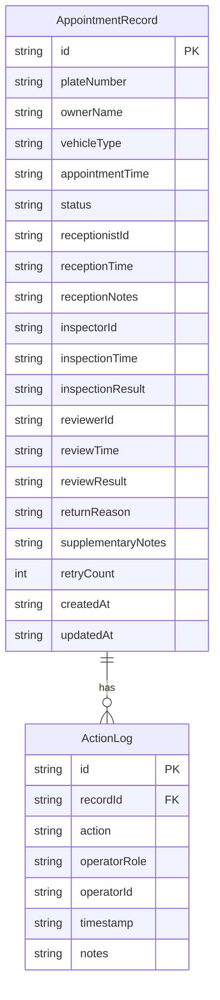

## 1. 架构设计

```mermaid
flowchart TB
    subgraph "前端 React"
        "登录页" --> "工作台页"
        "工作台页" --> "记录详情弹窗"
        "工作台页" --> "数据管理"
    end
    subgraph "后端 Express"
        "API路由" --> "业务Service"
        "业务Service" --> "SQLite数据库"
    end
    "前端 React" -->|REST API| "API路由"
```

## 2. 技术说明

- 前端：React@18 + tailwindcss@3 + vite + zustand
- 初始化工具：vite-init
- 后端：Express@4 + TypeScript (ESM)
- 数据库：SQLite (better-sqlite3)，数据持久化到文件

## 3. 路由定义

| 路由 | 用途 |
|------|------|
| / | 登录页（角色选择） |
| /dashboard | 工作台主页（按角色展示待办） |
| /records/:id | 记录详情（弹窗形式嵌入工作台） |
| /admin | 数据管理（批量操作与重置） |

## 4. API定义

### 4.1 类型定义

```typescript
interface AppointmentRecord {
  id: string;
  plateNumber: string;
  ownerName: string;
  vehicleType: string;
  appointmentTime: string;
  status: 'pending_reception' | 'pending_inspection' | 'pending_review' | 'completed' | 'returned' | 'rejected';
  receptionistId: string | null;
  receptionTime: string | null;
  receptionNotes: string;
  inspectorId: string | null;
  inspectionTime: string | null;
  inspectionResult: string;
  reviewerId: string | null;
  reviewTime: string | null;
  reviewResult: 'pass' | 'return' | 'reject' | null;
  returnReason: string;
  supplementaryNotes: string;
  retryCount: number;
  createdAt: string;
  updatedAt: string;
}

interface ActionLog {
  id: string;
  recordId: string;
  action: 'created' | 'received' | 'inspected' | 'approved' | 'returned' | 'supplemented' | 'reinspected' | 'reapproved' | 'rejected';
  operatorRole: string;
  operatorId: string;
  timestamp: string;
  notes: string;
}
```

### 4.2 接口定义

| 方法 | 路径 | 请求体 | 响应 | 说明 |
|------|------|--------|------|------|
| GET | /api/records | ?role=xxx&status=xxx | AppointmentRecord[] | 按角色和状态查询记录 |
| GET | /api/records/:id | - | AppointmentRecord | 获取单条记录 |
| POST | /api/records/:id/receive | { receptionNotes } | AppointmentRecord | 接车员接车 |
| POST | /api/records/:id/inspect | { inspectionResult } | AppointmentRecord | 检测员检测 |
| POST | /api/records/:id/review | { reviewResult, returnReason } | AppointmentRecord | 审核员审核 |
| POST | /api/records/:id/supplement | { supplementaryNotes } | AppointmentRecord | 接车员补充备注 |
| POST | /api/records/batch-review | { ids, reviewResult, returnReason } | { updated: number } | 批量审核 |
| POST | /api/records/reset | - | { reset: boolean } | 重置所有数据 |
| GET | /api/records/:id/logs | - | ActionLog[] | 获取操作日志 |

## 5. 服务端架构图

```mermaid
flowchart LR
    "Controller" --> "Service"
    "Service" --> "Repository"
    "Repository" --> "SQLite"
```

## 6. 数据模型

### 6.1 数据模型定义



### 6.2 数据定义语言

```sql
CREATE TABLE IF NOT EXISTS appointment_records (
  id TEXT PRIMARY KEY,
  plate_number TEXT NOT NULL,
  owner_name TEXT NOT NULL,
  vehicle_type TEXT NOT NULL,
  appointment_time TEXT NOT NULL,
  status TEXT NOT NULL DEFAULT 'pending_reception',
  receptionist_id TEXT,
  reception_time TEXT,
  reception_notes TEXT DEFAULT '',
  inspector_id TEXT,
  inspection_time TEXT,
  inspection_result TEXT DEFAULT '',
  reviewer_id TEXT,
  review_time TEXT,
  review_result TEXT,
  return_reason TEXT DEFAULT '',
  supplementary_notes TEXT DEFAULT '',
  retry_count INTEGER DEFAULT 0,
  created_at TEXT NOT NULL,
  updated_at TEXT NOT NULL
);

CREATE TABLE IF NOT EXISTS action_logs (
  id TEXT PRIMARY KEY,
  record_id TEXT NOT NULL,
  action TEXT NOT NULL,
  operator_role TEXT NOT NULL,
  operator_id TEXT NOT NULL,
  timestamp TEXT NOT NULL,
  notes TEXT DEFAULT '',
  FOREIGN KEY (record_id) REFERENCES appointment_records(id)
);

CREATE INDEX IF NOT EXISTS idx_records_status ON appointment_records(status);
CREATE INDEX IF NOT EXISTS idx_logs_record_id ON action_logs(record_id);
```

### 6.3 初始数据

系统启动时插入8条示例预约记录，覆盖不同状态：
- 3条待接车（pending_reception）
- 2条待检测（pending_inspection）
- 1条待审核（pending_review）
- 1条已退回（returned）
- 1条已完成（completed）
