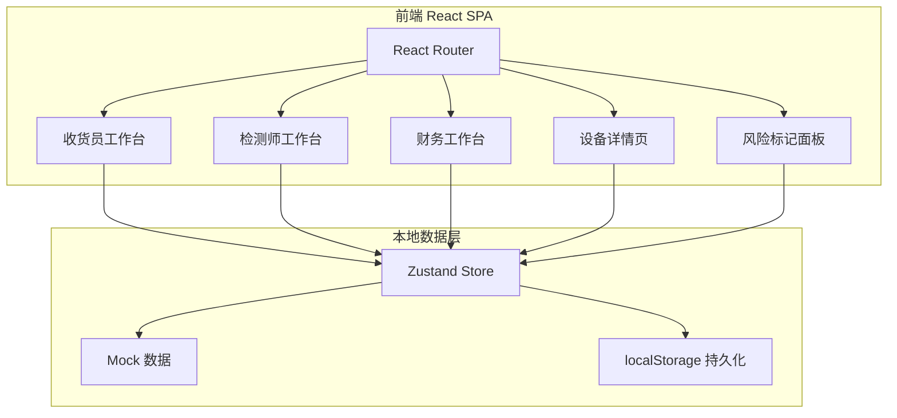
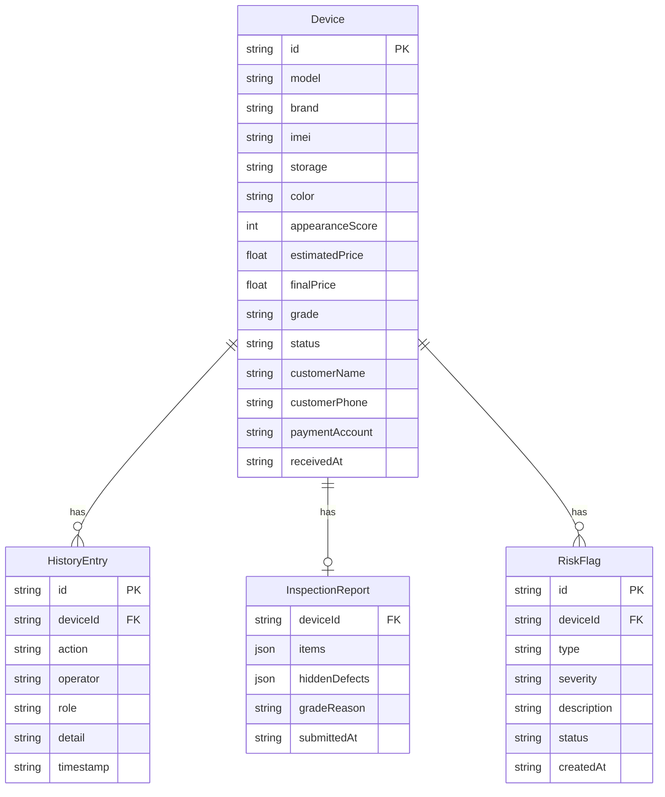

## 1. 架构设计



## 2. 技术说明

- **前端**：React@18 + TailwindCSS@3 + Vite
- **初始化工具**：Vite (react-ts template)
- **状态管理**：Zustand（轻量、支持持久化中间件）
- **路由**：React Router v6
- **后端**：无（纯前端，本地状态管理模拟后端行为）
- **数据持久化**：localStorage（通过 Zustand persist 中间件）
- **日期处理**：dayjs
- **图标**：Lucide React

## 3. 路由定义

| 路由 | 用途 |
|------|------|
| `/` | 重定向到 `/receiver` |
| `/receiver` | 收货员工作台 |
| `/inspector` | 检测师工作台 |
| `/finance` | 财务工作台 |
| `/device/:id` | 设备详情页（含历史回看） |
| `/risks` | 风险标记面板 |

## 4. API 定义

无后端 API。所有数据操作通过 Zustand Store 完成，模拟以下操作：

### 4.1 设备操作

```typescript
interface Device {
  id: string;
  model: string;
  brand: string;
  imei: string;
  storage: string;
  color: string;
  appearanceScore: number; // 1-10
  estimatedPrice: number;
  finalPrice: number | null;
  grade: 'A' | 'B' | 'C' | 'D' | 'scrap' | null;
  status: 'received' | 'inspecting' | 'graded' | 'confirmed' | 'paying' | 'completed' | 'returned';
  customerId: string;
  customerName: string;
  customerPhone: string;
  paymentAccount: string;
  paymentBank: string;
  receivedAt: string;
  receivedBy: string;
  inspectedAt: string | null;
  inspectedBy: string | null;
  paidAt: string | null;
  paidBy: string | null;
}

interface InspectionItem {
  category: string;
  name: string;
  result: 'pass' | 'fail' | 'skip' | null;
  note: string;
}

interface InspectionReport {
  deviceId: string;
  items: InspectionItem[];
  hiddenDefects: string[];
  gradeReason: string;
  submittedAt: string;
}

interface RiskFlag {
  id: string;
  deviceId: string;
  type: 'price_regret' | 'hidden_defect' | 'payment_error' | 'review';
  severity: 'high' | 'medium' | 'low';
  description: string;
  status: 'pending' | 'processing' | 'resolved';
  createdAt: string;
  resolvedAt: string | null;
}

interface HistoryEntry {
  id: string;
  deviceId: string;
  action: string;
  operator: string;
  role: 'receiver' | 'inspector' | 'finance' | 'manager';
  detail: string;
  timestamp: string;
}
```

### 4.2 Store 操作

```typescript
interface DeviceStore {
  devices: Device[];
  inspectionReports: Record<string, InspectionReport>;
  riskFlags: RiskFlag[];
  historyEntries: HistoryEntry[];

  addDevice: (device: Omit<Device, 'id' | 'status' | 'receivedAt'>) => void;
  batchReceiveDevices: (ids: string[]) => void;
  startInspection: (id: string) => void;
  submitInspection: (deviceId: string, report: InspectionReport, grade: Device['grade']) => void;
  confirmPrice: (id: string, finalPrice: number) => void;
  markPriceRegret: (id: string, reason: string) => void;
  verifyPaymentAccount: (id: string) => boolean;
  executePayment: (ids: string[]) => void;
  flagRisk: (deviceId: string, type: RiskFlag['type'], description: string, severity: RiskFlag['severity']) => void;
  resolveRisk: (riskId: string) => void;
  addHistoryEntry: (deviceId: string, action: string, operator: string, role: HistoryEntry['role'], detail: string) => void;
}
```

## 5. 服务端架构

不适用（纯前端应用）

## 6. 数据模型

### 6.1 数据模型关系



### 6.2 Mock 样例数据

系统预置 8 条样例设备数据，覆盖以下场景：

1. **完整流程样例**：iPhone 15 Pro，已完成收货→检测→A级→打款，带完整历史
2. **估价反悔样例**：华为 Mate 60 Pro，客户对B级估价不满要求退回，含协商备注
3. **暗病争议样例**：小米 14，检测发现主板维修痕迹，客户声称不知情，含争议记录
4. **打款异常样例**：OPPO Find X7，收款账号与客户姓名不匹配，已标记异常
5. **待检测样例**：Samsung S24 Ultra，刚收货待检测
6. **待打款样例**：iPhone 14，C级判定已确认价格，待财务打款
7. **复盘提醒样例**：vivo X100，同类机型多次出现暗病，需复盘
8. **废机样例**：iPhone 13，屏幕碎裂+主板故障，判定废机，含检测报告
