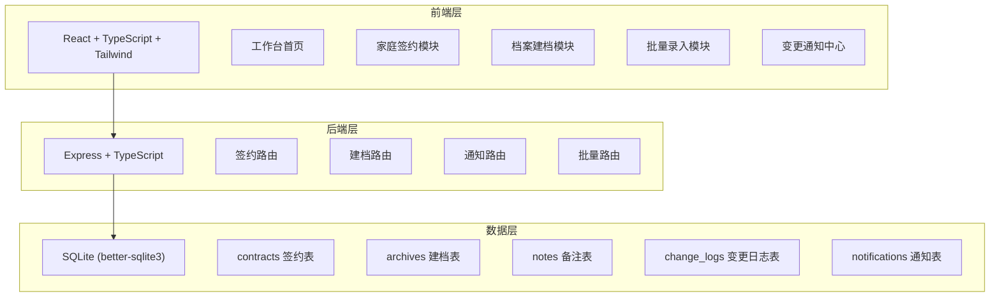
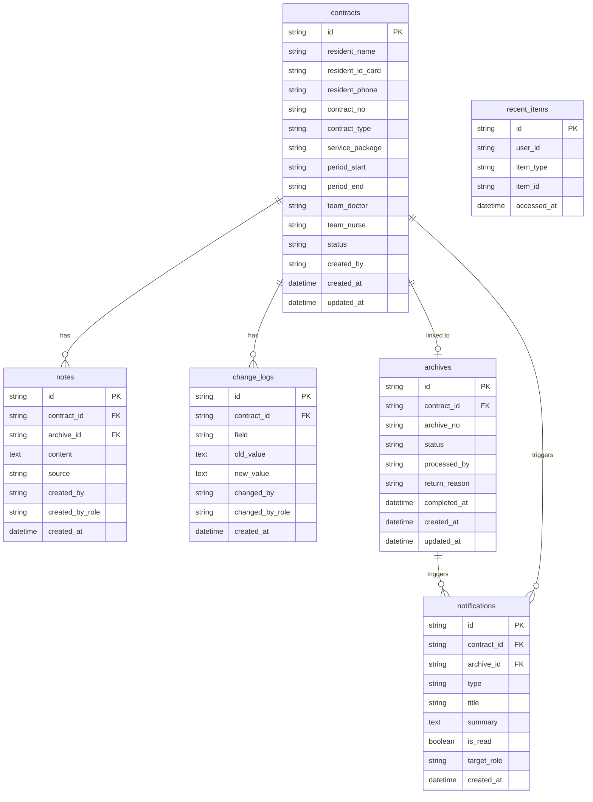

## 1. 架构设计



## 2. 技术说明

- 前端：React@18 + TypeScript + Tailwind CSS@3 + Vite + Zustand
- 初始化工具：vite-init
- 后端：Express@4 + TypeScript (ESM)
- 数据库：SQLite (better-sqlite3)，mock数据用于演示
- 状态管理：Zustand（前端），管理角色切换、通知状态、签约/建档列表筛选

## 3. 路由定义

### 前端路由

| 路由 | 用途 |
|------|------|
| / | 工作台首页：待办、最近打开、变更通知 |
| /contracts | 家庭签约列表 |
| /contracts/:id | 签约详情：基本信息、备注、变更记录、操作 |
| /contracts/new | 创建新签约 |
| /archives | 档案建档列表 |
| /archives/:id | 建档详情：签约继承、变更感知、退回补录 |
| /batch | 批量录入页面 |

### 后端路由

| 路由 | 方法 | 用途 |
|------|------|------|
| /api/contracts | GET | 获取签约列表（支持筛选） |
| /api/contracts | POST | 创建签约 |
| /api/contracts/:id | GET | 获取签约详情 |
| /api/contracts/:id | PATCH | 更新签约（状态变更、信息修改） |
| /api/contracts/:id/notes | POST | 添加签约备注 |
| /api/contracts/:id/changes | GET | 获取签约变更日志 |
| /api/archives | GET | 获取建档列表（支持筛选） |
| /api/archives | POST | 从签约创建建档 |
| /api/archives/:id | GET | 获取建档详情 |
| /api/archives/:id | PATCH | 更新建档（状态变更、退回等） |
| /api/archives/:id/return | POST | 退回签约补录 |
| /api/notifications | GET | 获取当前用户通知 |
| /api/notifications/:id/read | POST | 标记通知已读 |
| /api/batch/contracts | POST | 批量创建签约 |
| /api/batch/supplement | POST | 批量补充信息 |
| /api/recent | GET | 获取最近打开记录 |
| /api/dashboard | GET | 获取工作台数据（待办、统计） |

## 4. API定义

### 核心类型

```typescript
type ContractStatus = 'draft' | 'pending_review' | 'approved' | 'returned' | 'in_archive' | 'closed'
type ArchiveStatus = 'pending' | 'processing' | 'returned' | 'completed' | 'closed'
type Role = 'doctor' | 'nurse' | 'public_health'
type NoteSource = 'contract' | 'archive' | 'return'

interface Contract {
  id: string
  residentName: string
  residentIdCard: string
  residentPhone: string
  contractNo: string
  contractType: string
  servicePackage: string
  contractPeriod: { start: string; end: string }
  teamDoctor: string
  teamNurse: string
  status: ContractStatus
  createdBy: string
  createdAt: string
  updatedAt: string
}

interface Archive {
  id: string
  contractId: string
  archiveNo: string
  status: ArchiveStatus
  processedBy: string
  returnReason: string | null
  completedAt: string | null
  createdAt: string
  updatedAt: string
}

interface Note {
  id: string
  contractId: string
  archiveId: string | null
  content: string
  source: NoteSource
  createdBy: string
  createdByRole: Role
  createdAt: string
}

interface ChangeLog {
  id: string
  contractId: string
  field: string
  oldValue: string
  newValue: string
  changedBy: string
  changedByRole: Role
  createdAt: string
}

interface Notification {
  id: string
  contractId: string
  archiveId: string | null
  type: 'contract_changed' | 'contract_returned' | 'archive_return' | 'archive_completed'
  title: string
  summary: string
  isRead: boolean
  targetRole: Role
  createdAt: string
}
```

## 5. 服务端架构图

```mermaid
graph LR
    "Controller" --> "Service"
    "Service" --> "Repository"
    "Repository" --> "SQLite"
```

- Controller：路由处理、参数校验
- Service：业务逻辑（状态流转、变更通知生成、备注关联）
- Repository：数据访问（SQL查询、事务管理）

## 6. 数据模型

### 6.1 数据模型定义



### 6.2 数据定义语言

```sql
CREATE TABLE contracts (
  id TEXT PRIMARY KEY,
  resident_name TEXT NOT NULL,
  resident_id_card TEXT NOT NULL,
  resident_phone TEXT NOT NULL,
  contract_no TEXT UNIQUE NOT NULL,
  contract_type TEXT NOT NULL,
  service_package TEXT NOT NULL,
  period_start TEXT NOT NULL,
  period_end TEXT NOT NULL,
  team_doctor TEXT NOT NULL,
  team_nurse TEXT NOT NULL,
  status TEXT NOT NULL DEFAULT 'draft',
  created_by TEXT NOT NULL,
  created_at TEXT NOT NULL DEFAULT (datetime('now')),
  updated_at TEXT NOT NULL DEFAULT (datetime('now'))
);

CREATE TABLE archives (
  id TEXT PRIMARY KEY,
  contract_id TEXT NOT NULL REFERENCES contracts(id),
  archive_no TEXT UNIQUE NOT NULL,
  status TEXT NOT NULL DEFAULT 'pending',
  processed_by TEXT,
  return_reason TEXT,
  completed_at TEXT,
  created_at TEXT NOT NULL DEFAULT (datetime('now')),
  updated_at TEXT NOT NULL DEFAULT (datetime('now'))
);

CREATE TABLE notes (
  id TEXT PRIMARY KEY,
  contract_id TEXT NOT NULL REFERENCES contracts(id),
  archive_id TEXT REFERENCES archives(id),
  content TEXT NOT NULL,
  source TEXT NOT NULL DEFAULT 'contract',
  created_by TEXT NOT NULL,
  created_by_role TEXT NOT NULL,
  created_at TEXT NOT NULL DEFAULT (datetime('now'))
);

CREATE TABLE change_logs (
  id TEXT PRIMARY KEY,
  contract_id TEXT NOT NULL REFERENCES contracts(id),
  field TEXT NOT NULL,
  old_value TEXT,
  new_value TEXT,
  changed_by TEXT NOT NULL,
  changed_by_role TEXT NOT NULL,
  created_at TEXT NOT NULL DEFAULT (datetime('now'))
);

CREATE TABLE notifications (
  id TEXT PRIMARY KEY,
  contract_id TEXT NOT NULL REFERENCES contracts(id),
  archive_id TEXT REFERENCES archives(id),
  type TEXT NOT NULL,
  title TEXT NOT NULL,
  summary TEXT NOT NULL,
  is_read INTEGER NOT NULL DEFAULT 0,
  target_role TEXT NOT NULL,
  created_at TEXT NOT NULL DEFAULT (datetime('now'))
);

CREATE TABLE recent_items (
  id TEXT PRIMARY KEY,
  user_id TEXT NOT NULL,
  item_type TEXT NOT NULL,
  item_id TEXT NOT NULL,
  accessed_at TEXT NOT NULL DEFAULT (datetime('now'))
);

CREATE INDEX idx_contracts_status ON contracts(status);
CREATE INDEX idx_contracts_created_by ON contracts(created_by);
CREATE INDEX idx_archives_contract_id ON archives(contract_id);
CREATE INDEX idx_archives_status ON archives(status);
CREATE INDEX idx_notes_contract_id ON notes(contract_id);
CREATE INDEX idx_change_logs_contract_id ON change_logs(contract_id);
CREATE INDEX idx_notifications_target_role ON notifications(target_role);
CREATE INDEX idx_notifications_is_read ON notifications(is_read);
CREATE INDEX idx_recent_items_user ON recent_items(user_id, accessed_at);
```

## 7. 关键业务逻辑

### 7.1 状态流转规则

- draft → pending_review：全科医生提交审核
- pending_review → approved：护士审核通过
- pending_review → returned：护士退回修改
- returned → pending_review：全科医生补充后重新提交
- approved → in_archive：自动创建建档记录
- in_archive → returned：公卫专员退回补录
- in_archive → completed：公卫专员完成建档
- completed → closed：系统自动关闭（签约+建档同时关闭）

### 7.2 变更感知机制

签约状态为 in_archive 时，任何 contracts 表字段的修改都会：
1. 在 change_logs 表记录变更详情
2. 在 notifications 表生成一条 contract_changed 类型的通知，target_role 为 public_health
3. 建档详情页轮询或在加载时检查未读通知

### 7.3 备注流转规则

- 签约处理阶段添加的备注：source=contract，archive_id=null
- 建档退回时添加的退回原因：source=return，同时关联 contract_id 和 archive_id
- 建档处理阶段添加的备注：source=archive，同时关联 contract_id 和 archive_id
- 建档详情页展示全部关联签约的备注，按时间排列
