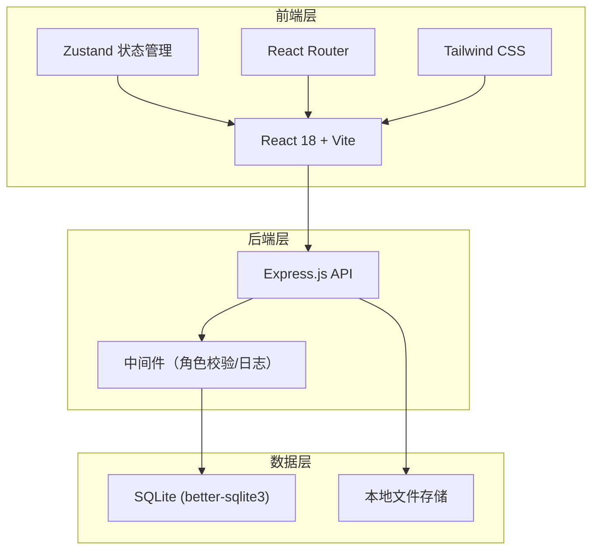
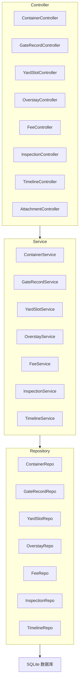
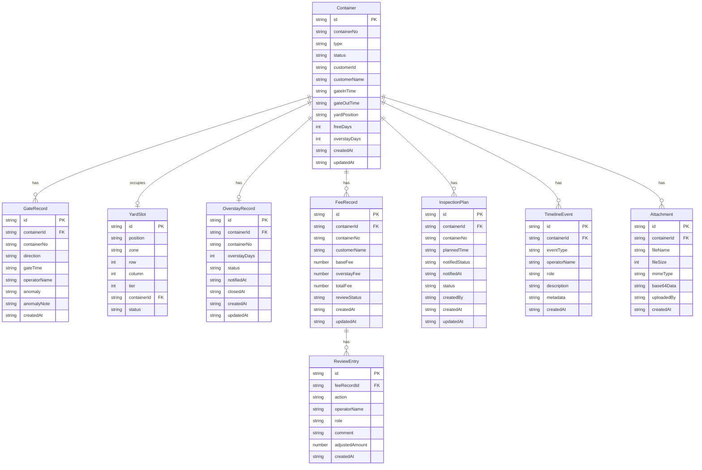

## 1. 架构设计



## 2. 技术说明

- **前端**：React@18 + Tailwind CSS@3 + Vite
- **初始化工具**：vite-init
- **后端**：Express@4 + TypeScript (ESM)
- **数据库**：SQLite (better-sqlite3)，无需额外数据库服务
- **状态管理**：Zustand
- **路由**：react-router-dom
- **图标**：lucide-react
- **ORM**：Drizzle ORM（轻量，适合 SQLite，TypeScript 优先）

## 3. 路由定义

| 路由 | 用途 |
|------|------|
| / | 工作台首页（角色感知仪表盘） |
| /containers | 箱号清单 |
| /gate-records | 闸口记录 |
| /yard-map | 堆位图 |
| /overstay | 超期堆存 |
| /fee-review | 费用复核 |
| /containers/:id | 集装箱详情（生命周期时间线） |
| /inspection | 查验计划 |

## 4. API 定义

### 4.1 集装箱相关

```typescript
interface Container {
  id: string
  containerNo: string
  type: "20GP" | "40GP" | "40HC" | "20RF"
  status: "normal" | "overstay" | "inspecting" | "departed" | "disputed" | "misplaced"
  customerId: string
  customerName: string
  gateInTime: string
  gateOutTime: string | null
  yardPosition: string | null
  freeDays: number
  overstayDays: number
  createdAt: string
  updatedAt: string
}

// GET /api/containers - 获取箱号清单（支持 status 筛选）
// GET /api/containers/:id - 获取箱号详情
// POST /api/containers - 新增箱号（闸口登记）
// PATCH /api/containers/:id - 更新箱号信息
// PATCH /api/containers/:id/status - 更新箱号状态
// POST /api/containers/batch-status - 批量更新状态
```

### 4.2 闸口记录

```typescript
interface GateRecord {
  id: string
  containerId: string
  containerNo: string
  direction: "in" | "out"
  gateTime: string
  operatorId: string
  operatorName: string
  anomaly: "none" | "doc_mismatch" | "container_damaged" | "overdue_pickup" | null
  anomalyNote: string | null
  createdAt: string
}

// GET /api/gate-records - 获取闸口记录列表
// POST /api/gate-records - 新增闸口记录
// PATCH /api/gate-records/:id - 标记异常
```

### 4.3 堆位管理

```typescript
interface YardSlot {
  id: string
  position: string
  zone: string
  row: number
  column: number
  tier: number
  containerId: string | null
  status: "empty" | "occupied" | "overstay" | "inspecting" | "misplaced"
}

// GET /api/yard-slots - 获取堆位图数据
// PATCH /api/yard-slots/:id - 更新堆位状态/分配
// POST /api/yard-slots/relocate - 错放箱移位
```

### 4.4 超期堆存

```typescript
interface OverstayRecord {
  id: string
  containerId: string
  containerNo: string
  overstayDays: number
  status: "pending_notify" | "notified" | "processing" | "closed"
  notifiedAt: string | null
  closedAt: string | null
  createdAt: string
  updatedAt: string
}

// GET /api/overstay - 获取超期堆存列表
// PATCH /api/overstay/:id/status - 更新超期处理状态
// POST /api/overstay/:id/notify - 发送超期通知（模拟）
```

### 4.5 费用复核

```typescript
interface FeeRecord {
  id: string
  containerId: string
  containerNo: string
  customerName: string
  baseFee: number
  overstayFee: number
  totalFee: number
  reviewStatus: "pending" | "reviewing" | "approved" | "rejected" | "disputed"
  reviewHistory: ReviewEntry[]
  createdAt: string
  updatedAt: string
}

interface ReviewEntry {
  id: string
  feeRecordId: string
  action: "submit_review" | "approve" | "reject" | "dispute" | "adjust"
  operatorName: string
  role: "gate_operator" | "dispatcher" | "customer_service"
  comment: string
  adjustedAmount: number | null
  createdAt: string
}

// GET /api/fees - 获取费用清单
// GET /api/fees/:id - 获取费用详情（含复核历史）
// PATCH /api/fees/:id/review - 提交复核操作
// POST /api/fees/:id/dispute - 发起争议
```

### 4.6 查验计划

```typescript
interface InspectionPlan {
  id: string
  containerId: string
  containerNo: string
  plannedTime: string
  notifiedStatus: "not_notified" | "notified"
  notifiedAt: string | null
  status: "planned" | "in_progress" | "completed"
  createdBy: string
  createdAt: string
  updatedAt: string
}

// GET /api/inspections - 获取查验计划列表
// POST /api/inspections - 新建查验计划
// PATCH /api/inspections/:id - 更新查验计划
// POST /api/inspections/:id/notify - 发送查验通知（模拟）
// GET /api/inspections/missed-notifications - 获取漏通知列表
```

### 4.7 集装箱时间线

```typescript
interface TimelineEvent {
  id: string
  containerId: string
  eventType: "gate_in" | "gate_out" | "position_assigned" | "position_relocated" | "overstay_detected" | "overstay_notified" | "inspection_scheduled" | "inspection_completed" | "fee_generated" | "fee_disputed" | "fee_approved" | "fee_rejected" | "status_changed" | "anomaly_marked"
  operatorName: string
  role: string
  description: string
  metadata: Record<string, unknown>
  createdAt: string
}

// GET /api/containers/:id/timeline - 获取集装箱生命周期时间线
```

### 4.8 附件

```typescript
interface Attachment {
  id: string
  containerId: string
  fileName: string
  fileSize: number
  mimeType: string
  base64Data: string
  uploadedBy: string
  createdAt: string
}

// GET /api/containers/:id/attachments - 获取附件列表
// POST /api/containers/:id/attachments - 上传附件（Base64）
```

## 5. 服务端架构



## 6. 数据模型

### 6.1 数据模型定义



### 6.2 数据定义语言

```sql
CREATE TABLE containers (
  id TEXT PRIMARY KEY,
  container_no TEXT NOT NULL UNIQUE,
  type TEXT NOT NULL CHECK(type IN ('20GP', '40GP', '40HC', '20RF')),
  status TEXT NOT NULL DEFAULT 'normal' CHECK(status IN ('normal', 'overstay', 'inspecting', 'departed', 'disputed', 'misplaced')),
  customer_id TEXT NOT NULL,
  customer_name TEXT NOT NULL,
  gate_in_time TEXT NOT NULL,
  gate_out_time TEXT,
  yard_position TEXT,
  free_days INTEGER NOT NULL DEFAULT 7,
  overstay_days INTEGER NOT NULL DEFAULT 0,
  created_at TEXT NOT NULL DEFAULT (datetime('now')),
  updated_at TEXT NOT NULL DEFAULT (datetime('now'))
);

CREATE INDEX idx_containers_status ON containers(status);
CREATE INDEX idx_containers_customer ON containers(customer_id);

CREATE TABLE gate_records (
  id TEXT PRIMARY KEY,
  container_id TEXT NOT NULL REFERENCES containers(id),
  container_no TEXT NOT NULL,
  direction TEXT NOT NULL CHECK(direction IN ('in', 'out')),
  gate_time TEXT NOT NULL,
  operator_name TEXT NOT NULL,
  anomaly TEXT DEFAULT 'none' CHECK(anomaly IN ('none', 'doc_mismatch', 'container_damaged', 'overdue_pickup')),
  anomaly_note TEXT,
  created_at TEXT NOT NULL DEFAULT (datetime('now'))
);

CREATE INDEX idx_gate_records_container ON gate_records(container_id);
CREATE INDEX idx_gate_records_time ON gate_records(gate_time DESC);

CREATE TABLE yard_slots (
  id TEXT PRIMARY KEY,
  position TEXT NOT NULL UNIQUE,
  zone TEXT NOT NULL,
  row_num INTEGER NOT NULL,
  col_num INTEGER NOT NULL,
  tier INTEGER NOT NULL DEFAULT 1,
  container_id TEXT REFERENCES containers(id),
  status TEXT NOT NULL DEFAULT 'empty' CHECK(status IN ('empty', 'occupied', 'overstay', 'inspecting', 'misplaced'))
);

CREATE INDEX idx_yard_slots_zone ON yard_slots(zone);
CREATE INDEX idx_yard_slots_status ON yard_slots(status);

CREATE TABLE overstay_records (
  id TEXT PRIMARY KEY,
  container_id TEXT NOT NULL REFERENCES containers(id),
  container_no TEXT NOT NULL,
  overstay_days INTEGER NOT NULL,
  status TEXT NOT NULL DEFAULT 'pending_notify' CHECK(status IN ('pending_notify', 'notified', 'processing', 'closed')),
  notified_at TEXT,
  closed_at TEXT,
  created_at TEXT NOT NULL DEFAULT (datetime('now')),
  updated_at TEXT NOT NULL DEFAULT (datetime('now'))
);

CREATE INDEX idx_overstay_container ON overstay_records(container_id);
CREATE INDEX idx_overstay_status ON overstay_records(status);

CREATE TABLE fee_records (
  id TEXT PRIMARY KEY,
  container_id TEXT NOT NULL REFERENCES containers(id),
  container_no TEXT NOT NULL,
  customer_name TEXT NOT NULL,
  base_fee REAL NOT NULL DEFAULT 0,
  overstay_fee REAL NOT NULL DEFAULT 0,
  total_fee REAL NOT NULL DEFAULT 0,
  review_status TEXT NOT NULL DEFAULT 'pending' CHECK(review_status IN ('pending', 'reviewing', 'approved', 'rejected', 'disputed')),
  created_at TEXT NOT NULL DEFAULT (datetime('now')),
  updated_at TEXT NOT NULL DEFAULT (datetime('now'))
);

CREATE INDEX idx_fee_container ON fee_records(container_id);
CREATE INDEX idx_fee_status ON fee_records(review_status);

CREATE TABLE review_entries (
  id TEXT PRIMARY KEY,
  fee_record_id TEXT NOT NULL REFERENCES fee_records(id),
  action TEXT NOT NULL CHECK(action IN ('submit_review', 'approve', 'reject', 'dispute', 'adjust')),
  operator_name TEXT NOT NULL,
  role TEXT NOT NULL CHECK(role IN ('gate_operator', 'dispatcher', 'customer_service')),
  comment TEXT,
  adjusted_amount REAL,
  created_at TEXT NOT NULL DEFAULT (datetime('now'))
);

CREATE INDEX idx_review_fee ON review_entries(fee_record_id);

CREATE TABLE inspection_plans (
  id TEXT PRIMARY KEY,
  container_id TEXT NOT NULL REFERENCES containers(id),
  container_no TEXT NOT NULL,
  planned_time TEXT NOT NULL,
  notified_status TEXT NOT NULL DEFAULT 'not_notified' CHECK(notified_status IN ('not_notified', 'notified')),
  notified_at TEXT,
  status TEXT NOT NULL DEFAULT 'planned' CHECK(status IN ('planned', 'in_progress', 'completed')),
  created_by TEXT NOT NULL,
  created_at TEXT NOT NULL DEFAULT (datetime('now')),
  updated_at TEXT NOT NULL DEFAULT (datetime('now'))
);

CREATE INDEX idx_inspection_container ON inspection_plans(container_id);
CREATE INDEX idx_inspection_time ON inspection_plans(planned_time);

CREATE TABLE timeline_events (
  id TEXT PRIMARY KEY,
  container_id TEXT NOT NULL REFERENCES containers(id),
  event_type TEXT NOT NULL,
  operator_name TEXT NOT NULL,
  role TEXT NOT NULL,
  description TEXT NOT NULL,
  metadata TEXT DEFAULT '{}',
  created_at TEXT NOT NULL DEFAULT (datetime('now'))
);

CREATE INDEX idx_timeline_container ON timeline_events(container_id);
CREATE INDEX idx_timeline_time ON timeline_events(created_at DESC);

CREATE TABLE attachments (
  id TEXT PRIMARY KEY,
  container_id TEXT NOT NULL REFERENCES containers(id),
  file_name TEXT NOT NULL,
  file_size INTEGER NOT NULL,
  mime_type TEXT NOT NULL,
  base64_data TEXT NOT NULL,
  uploaded_by TEXT NOT NULL,
  created_at TEXT NOT NULL DEFAULT (datetime('now'))
);

CREATE INDEX idx_attachment_container ON attachments(container_id);
```
