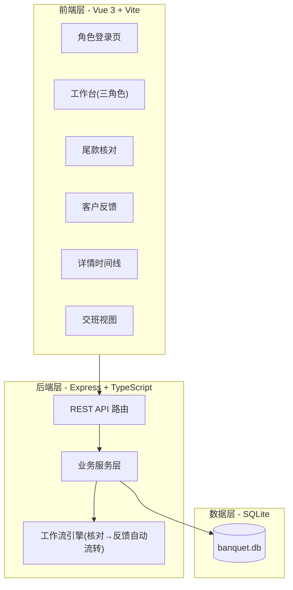
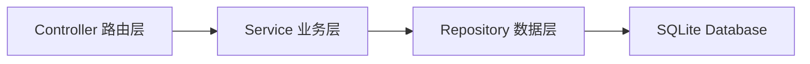
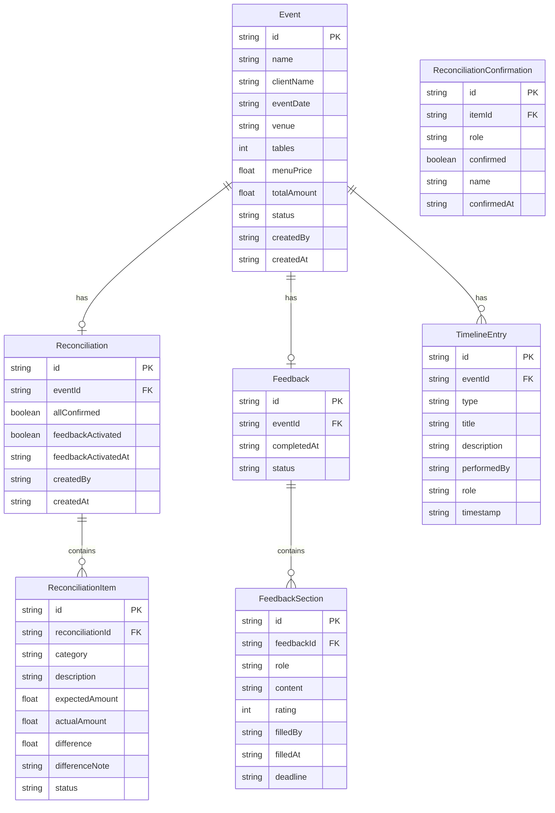

## 1. 架构设计



## 2. 技术说明

- 前端：Vue 3 + TypeScript + Tailwind CSS + Vue Router + Pinia
- 初始化工具：vite-init (vue-express-ts 模板)
- 后端：Express 4 + TypeScript (ESM)
- 数据库：SQLite (better-sqlite3)，文件级单库，无需额外部署
- 状态管理：Pinia
- 路由：Vue Router 4
- 图标：lucide-vue-next

## 3. 路由定义

| 路由 | 用途 |
|------|------|
| `/login` | 角色选择与姓名输入 |
| `/dashboard` | 当前角色的工作台首页 |
| `/reconciliation` | 尾款核对列表(含筛选、批量) |
| `/reconciliation/:id` | 尾款核对详情 |
| `/feedback` | 客户反馈列表(含回看) |
| `/feedback/:id` | 客户反馈填写/查看 |
| `/event/:id` | 活动详情时间线 |
| `/handover` | 交班视图 |

## 4. API 定义

### 4.1 类型定义

```typescript
type Role = 'sales' | 'hall' | 'kitchen'

interface Event {
  id: string
  name: string
  clientName: string
  eventDate: string
  venue: string
  tables: number
  menuPrice: number
  totalAmount: number
  status: 'pending' | 'reconciling' | 'feedback' | 'completed'
  createdBy: string
  createdAt: string
}

interface ReconciliationItem {
  id: string
  eventId: string
  category: 'venue' | 'menu' | 'extra' | 'discount'
  description: string
  expectedAmount: number
  actualAmount: number | null
  difference: number | null
  differenceNote: string
  confirmedBy: Record<Role, { confirmed: boolean; name: string; confirmedAt: string | null }>
  status: 'pending' | 'confirmed' | 'difference'
}

interface Reconciliation {
  id: string
  eventId: string
  items: ReconciliationItem[]
  allConfirmed: boolean
  feedbackActivated: boolean
  feedbackActivatedAt: string | null
  createdBy: string
  createdAt: string
}

interface FeedbackSection {
  role: Role
  content: string
  rating: number
  filledBy: string
  filledAt: string | null
  deadline: string
  overdue: boolean
}

interface Feedback {
  id: string
  eventId: string
  sections: FeedbackSection[]
  completedAt: string | null
  status: 'pending' | 'partial' | 'completed'
}

interface TimelineEntry {
  id: string
  eventId: string
  type: 'event_created' | 'reconciliation_started' | 'item_confirmed' | 'difference_marked' | 'reconciliation_completed' | 'feedback_activated' | 'feedback_filled' | 'feedback_completed' | 'event_archived'
  title: string
  description: string
  performedBy: string
  role: Role
  timestamp: string
}

interface HandoverItem {
  eventType: 'reconciliation' | 'feedback'
  eventId: string
  eventName: string
  responsibleRole: Role
  responsibleName: string
  deadline: string
  remainingHours: number
  status: 'pending' | 'in_progress' | 'overdue'
}
```

### 4.2 接口列表

| 方法 | 路径 | 说明 |
|------|------|------|
| POST | `/api/auth/login` | 角色登录 |
| GET | `/api/events` | 活动列表(支持状态筛选) |
| POST | `/api/events` | 创建活动 |
| GET | `/api/events/:id` | 活动详情 |
| GET | `/api/reconciliations` | 尾款核对列表(支持状态/日期筛选) |
| POST | `/api/reconciliations` | 发起尾款核对 |
| GET | `/api/reconciliations/:id` | 核对详情 |
| PUT | `/api/reconciliations/:id/items/:itemId/confirm` | 确认单个核对项 |
| POST | `/api/reconciliations/batch-confirm` | 批量确认核对项 |
| PUT | `/api/reconciliations/:id/items/:itemId/difference` | 标记差异 |
| GET | `/api/feedbacks` | 反馈列表(支持回看筛选) |
| GET | `/api/feedbacks/:id` | 反馈详情 |
| PUT | `/api/feedbacks/:id/sections/:role` | 填写角色对应的反馈 |
| GET | `/api/events/:id/timeline` | 活动时间线 |
| GET | `/api/handover` | 交班视图数据 |
| GET | `/api/dashboard/:role` | 工作台数据 |
| POST | `/api/upload` | 附件上传(Base64) |

## 5. 服务端架构



- Controller：参数校验、HTTP 状态码
- Service：业务逻辑、工作流引擎（核对完成→自动激活反馈）
- Repository：SQL 查询、事务管理

## 6. 数据模型

### 6.1 ER 图



### 6.2 数据定义语言

```sql
CREATE TABLE events (
  id TEXT PRIMARY KEY,
  name TEXT NOT NULL,
  client_name TEXT NOT NULL,
  event_date TEXT NOT NULL,
  venue TEXT NOT NULL,
  tables INTEGER NOT NULL,
  menu_price REAL NOT NULL,
  total_amount REAL NOT NULL,
  status TEXT NOT NULL DEFAULT 'pending',
  created_by TEXT NOT NULL,
  created_at TEXT NOT NULL DEFAULT (datetime('now'))
);

CREATE TABLE reconciliations (
  id TEXT PRIMARY KEY,
  event_id TEXT NOT NULL REFERENCES events(id),
  all_confirmed INTEGER NOT NULL DEFAULT 0,
  feedback_activated INTEGER NOT NULL DEFAULT 0,
  feedback_activated_at TEXT,
  created_by TEXT NOT NULL,
  created_at TEXT NOT NULL DEFAULT (datetime('now'))
);

CREATE TABLE reconciliation_items (
  id TEXT PRIMARY KEY,
  reconciliation_id TEXT NOT NULL REFERENCES reconciliations(id),
  category TEXT NOT NULL,
  description TEXT NOT NULL,
  expected_amount REAL NOT NULL,
  actual_amount REAL,
  difference REAL,
  difference_note TEXT DEFAULT '',
  status TEXT NOT NULL DEFAULT 'pending'
);

CREATE TABLE reconciliation_confirmations (
  id TEXT PRIMARY KEY,
  item_id TEXT NOT NULL REFERENCES reconciliation_items(id),
  role TEXT NOT NULL,
  confirmed INTEGER NOT NULL DEFAULT 0,
  name TEXT NOT NULL DEFAULT '',
  confirmed_at TEXT
);

CREATE TABLE feedbacks (
  id TEXT PRIMARY KEY,
  event_id TEXT NOT NULL REFERENCES events(id),
  completed_at TEXT,
  status TEXT NOT NULL DEFAULT 'pending'
);

CREATE TABLE feedback_sections (
  id TEXT PRIMARY KEY,
  feedback_id TEXT NOT NULL REFERENCES feedbacks(id),
  role TEXT NOT NULL,
  content TEXT DEFAULT '',
  rating INTEGER,
  filled_by TEXT DEFAULT '',
  filled_at TEXT,
  deadline TEXT NOT NULL
);

CREATE TABLE timeline_entries (
  id TEXT PRIMARY KEY,
  event_id TEXT NOT NULL REFERENCES events(id),
  type TEXT NOT NULL,
  title TEXT NOT NULL,
  description TEXT NOT NULL,
  performed_by TEXT NOT NULL,
  role TEXT NOT NULL,
  timestamp TEXT NOT NULL DEFAULT (datetime('now'))
);

CREATE INDEX idx_events_status ON events(status);
CREATE INDEX idx_events_date ON events(event_date);
CREATE INDEX idx_reconciliations_event ON reconciliations(event_id);
CREATE INDEX idx_recon_items_recon ON reconciliation_items(reconciliation_id);
CREATE INDEX idx_recon_conf_item ON reconciliation_confirmations(item_id);
CREATE INDEX idx_feedbacks_event ON feedbacks(event_id);
CREATE INDEX idx_feedback_sections_fb ON feedback_sections(feedback_id);
CREATE INDEX idx_timeline_event ON timeline_entries(event_id);
```
