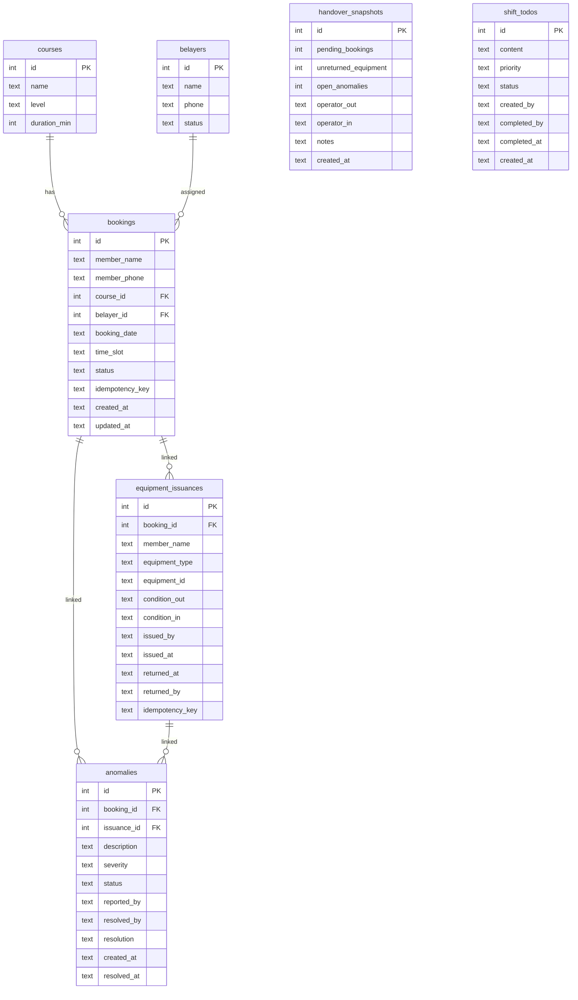

## 1. 架构设计

```mermaid
graph TB
    "React 前端" --> "Express API"
    "Express API" --> "Service 层"
    "Service 层" --> "SQLite 数据库"
    "Service 层 --> "交班快照生成"
```

前端 React + Tailwind 负责 UI 渲染与交互，Express 提供 RESTful API，SQLite 作为持久化存储。所有数据操作经过 Service 层，确保业务逻辑一致。

## 2. 技术栈说明

- **前端**：React@18 + TypeScript + Tailwind CSS + Zustand
- **构建工具**：Vite
- **后端**：Express@4 + TypeScript（ESM）
- **数据库**：SQLite（better-sqlite3，同步 API，适合单机部署）
- **初始化工具**：vite-init react-express-ts 模板

## 3. 路由定义

| 路由 | 用途 |
|------|------|
| `/` | 仪表盘（首页） |
| `/bookings` | 课程预约列表 |
| `/bookings/new` | 新建预约 |
| `/equipment` | 装备发放列表与回看 |
| `/equipment/issue` | 装备发放登记 |
| `/anomalies` | 异常记录列表 |
| `/anomalies/new` | 上报异常 |
| `/handover` | 交班面板 |
| `/handover/history` | 历史交班记录 |

## 4. API 定义

### 4.1 课程预约

```
GET    /api/bookings              获取预约列表（?date=&status=）
POST   /api/bookings              创建预约（幂等：需带 X-Idempotency-Key）
PATCH  /api/bookings/:id/status   更新预约状态（body: { status, operator }）
```

### 4.2 装备发放

```
GET    /api/equipment-issuances         获取发放列表（?date=&status=&member=）
POST   /api/equipment-issuances        发放登记（幂等：需带 X-Idempotency-Key）
PATCH  /api/equipment-issuances/:id/return  归还登记
```

### 4.3 异常记录

```
GET    /api/anomalies              获取异常列表（?status=&severity=）
POST   /api/anomalies              上报异常
PATCH  /api/anomalies/:id/resolve  处理异常
```

### 4.4 交班

```
GET    /api/handover/summary       当前班次汇总
POST   /api/handover/snapshot      生成交班快照
GET    /api/handover/history       历史交班记录
GET    /api/handover/snapshots/:id 查看某次交班快照详情
```

### 4.5 仪表盘

```
GET    /api/dashboard              首页数据（待办、异常、已完成）
```

### 4.6 基础数据

```
GET    /api/members                会员列表
GET    /api/belayers               保护员列表
GET    /api/courses                课程类型列表
GET    /api/equipment-types        装备类型列表
```

### 4.7 TypeScript 类型

```typescript
interface Booking {
  id: number
  member_name: string
  member_phone: string
  course_id: number
  course_name: string
  belayer_id: number | null
  belayer_name: string | null
  booking_date: string
  time_slot: string
  status: 'pending' | 'confirmed' | 'in_progress' | 'completed' | 'cancelled'
  idempotency_key: string
  created_at: string
  updated_at: string
}

interface EquipmentIssuance {
  id: number
  booking_id: number | null
  member_name: string
  equipment_type: string
  equipment_id: string
  condition_out: string
  condition_in: string | null
  issued_by: string
  issued_at: string
  returned_at: string | null
  returned_by: string | null
  idempotency_key: string
}

interface Anomaly {
  id: number
  booking_id: number | null
  issuance_id: number | null
  description: string
  severity: 'low' | 'medium' | 'high'
  status: 'open' | 'resolved'
  reported_by: string
  resolved_by: string | null
  resolution: string | null
  created_at: string
  resolved_at: string | null
}

interface HandoverSnapshot {
  id: number
  pending_bookings: number
  unreturned_equipment: number
  open_anomalies: number
  operator_out: string
  operator_in: string
  notes: string
  created_at: string
}

interface ShiftTodo {
  id: number
  content: string
  priority: 'high' | 'medium' | 'low'
  status: 'pending' | 'done'
  created_by: string
  completed_by: string | null
  completed_at: string | null
  created_at: string
}
```

## 5. 服务端架构图

```mermaid
graph LR
    "Router" --> "Controller"
    "Controller" --> "Service"
    "Service" --> "Repository"
    "Repository" --> "SQLite"
```

- **Router**：路由注册与中间件挂载
- **Controller**：请求参数校验、幂等键检查、调用 Service、格式化响应
- **Service**：业务逻辑（预约状态机、装备发放约束、交班快照聚合）
- **Repository**：SQL 执行与数据映射

## 6. 数据模型

### 6.1 ER 图



### 6.2 DDL

```sql
CREATE TABLE IF NOT EXISTS courses (
    id INTEGER PRIMARY KEY AUTOINCREMENT,
    name TEXT NOT NULL,
    level TEXT NOT NULL,
    duration_min INTEGER NOT NULL
);

CREATE TABLE IF NOT EXISTS belayers (
    id INTEGER PRIMARY KEY AUTOINCREMENT,
    name TEXT NOT NULL,
    phone TEXT NOT NULL,
    status TEXT NOT NULL DEFAULT 'on_duty'
);

CREATE TABLE IF NOT EXISTS bookings (
    id INTEGER PRIMARY KEY AUTOINCREMENT,
    member_name TEXT NOT NULL,
    member_phone TEXT NOT NULL,
    course_id INTEGER NOT NULL REFERENCES courses(id),
    belayer_id INTEGER REFERENCES belayers(id),
    booking_date TEXT NOT NULL,
    time_slot TEXT NOT NULL,
    status TEXT NOT NULL DEFAULT 'pending' CHECK(status IN ('pending','confirmed','in_progress','completed','cancelled')),
    idempotency_key TEXT NOT NULL UNIQUE,
    created_at TEXT NOT NULL DEFAULT (datetime('now','localtime')),
    updated_at TEXT NOT NULL DEFAULT (datetime('now','localtime'))
);

CREATE TABLE IF NOT EXISTS equipment_issuances (
    id INTEGER PRIMARY KEY AUTOINCREMENT,
    booking_id INTEGER REFERENCES bookings(id),
    member_name TEXT NOT NULL,
    equipment_type TEXT NOT NULL,
    equipment_id TEXT NOT NULL,
    condition_out TEXT NOT NULL DEFAULT '良好',
    condition_in TEXT,
    issued_by TEXT NOT NULL,
    issued_at TEXT NOT NULL DEFAULT (datetime('now','localtime')),
    returned_at TEXT,
    returned_by TEXT,
    idempotency_key TEXT NOT NULL UNIQUE
);

CREATE TABLE IF NOT EXISTS anomalies (
    id INTEGER PRIMARY KEY AUTOINCREMENT,
    booking_id INTEGER REFERENCES bookings(id),
    issuance_id INTEGER REFERENCES equipment_issuances(id),
    description TEXT NOT NULL,
    severity TEXT NOT NULL DEFAULT 'medium' CHECK(severity IN ('low','medium','high')),
    status TEXT NOT NULL DEFAULT 'open' CHECK(status IN ('open','resolved')),
    reported_by TEXT NOT NULL,
    resolved_by TEXT,
    resolution TEXT,
    created_at TEXT NOT NULL DEFAULT (datetime('now','localtime')),
    resolved_at TEXT
);

CREATE TABLE IF NOT EXISTS handover_snapshots (
    id INTEGER PRIMARY KEY AUTOINCREMENT,
    pending_bookings INTEGER NOT NULL DEFAULT 0,
    unreturned_equipment INTEGER NOT NULL DEFAULT 0,
    open_anomalies INTEGER NOT NULL DEFAULT 0,
    operator_out TEXT NOT NULL,
    operator_in TEXT NOT NULL,
    notes TEXT DEFAULT '',
    created_at TEXT NOT NULL DEFAULT (datetime('now','localtime'))
);

CREATE TABLE IF NOT EXISTS shift_todos (
    id INTEGER PRIMARY KEY AUTOINCREMENT,
    content TEXT NOT NULL,
    priority TEXT NOT NULL DEFAULT 'medium' CHECK(priority IN ('high','medium','low')),
    status TEXT NOT NULL DEFAULT 'pending' CHECK(status IN ('pending','done')),
    created_by TEXT NOT NULL,
    completed_by TEXT,
    completed_at TEXT,
    created_at TEXT NOT NULL DEFAULT (datetime('now','localtime'))
);

CREATE INDEX IF NOT EXISTS idx_bookings_date ON bookings(booking_date);
CREATE INDEX IF NOT EXISTS idx_bookings_status ON bookings(status);
CREATE INDEX IF NOT EXISTS idx_issuances_returned ON equipment_issuances(returned_at);
CREATE INDEX IF NOT EXISTS idx_anomalies_status ON anomalies(status);
CREATE INDEX IF NOT EXISTS idx_todos_status ON shift_todos(status);
```

### 6.3 种子数据

预置数据确保首页不为空：

- **课程类型**：基础攀岩体验、进阶攀岩技术、顶绳保护训练、抱石入门
- **保护员**：张磊、王静、李明
- **课程预约**（5条）：覆盖 pending/confirmed/in_progress/completed/cancelled
- **装备发放**（3条）：2条已归还，1条未归还
- **异常记录**（3条）：1条已关闭，2条未关闭
- **交班待办**（4条）：2条待处理，2条已完成
