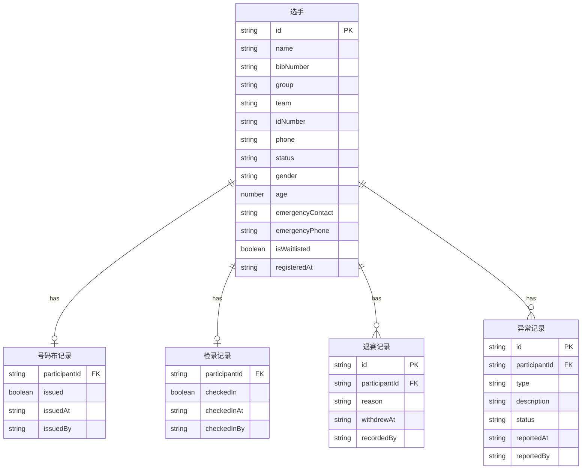

## 1. 架构设计

```mermaid
graph TB
    "浏览器" --> "React 前端"
    "React 前端" --> "Zustand 状态管理"
    "Zustand 状态管理" --> "Mock 数据层"
    "Mock 数据层" --> "LocalStorage 持久化"
```

纯前端架构，数据通过 Zustand 管理，使用 LocalStorage 做简单持久化以模拟现场多标签页场景。

## 2. 技术说明

- **前端**: React@18 + TypeScript + Tailwind CSS + Vite
- **初始化工具**: vite-init
- **状态管理**: Zustand（轻量，适合单页面多状态）
- **路由**: react-router-dom v6
- **图标**: lucide-react
- **后端**: 无，纯前端 Mock 数据
- **数据持久化**: LocalStorage

## 3. 路由定义

| 路由 | 用途 |
|------|------|
| `/` | 总览仪表盘 |
| `/registrations` | 报名名单 |
| `/groups` | 分组管理 |
| `/bibs` | 号码布发放 |
| `/checkin` | 现场检录 |
| `/withdrawals` | 退赛记录 |

## 4. 数据模型

### 4.1 数据模型定义



### 4.2 数据定义

#### 选手状态枚举
- `registered` - 已报名
- `checked_in` - 已检录
- `withdrawn` - 已退赛
- `disqualified` - 取消资格

#### 异常类型枚举
- `id_mismatch` - 证件不符
- `duplicate_entry` - 重复报名
- `group_conflict` - 组别冲突
- `other` - 其他异常

#### 组别枚举
- `亲子组` - Parent-Child
- `公开组` - Open
- `企业团体` - Corporate Team

#### 号码布发放状态
- `issued: false` - 未发放
- `issued: true` - 已发放

## 5. 项目结构

```
src/
├── components/          # 通用组件
│   ├── Layout.tsx       # 整体布局（侧边栏+顶栏+内容）
│   ├── Sidebar.tsx      # 左侧导航
│   ├── StatusBadge.tsx  # 状态标签
│   └── SearchBar.tsx    # 搜索组件
├── pages/               # 页面
│   ├── Dashboard.tsx    # 总览仪表盘
│   ├── Registrations.tsx # 报名名单
│   ├── Groups.tsx       # 分组管理
│   ├── Bibs.tsx         # 号码布发放
│   ├── CheckIn.tsx      # 现场检录
│   └── Withdrawals.tsx  # 退赛记录
├── store/               # Zustand 状态
│   └── useEventStore.ts # 全局状态
├── data/                # Mock 数据
│   └── mockData.ts      # 初始数据
├── types/               # 类型定义
│   └── index.ts         # 全局类型
├── App.tsx              # 路由入口
└── main.tsx             # 应用入口
```
