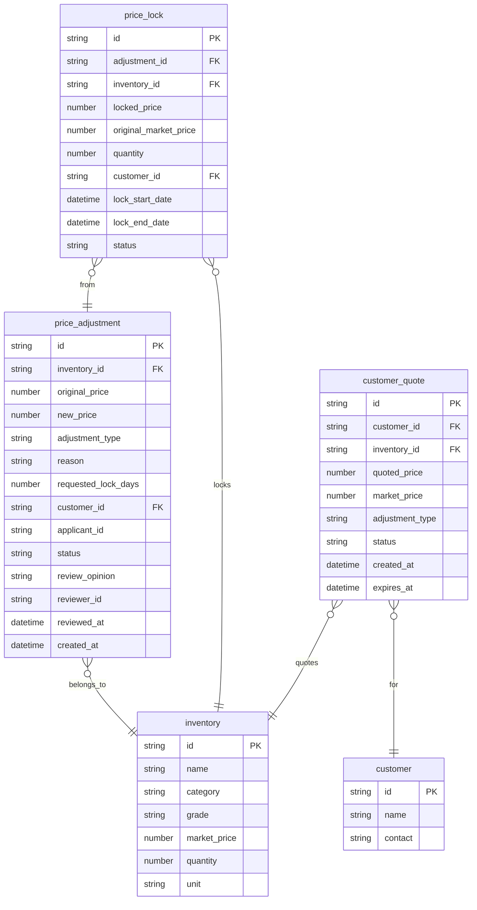

## 1. 架构设计

```mermaid
graph TB
    subgraph "前端层"
        "A[React + Vite + TailwindCSS]"
        "A1[调价管理页]"
        "A2[审核管理页]"
        "A3[锁价库存页]"
        "A4[客户报价记录页]"
    end
    subgraph "后端层"
        "B[Express.js API Server]"
        "B1[调价申请接口]"
        "B2[审核接口]"
        "B3[锁价库存接口]"
        "B4[客户报价接口]"
    end
    subgraph "数据层"
        "C[SQLite + Mock数据]"
        "C1[price_adjustments 调价申请表]"
        "C2[price_locks 锁价记录表]"
        "C3[customer_quotes 客户报价表]"
        "C4[inventory 库存表]"
    end
    "A1" --> "B1"
    "A2" --> "B2"
    "A3" --> "B3"
    "A4" --> "B4"
    "B1" --> "C1"
    "B2" --> "C1"
    "B3" --> "C2"
    "B4" --> "C3"
    "B1" --> "C4"
    "B3" --> "C4"
```

## 2. 技术说明

- 前端：React@18 + TailwindCSS@3 + Vite + Zustand + React Router
- 初始化工具：vite-init
- 后端：Express@4 + TypeScript (ESM)
- 数据库：SQLite (better-sqlite3)，含初始Mock数据
- 包管理器：npm

## 3. 路由定义

| 路由 | 用途 |
|------|------|
| / | 仪表盘概览，展示调价统计、待审核数量、锁价状态 |
| /adjustment | 调价管理，调价申请表单与记录列表 |
| /review | 审核管理，待审核列表与审核历史 |
| /price-lock | 锁价库存，锁价列表与状态监控 |
| /quotes | 客户报价记录，按客户分组的报价历史 |

## 4. API定义

### 4.1 调价申请接口

```typescript
interface PriceAdjustment {
  id: string
  inventoryId: string
  inventoryName: string
  originalPrice: number
  newPrice: number
  adjustmentType: "market_change" | "customer_negotiation" | "grade_change"
  reason: string
  requestedLockDays: number
  customerId?: string
  customerName?: string
  applicantId: string
  applicantName: string
  status: "pending" | "approved" | "rejected" | "expired"
  reviewOpinion?: string
  reviewerId?: string
  reviewerName?: string
  reviewedAt?: string
  createdAt: string
  updatedAt: string
}

// POST /api/adjustments - 创建调价申请
// GET /api/adjustments - 获取调价列表（支持status/filter查询）
// GET /api/adjustments/:id - 获取调价详情
```

### 4.2 审核接口

```typescript
interface ReviewAction {
  adjustmentId: string
  action: "approve" | "reject"
  opinion: string
  lockDays?: number
}

// POST /api/adjustments/:id/review - 审核调价申请
// GET /api/adjustments/pending - 获取待审核列表
// GET /api/adjustments/reviewed - 获取已审核列表
```

### 4.3 锁价库存接口

```typescript
interface PriceLock {
  id: string
  adjustmentId: string
  inventoryId: string
  inventoryName: string
  lockedPrice: number
  originalMarketPrice: number
  quantity: number
  unit: string
  customerId: string
  customerName: string
  lockStartDate: string
  lockEndDate: string
  status: "active" | "expiring_soon" | "expired"
}

// GET /api/price-locks - 获取锁价库存列表
// GET /api/price-locks/expiring - 获取即将过期的锁价
// DELETE /api/price-locks/:id - 手动解除锁价
```

### 4.4 客户报价接口

```typescript
interface CustomerQuote {
  id: string
  customerId: string
  customerName: string
  inventoryId: string
  inventoryName: string
  quotedPrice: number
  marketPrice: number
  adjustmentType: "market_change" | "customer_negotiation" | "grade_change"
  status: "active" | "expired" | "rejected"
  createdAt: string
  expiresAt?: string
}

// GET /api/quotes - 获取客户报价列表（支持customerId筛选）
// GET /api/quotes/:id - 获取报价详情
```

## 5. 服务器架构图

```mermaid
graph LR
    "Controller[路由控制器]" --> "Service[业务逻辑层]"
    "Service" --> "Repository[数据访问层]"
    "Repository" --> "DB[SQLite数据库]"
```

## 6. 数据模型

### 6.1 数据模型定义



### 6.2 数据定义语言

```sql
CREATE TABLE inventory (
  id TEXT PRIMARY KEY,
  name TEXT NOT NULL,
  category TEXT NOT NULL,
  grade TEXT NOT NULL,
  market_price REAL NOT NULL,
  quantity INTEGER NOT NULL,
  unit TEXT NOT NULL DEFAULT '吨'
);

CREATE TABLE customer (
  id TEXT PRIMARY KEY,
  name TEXT NOT NULL,
  contact TEXT NOT NULL
);

CREATE TABLE price_adjustment (
  id TEXT PRIMARY KEY,
  inventory_id TEXT NOT NULL REFERENCES inventory(id),
  original_price REAL NOT NULL,
  new_price REAL NOT NULL,
  adjustment_type TEXT NOT NULL CHECK(adjustment_type IN ('market_change', 'customer_negotiation', 'grade_change')),
  reason TEXT NOT NULL,
  requested_lock_days INTEGER NOT NULL,
  customer_id TEXT REFERENCES customer(id),
  applicant_name TEXT NOT NULL,
  status TEXT NOT NULL DEFAULT 'pending' CHECK(status IN ('pending', 'approved', 'rejected', 'expired')),
  review_opinion TEXT,
  reviewer_name TEXT,
  reviewed_at TEXT,
  created_at TEXT NOT NULL DEFAULT (datetime('now')),
  updated_at TEXT NOT NULL DEFAULT (datetime('now'))
);

CREATE TABLE price_lock (
  id TEXT PRIMARY KEY,
  adjustment_id TEXT NOT NULL REFERENCES price_adjustment(id),
  inventory_id TEXT NOT NULL REFERENCES inventory(id),
  locked_price REAL NOT NULL,
  original_market_price REAL NOT NULL,
  quantity INTEGER NOT NULL,
  unit TEXT NOT NULL DEFAULT '吨',
  customer_id TEXT NOT NULL REFERENCES customer(id),
  lock_start_date TEXT NOT NULL,
  lock_end_date TEXT NOT NULL,
  status TEXT NOT NULL DEFAULT 'active' CHECK(status IN ('active', 'expiring_soon', 'expired'))
);

CREATE TABLE customer_quote (
  id TEXT PRIMARY KEY,
  customer_id TEXT NOT NULL REFERENCES customer(id),
  inventory_id TEXT NOT NULL REFERENCES inventory(id),
  quoted_price REAL NOT NULL,
  market_price REAL NOT NULL,
  adjustment_type TEXT NOT NULL CHECK(adjustment_type IN ('market_change', 'customer_negotiation', 'grade_change')),
  status TEXT NOT NULL DEFAULT 'active' CHECK(status IN ('active', 'expired', 'rejected')),
  created_at TEXT NOT NULL DEFAULT (datetime('now')),
  expires_at TEXT
);

-- 初始Mock数据：含审核拒绝、临时锁价、价格过期样例
INSERT INTO inventory VALUES ('inv-001', '废铜线', '有色金属', 'A级', 48000, 50, '吨');
INSERT INTO inventory VALUES ('inv-002', '废铝板', '有色金属', 'B级', 13500, 80, '吨');
INSERT INTO inventory VALUES ('inv-003', '废钢板', '黑色金属', 'A级', 3200, 120, '吨');
INSERT INTO inventory VALUES ('inv-004', '废旧塑料', '塑料', 'C级', 2800, 200, '吨');

INSERT INTO customer VALUES ('cust-001', '华鑫金属回收', '张经理 13800001111');
INSERT INTO customer VALUES ('cust-002', '永达资源科技', '李总 13900002222');
INSERT INTO customer VALUES ('cust-003', '绿源环保材料', '王经理 13700003333');

-- 样例1：审核拒绝
INSERT INTO price_adjustment VALUES ('adj-001', 'inv-002', 13500, 11000, 'customer_negotiation', '客户永达资源科技要求大幅降价采购废铝板', 30, 'cust-002', '刘晓红', 'rejected', '降价幅度过大(18.5%)，超出公司调价权限范围，建议与客户重新协商', '陈志强', '2026-06-18T14:30:00', '2026-06-17T09:15:00', '2026-06-18T14:30:00');

-- 样例2：临时锁价（审核通过，锁价生效中）
INSERT INTO price_adjustment VALUES ('adj-002', 'inv-001', 48000, 46500, 'market_change', '近期废铜市场价下行，客户要求按调整后价格执行', 15, 'cust-001', '刘晓红', 'approved', '同意，降价幅度3.1%在合理范围内', '陈志强', '2026-06-20T10:00:00', '2026-06-19T11:20:00', '2026-06-20T10:00:00');

-- 样例3：价格过期
INSERT INTO price_adjustment VALUES ('adj-003', 'inv-004', 2800, 2600, 'grade_change', '库存废旧塑料经二次分拣后等级由C降为D，需调低价格', 7, 'cust-003', '刘晓红', 'expired', NULL, NULL, NULL, '2026-06-10T08:45:00', '2026-06-10T08:45:00');

-- 锁价记录：对应adj-002的临时锁价
INSERT INTO price_lock VALUES ('lock-001', 'adj-002', 'inv-001', 46500, 48000, 50, '吨', 'cust-001', '2026-06-20T10:00:00', '2026-07-05T10:00:00', 'active');

-- 锁价记录：已过期的锁价（对应adj-003）
INSERT INTO price_lock VALUES ('lock-002', 'adj-003', 'inv-004', 2600, 2800, 200, '吨', 'cust-003', '2026-06-10T08:45:00', '2026-06-17T08:45:00', 'expired');

-- 客户报价记录
INSERT INTO customer_quote VALUES ('quote-001', 'cust-001', 'inv-001', 46500, 48000, 'market_change', 'active', '2026-06-20T10:00:00', '2026-07-05T10:00:00');
INSERT INTO customer_quote VALUES ('quote-002', 'cust-002', 'inv-002', 11000, 13500, 'customer_negotiation', 'rejected', '2026-06-17T09:15:00', NULL);
INSERT INTO customer_quote VALUES ('quote-003', 'cust-003', 'inv-004', 2600, 2800, 'grade_change', 'expired', '2026-06-10T08:45:00', '2026-06-17T08:45:00');
```
