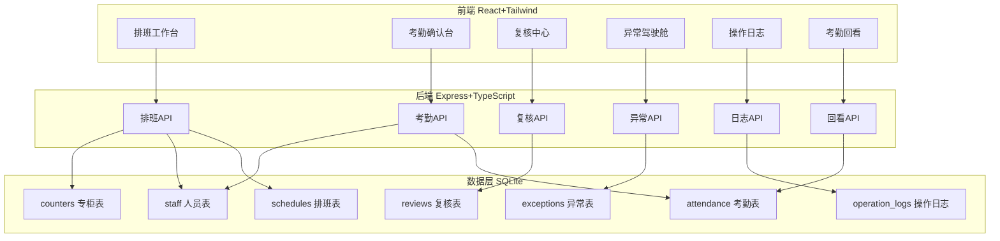
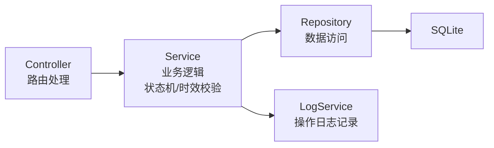
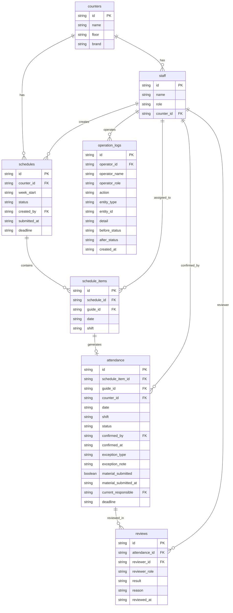

## 1. 架构设计



## 2. 技术说明

- 前端：React@18 + Tailwind CSS@3 + Vite
- 初始化工具：vite-init
- 后端：Express@4 + TypeScript（ESM 格式）
- 数据库：SQLite（better-sqlite3），演示数据直接写入
- 状态管理：Zustand
- 图标：lucide-react
- 字体：Noto Sans SC + JetBrains Mono（Google Fonts CDN）

## 3. 路由定义

| 路由 | 用途 | 权限角色 |
|------|------|----------|
| / | 登录页，角色选择 | 公开 |
| /schedule | 排班工作台 | 柜长 |
| /attendance | 考勤确认台 | 柜长、导购 |
| /review | 复核中心 | 楼层主管、品牌督导 |
| /exceptions | 异常驾驶舱 | 全角色（视角不同） |
| /logs | 操作日志 | 全角色 |
| /history | 考勤回看 | 全角色 |

## 4. API 定义

### 4.1 排班 API

```
GET    /api/schedules?counterId=&weekStart=     获取排班列表
POST   /api/schedules                            创建排班
PUT    /api/schedules/:id                        更新排班
POST   /api/schedules/:id/submit                 提交排班
POST   /api/schedules/:id/change                 排班变更申请
```

### 4.2 考勤 API

```
GET    /api/attendance?status=&date=             获取考勤列表
POST   /api/attendance/:id/confirm               确认考勤
POST   /api/attendance/:id/mark-exception        标记异常
POST   /api/attendance/:id/submit-material       补交材料
GET    /api/attendance/:id                       获取考勤详情
```

### 4.3 复核 API

```
GET    /api/reviews?status=                      获取复核列表
POST   /api/reviews/:id/approve                  复核通过
POST   /api/reviews/:id/reject                   复核退回（需原因）
POST   /api/reviews/:id/brand-confirm            品牌确认
```

### 4.4 异常 API

```
GET    /api/exceptions?type=                     获取异常列表
GET    /api/exceptions/stats                     异常统计
```

### 4.5 日志 API

```
GET    /api/logs?operatorId=&entityType=&dateRange=  获取操作日志
```

### 4.6 认证 API

```
POST   /api/auth/demo-login                      演示账号登录
```

### 4.7 TypeScript 类型定义

```typescript
type ScheduleStatus = "draft" | "submitted" | "confirmed" | "change_requested"

type AttendanceStatus =
  | "pending_confirm"
  | "pending_material"
  | "timeout_escalated"
  | "pending_review"
  | "review_rejected"
  | "pending_brand_confirm"
  | "closed"

type ExceptionType = "missing_material" | "timeout" | "review_rejected"

interface Staff {
  id: string
  name: string
  role: "counter_manager" | "floor_supervisor" | "brand_supervisor" | "guide"
  counterId: string
  avatar: string
}

interface Counter {
  id: string
  name: string
  floor: string
  brand: string
}

interface Schedule {
  id: string
  counterId: string
  weekStart: string
  status: ScheduleStatus
  createdBy: string
  submittedAt: string | null
  deadline: string | null
  items: ScheduleItem[]
}

interface ScheduleItem {
  id: string
  scheduleId: string
  guideId: string
  date: string
  shift: "morning" | "afternoon" | "full" | "off"
}

interface Attendance {
  id: string
  scheduleItemId: string
  guideId: string
  counterId: string
  date: string
  shift: string
  status: AttendanceStatus
  confirmedBy: string | null
  confirmedAt: string | null
  exceptionType: ExceptionType | null
  exceptionNote: string | null
  materialSubmitted: boolean
  materialSubmittedAt: string | null
  currentResponsible: string
  deadline: string | null
}

interface Review {
  id: string
  attendanceId: string
  reviewerId: string
  reviewerRole: "floor_supervisor" | "brand_supervisor"
  result: "approved" | "rejected" | null
  reason: string | null
  reviewedAt: string | null
}

interface OperationLog {
  id: string
  operatorId: string
  operatorName: string
  operatorRole: string
  action: string
  entityType: string
  entityId: string
  detail: string
  beforeStatus: string | null
  afterStatus: string | null
  createdAt: string
}

interface Exception {
  id: string
  type: ExceptionType
  attendanceId: string
  guideName: string
  counterName: string
  date: string
  description: string
  responsibleId: string
  responsibleName: string
  deadline: string
  isOverdue: boolean
}
```

## 5. 服务端架构图



## 6. 数据模型

### 6.1 数据模型定义



### 6.2 数据定义语言

```sql
CREATE TABLE counters (
  id TEXT PRIMARY KEY,
  name TEXT NOT NULL,
  floor TEXT NOT NULL,
  brand TEXT NOT NULL
);

CREATE TABLE staff (
  id TEXT PRIMARY KEY,
  name TEXT NOT NULL,
  role TEXT NOT NULL CHECK(role IN ('counter_manager','floor_supervisor','brand_supervisor','guide')),
  counter_id TEXT,
  avatar TEXT,
  FOREIGN KEY (counter_id) REFERENCES counters(id)
);

CREATE TABLE schedules (
  id TEXT PRIMARY KEY,
  counter_id TEXT NOT NULL,
  week_start TEXT NOT NULL,
  status TEXT NOT NULL DEFAULT 'draft' CHECK(status IN ('draft','submitted','confirmed','change_requested')),
  created_by TEXT NOT NULL,
  submitted_at TEXT,
  deadline TEXT,
  FOREIGN KEY (counter_id) REFERENCES counters(id),
  FOREIGN KEY (created_by) REFERENCES staff(id)
);

CREATE TABLE schedule_items (
  id TEXT PRIMARY KEY,
  schedule_id TEXT NOT NULL,
  guide_id TEXT NOT NULL,
  date TEXT NOT NULL,
  shift TEXT NOT NULL CHECK(shift IN ('morning','afternoon','full','off')),
  FOREIGN KEY (schedule_id) REFERENCES schedules(id),
  FOREIGN KEY (guide_id) REFERENCES staff(id)
);

CREATE TABLE attendance (
  id TEXT PRIMARY KEY,
  schedule_item_id TEXT NOT NULL,
  guide_id TEXT NOT NULL,
  counter_id TEXT NOT NULL,
  date TEXT NOT NULL,
  shift TEXT NOT NULL,
  status TEXT NOT NULL DEFAULT 'pending_confirm' CHECK(status IN ('pending_confirm','pending_material','timeout_escalated','pending_review','review_rejected','pending_brand_confirm','closed')),
  confirmed_by TEXT,
  confirmed_at TEXT,
  exception_type TEXT CHECK(exception_type IN ('missing_material','timeout','review_rejected')),
  exception_note TEXT,
  material_submitted INTEGER NOT NULL DEFAULT 0,
  material_submitted_at TEXT,
  current_responsible TEXT NOT NULL,
  deadline TEXT,
  FOREIGN KEY (schedule_item_id) REFERENCES schedule_items(id),
  FOREIGN KEY (guide_id) REFERENCES staff(id),
  FOREIGN KEY (counter_id) REFERENCES counters(id),
  FOREIGN KEY (confirmed_by) REFERENCES staff(id),
  FOREIGN KEY (current_responsible) REFERENCES staff(id)
);

CREATE TABLE reviews (
  id TEXT PRIMARY KEY,
  attendance_id TEXT NOT NULL,
  reviewer_id TEXT NOT NULL,
  reviewer_role TEXT NOT NULL CHECK(reviewer_role IN ('floor_supervisor','brand_supervisor')),
  result TEXT CHECK(result IN ('approved','rejected')),
  reason TEXT,
  reviewed_at TEXT,
  FOREIGN KEY (attendance_id) REFERENCES attendance(id),
  FOREIGN KEY (reviewer_id) REFERENCES staff(id)
);

CREATE TABLE operation_logs (
  id TEXT PRIMARY KEY,
  operator_id TEXT NOT NULL,
  operator_name TEXT NOT NULL,
  operator_role TEXT NOT NULL,
  action TEXT NOT NULL,
  entity_type TEXT NOT NULL,
  entity_id TEXT NOT NULL,
  detail TEXT NOT NULL,
  before_status TEXT,
  after_status TEXT,
  created_at TEXT NOT NULL DEFAULT (datetime('now')),
  FOREIGN KEY (operator_id) REFERENCES staff(id)
);

CREATE INDEX idx_attendance_status ON attendance(status);
CREATE INDEX idx_attendance_deadline ON attendance(deadline);
CREATE INDEX idx_attendance_current_responsible ON attendance(current_responsible);
CREATE INDEX idx_operation_logs_entity ON operation_logs(entity_type, entity_id);
CREATE INDEX idx_operation_logs_operator ON operation_logs(operator_id);
CREATE INDEX idx_schedules_counter_week ON schedules(counter_id, week_start);
```
