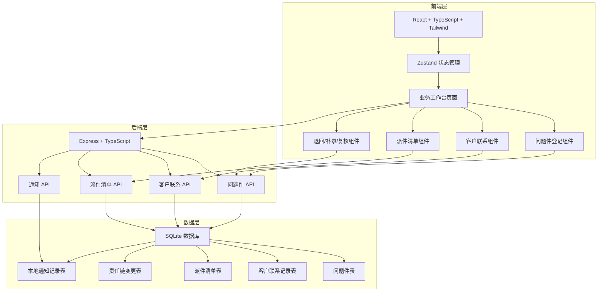
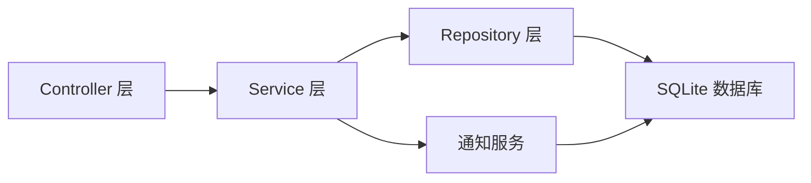
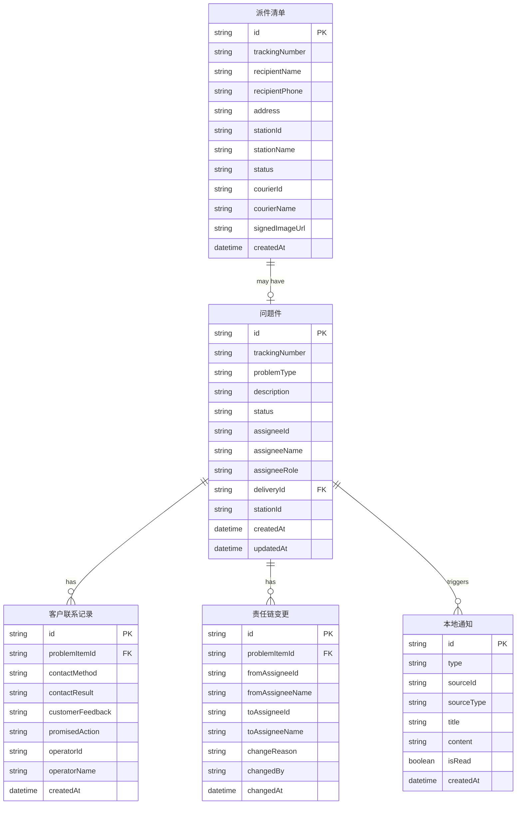

## 1. 架构设计



## 2. 技术说明

- **前端**：React@18 + TypeScript + Tailwind CSS@3 + Vite
- **初始化工具**：vite-init（react-express-ts 模板）
- **状态管理**：Zustand
- **后端**：Express@4 + TypeScript（ESM 格式）
- **数据库**：SQLite（better-sqlite3），业务数据持久化
- **通知机制**：本地通知记录表（无外部通知渠道时用数据库记录体现触发结果）
- **图标**：lucide-react

## 3. 路由定义

| 路由 | 用途 |
|------|------|
| / | 业务工作台主页（问题件列表 + 客户联系看板 + 异常提醒） |
| /problem/:id | 问题件登记详情页（含责任链面板、处理节奏时间线） |
| /contact/:id | 客户联系详情页（含联系回看、问题件感知区） |
| /delivery | 派件清单视图 |
| /return | 退回流程页 |
| /supplement | 补录登记页 |
| /review | 复核确认页 |

## 4. API 定义

### 4.1 问题件 API

```typescript
interface ProblemItem {
  id: string;
  trackingNumber: string;
  problemType: "破损" | "丢失" | "错分" | "超时" | "拒收" | "其他";
  description: string;
  status: "待处理" | "处理中" | "已联系" | "退回中" | "复核中" | "已完成";
  assigneeId: string;
  assigneeName: string;
  assigneeRole: "网点客服" | "派件员" | "驿站负责人";
  deliveryId: string;
  stationId: string;
  createdAt: string;
  updatedAt: string;
}

interface ResponsibilityChange {
  id: string;
  problemItemId: string;
  fromAssigneeId: string;
  fromAssigneeName: string;
  toAssigneeId: string;
  toAssigneeName: string;
  changeReason: string;
  changedBy: string;
  changedAt: string;
}

// GET /api/problems - 获取问题件列表（支持状态/类型/责任人筛选）
// GET /api/problems/:id - 获取问题件详情（含责任链）
// POST /api/problems - 创建问题件登记
// PUT /api/problems/:id - 修改问题件（触发客户联系感知）
// PUT /api/problems/:id/assignee - 变更责任人（记录变更说明）
// POST /api/problems/:id/return - 发起退回
// POST /api/problems/:id/supplement - 补录
// POST /api/problems/:id/review - 提交复核
```

### 4.2 客户联系 API

```typescript
interface ContactRecord {
  id: string;
  problemItemId: string;
  contactMethod: "电话" | "短信" | "微信" | "现场";
  contactResult: "已确认" | "要求退回" | "需补录" | "联系不上" | "客户拒收";
  customerFeedback: string;
  promisedAction: string;
  operatorId: string;
  operatorName: string;
  createdAt: string;
}

// GET /api/contacts - 获取客户联系列表（关联问题件）
// GET /api/contacts/:id - 获取联系详情（含问题件变更感知）
// POST /api/contacts - 创建联系记录
// GET /api/contacts/by-problem/:problemId - 按问题件获取联系历史
```

### 4.3 派件清单 API

```typescript
interface DeliveryItem {
  id: string;
  trackingNumber: string;
  recipientName: string;
  recipientPhone: string;
  address: string;
  stationId: string;
  stationName: string;
  status: "待派送" | "派送中" | "已签收" | "问题件" | "已退回";
  courierId: string;
  courierName: string;
  signedImageUrl: string | null;
  createdAt: string;
}

// GET /api/deliveries - 获取派件清单
// GET /api/deliveries/:id - 获取派件详情
// PUT /api/deliveries/:id/status - 更新派件状态
```

### 4.4 通知 API

```typescript
interface LocalNotification {
  id: string;
  type: "登记变更" | "超时未联系" | "退回预警" | "责任变更" | "复核待确认";
  sourceId: string;
  sourceType: "problem" | "contact";
  title: string;
  content: string;
  isRead: boolean;
  createdAt: string;
}

// GET /api/notifications - 获取通知列表
// PUT /api/notifications/:id/read - 标记已读
// POST /api/notifications - 创建通知（内部调用）
```

## 5. 服务端架构图



## 6. 数据模型

### 6.1 数据模型定义



### 6.2 数据定义语言

```sql
CREATE TABLE problems (
  id TEXT PRIMARY KEY,
  tracking_number TEXT NOT NULL,
  problem_type TEXT NOT NULL CHECK(problem_type IN ('破损','丢失','错分','超时','拒收','其他')),
  description TEXT NOT NULL,
  status TEXT NOT NULL DEFAULT '待处理' CHECK(status IN ('待处理','处理中','已联系','退回中','复核中','已完成')),
  assignee_id TEXT NOT NULL,
  assignee_name TEXT NOT NULL,
  assignee_role TEXT NOT NULL CHECK(assignee_role IN ('网点客服','派件员','驿站负责人')),
  delivery_id TEXT,
  station_id TEXT,
  created_at TEXT NOT NULL DEFAULT (datetime('now')),
  updated_at TEXT NOT NULL DEFAULT (datetime('now'))
);

CREATE TABLE contact_records (
  id TEXT PRIMARY KEY,
  problem_item_id TEXT NOT NULL REFERENCES problems(id),
  contact_method TEXT NOT NULL CHECK(contact_method IN ('电话','短信','微信','现场')),
  contact_result TEXT NOT NULL CHECK(contact_result IN ('已确认','要求退回','需补录','联系不上','客户拒收')),
  customer_feedback TEXT,
  promised_action TEXT,
  operator_id TEXT NOT NULL,
  operator_name TEXT NOT NULL,
  created_at TEXT NOT NULL DEFAULT (datetime('now'))
);

CREATE TABLE deliveries (
  id TEXT PRIMARY KEY,
  tracking_number TEXT NOT NULL,
  recipient_name TEXT NOT NULL,
  recipient_phone TEXT NOT NULL,
  address TEXT NOT NULL,
  station_id TEXT NOT NULL,
  station_name TEXT NOT NULL,
  status TEXT NOT NULL DEFAULT '待派送' CHECK(status IN ('待派送','派送中','已签收','问题件','已退回')),
  courier_id TEXT NOT NULL,
  courier_name TEXT NOT NULL,
  signed_image_url TEXT,
  created_at TEXT NOT NULL DEFAULT (datetime('now'))
);

CREATE TABLE responsibility_changes (
  id TEXT PRIMARY KEY,
  problem_item_id TEXT NOT NULL REFERENCES problems(id),
  from_assignee_id TEXT NOT NULL,
  from_assignee_name TEXT NOT NULL,
  to_assignee_id TEXT NOT NULL,
  to_assignee_name TEXT NOT NULL,
  change_reason TEXT NOT NULL,
  changed_by TEXT NOT NULL,
  changed_at TEXT NOT NULL DEFAULT (datetime('now'))
);

CREATE TABLE local_notifications (
  id TEXT PRIMARY KEY,
  type TEXT NOT NULL CHECK(type IN ('登记变更','超时未联系','退回预警','责任变更','复核待确认')),
  source_id TEXT NOT NULL,
  source_type TEXT NOT NULL CHECK(source_type IN ('problem','contact')),
  title TEXT NOT NULL,
  content TEXT NOT NULL,
  is_read INTEGER NOT NULL DEFAULT 0,
  created_at TEXT NOT NULL DEFAULT (datetime('now'))
);

CREATE INDEX idx_problems_status ON problems(status);
CREATE INDEX idx_problems_assignee ON problems(assignee_id);
CREATE INDEX idx_contact_records_problem ON contact_records(problem_item_id);
CREATE INDEX idx_deliveries_status ON deliveries(status);
CREATE INDEX idx_notifications_read ON local_notifications(is_read);
CREATE INDEX idx_notifications_type ON local_notifications(type);
```
