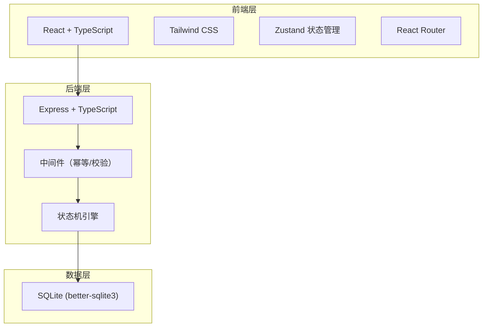
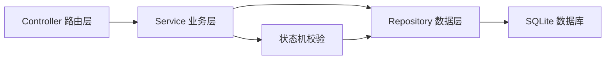
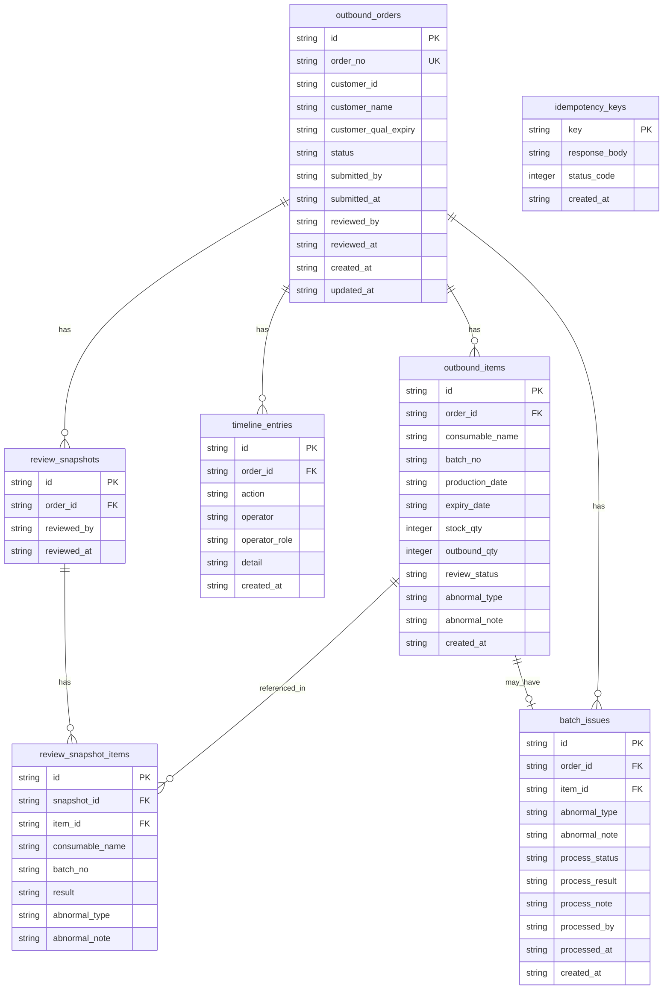

## 1. 架构设计



## 2. 技术说明

- 前端：React@18 + Tailwind CSS@3 + Vite + Zustand
- 初始化工具：vite-init（react-express-ts 模板）
- 后端：Express@4 + TypeScript (ESM)
- 数据库：SQLite (better-sqlite3)，无需外部服务

## 3. 路由定义

| 路由 | 用途 |
|------|------|
| `/` | 出库单列表页（默认页） |
| `/outbound/:id` | 出库单详情页 |
| `/outbound/:id/review` | 出库复核页 |
| `/outbound/:id/replay` | 出库复核回看页 |
| `/batch-issues` | 批号异常工单列表页 |
| `/batch-issues/:id` | 批号处理页 |

## 4. API 定义

### 4.1 出库单相关

```typescript
interface OutboundOrder {
  id: string;
  orderNo: string;
  customerId: string;
  customerName: string;
  customerQualExpiry: string;
  status: OutboundStatus;
  submittedBy: string;
  submittedAt: string | null;
  reviewedBy: string | null;
  reviewedAt: string | null;
  createdAt: string;
  updatedAt: string;
}

type OutboundStatus = 
  | "pending_submit"
  | "pending_review"
  | "reviewing"
  | "completed"
  | "has_issue"
  | "closed";

// POST /api/outbound-orders
// 幂等提交：若 orderNo 已存在则返回 200 + 已有记录
interface CreateOutboundOrderRequest {
  orderNo: string;
  customerId: string;
  customerName: string;
  customerQualExpiry: string;
  items: CreateOutboundItem[];
  idempotencyKey: string;
}

interface CreateOutboundItem {
  consumableName: string;
  batchNo: string;
  productionDate: string;
  expiryDate: string;
  stockQty: number;
  outboundQty: number;
}

// GET /api/outbound-orders
interface ListOutboundOrdersResponse {
  total: number;
  items: OutboundOrder[];
}

// GET /api/outbound-orders/:id
interface OutboundOrderDetailResponse {
  order: OutboundOrder;
  items: OutboundItem[];
  timeline: TimelineEntry[];
  reviewSnapshots: ReviewSnapshot[];
}

// PUT /api/outbound-orders/:id/submit
interface SubmitOutboundOrderRequest {
  submittedBy: string;
  idempotencyKey: string;
}

// PUT /api/outbound-orders/:id/review
interface ReviewOutboundOrderRequest {
  reviewedBy: string;
  reviewItems: ReviewItemInput[];
  idempotencyKey: string;
}

interface ReviewItemInput {
  itemId: string;
  result: "normal" | "abnormal";
  abnormalType?: "batch_error" | "near_expiry" | "expired" | "qual_expired";
  abnormalNote?: string;
}
```

### 4.2 耗材批号项

```typescript
interface OutboundItem {
  id: string;
  orderId: string;
  consumableName: string;
  batchNo: string;
  productionDate: string;
  expiryDate: string;
  stockQty: number;
  outboundQty: number;
  reviewStatus: "pending" | "normal" | "abnormal";
  abnormalType: string | null;
  abnormalNote: string | null;
  createdAt: string;
}

// PUT /api/outbound-items/:id/process
interface ProcessBatchIssueRequest {
  processedBy: string;
  processResult: "exchange" | "return" | "special_approval";
  processNote: string;
  newBatchNo?: string;
  newExpiryDate?: string;
  idempotencyKey: string;
}
```

### 4.3 时间线与复核快照

```typescript
interface TimelineEntry {
  id: string;
  orderId: string;
  action: string;
  operator: string;
  operatorRole: string;
  detail: string;
  createdAt: string;
}

interface ReviewSnapshot {
  id: string;
  orderId: string;
  reviewedBy: string;
  reviewAt: string;
  items: ReviewSnapshotItem[];
}

interface ReviewSnapshotItem {
  itemId: string;
  consumableName: string;
  batchNo: string;
  result: "normal" | "abnormal";
  abnormalType: string | null;
  abnormalNote: string | null;
}
```

### 4.4 批号异常工单

```typescript
interface BatchIssue {
  id: string;
  orderId: string;
  orderNo: string;
  itemId: string;
  consumableName: string;
  batchNo: string;
  abnormalType: "batch_error" | "near_expiry" | "expired" | "qual_expired";
  abnormalNote: string;
  processStatus: "pending" | "processed";
  processResult: "exchange" | "return" | "special_approval" | null;
  processNote: string | null;
  processedBy: string | null;
  processedAt: string | null;
  createdAt: string;
}

// GET /api/batch-issues
interface ListBatchIssuesResponse {
  total: number;
  items: BatchIssue[];
}

// GET /api/batch-issues/:id
// 返回 BatchIssue + 关联的出库单信息 + 时间线
```

## 5. 服务器架构图



## 6. 数据模型

### 6.1 数据模型定义



### 6.2 数据定义语言

```sql
CREATE TABLE outbound_orders (
  id TEXT PRIMARY KEY,
  order_no TEXT UNIQUE NOT NULL,
  customer_id TEXT NOT NULL,
  customer_name TEXT NOT NULL,
  customer_qual_expiry TEXT NOT NULL,
  status TEXT NOT NULL DEFAULT 'pending_submit',
  submitted_by TEXT,
  submitted_at TEXT,
  reviewed_by TEXT,
  reviewed_at TEXT,
  created_at TEXT NOT NULL DEFAULT (datetime('now')),
  updated_at TEXT NOT NULL DEFAULT (datetime('now'))
);

CREATE TABLE outbound_items (
  id TEXT PRIMARY KEY,
  order_id TEXT NOT NULL REFERENCES outbound_orders(id),
  consumable_name TEXT NOT NULL,
  batch_no TEXT NOT NULL,
  production_date TEXT NOT NULL,
  expiry_date TEXT NOT NULL,
  stock_qty INTEGER NOT NULL,
  outbound_qty INTEGER NOT NULL,
  review_status TEXT NOT NULL DEFAULT 'pending',
  abnormal_type TEXT,
  abnormal_note TEXT,
  created_at TEXT NOT NULL DEFAULT (datetime('now'))
);

CREATE TABLE timeline_entries (
  id TEXT PRIMARY KEY,
  order_id TEXT NOT NULL REFERENCES outbound_orders(id),
  action TEXT NOT NULL,
  operator TEXT NOT NULL,
  operator_role TEXT NOT NULL,
  detail TEXT NOT NULL,
  created_at TEXT NOT NULL DEFAULT (datetime('now'))
);

CREATE TABLE review_snapshots (
  id TEXT PRIMARY KEY,
  order_id TEXT NOT NULL REFERENCES outbound_orders(id),
  reviewed_by TEXT NOT NULL,
  reviewed_at TEXT NOT NULL DEFAULT (datetime('now'))
);

CREATE TABLE review_snapshot_items (
  id TEXT PRIMARY KEY,
  snapshot_id TEXT NOT NULL REFERENCES review_snapshots(id),
  item_id TEXT NOT NULL REFERENCES outbound_items(id),
  consumable_name TEXT NOT NULL,
  batch_no TEXT NOT NULL,
  result TEXT NOT NULL,
  abnormal_type TEXT,
  abnormal_note TEXT
);

CREATE TABLE batch_issues (
  id TEXT PRIMARY KEY,
  order_id TEXT NOT NULL REFERENCES outbound_orders(id),
  item_id TEXT NOT NULL REFERENCES outbound_items(id),
  abnormal_type TEXT NOT NULL,
  abnormal_note TEXT NOT NULL,
  process_status TEXT NOT NULL DEFAULT 'pending',
  process_result TEXT,
  process_note TEXT,
  processed_by TEXT,
  processed_at TEXT,
  created_at TEXT NOT NULL DEFAULT (datetime('now'))
);

CREATE TABLE idempotency_keys (
  key TEXT PRIMARY KEY,
  response_body TEXT NOT NULL,
  status_code INTEGER NOT NULL,
  created_at TEXT NOT NULL DEFAULT (datetime('now'))
);

CREATE INDEX idx_outbound_orders_status ON outbound_orders(status);
CREATE INDEX idx_outbound_items_order_id ON outbound_items(order_id);
CREATE INDEX idx_timeline_entries_order_id ON timeline_entries(order_id);
CREATE INDEX idx_review_snapshots_order_id ON review_snapshots(order_id);
CREATE INDEX idx_batch_issues_process_status ON batch_issues(process_status);
CREATE INDEX idx_batch_issues_order_id ON batch_issues(order_id);
```

## 7. 状态机约束

```
出库单状态流转：
  pending_submit ──(提交)──→ pending_review
  pending_review ──(开始复核)──→ reviewing
  reviewing ──(全部正常)──→ completed
  reviewing ──(发现异常)──→ has_issue
  has_issue ──(异常全部处理-退货)──→ closed
  has_issue ──(异常全部处理-换货)──→ pending_review
  has_issue ──(特批放行)──→ completed

耗材批号项状态：
  pending ──(复核正常)──→ normal
  pending ──(复核异常)──→ abnormal
  abnormal ──(换货)──→ pending (新批号)
  abnormal ──(退货/特批)──→ 终态
```
