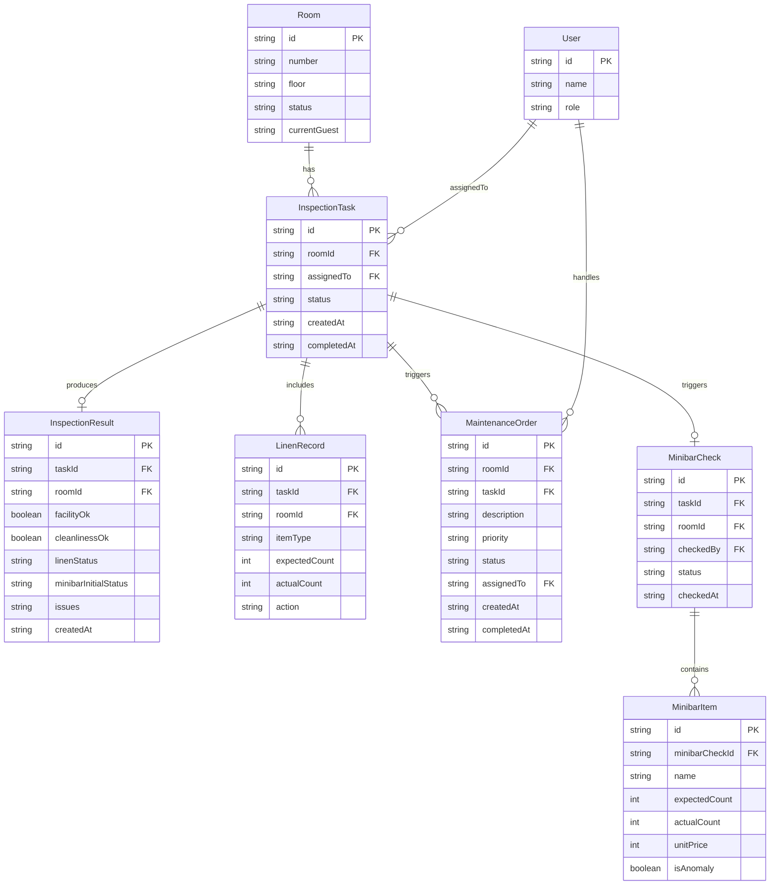

## 1. 架构设计

纯前端单页应用，数据持久化依赖 localStorage，无需后端服务。三角色通过前端路由隔离工作台，共享同一数据层。

```mermaid
flowchart TD
    "浏览器" --> "React SPA"
    "React SPA" --> "React Router(路由层)"
    "React SPA" --> "Zustand Store(状态层)"
    "Zustand Store(状态层)" --> "localStorage Adapter(持久化层)"
    "Zustand Store(状态层)" --> "Mock Data(模拟数据层)"
    "React Router(路由层)" --> "主管工作台"
    "React Router(路由层)" --> "保洁员工作台"
    "React Router(路由层)" --> "工程师工作台"
```

## 2. 技术说明

- 前端：React@18 + TypeScript + TailwindCSS@3 + Vite
- 初始化工具：vite-init (react-ts 模板)
- 后端：无(纯前端，mock 数据)
- 数据库：localStorage(持久化) + 内存(Zustand 状态)
- 状态管理：Zustand，配合 persist 中间件实现 localStorage 持久化
- 图标：lucide-react

## 3. 路由定义

| 路由 | 用途 |
|------|------|
| / | 角色选择页 |
| /supervisor | 主管工作台(房态看板+任务分配+异常审核) |
| /supervisor/room/:roomId | 主管查看房间详情 |
| /supervisor/minibar-review | 主管迷你吧异常审核 |
| /supervisor/handover | 主管交接总览 |
| /attendant | 保洁员工作台(待查房列表) |
| /attendant/inspect/:taskId | 退房查房表单 |
| /attendant/minibar/:taskId | 迷你吧核对 |
| /attendant/minibar-history | 迷你吧核对历史回看 |
| /engineer | 工程师工作台(维修单列表) |
| /engineer/order/:orderId | 维修单详情 |

## 4. API定义

无后端API。所有数据通过 Zustand Store + localStorage 在前端本地管理。

数据操作接口(Store Actions)：
- `assignTask(taskId, attendantId)` - 主管分配查房任务
- `startInspection(taskId)` - 保洁员开始查房
- `completeInspection(taskId, result)` - 完成查房，自动触发迷你吧核对
- `submitMinibarCheck(taskId, items)` - 提交迷你吧核对
- `createMaintenanceOrder(roomId, issue)` - 自动生成维修单
- `updateMaintenanceOrder(orderId, status)` - 工程师更新维修状态
- `reviewMinibarAnomaly(anomalyId, action)` - 主管审核异常

## 5. 服务端架构图

不涉及

## 6. 数据模型

### 6.1 数据模型定义



### 6.2 数据定义

使用 TypeScript 类型定义存储于 `src/types/index.ts`，localStorage 以 JSON 序列化存储，Zustand persist 中间件自动处理序列化/反序列化。初始模拟数据包含：
- 30间客房(3层×10间)
- 6名用户(主管2/保洁员3/工程师1)
- 若干预置查房任务、维修单和迷你吧消费品清单
