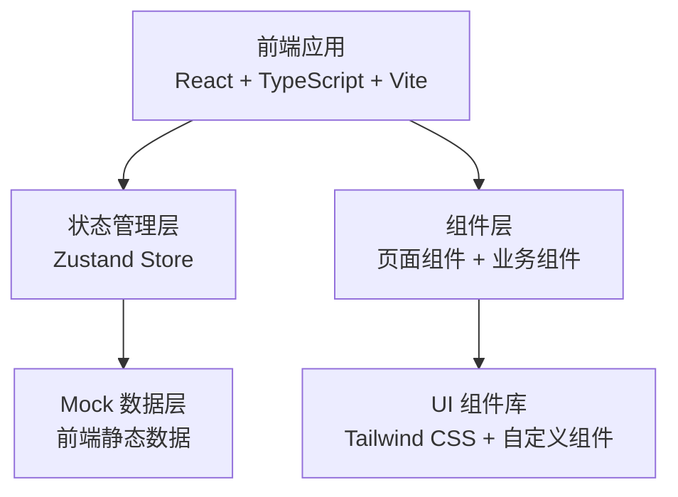
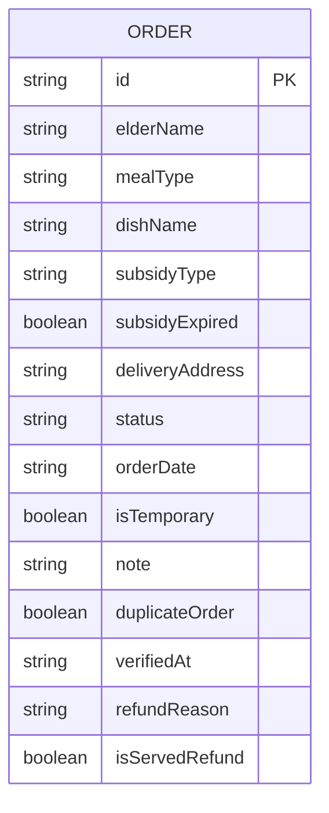

## 1. 架构设计



纯前端架构，所有数据通过 Mock 层提供，无后端依赖。

## 2. 技术说明

- **前端**：React@18 + TypeScript + Tailwind CSS@3 + Vite
- **初始化工具**：vite-init（react-ts 模板）
- **状态管理**：Zustand
- **路由**：react-router-dom（单页应用，暂仅主页面路由）
- **图标**：lucide-react
- **后端**：无（纯前端原型）
- **数据**：前端 Mock 数据，模拟真实业务场景

## 3. 路由定义

| 路由 | 用途 |
|------|------|
| / | 订餐管理主页（默认展示今天的订单） |

## 4. API 定义

无后端 API，所有数据通过 Zustand Store 管理，Mock 数据直接嵌入前端。

### 数据类型定义

```typescript
interface Order {
  id: string
  elderName: string
  mealType: 'breakfast' | 'lunch' | 'dinner'
  dishName: string
  subsidyType: 'low_income' | 'disabled' | 'over80' | 'veteran' | 'none'
  subsidyExpired: boolean
  deliveryAddress: string
  status: 'pending' | 'served' | 'verified' | 'cancelled' | 'refund_requested'
  orderDate: string
  isTemporary: boolean
  note: string
  duplicateOrder: boolean
  verifiedAt: string | null
  refundReason: string | null
  isServedRefund: boolean
}

type ViewMode = 'today' | 'tomorrow' | 'abnormal'
```

## 5. 服务器架构图

无后端服务器

## 6. 数据模型

### 6.1 数据模型定义



### 6.2 Mock 数据场景

| 场景 | 描述 | 数据示例 |
|------|------|----------|
| 正常订餐 | 资格有效、待核销 | 王淑芬 午餐 低保补贴 未核销 |
| 重复订餐 | 同一人同一天同餐类多笔 | 李建国 午餐出现2条 |
| 资格过期 | 补贴资格已过期但仍订餐 | 张秀英 残疾补贴已过期 |
| 已出餐退餐 | 家属来退但餐已出 | 赵德明 已出餐 家属要求退餐 |
| 临时加餐 | 非常规订餐登记 | 陈桂花 临时加餐晚餐 |
| 已核销 | 正常完成核销 | 刘福全 已核销 |
