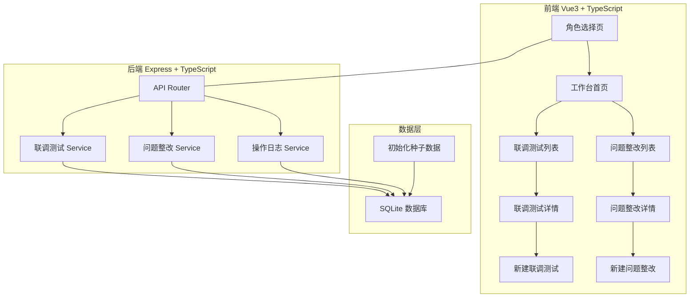
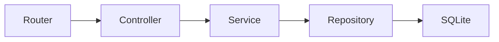
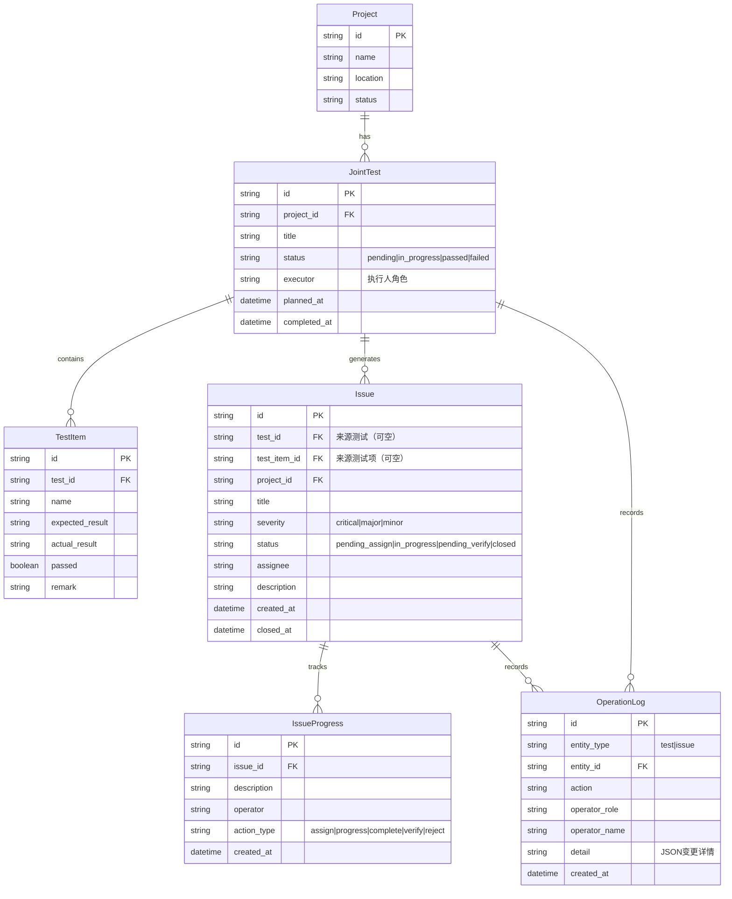

## 1. 架构设计



## 2. 技术说明

- 前端：Vue 3 + TypeScript + Vue Router + Tailwind CSS
- 初始化工具：vite-init（vue-express-ts 模板）
- 后端：Express 4 + TypeScript（ESM 格式）
- 数据库：SQLite（better-sqlite3），单文件存储，方便数据重置
- 图标：lucide-vue-next

## 3. 路由定义

| 路由 | 用途 |
|------|------|
| `/` | 角色选择页，选择身份后进入工作台 |
| `/dashboard` | 工作台首页，按角色展示待办和动态 |
| `/tests` | 联调测试列表页，支持筛选 |
| `/tests/:id` | 联调测试详情页，含操作历史时间线 |
| `/tests/new` | 新建联调测试页 |
| `/issues` | 问题整改列表页，支持筛选 |
| `/issues/:id` | 问题整改详情页，含操作历史时间线 |
| `/issues/new` | 新建问题整改页 |

## 4. API 定义

### 4.1 角色与认证（模拟）

```typescript
// 角色切换（模拟，无真实认证）
POST /api/role
  Request: { role: "pm" | "captain" | "engineer" }
  Response: { role: string, name: string, permissions: string[] }

GET /api/role
  Response: { role: string, name: string }
```

### 4.2 联调测试

```typescript
GET /api/tests?status=&project=&date_from=&date_to=
  Response: TestListItem[]

GET /api/tests/:id
  Response: TestDetail

POST /api/tests
  Request: CreateTestRequest
  Response: TestDetail

PUT /api/tests/:id/execute
  Request: { testItemId: string, passed: boolean, remark: string }
  Response: TestDetail

PUT /api/tests/:id/complete
  Request: { }
  Response: TestDetail

POST /api/tests/:id/convert-to-issue
  Request: { failedItemIds: string[] }
  Response: IssueDetail[]
```

### 4.3 问题整改

```typescript
GET /api/issues?status=&assignee=&severity=
  Response: IssueListItem[]

GET /api/issues/:id
  Response: IssueDetail

POST /api/issues
  Request: CreateIssueRequest
  Response: IssueDetail

PUT /api/issues/:id/assign
  Request: { assignee: string }
  Response: IssueDetail

PUT /api/issues/:id/progress
  Request: { description: string }
  Response: IssueDetail

PUT /api/issues/:id/complete
  Request: { }
  Response: IssueDetail

PUT /api/issues/:id/verify
  Request: { passed: boolean, remark: string }
  Response: IssueDetail
```

### 4.4 操作日志

```typescript
GET /api/logs?entity_type=test|issue&entity_id=
  Response: OperationLog[]
```

### 4.5 统计

```typescript
GET /api/stats
  Response: {
    pendingTests: number
    failedTests: number
    pendingIssues: number
    pendingVerifyIssues: number
    recentActivities: Activity[]
  }
```

## 5. 服务端架构图



## 6. 数据模型

### 6.1 数据模型定义



### 6.2 数据定义语言

```sql
CREATE TABLE projects (
  id TEXT PRIMARY KEY,
  name TEXT NOT NULL,
  location TEXT,
  status TEXT DEFAULT 'active'
);

CREATE TABLE joint_tests (
  id TEXT PRIMARY KEY,
  project_id TEXT NOT NULL REFERENCES projects(id),
  title TEXT NOT NULL,
  status TEXT NOT NULL DEFAULT 'pending',
  executor TEXT,
  planned_at TEXT,
  completed_at TEXT,
  created_at TEXT DEFAULT (datetime('now')),
  updated_at TEXT DEFAULT (datetime('now'))
);

CREATE TABLE test_items (
  id TEXT PRIMARY KEY,
  test_id TEXT NOT NULL REFERENCES joint_tests(id) ON DELETE CASCADE,
  name TEXT NOT NULL,
  expected_result TEXT,
  actual_result TEXT,
  passed INTEGER DEFAULT NULL,
  remark TEXT,
  sort_order INTEGER DEFAULT 0
);

CREATE TABLE issues (
  id TEXT PRIMARY KEY,
  test_id TEXT REFERENCES joint_tests(id),
  test_item_id TEXT REFERENCES test_items(id),
  project_id TEXT NOT NULL REFERENCES projects(id),
  title TEXT NOT NULL,
  severity TEXT NOT NULL DEFAULT 'major',
  status TEXT NOT NULL DEFAULT 'pending_assign',
  assignee TEXT,
  description TEXT,
  created_at TEXT DEFAULT (datetime('now')),
  updated_at TEXT DEFAULT (datetime('now')),
  closed_at TEXT
);

CREATE TABLE issue_progresses (
  id TEXT PRIMARY KEY,
  issue_id TEXT NOT NULL REFERENCES issues(id) ON DELETE CASCADE,
  description TEXT NOT NULL,
  operator TEXT NOT NULL,
  action_type TEXT NOT NULL,
  created_at TEXT DEFAULT (datetime('now'))
);

CREATE TABLE operation_logs (
  id TEXT PRIMARY KEY,
  entity_type TEXT NOT NULL,
  entity_id TEXT NOT NULL,
  action TEXT NOT NULL,
  operator_role TEXT NOT NULL,
  operator_name TEXT NOT NULL,
  detail TEXT,
  created_at TEXT DEFAULT (datetime('now'))
);

CREATE INDEX idx_joint_tests_project ON joint_tests(project_id);
CREATE INDEX idx_joint_tests_status ON joint_tests(status);
CREATE INDEX idx_test_items_test ON test_items(test_id);
CREATE INDEX idx_issues_test ON issues(test_id);
CREATE INDEX idx_issues_status ON issues(status);
CREATE INDEX idx_issues_assignee ON issues(assignee);
CREATE INDEX idx_issue_progresses_issue ON issue_progresses(issue_id);
CREATE INDEX idx_operation_logs_entity ON operation_logs(entity_type, entity_id);
```
