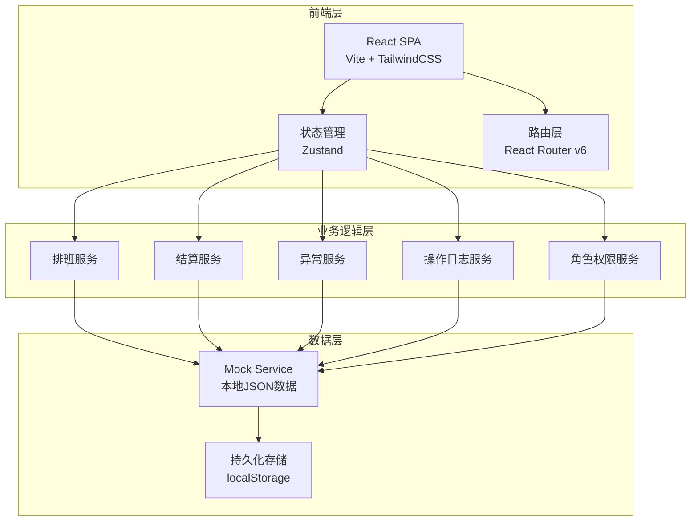
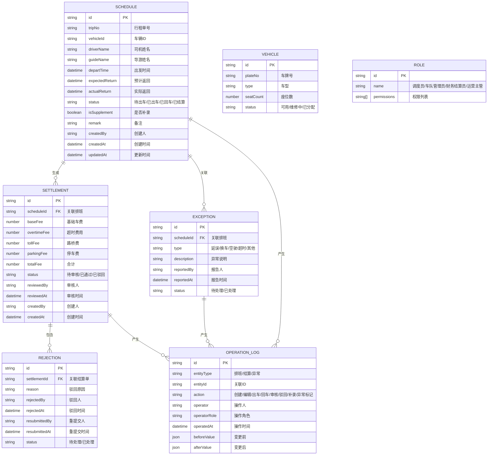

## 1. 架构设计

## 2. 技术说明

- **前端**：React@18 + TailwindCSS@3 + Vite
- **初始化工具**：Vite (react-ts template)
- **状态管理**：Zustand — 轻量、无样板代码、支持持久化中间件
- **路由**：React Router v6
- **后端**：无独立后端，使用 Zustand + localStorage 作为持久化方案
- **数据**：Mock数据，预置15条排班、8条结算、5条异常、30条操作日志
- **UI组件**：Ant Design 5.x — 适合数据密集型管理后台
- **日期处理**：dayjs
- **图标**：@ant-design/icons

## 3. 路由定义

| 路由 | 用途 | 权限 |
|------|------|------|
| / | 工作台首页：待办、风险项、最近变更 | 全角色 |
| /schedule | 车辆排班日历视图 | 调度员、车队管理员、运营主管 |
| /schedule/new | 新增排班 | 调度员 |
| /schedule/:id | 排班详情与状态流转 | 调度员、车队管理员 |
| /settlement | 用车结算列表 | 全角色 |
| /settlement/:id | 结算审核详情 | 财务结算员、运营主管 |
| /settlement/:id/reject | 驳回操作（弹窗交互，路由仅作状态记录） | 财务结算员 |
| /exception | 异常说明列表 | 全角色 |
| /exception/new | 新增异常录入 | 调度员、车队管理员 |
| /logs | 操作日志列表 | 运营主管 |

## 4. 数据模型

### 4.1 数据模型定义

### 4.2 数据定义

SCHEDULE 表状态枚举：`PENDING`（待出车）、`DEPARTED`（已出车）、`RETURNED`（已回车）、`SETTLED`（已结算）

SETTLEMENT 表状态枚举：`PENDING_REVIEW`（待审核）、`APPROVED`（已通过）、`REJECTED`（已驳回）

EXCEPTION 类型枚举：`DELAY`（延误）、`VEHICLE_CHANGE`（换车）、`EMPTY_TRIP`（空驶）、`OVERTIME`（超时）、`OTHER`（其他）

REJECTION 状态枚举：`PENDING`（待处理）、`RESOLVED`（已处理）

## 5. 状态管理架构

采用 Zustand 按领域分Store，所有Store共享角色状态：

- **useRoleStore**：当前角色、角色权限映射、切换角色
- **useScheduleStore**：排班CRUD、状态流转、补录标记
- **useSettlementStore**：结算CRUD、审核通过、驳回（创建REJECTION实体）、重提交
- **useExceptionStore**：异常CRUD、关联排班与结算
- **useLogStore**：日志记录、日志查询、变更对比
- **useDashboardStore**：派生数据（待办数、风险项、最近变更），从其他Store聚合计算

关键设计：
1. 每个Store的mutation方法内部自动调用 `useLogStore.addLog()` 记录操作日志
2. 驳回操作调用 `useSettlementStore.rejectSettlement()` 时，同时创建REJECTION记录和OPERATION_LOG记录
3. 补录排班调用 `useScheduleStore.createSupplementSchedule()` 时，`isSupplement` 标记为true并记录日志
4. 角色切换通过 `useRoleStore.switchRole()` 实现，切换后UI自动根据权限过滤操作按钮

## 6. 关键交互规则

1. **同一份数据原则**：排班、结算、异常、日志共享ID关联，任何页面查看同一排班ID看到的数据一致
2. **驳回是实体而非提示**：驳回创建REJECTION记录存入Store，调度员在待办和结算详情均可看到驳回历史
3. **补录有标记**：补录排班的 `isSupplement=true`，在排班列表和结算单中均有「补录」标签
4. **操作日志自动记录**：所有CRUD和状态流转自动写入日志，无需手动触发
5. **角色权限控制操作可见性**：按钮渲染前检查当前角色权限，无权限则不显示（不是禁用）
