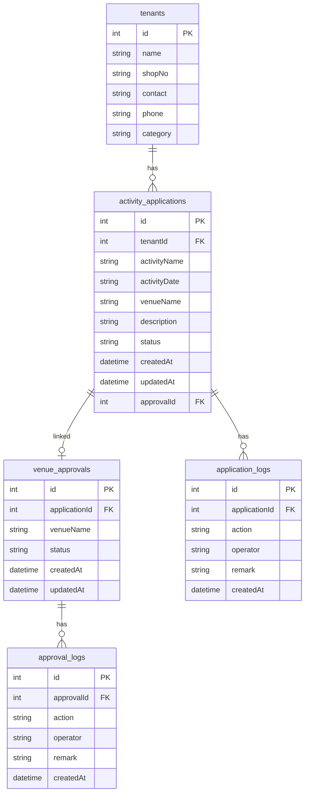

## 1. 架构设计

```mermaid
graph TB
    "Frontend" --> "Backend API"
    "Backend API" --> "SQLite Database"
    
    subgraph "Frontend"
        "活动申请列表页"
        "活动申请详情页"
        "场地审批列表页"
        "场地审批详情页"
    end
    
    subgraph "Backend API"
        "活动申请 API"
        "场地审批 API"
        "租户 API"
    end
    
    subgraph "SQLite Database"
        "tenants"
        "activity_applications"
        "venue_approvals"
        "application_logs"
        "approval_logs"
    end
```

## 2. 技术说明

- 前端：React@18 + TypeScript + Tailwind CSS@3 + Vite + Zustand + React Router DOM
- 初始化工具：vite-init（react-express-ts 模板）
- 后端：Express@4 + TypeScript (ESM)
- 数据库：SQLite（better-sqlite3），无需额外服务
- 状态管理：Zustand

## 3. 路由定义

| 路由 | 用途 |
|------|------|
| / | 首页仪表盘，显示待处理/待审批数量概览 |
| /applications | 活动申请列表页 |
| /applications/:id | 活动申请详情页 |
| /approvals | 场地审批列表页 |
| /approvals/:id | 场地审批详情页 |

## 4. API 定义

### 4.1 活动申请 API

| 方法 | 路径 | 说明 |
|------|------|------|
| GET | /api/applications | 获取活动申请列表（支持 status/tenant 筛选） |
| GET | /api/applications/:id | 获取活动申请详情（含流转日志） |
| POST | /api/applications | 创建活动申请（同时创建关联场地审批） |
| PUT | /api/applications/:id/process | 受理申请（状态：待处理→处理中） |
| PUT | /api/applications/:id/return | 退回申请（状态：处理中→已退回） |
| PUT | /api/applications/:id/supplement | 补充资料（状态：已退回→已补充） |
| PUT | /api/applications/:id/close | 关闭申请（状态→已关闭） |
| DELETE | /api/applications | 重置所有活动申请数据 |

### 4.2 场地审批 API

| 方法 | 路径 | 说明 |
|------|------|------|
| GET | /api/approvals | 获取场地审批列表（支持 status 筛选） |
| GET | /api/approvals/:id | 获取场地审批详情（含审批日志） |
| PUT | /api/approvals/:id/approve | 审批通过 |
| PUT | /api/approvals/:id/reject | 审批退回 |
| PUT | /api/approvals/:id/supplement | 补充审批意见后重新提交 |
| DELETE | /api/approvals | 重置所有场地审批数据 |

### 4.3 租户 API

| 方法 | 路径 | 说明 |
|------|------|------|
| GET | /api/tenants | 获取租户列表 |

### 4.4 数据类型定义

```typescript
type ApplicationStatus = 'pending' | 'processing' | 'returned' | 'supplemented' | 'closed';
type ApprovalStatus = 'pending' | 'approved' | 'rejected';

interface Tenant {
  id: number;
  name: string;
  shopNo: string;
  contact: string;
  phone: string;
  category: string;
}

interface ActivityApplication {
  id: number;
  tenantId: number;
  activityName: string;
  activityDate: string;
  venueId: number;
  venueName: string;
  description: string;
  status: ApplicationStatus;
  createdAt: string;
  updatedAt: string;
  approvalId: number | null;
}

interface VenueApproval {
  id: number;
  applicationId: number;
  venueName: string;
  status: ApprovalStatus;
  createdAt: string;
  updatedAt: string;
}

interface ApplicationLog {
  id: number;
  applicationId: number;
  action: 'created' | 'processed' | 'returned' | 'supplemented' | 'closed';
  operator: string;
  remark: string;
  createdAt: string;
}

interface ApprovalLog {
  id: number;
  approvalId: number;
  action: 'created' | 'approved' | 'rejected' | 'supplemented';
  operator: string;
  remark: string;
  createdAt: string;
}
```

## 5. 服务端架构图

```mermaid
graph LR
    "Router" --> "Controller"
    "Controller" --> "Service"
    "Service" --> "Repository"
    "Repository" --> "SQLite"
```

## 6. 数据模型

### 6.1 数据模型定义



### 6.2 数据定义语言

```sql
CREATE TABLE tenants (
  id INTEGER PRIMARY KEY AUTOINCREMENT,
  name TEXT NOT NULL,
  shopNo TEXT NOT NULL,
  contact TEXT NOT NULL,
  phone TEXT NOT NULL,
  category TEXT NOT NULL
);

CREATE TABLE activity_applications (
  id INTEGER PRIMARY KEY AUTOINCREMENT,
  tenantId INTEGER NOT NULL,
  activityName TEXT NOT NULL,
  activityDate TEXT NOT NULL,
  venueName TEXT NOT NULL,
  description TEXT DEFAULT '',
  status TEXT NOT NULL DEFAULT 'pending',
  createdAt TEXT NOT NULL DEFAULT (datetime('now', 'localtime')),
  updatedAt TEXT NOT NULL DEFAULT (datetime('now', 'localtime')),
  approvalId INTEGER,
  FOREIGN KEY (tenantId) REFERENCES tenants(id),
  FOREIGN KEY (approvalId) REFERENCES venue_approvals(id)
);

CREATE TABLE venue_approvals (
  id INTEGER PRIMARY KEY AUTOINCREMENT,
  applicationId INTEGER NOT NULL,
  venueName TEXT NOT NULL,
  status TEXT NOT NULL DEFAULT 'pending',
  createdAt TEXT NOT NULL DEFAULT (datetime('now', 'localtime')),
  updatedAt TEXT NOT NULL DEFAULT (datetime('now', 'localtime')),
  FOREIGN KEY (applicationId) REFERENCES activity_applications(id)
);

CREATE TABLE application_logs (
  id INTEGER PRIMARY KEY AUTOINCREMENT,
  applicationId INTEGER NOT NULL,
  action TEXT NOT NULL,
  operator TEXT NOT NULL,
  remark TEXT DEFAULT '',
  createdAt TEXT NOT NULL DEFAULT (datetime('now', 'localtime')),
  FOREIGN KEY (applicationId) REFERENCES activity_applications(id)
);

CREATE TABLE approval_logs (
  id INTEGER PRIMARY KEY AUTOINCREMENT,
  approvalId INTEGER NOT NULL,
  action TEXT NOT NULL,
  operator TEXT NOT NULL,
  remark TEXT DEFAULT '',
  createdAt TEXT NOT NULL DEFAULT (datetime('now', 'localtime')),
  FOREIGN KEY (approvalId) REFERENCES venue_approvals(id)
);

-- 种子数据：租户
INSERT INTO tenants (name, shopNo, contact, phone, category) VALUES
  ('锦绣服饰', 'A-101', '张经理', '138-0001-1001', '服装'),
  ('味千拉面', 'B-205', '李店长', '139-0002-2002', '餐饮'),
  ('星光数码', 'C-302', '王主管', '137-0003-3003', '电子'),
  ('花漾美妆', 'A-215', '赵店长', '136-0004-4004', '美妆'),
  ('童趣乐园', 'D-101', '刘经理', '135-0005-5005', '亲子'),
  ('悦动健身', 'E-201', '陈主管', '134-0006-6006', '运动'),
  ('书香阁', 'F-103', '周店长', '133-0007-7007', '书店');
```
