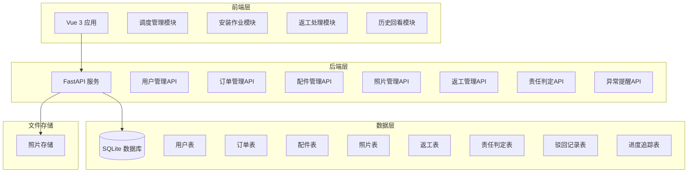
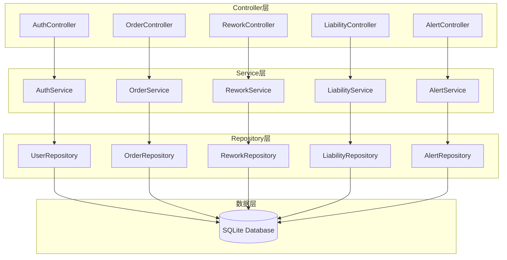
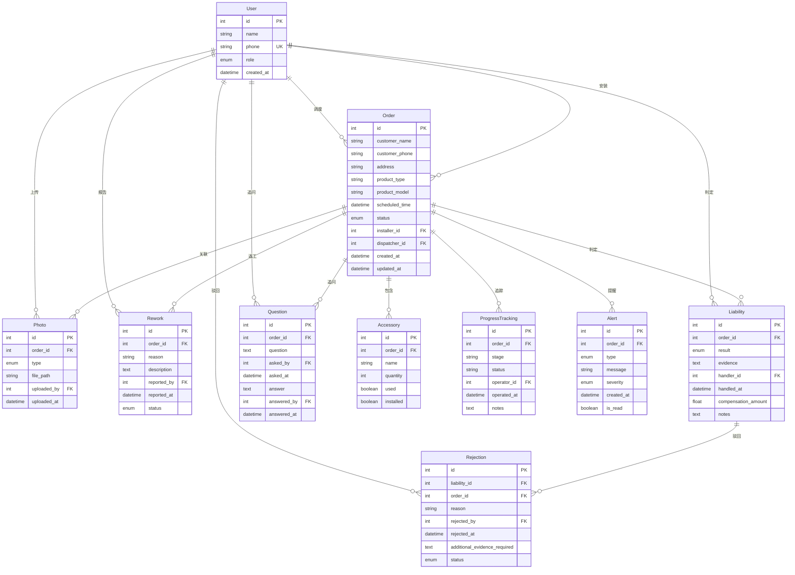

## 1. 架构设计



## 2. 技术说明

### 2.1 前端技术栈
- **框架**: Vue 3.3 + Composition API
- **构建工具**: Vite 5
- **UI组件库**: Element Plus 2.4
- **路由**: Vue Router 4.2
- **HTTP客户端**: Axios 1.6
- **状态管理**: Pinia 2.1
- **样式**: CSS Variables + Scoped CSS

### 2.2 后端技术栈
- **框架**: FastAPI 0.104
- **数据库**: SQLite 3 (开发环境) / PostgreSQL (生产环境)
- **ORM**: SQLAlchemy 2.0
- **数据验证**: Pydantic 2.0
- **文件处理**: Python内置文件操作
- **异步支持**: async/await

### 2.3 初始化工具
- 前端: `npm create vite@latest`
- 后端: 手动创建FastAPI项目结构

## 3. 路由定义

### 3.1 前端路由
| 路由 | 用途 | 权限 |
|------|------|------|
| `/login` | 用户登录页面 | 公开 |
| `/dispatch` | 调度管理主页 | 调度员 |
| `/dispatch/orders` | 订单管理 | 调度员 |
| `/dispatch/assign` | 师傅分配 | 调度员 |
| `/dispatch/alerts` | 异常提醒 | 调度员 |
| `/installer` | 安装师傅主页 | 安装师傅 |
| `/installer/tasks` | 待办任务 | 安装师傅 |
| `/installer/task/:id` | 任务详情 | 安装师傅 |
| `/installer/rework/:id` | 返工处理 | 安装师傅 |
| `/service` | 售后客服主页 | 售后客服 |
| `/service/rework` | 返工申请 | 售后客服 |
| `/service/liability` | 责任判定 | 售后客服 |
| `/history` | 历史回看 | 所有角色 |
| `/history/order/:id` | 订单详情 | 所有角色 |

### 3.2 后端API路由
| 路由 | 方法 | 用途 |
|------|------|------|
| `/api/auth/login` | POST | 用户登录 |
| `/api/users` | GET | 获取用户列表 |
| `/api/users/:id` | GET | 获取用户详情 |
| `/api/orders` | GET, POST | 订单列表、创建订单 |
| `/api/orders/:id` | GET | 获取订单详情 |
| `/api/orders/:id/assign` | PUT | 分配师傅 |
| `/api/orders/:id/start` | PUT | 开始安装 |
| `/api/orders/:id/complete` | PUT | 完成安装 |
| `/api/orders/:id/accessories` | GET, POST | 配件列表、添加配件 |
| `/api/accessories/:id/install` | PUT | 标记配件已安装 |
| `/api/orders/:id/photos` | GET, POST | 照片列表、上传照片 |
| `/api/orders/:id/rework` | GET, POST | 返工记录、发起返工 |
| `/api/reworks/:id/accept` | PUT | 接受返工 |
| `/api/reworks/:id/complete` | PUT | 完成返工 |
| `/api/orders/:id/liability` | GET, POST | 责任判定、创建判定 |
| `/api/liability/:id/reject` | POST | 驳回补录 |
| `/api/alerts` | GET | 获取异常提醒 |
| `/api/progress/:id` | GET | 获取订单进度追踪 |
| `/api/progress/:id/question` | POST | 主管追问进度 |

## 4. API定义

### 4.1 数据类型定义

```typescript
// 用户相关
interface User {
  id: number;
  name: string;
  phone: string;
  role: 'DISPATCHER' | 'INSTALLER' | 'SERVICE';
  created_at: string;
}

// 订单状态
type OrderStatus = 
  | 'PENDING'        // 待分配
  | 'ASSIGNED'       // 已分配
  | 'IN_PROGRESS'    // 安装中
  | 'COMPLETED'      // 已完成
  | 'REWORK_REQUESTED'    // 待返工
  | 'REWORK_IN_PROGRESS'  // 返工中
  | 'REWORK_COMPLETED'    // 返工完成
  | 'LIABILITY_PENDING'   // 待责任判定
  | 'LIABILITY_DONE';     // 责任已判定

// 责任判定结果
type LiabilityResult = 
  | 'INSTALLER'  // 安装师傅责任
  | 'MATERIAL'   // 材料质量问题
  | 'USER'       // 用户使用不当
  | 'UNKNOWN';   // 原因待查

// 照片类型
type PhotoType = 
  | 'BEFORE'    // 安装前
  | 'DURING'    // 安装中
  | 'AFTER'     // 安装后
  | 'LEAKAGE';  // 漏水现场

// 订单
interface Order {
  id: number;
  customer_name: string;
  customer_phone: string;
  address: string;
  product_type: string;
  product_model: string;
  scheduled_time: string;
  status: OrderStatus;
  installer_id?: number;
  dispatcher_id?: number;
  created_at: string;
  updated_at: string;
}

// 配件
interface Accessory {
  id: number;
  order_id: number;
  name: string;
  quantity: number;
  used: boolean;
  installed: boolean;
}

// 照片
interface Photo {
  id: number;
  order_id: number;
  type: PhotoType;
  file_path: string;
  uploaded_by: number;
  uploaded_at: string;
}

// 返工记录
interface Rework {
  id: number;
  order_id: number;
  reason: string;
  description: string;
  reported_by: number;
  reported_at: string;
  status: OrderStatus;
}

// 责任判定
interface Liability {
  id: number;
  order_id: number;
  result: LiabilityResult;
  evidence: string;
  handler_id: number;
  handled_at: string;
  compensation_amount: number;
  notes: string;
}

// 驳回记录（新增）
interface Rejection {
  id: number;
  liability_id: number;
  order_id: number;
  reason: string;
  rejected_by: number;
  rejected_at: string;
  additional_evidence_required: string[];
  status: 'PENDING' | 'RESOLVED';
}

// 进度追踪（新增）
interface ProgressTracking {
  id: number;
  order_id: number;
  stage: string;
  status: string;
  operator_id: number;
  operated_at: string;
  notes: string;
}

// 异常提醒（新增）
interface Alert {
  id: number;
  type: 'LEAKAGE' | 'TIMEOUT' | 'REJECTION' | 'PENDING_LIABILITY';
  order_id: number;
  message: string;
  severity: 'HIGH' | 'MEDIUM' | 'LOW';
  created_at: string;
  is_read: boolean;
}

// 主管追问（新增）
interface Question {
  id: number;
  order_id: number;
  question: string;
  asked_by: number;
  asked_at: string;
  answer?: string;
  answered_by?: number;
  answered_at?: string;
}
```

### 4.2 请求/响应模式

```typescript
// 登录请求
interface LoginRequest {
  phone: string;
  password?: string;
}

// 登录响应
interface LoginResponse {
  user: User;
  token: string;
}

// 创建订单请求
interface CreateOrderRequest {
  customer_name: string;
  customer_phone: string;
  address: string;
  product_type: string;
  product_model: string;
  scheduled_time: string;
}

// 发起返工请求
interface CreateReworkRequest {
  reason: string;
  description: string;
}

// 责任判定请求
interface CreateLiabilityRequest {
  result: LiabilityResult;
  evidence: string;
  compensation_amount: number;
  notes: string;
}

// 驳回补录请求
interface RejectLiabilityRequest {
  reason: string;
  additional_evidence_required: string[];
}

// 主管追问请求
interface AskQuestionRequest {
  question: string;
}

// 回答追问请求
interface AnswerQuestionRequest {
  answer: string;
}
```

## 5. 服务器架构图



## 6. 数据模型

### 6.1 数据模型定义



### 6.2 数据定义语言

```sql
-- 用户表
CREATE TABLE users (
    id INTEGER PRIMARY KEY AUTOINCREMENT,
    name VARCHAR(100) NOT NULL,
    phone VARCHAR(20) UNIQUE NOT NULL,
    role VARCHAR(20) NOT NULL CHECK(role IN ('DISPATCHER', 'INSTALLER', 'SERVICE')),
    created_at DATETIME DEFAULT CURRENT_TIMESTAMP
);

-- 订单表
CREATE TABLE orders (
    id INTEGER PRIMARY KEY AUTOINCREMENT,
    customer_name VARCHAR(100) NOT NULL,
    customer_phone VARCHAR(20) NOT NULL,
    address TEXT NOT NULL,
    product_type VARCHAR(100) NOT NULL,
    product_model VARCHAR(100) NOT NULL,
    scheduled_time DATETIME NOT NULL,
    status VARCHAR(30) DEFAULT 'PENDING' CHECK(status IN (
        'PENDING', 'ASSIGNED', 'IN_PROGRESS', 'COMPLETED',
        'REWORK_REQUESTED', 'REWORK_IN_PROGRESS', 'REWORK_COMPLETED',
        'LIABILITY_PENDING', 'LIABILITY_DONE'
    )),
    installer_id INTEGER REFERENCES users(id),
    dispatcher_id INTEGER REFERENCES users(id),
    created_at DATETIME DEFAULT CURRENT_TIMESTAMP,
    updated_at DATETIME DEFAULT CURRENT_TIMESTAMP
);

-- 配件表
CREATE TABLE accessories (
    id INTEGER PRIMARY KEY AUTOINCREMENT,
    order_id INTEGER NOT NULL REFERENCES orders(id),
    name VARCHAR(100) NOT NULL,
    quantity INTEGER DEFAULT 1,
    used BOOLEAN DEFAULT FALSE,
    installed BOOLEAN DEFAULT FALSE
);

-- 照片表
CREATE TABLE photos (
    id INTEGER PRIMARY KEY AUTOINCREMENT,
    order_id INTEGER NOT NULL REFERENCES orders(id),
    type VARCHAR(20) NOT NULL CHECK(type IN ('BEFORE', 'DURING', 'AFTER', 'LEAKAGE')),
    file_path VARCHAR(500) NOT NULL,
    uploaded_by INTEGER NOT NULL REFERENCES users(id),
    uploaded_at DATETIME DEFAULT CURRENT_TIMESTAMP
);

-- 返工记录表
CREATE TABLE reworks (
    id INTEGER PRIMARY KEY AUTOINCREMENT,
    order_id INTEGER NOT NULL REFERENCES orders(id),
    reason VARCHAR(200) NOT NULL,
    description TEXT,
    reported_by INTEGER NOT NULL REFERENCES users(id),
    reported_at DATETIME DEFAULT CURRENT_TIMESTAMP,
    status VARCHAR(30) DEFAULT 'REWORK_REQUESTED'
);

-- 责任判定表
CREATE TABLE liabilities (
    id INTEGER PRIMARY KEY AUTOINCREMENT,
    order_id INTEGER NOT NULL REFERENCES orders(id),
    result VARCHAR(30) NOT NULL CHECK(result IN ('INSTALLER', 'MATERIAL', 'USER', 'UNKNOWN')),
    evidence TEXT,
    handler_id INTEGER NOT NULL REFERENCES users(id),
    handled_at DATETIME DEFAULT CURRENT_TIMESTAMP,
    compensation_amount DECIMAL(10, 2) DEFAULT 0.0,
    notes TEXT
);

-- 驳回记录表（新增）
CREATE TABLE rejections (
    id INTEGER PRIMARY KEY AUTOINCREMENT,
    liability_id INTEGER NOT NULL REFERENCES liabilities(id),
    order_id INTEGER NOT NULL REFERENCES orders(id),
    reason VARCHAR(500) NOT NULL,
    rejected_by INTEGER NOT NULL REFERENCES users(id),
    rejected_at DATETIME DEFAULT CURRENT_TIMESTAMP,
    additional_evidence_required TEXT,
    status VARCHAR(20) DEFAULT 'PENDING' CHECK(status IN ('PENDING', 'RESOLVED'))
);

-- 进度追踪表（新增）
CREATE TABLE progress_tracking (
    id INTEGER PRIMARY KEY AUTOINCREMENT,
    order_id INTEGER NOT NULL REFERENCES orders(id),
    stage VARCHAR(50) NOT NULL,
    status VARCHAR(50) NOT NULL,
    operator_id INTEGER NOT NULL REFERENCES users(id),
    operated_at DATETIME DEFAULT CURRENT_TIMESTAMP,
    notes TEXT
);

-- 异常提醒表（新增）
CREATE TABLE alerts (
    id INTEGER PRIMARY KEY AUTOINCREMENT,
    order_id INTEGER NOT NULL REFERENCES orders(id),
    type VARCHAR(30) NOT NULL CHECK(type IN ('LEAKAGE', 'TIMEOUT', 'REJECTION', 'PENDING_LIABILITY')),
    message TEXT NOT NULL,
    severity VARCHAR(10) NOT NULL CHECK(severity IN ('HIGH', 'MEDIUM', 'LOW')),
    created_at DATETIME DEFAULT CURRENT_TIMESTAMP,
    is_read BOOLEAN DEFAULT FALSE
);

-- 主管追问表（新增）
CREATE TABLE questions (
    id INTEGER PRIMARY KEY AUTOINCREMENT,
    order_id INTEGER NOT NULL REFERENCES orders(id),
    question TEXT NOT NULL,
    asked_by INTEGER NOT NULL REFERENCES users(id),
    asked_at DATETIME DEFAULT CURRENT_TIMESTAMP,
    answer TEXT,
    answered_by INTEGER REFERENCES users(id),
    answered_at DATETIME
);

-- 索引
CREATE INDEX idx_orders_status ON orders(status);
CREATE INDEX idx_orders_installer ON orders(installer_id);
CREATE INDEX idx_orders_scheduled ON orders(scheduled_time);
CREATE INDEX idx_photos_order ON photos(order_id);
CREATE INDEX idx_reworks_order ON reworks(order_id);
CREATE INDEX idx_liabilities_order ON liabilities(order_id);
CREATE INDEX idx_alerts_order ON alerts(order_id);
CREATE INDEX idx_alerts_read ON alerts(is_read);
CREATE INDEX idx_progress_order ON progress_tracking(order_id);

-- 初始数据
INSERT INTO users (name, phone, role) VALUES 
('张调度', '13800138001', 'DISPATCHER'),
('李师傅', '13800138002', 'INSTALLER'),
('王师傅', '13800138003', 'INSTALLER'),
('赵客服', '13800138004', 'SERVICE');
```