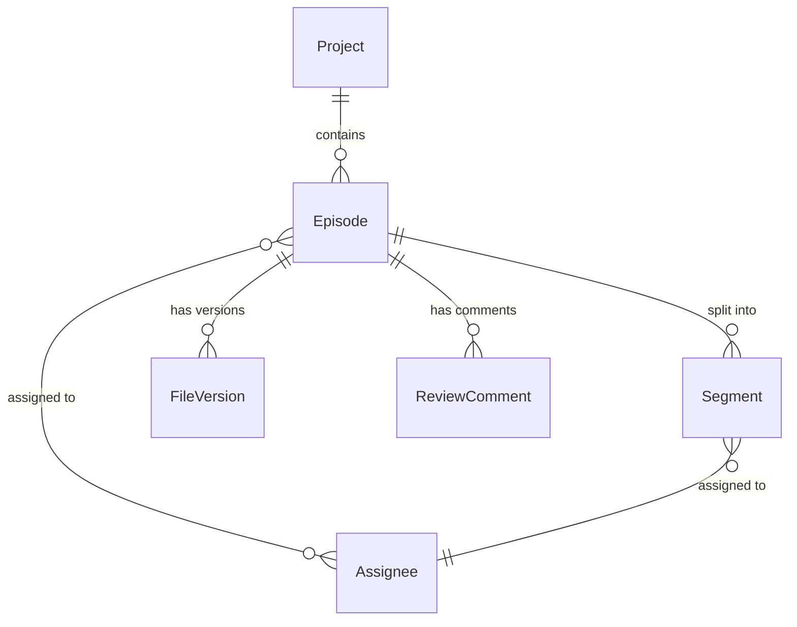

## 1. 架构设计

纯前端桌面应用，数据存储于 Zustand Store（内存 + localStorage 持久化），无需后端服务。

```mermaid
flowchart TB
    subgraph "前端层"
        "React 页面组件"
        "Zustand 状态管理"
        "React Router 路由"
    end
    subgraph "数据层"
        "localStorage 持久化"
        "演示数据种子"
    end
    "React 页面组件" --> "Zustand 状态管理"
    "Zustand 状态管理" --> "localStorage 持久化"
    "演示数据种子" --> "Zustand 状态管理"
```

## 2. 技术说明

- 前端：React@18 + TypeScript + Tailwind CSS@3 + Vite
- 状态管理：Zustand（含 persist 中间件自动同步 localStorage）
- 路由：React Router DOM v6
- 图标：lucide-react
- 后端：无（纯前端，localStorage 持久化）
- 数据库：无（使用演示数据种子 + localStorage）

## 3. 路由定义

| 路由 | 用途 |
|------|------|
| / | 仪表盘——项目总览、待办事项、异常告警 |
| /projects | 项目管理——节目列表、新建项目 |
| /projects/:id | 项目详情——集数/段落管理、人员分配 |
| /projects/:id/versions | 版本管理——文件版本时间线 |
| /projects/:id/review | 校对工单——意见列表、返工操作 |
| /delivery | 交付看板——压制状态、待交付 |

## 4. API 定义

无后端 API，所有操作通过 Zustand Store 方法完成。

### Store 接口定义

```typescript
interface Project {
  id: string
  name: string
  totalEpisodes: number
  createdAt: string
  updatedAt: string
  episodes: Episode[]
  lastOpenedAt: string
}

interface Episode {
  id: string
  projectId: string
  number: number
  title: string
  status: EpisodeStatus
  segments: Segment[]
  assignees: Assignee[]
  deadline: string
}

type EpisodeStatus =
  | 'translating'
  | 'timing'
  | 'reviewing'
  | 'rework'
  | 'approved'
  | 'encoding'
  | 'encoded'
  | 'delivering'
  | 'delivered'

interface Segment {
  id: string
  episodeId: string
  name: string
  startLine: number
  endLine: number
  assigneeId: string
  status: EpisodeStatus
}

interface Assignee {
  id: string
  name: string
  role: 'translator' | 'timer' | 'reviewer' | 'encoder'
  avatar?: string
}

interface FileVersion {
  id: string
  episodeId: string
  segmentId?: string
  version: number
  filePath: string | null
  submittedBy: string
  submittedAt: string
  note: string
  type: 'translation' | 'timing' | 'final'
}

interface ReviewComment {
  id: string
  episodeId: string
  segmentId?: string
  authorId: string
  type: 'typo' | 'timing' | 'meaning' | 'style' | 'other'
  content: string
  timestamp: string
  status: 'open' | 'resolved'
}
```

## 5. 服务端架构

不适用

## 6. 数据模型

### 6.1 数据模型定义



### 6.2 数据定义语言

使用 TypeScript 接口定义（见上方 Store 接口定义），数据通过 Zustand persist 中间件序列化至 localStorage。

### 6.3 演示数据种子

4个演示项目对应4种场景：
1. 《暗夜行者》EP03 翻译迟交
2. 《星际迷途》EP05 校对打回
3. 《古城秘境》EP02 文件路径丢失
4. 《风之声》EP01 已压制待交付
