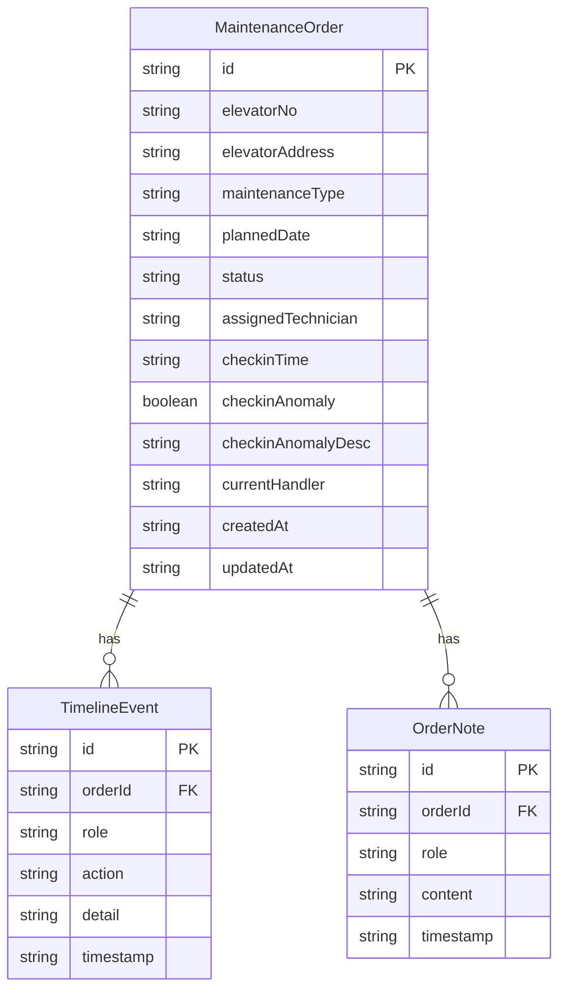

## 1. 架构设计

```mermaid
flowchart TD
    subgraph "前端层"
        "React + TailwindCSS"
        "Zustand 状态管理"
        "React Router"
    end
    subgraph "后端层"
        "Express API"
        "路由控制器"
        "业务逻辑层"
    end
    subgraph "数据层"
        "SQLite 数据库"
        "种子数据"
    end
    "React + TailwindCSS" --> "Express API"
    "Zustand 状态管理" --> "Express API"
    "Express API" --> "路由控制器"
    "路由控制器" --> "业务逻辑层"
    "业务逻辑层" --> "SQLite 数据库"
```

## 2. 技术说明

- 前端：React@18 + TailwindCSS@3 + Vite
- 初始化工具：vite-init
- 后端：Express@4 + TypeScript (ESM)
- 数据库：SQLite（better-sqlite3），本地文件存储
- 状态管理：Zustand
- 路由：React Router DOM v6

## 3. 路由定义

| 路由 | 用途 |
|------|------|
| / | 工单列表页（默认按当前角色展示待办工单） |
| /order/:id | 工单详情页（包含签到、备注、时间线） |

## 4. API 定义

### 4.1 角色与认证

```
GET  /api/roles                # 获取角色列表
POST /api/auth/demo/:role      | 演示账号登录（role: technician/service/supervisor）
```

### 4.2 维保工单

```
GET    /api/orders              # 获取工单列表（支持 ?status=&role= 筛选）
GET    /api/orders/:id          # 获取工单详情（含签到记录、备注、时间线）
POST   /api/orders/:id/checkin | 到场签到
POST   /api/orders/:id/note    | 添加备注
POST   /api/orders/:id/review  | 主管审核（通过/退回）
POST   /api/orders/batch/checkin | 批量签到
POST   /api/orders/batch/review  | 批量审核
```

### 4.3 TypeScript 类型定义

```typescript
interface MaintenanceOrder {
  id: string;
  elevatorNo: string;
  elevatorAddress: string;
  maintenanceType: 'routine' | 'quarterly' | 'annual';
  plannedDate: string;
  status: 'pending' | 'checked_in' | 'in_service' | 'reviewing' | 'completed' | 'rejected';
  assignedTechnician: string;
  checkinTime?: string;
  checkinAnomaly?: boolean;
  checkinAnomalyDesc?: string;
  currentHandler: 'technician' | 'service' | 'supervisor';
  createdAt: string;
  updatedAt: string;
}

interface TimelineEvent {
  id: string;
  orderId: string;
  role: 'technician' | 'service' | 'supervisor' | 'system';
  action: string;
  detail: string;
  timestamp: string;
}

interface OrderNote {
  id: string;
  orderId: string;
  role: 'technician' | 'service' | 'supervisor';
  content: string;
  timestamp: string;
}
```

## 5. 服务端架构图

```mermaid
flowchart LR
    "Router" --> "Controller"
    "Controller" --> "Service"
    "Service" --> "Repository"
    "Repository" --> "SQLite"
```

## 6. 数据模型

### 6.1 数据模型定义



### 6.2 数据定义语言

```sql
CREATE TABLE maintenance_orders (
  id TEXT PRIMARY KEY,
  elevator_no TEXT NOT NULL,
  elevator_address TEXT NOT NULL,
  maintenance_type TEXT NOT NULL CHECK(maintenance_type IN ('routine', 'quarterly', 'annual')),
  planned_date TEXT NOT NULL,
  status TEXT NOT NULL DEFAULT 'pending' CHECK(status IN ('pending', 'checked_in', 'in_service', 'reviewing', 'completed', 'rejected')),
  assigned_technician TEXT NOT NULL,
  checkin_time TEXT,
  checkin_anomaly INTEGER DEFAULT 0,
  checkin_anomaly_desc TEXT,
  current_handler TEXT NOT NULL DEFAULT 'technician' CHECK(current_handler IN ('technician', 'service', 'supervisor')),
  created_at TEXT NOT NULL DEFAULT (datetime('now')),
  updated_at TEXT NOT NULL DEFAULT (datetime('now'))
);

CREATE TABLE timeline_events (
  id TEXT PRIMARY KEY,
  order_id TEXT NOT NULL REFERENCES maintenance_orders(id),
  role TEXT NOT NULL CHECK(role IN ('technician', 'service', 'supervisor', 'system')),
  action TEXT NOT NULL,
  detail TEXT NOT NULL DEFAULT '',
  timestamp TEXT NOT NULL DEFAULT (datetime('now'))
);

CREATE TABLE order_notes (
  id TEXT PRIMARY KEY,
  order_id TEXT NOT NULL REFERENCES maintenance_orders(id),
  role TEXT NOT NULL CHECK(role IN ('technician', 'service', 'supervisor')),
  content TEXT NOT NULL,
  timestamp TEXT NOT NULL DEFAULT (datetime('now'))
);

CREATE INDEX idx_orders_status ON maintenance_orders(status);
CREATE INDEX idx_orders_handler ON maintenance_orders(current_handler);
CREATE INDEX idx_timeline_order ON timeline_events(order_id);
CREATE INDEX idx_notes_order ON order_notes(order_id);
```
