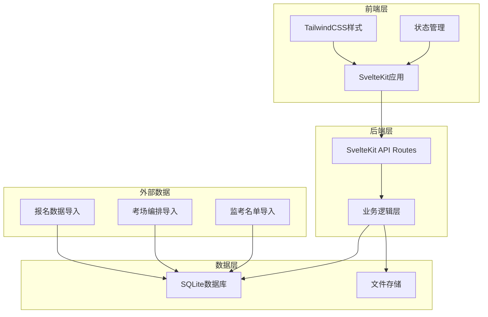
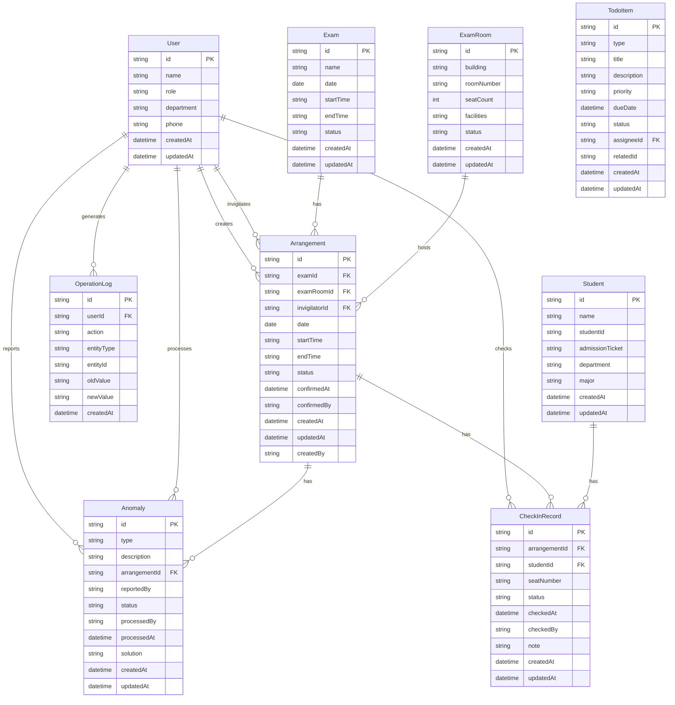

# 考务中心-监考安排与签到确认 技术架构文档

## 1. 架构设计



## 2. 技术说明

### 2.1 技术栈选择

- **前端框架**：SvelteKit (最新稳定版)
  - 理由：轻量、高性能、开发体验好
  - 支持SSR和CSR混合渲染
  - 内置路由和API路由

- **样式方案**：TailwindCSS 3.x
  - 理由：快速开发、高度可定制
  - 与SvelteKit完美集成

- **数据库**：SQLite
  - 理由：轻量、无需独立服务器、适合中小规模
  - 数据存储在本地文件，便于备份和迁移

- **状态管理**：Svelte Stores
  - 理由：Svelte内置，简单高效

- **初始化工具**：npm create svelte@latest

### 2.2 项目结构

```
trae-20260601-3/
├── src/
│   ├── lib/
│   │   ├── components/      # 可复用组件
│   │   ├── stores/          # 状态管理
│   │   ├── utils/           # 工具函数
│   │   └── server/          # 服务端代码
│   │       ├── db/          # 数据库操作
│   │       └── api/         # API处理函数
│   ├── routes/
│   │   ├── (app)/           # 需要登录的路由
│   │   │   ├── dashboard/    # 首页仪表盘
│   │   │   ├── arrangement/  # 监考安排
│   │   │   ├── checkin/      # 签到确认
│   │   │   ├── exam-room/    # 考场管理
│   │   │   └── statistics/   # 数据统计
│   │   ├── api/             # API路由
│   │   └── login/           # 登录页
│   └── app.html
├── static/                  # 静态资源
├── prisma/                  # 数据库schema
└── package.json
```

## 3. 路由定义

| 路由路径 | 页面名称 | 功能描述 |
|---------|---------|---------|
| /login | 登录页 | 用户登录和角色选择 |
| / | 首页仪表盘 | 待办、风险、变更、快速入口 |
| /arrangement | 监考安排列表 | 查看所有监考安排 |
| /arrangement/new | 新建监考安排 | 创建新的监考安排 |
| /arrangement/[id] | 监考安排详情 | 查看和编辑具体安排 |
| /checkin | 签到确认列表 | 查看签到任务列表 |
| /checkin/[id] | 签到确认详情 | 执行签到确认操作 |
| /checkin/history | 签到回看 | 查看历史签到记录 |
| /exam-room | 考场列表 | 查看所有考场信息 |
| /exam-room/[id] | 考场详情 | 查看考场座位编排 |
| /statistics | 数据统计 | 查看各类统计数据 |

## 4. API定义

### 4.1 数据类型定义

```typescript
// 用户角色
enum Role {
  EXAM_OFFICER = 'EXAM_OFFICER',    // 考务专员
  INVIGILATOR = 'INVIGILATOR',       // 监考老师
  TECH_SUPPORT = 'TECH_SUPPORT'      // 技术支持
}

// 用户信息
interface User {
  id: string;
  name: string;
  role: Role;
  department: string;
  phone: string;
  createdAt: Date;
  updatedAt: Date;
}

// 考试信息
interface Exam {
  id: string;
  name: string;
  date: Date;
  startTime: string;
  endTime: string;
  status: 'DRAFT' | 'PUBLISHED' | 'ONGOING' | 'FINISHED';
  createdAt: Date;
  updatedAt: Date;
}

// 考场信息
interface ExamRoom {
  id: string;
  building: string;
  roomNumber: string;
  seatCount: number;
  facilities: string[];
  status: 'AVAILABLE' | 'OCCUPIED' | 'MAINTENANCE';
  createdAt: Date;
  updatedAt: Date;
}

// 监考安排
interface Arrangement {
  id: string;
  examId: string;
  examRoomId: string;
  invigilatorId: string;
  date: Date;
  startTime: string;
  endTime: string;
  status: 'PENDING' | 'CONFIRMED' | 'REJECTED' | 'COMPLETED';
  confirmedAt?: Date;
  confirmedBy?: string;
  createdAt: Date;
  updatedAt: Date;
  createdBy: string;
  
  // 关联数据
  exam?: Exam;
  examRoom?: ExamRoom;
  invigilator?: User;
}

// 学生信息
interface Student {
  id: string;
  name: string;
  studentId: string;
  admissionTicket: string;
  department: string;
  major: string;
  createdAt: Date;
  updatedAt: Date;
}

// 签到记录
interface CheckInRecord {
  id: string;
  arrangementId: string;
  studentId: string;
  seatNumber: string;
  status: 'PRESENT' | 'ABSENT' | 'LATE';
  checkedAt?: Date;
  checkedBy: string;
  note?: string;
  createdAt: Date;
  updatedAt: Date;
  
  // 关联数据
  arrangement?: Arrangement;
  student?: Student;
}

// 异常记录
interface Anomaly {
  id: string;
  type: 'ADMISSION_ERROR' | 'SEAT_CONFLICT' | 'STUDENT_MISSING' | 'OTHER';
  description: string;
  arrangementId: string;
  reportedBy: string;
  status: 'PENDING' | 'PROCESSING' | 'RESOLVED';
  processedBy?: string;
  processedAt?: Date;
  solution?: string;
  createdAt: Date;
  updatedAt: Date;
  
  // 关联数据
  arrangement?: Arrangement;
  reporter?: User;
  processor?: User;
}

// 待办事项
interface TodoItem {
  id: string;
  type: 'ARRANGEMENT_CONFIRM' | 'ANOMALY_HANDLE' | 'CHECKIN_REMINDER';
  title: string;
  description: string;
  priority: 'HIGH' | 'MEDIUM' | 'LOW';
  dueDate?: Date;
  status: 'PENDING' | 'COMPLETED';
  assigneeId: string;
  relatedId?: string;
  createdAt: Date;
  updatedAt: Date;
}

// 操作日志
interface OperationLog {
  id: string;
  userId: string;
  action: string;
  entityType: string;
  entityId: string;
  oldValue?: string;
  newValue?: string;
  createdAt: Date;
  
  // 关联数据
  user?: User;
}
```

### 4.2 API端点定义

#### 用户相关

```typescript
// POST /api/auth/login
// 用户登录
Request: { username: string; password: string }
Response: { user: User; token: string }

// POST /api/auth/switch-role
// 切换角色
Request: { role: Role }
Response: { user: User }

// GET /api/users/me
// 获取当前用户信息
Response: User
```

#### 监考安排相关

```typescript
// GET /api/arrangements
// 获取监考安排列表
Query: { examId?: string; status?: string; date?: string }
Response: { arrangements: Arrangement[]; total: number }

// POST /api/arrangements
// 创建监考安排
Request: Omit<Arrangement, 'id' | 'createdAt' | 'updatedAt'>
Response: Arrangement

// POST /api/arrangements/batch
// 批量创建监考安排
Request: { arrangements: Omit<Arrangement, 'id' | 'createdAt' | 'updatedAt'>[] }
Response: { success: number; failed: number; arrangements: Arrangement[] }

// PUT /api/arrangements/:id
// 更新监考安排
Request: Partial<Arrangement>
Response: Arrangement

// POST /api/arrangements/:id/confirm
// 确认监考安排
Request: { status: 'CONFIRMED' | 'REJECTED'; note?: string }
Response: Arrangement

// GET /api/arrangements/check-conflict
// 检查冲突
Query: { invigilatorId: string; date: string; startTime: string; endTime: string }
Response: { hasConflict: boolean; conflicts: Arrangement[] }
```

#### 签到确认相关

```typescript
// GET /api/checkin
// 获取签到任务列表
Query: { invigilatorId?: string; date?: string; status?: string }
Response: { tasks: Arrangement[]; total: number }

// GET /api/checkin/:arrangementId
// 获取签到详情
Response: { arrangement: Arrangement; students: (Student & { checkInStatus: string; seatNumber: string })[] }

// POST /api/checkin/:arrangementId/check
// 签到/缺考操作
Request: { studentId: string; status: 'PRESENT' | 'ABSENT' | 'LATE'; note?: string }
Response: CheckInRecord

// POST /api/checkin/:arrangementId/batch-check
// 批量签到
Request: { students: { studentId: string; status: 'PRESENT' | 'ABSENT' | 'LATE' }[] }
Response: { success: number; failed: number }

// POST /api/checkin/:arrangementId/report-anomaly
// 上报异常
Request: { type: Anomaly['type']; description: string; studentId?: string }
Response: Anomaly

// GET /api/checkin/history
// 签到回看
Query: { examId?: string; examRoomId?: string; date?: string }
Response: { records: CheckInRecord[]; total: number }
```

#### 考场管理相关

```typescript
// GET /api/exam-rooms
// 获取考场列表
Query: { status?: string; building?: string }
Response: { examRooms: ExamRoom[]; total: number }

// GET /api/exam-rooms/:id
// 获取考场详情
Response: { examRoom: ExamRoom; seats: { seatNumber: string; student?: Student }[] }
```

#### 数据统计相关

```typescript
// GET /api/statistics/absent
// 缺考统计
Query: { examId?: string; department?: string; major?: string }
Response: { total: number; absent: number; absentRate: number; details: any[] }

// GET /api/statistics/invigilator-workload
// 监考工作量统计
Query: { startDate?: string; endDate?: string }
Response: { workload: { invigilator: User; count: number; hours: number }[] }

// GET /api/statistics/anomalies
// 异常分析
Query: { startDate?: string; endDate?: string }
Response: { total: number; byType: { type: string; count: number }[] }
```

#### 待办和风险相关

```typescript
// GET /api/todos
// 获取待办事项
Query: { status?: string; priority?: string }
Response: { todos: TodoItem[]; total: number }

// POST /api/todos/:id/complete
// 完成待办
Response: TodoItem

// GET /api/risks
// 获取风险预警
Response: { risks: { type: string; description: string; severity: 'HIGH' | 'MEDIUM' | 'LOW'; relatedData: any }[] }

// GET /api/recent-changes
// 获取最近变更
Query: { hours?: number }
Response: { changes: OperationLog[] }
```

## 5. 数据模型

### 5.1 数据模型定义



### 5.2 数据库Schema (Prisma)

```prisma
generator client {
  provider = "prisma-client-js"
}

datasource db {
  provider = "sqlite"
  url      = "file:./dev.db"
}

model User {
  id          String   @id @default(uuid())
  name        String
  role        String
  department  String
  phone       String
  createdAt   DateTime @default(now())
  updatedAt   DateTime @updatedAt
  
  createdArrangements   Arrangement[]  @relation("CreatedBy")
  invigilatedArrangements Arrangement[] @relation("Invigilator")
  checkedRecords  CheckInRecord[]  @relation("CheckedBy")
  reportedAnomalies  Anomaly[]    @relation("ReportedBy")
  processedAnomalies Anomaly[]   @relation("ProcessedBy")
  operationLogs  OperationLog[]
  todoItems   TodoItem[]  @relation("Assignee")
}

model Exam {
  id          String   @id @default(uuid())
  name        String
  date        DateTime
  startTime   String
  endTime     String
  status      String
  createdAt   DateTime @default(now())
  updatedAt   DateTime @updatedAt
  
  arrangements Arrangement[]
}

model ExamRoom {
  id          String   @id @default(uuid())
  building    String
  roomNumber  String
  seatCount   Int
  facilities  String
  status      String
  createdAt   DateTime @default(now())
  updatedAt   DateTime @updatedAt
  
  arrangements Arrangement[]
}

model Arrangement {
  id            String    @id @default(uuid())
  examId        String
  examRoomId    String
  invigilatorId String
  date          DateTime
  startTime     String
  endTime       String
  status        String
  confirmedAt   DateTime?
  confirmedBy   String?
  createdAt     DateTime  @default(now())
  updatedAt     DateTime  @updatedAt
  createdBy     String
  
  exam          Exam      @relation(fields: [examId], references: [id])
  examRoom      ExamRoom  @relation(fields: [examRoomId], references: [id])
  invigilator   User      @relation("Invigilator", fields: [invigilatorId], references: [id])
  creator       User      @relation("CreatedBy", fields: [createdBy], references: [id])
  checkInRecords CheckInRecord[]
  anomalies     Anomaly[]
  
  @@index([examId])
  @@index([examRoomId])
  @@index([invigilatorId])
  @@index([date, startTime, endTime])
}

model Student {
  id              String   @id @default(uuid())
  name            String
  studentId       String   @unique
  admissionTicket String   @unique
  department      String
  major           String
  createdAt       DateTime @default(now())
  updatedAt       DateTime @updatedAt
  
  checkInRecords  CheckInRecord[]
}

model CheckInRecord {
  id             String   @id @default(uuid())
  arrangementId  String
  studentId      String
  seatNumber     String
  status         String
  checkedAt      DateTime?
  checkedBy      String
  note           String?
  createdAt      DateTime @default(now())
  updatedAt      DateTime @updatedAt
  
  arrangement    Arrangement @relation(fields: [arrangementId], references: [id])
  student        Student     @relation(fields: [studentId], references: [id])
  checker        User        @relation("CheckedBy", fields: [checkedBy], references: [id])
  
  @@unique([arrangementId, studentId])
  @@index([arrangementId])
  @@index([studentId])
}

model Anomaly {
  id             String    @id @default(uuid())
  type           String
  description    String
  arrangementId  String
  reportedBy     String
  status         String
  processedBy    String?
  processedAt    DateTime?
  solution       String?
  createdAt      DateTime  @default(now())
  updatedAt      DateTime  @updatedAt
  
  arrangement    Arrangement @relation(fields: [arrangementId], references: [id])
  reporter       User       @relation("ReportedBy", fields: [reportedBy], references: [id])
  processor      User?      @relation("ProcessedBy", fields: [processedBy], references: [id])
  
  @@index([arrangementId])
  @@index([status])
}

model OperationLog {
  id          String   @id @default(uuid())
  userId      String
  action      String
  entityType  String
  entityId    String
  oldValue    String?
  newValue    String?
  createdAt   DateTime @default(now())
  
  user        User     @relation(fields: [userId], references: [id])
  
  @@index([userId])
  @@index([entityType, entityId])
  @@index([createdAt])
}

model TodoItem {
  id          String    @id @default(uuid())
  type        String
  title       String
  description String
  priority    String
  dueDate     DateTime?
  status      String
  assigneeId  String
  relatedId   String?
  createdAt   DateTime  @default(now())
  updatedAt   DateTime  @updatedAt
  
  assignee    User      @relation("Assignee", fields: [assigneeId], references: [id])
  
  @@index([assigneeId])
  @@index([status])
}
```

## 6. 核心业务逻辑

### 6.1 监考安排冲突检测

```typescript
// 检测监考老师时间冲突
async function checkInvigilatorConflict(
  invigilatorId: string,
  date: Date,
  startTime: string,
  endTime: string,
  excludeId?: string
): Promise<Arrangement[]> {
  const arrangements = await db.arrangement.findMany({
    where: {
      invigilatorId,
      date,
      id: excludeId ? { not: excludeId } : undefined,
      OR: [
        {
          AND: [
            { startTime: { lte: startTime } },
            { endTime: { gt: startTime } }
          ]
        },
        {
          AND: [
            { startTime: { lt: endTime } },
            { endTime: { gte: endTime } }
          ]
        }
      ]
    }
  });
  return arrangements;
}

// 检测考场座位冲突
async function checkSeatConflict(
  examRoomId: string,
  date: Date,
  startTime: string,
  endTime: string,
  excludeId?: string
): Promise<Arrangement[]> {
  const arrangements = await db.arrangement.findMany({
    where: {
      examRoomId,
      date,
      id: excludeId ? { not: excludeId } : undefined,
      OR: [
        {
          AND: [
            { startTime: { lte: startTime } },
            { endTime: { gt: startTime } }
          ]
        },
        {
          AND: [
            { startTime: { lt: endTime } },
            { endTime: { gte: endTime } }
          ]
        }
      ]
    }
  });
  return arrangements;
}
```

### 6.2 签到确认流程

```typescript
// 签到确认
async function checkInStudent(
  arrangementId: string,
  studentId: string,
  status: 'PRESENT' | 'ABSENT' | 'LATE',
  checkedBy: string,
  note?: string
): Promise<CheckInRecord> {
  // 创建或更新签到记录
  const record = await db.checkInRecord.upsert({
    where: {
      arrangementId_studentId: {
        arrangementId,
        studentId
      }
    },
    create: {
      arrangementId,
      studentId,
      status,
      checkedAt: new Date(),
      checkedBy,
      note
    },
    update: {
      status,
      checkedAt: new Date(),
      checkedBy,
      note
    }
  });
  
  // 记录操作日志
  await db.operationLog.create({
    data: {
      userId: checkedBy,
      action: 'CHECK_IN',
      entityType: 'CheckInRecord',
      entityId: record.id,
      newValue: JSON.stringify({ status, note })
    }
  });
  
  return record;
}
```

### 6.3 异常处理流程

```typescript
// 上报异常
async function reportAnomaly(
  type: AnomalyType,
  description: string,
  arrangementId: string,
  reportedBy: string,
  studentId?: string
): Promise<Anomaly> {
  const anomaly = await db.anomaly.create({
    data: {
      type,
      description,
      arrangementId,
      reportedBy,
      status: 'PENDING'
    }
  });
  
  // 创建待办事项
  await db.todoItem.create({
    data: {
      type: 'ANOMALY_HANDLE',
      title: `处理异常：${type}`,
      description,
      priority: type === 'ADMISSION_ERROR' ? 'HIGH' : 'MEDIUM',
      assigneeId: await getTechSupportId(),
      relatedId: anomaly.id
    }
  });
  
  // 记录操作日志
  await db.operationLog.create({
    data: {
      userId: reportedBy,
      action: 'REPORT_ANOMALY',
      entityType: 'Anomaly',
      entityId: anomaly.id,
      newValue: JSON.stringify({ type, description })
    }
  });
  
  return anomaly;
}
```

## 7. 安全考虑

### 7.1 权限控制

- 基于角色的访问控制（RBAC）
- API路由级别的权限验证
- 敏感操作需要二次确认

### 7.2 数据安全

- 密码加密存储（bcrypt）
- SQL注入防护（Prisma参数化查询）
- XSS防护（Svelte自动转义）

### 7.3 操作留痕

- 所有关键操作记录到OperationLog
- 记录操作人、时间、变更前后值
- 支持操作历史查询

## 8. 性能优化

### 8.1 数据库优化

- 合理使用索引（已在Schema中定义）
- 分页查询避免大量数据加载
- 使用Prisma的select减少查询字段

### 8.2 前端优化

- SvelteKit的SSR提升首屏加载
- 组件级别的代码分割
- 使用Svelte的响应式更新减少不必要的渲染

## 9. 部署方案

### 9.1 开发环境

- Node.js 18+
- SQLite数据库文件存储在项目目录
- 使用Vite开发服务器

### 9.2 生产环境

- 可部署到任何支持Node.js的服务器
- SQLite数据库文件需要定期备份
- 建议使用PM2进行进程管理