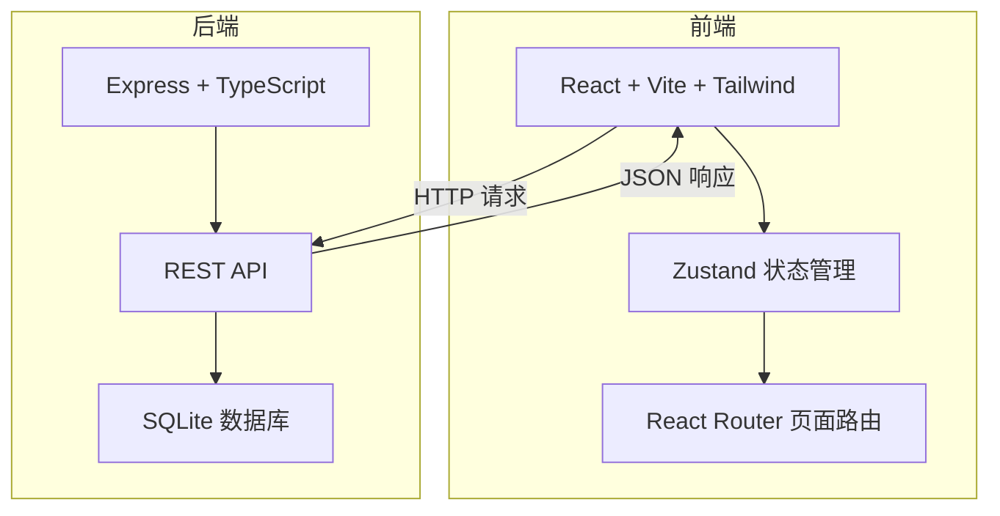
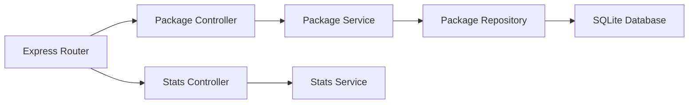
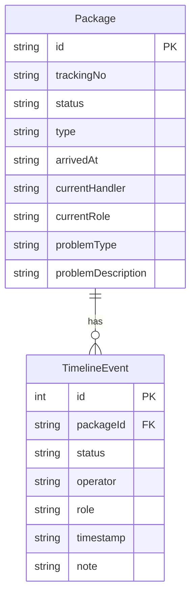

## 1. 架构设计



## 2. 技术说明

- 前端：React@18 + Tailwind CSS@3 + Vite + Zustand
- 初始化工具：vite-init
- 后端：Express@4 + TypeScript（ESM 模式）
- 数据库：SQLite（better-sqlite3），本地文件存储，无需额外安装

## 3. 路由定义

| 路由 | 用途 |
|------|------|
| `/` | 首页仪表盘：今日优先事项、统计概览、最近动态 |
| `/dispatch` | 派件清单页：到站快件列表、驿站入库操作 |
| `/problems` | 问题件管理页：问题件列表、处理流转 |
| `/pickup` | 取件核销页：待核销列表、核销回看 |
| `/package/:id` | 详情时间线页：单件快件全生命周期 |

## 4. API 定义

### 4.1 快件相关

```
GET    /api/packages              获取快件列表（支持 status/role 筛选）
GET    /api/packages/:id          获取快件详情（含完整时间线）
POST   /api/packages/:id/checkin  驿站入库（body: { operator, role, note? }）
POST   /api/packages/:id/verify   取件核销（body: { operator, role, pickupPerson, note? }）
POST   /api/packages/:id/problem  标记问题件（body: { operator, role, problemType, description }）
POST   /api/packages/:id/resolve  处理问题件（body: { operator, role, resolution, action: 'recheckin' | 'return' }）
POST   /api/packages/:id/reset    重置快件状态（body: { operator, role, targetStatus, note }）
```

### 4.2 统计与动态

```
GET    /api/stats/today           获取今日统计数据
GET    /api/activities            获取最近动态列表（limit 参数）
```

### 4.3 数据重置

```
POST   /api/reset                 重置全部数据到初始种子状态
```

### 4.4 TypeScript 类型定义

```typescript
type PackageStatus =
  | 'arrived'
  | 'checked_in'
  | 'notified'
  | 'verified'
  | 'problem'
  | 'returned'
  | 'completed'

type ProblemAction = 'recheckin' | 'return'

interface TimelineEvent {
  id: number
  packageId: string
  status: PackageStatus
  operator: string
  role: 'dispatcher' | 'station_manager' | 'customer_service'
  timestamp: string
  note: string
}

interface Package {
  id: string
  trackingNo: string
  status: PackageStatus
  type: 'normal' | 'fragile' | 'oversized'
  arrivedAt: string
  currentHandler: string
  currentRole: string
  problemType?: string
  problemDescription?: string
  timeline: TimelineEvent[]
}

interface TodayStats {
  pendingCheckin: number
  pendingVerify: number
  problemCount: number
  todayCompleted: number
  overdueCheckin: number
  overdueVerify: number
}

interface Activity {
  id: number
  packageId: string
  trackingNo: string
  action: string
  operator: string
  role: string
  timestamp: string
}
```

## 5. 服务端架构



## 6. 数据模型

### 6.1 数据模型定义



### 6.2 数据定义语言

```sql
CREATE TABLE packages (
  id TEXT PRIMARY KEY,
  tracking_no TEXT NOT NULL UNIQUE,
  status TEXT NOT NULL DEFAULT 'arrived',
  type TEXT NOT NULL DEFAULT 'normal',
  arrived_at TEXT NOT NULL,
  current_handler TEXT NOT NULL,
  current_role TEXT NOT NULL,
  problem_type TEXT,
  problem_description TEXT
);

CREATE TABLE timeline_events (
  id INTEGER PRIMARY KEY AUTOINCREMENT,
  package_id TEXT NOT NULL,
  status TEXT NOT NULL,
  operator TEXT NOT NULL,
  role TEXT NOT NULL,
  timestamp TEXT NOT NULL,
  note TEXT NOT NULL DEFAULT '',
  FOREIGN KEY (package_id) REFERENCES packages(id)
);

CREATE INDEX idx_packages_status ON packages(status);
CREATE INDEX idx_timeline_package ON timeline_events(package_id);
CREATE INDEX idx_timeline_timestamp ON timeline_events(timestamp);
```

### 6.3 初始种子数据

系统初始化时插入 15 条模拟快件数据，覆盖以下状态分布：
- arrived（到站待入库）：4 条
- checked_in（已入库待核销）：3 条（含 1 条超时）
- verified（已核销）：3 条
- problem（问题件）：3 条（含不同问题类型）
- returned（已退回）：1 条
- completed（已完成）：1 条

每条快件都携带对应的 timeline_events 记录，体现完整的状态流转历史。
